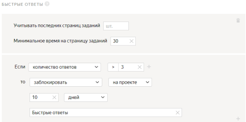
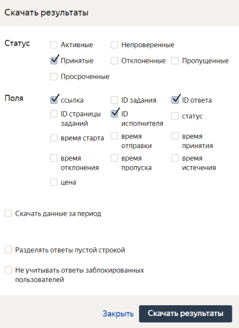

# Проект 4. Какой из найденных объектов больше похож на исходный?

В этом [проекте](../../glossary.md#project) исполнители будут сравнивать найденную обувь с исходным изображением и определять, какой из вариантов более похож. Для сравнения в проекте вы дополните результаты из [второго проекта](find_an_item_in_store.md), подробнее об этом на шаге **Загрузите [задания](../../glossary.md#tsv)**.

## Создайте проект {#create_project}

Чтобы создать проект, откройте [Толоку для заказчика]({{ yandex-toloka }}).

#### В интерфейсе:

1. Выберите пресет:

    1. 

    1. 

1. Заполните общую информацию:

    1. В поле **Название для исполнителей** введите `Какой из найденных объектов похож на исходный?`.

    1. В поле **Описание для исполнителей** введите `Решите, какая пара обуви больше похожа на исходную.`.

    1. 

    1. 

1. 

    

    - Конструктор шаблонов

      1. Воспользуйтесь [готовым кодом](https://clck.ru/TvYLF)[ready-made code](https://clck.ru/U7feQ) для этого проекта, где уже настроена валидация, горячие клавиши и внешний вид задания.

          Исполнитель не сможет отправить задание, если:

          - не перейдет по кнопкам в интернет-магазин;
          - не выберет один из вариантов ответа.

      1. 

          - Поля входных данных:

            - `image` — ссылка для загрузки изображения исходного товара;
            - `left_link` — ссылка для левой кнопки на товар в интернет-магазине;
            - `right_link` — ссылка для правой кнопки на товар в интернет-магазине.

          - Поле выходных данных: `result` — строка, в которую будет записан ответ исполнителя.

    - Редактор HTML/CSS/JS

      1. В **Интерфейсе задания** удалите шаблонный код из блока **HTML** и вставьте следующий код:

          

          ```html
          <div class="header">
          <div class="left caption">
          {{button label="Перейдите на сайт" href=uploaded_link_left size="L"}}
          <p class="url">not_var{{uploaded_link_left}}</p>
          </div>
          <div class="right caption">
          <p class="url">not_var{{uploaded_link_right}}</p>
          {{button label="Перейдите на сайт" href=uploaded_link_right  size="L"}}
          </div>
          </div>

          {{img src=image}}

          <div class="content clearfix">
          <div class="left page">
          {{iframe src=uploaded_link_left width="100%" height="700px" real-size=true screenshot=true}}
          </div>
          <div class="right page">
          {{iframe src=uploaded_link_right width="100%" height="700px" real-size=true screenshot=true}}
          </div>
          </div>

          <div class="footer">
          {{field type="radio" name="result" label="Левое изображение лучше" value="result_left" hotkey="1"}}
          {{field type="radio" name="result" label="Правое изображение лучше" value="result_right" hotkey="2"}}
          </div>
          ```

          

          ```html
          <div class="header">
          <div class="left caption">
          {{button label="Go to site" href=uploaded_link_left size="L"}}
          <p class="url">not_var{{uploaded_link_left}}</p>
          </div>
          <div class="right caption">
          <p class="url">not_var{{uploaded_link_right}}</p>
          {{button label="Go to site" href=uploaded_link_right  size="L"}}
          </div>
          </div>

          {{img src=image}}

          <div class="content clearfix">
          <div class="left page">
          {{iframe src=uploaded_link_left width="100%" height="700px" real-size=true screenshot=true}}
          </div>
          <div class="right page">
          {{iframe src=uploaded_link_right width="100%" height="700px" real-size=true screenshot=true}}
          </div>
          </div>

          <div class="footer">
          {{field type="radio" name="result" label="Left image is better" value="result_left" hotkey="1"}}
          {{field type="radio" name="result" label="Right image is better" value="result_right" hotkey="2"}}
          </div>
          ```

          

      1. В блоке **JS** отредактируйте код, добавив следующие строки до строки `OnRender`.

          

          Не удаляйте существующий код.

          

          ```javascript
          getTemplateData: function() {
          var data = TolokaHandlebarsTask.prototype.getTemplateData.apply(this, arguments),
          input = this.getTask().input_values;
          var left_link = input.left_link;
          var right_link = input.right_link;
          var uploaded_link_left = '',
          uploaded_link_right = ''
          if (Math.floor(Math.random() * 2)) {
          uploaded_link_left = left_link
          uploaded_link_right = right_link
          } else {
          uploaded_link_left = right_link
          uploaded_link_right = left_link
          }
          data.uploaded_link_left = uploaded_link_left;
          data.uploaded_link_right = uploaded_link_right;
          data.result_left = uploaded_link_left;
          data.result_right = uploaded_link_right;

          return data;

          },
          ```

      1. В блок **CSS** вставьте следующий код, отвечающий за установку пропорционального размера изображения.

          ```css
          .task {
          display: block;
          text-align:center;
          }

          .header {
          overflow: hidden;
          background-color: #FFCC00;
          }

          .caption {
          width: 50%;
          }

          .url {
          white-space: nowrap;
          overflow: hidden;
          text-overflow: ellipsis;

          max-width: calc(100% - 182px);

          display: inline-block;
          vertical-align: bottom;
          }

          .button {
          margin: 10px;
          max-width: 182px;
          }

          .button__label {
          white-space: nowrap;
          overflow: hidden;
          text-overflow: ellipsis;
          max-width: 150px;
          }

          .content {
          margin: 10px 0;
          }

          .page {
          display: inline-block;
          width: 50%;
          }

          .left {
          float: left;
          text-align: left;
          }

          .right {
          float: right;
          text-align: right;
          }

          .clearfix {
          overflow: hidden;
          width: 100%;
          }
          ```

      1. Отредактируйте [входные и выходные данные](../../glossary.md#input-output-data) в блоке **Спецификация данных**.

      1. Нажмите кнопку , чтобы переключить графический режим на формат JSON.

      1. В поле **Входные данные** введите:

          ```json
          {
          "image": {
          "type": "url",
          "hidden": false,
          "required": true
          },
          "left_link": {
          "type": "url",
          "hidden": false,
          "required": true
          },
          "right_link": {
          "type": "url",
          "hidden": false,
          "required": true
          }
          }
          ```

      1. В поле **Выходные данные** введите:

          ```json
          {
          "result": {
          "type": "url",
          "hidden": false,
          "required": true
          }
          }
          ```

          Подробнее о параметрах **Спецификации** читайте в разделе [Входные и выходные данные](incoming.md).

      1. Нажмите кнопку  **Предпросмотр задания****Preview task**, чтобы увидеть получившееся задание.

          

          В предварительном просмотре проекта отображается одно задание со стандартными данными. Количество заданий на странице вы сможете настроить далее.

          

      1. 

    

1. 

1. В поле **Инструкция для исполнителей** введите [инструкцию](../../glossary.md#instructions).

    1. **Текст инструкции:**

        ```plaintext
        Посмотрите на две фотографии с разной обувью и решите, какая пара обуви больше похожа на исходную пару.
        Используйте свое собственное чувство стиля, но помните, что обувь будет выглядеть одинаково, если
        она похожа по цвету, материалу, длине и стилю.
        ```

        

        ```plaintext
        Look at 2 pictures with different shoes and decide which pair of shoes looks most similar to the original pair.
        Rely on your own sense of style, but also remember that the shoes look alike if
        they are the same color, fabric, length, and style.
        ```

        

    1. 

1. 

Подробнее о работе с проектом читайте в разделе [Проект](project.md).

## Создайте пул {#create_pool}

Чтобы создать [пул](../../glossary.md#pool):

1. Откройте страницу проекта с именем **Какая обувь выглядит более похоже**.

1. Нажмите кнопку **Добавить пул**.

1. Укажите **Название пула**.

1. (опционально) Добавьте **Приватный комментарий**. Эта информация доступна только вам.

1. В блоке **Аудитория** в разделе **Исполнители** отфильтруйте исполнителей.

    1. Нажмите **Добавить фильтр**.

    1. Найдите в списке блок **Профиль исполнителя** и выберите навык **Языки**.

    1. В поле **?** укажите `=`.

    1. Добавьте еще один фильтр. Нажмите **Добавить фильтр**.

    1. Найдите в списке блок **Навыки** и нажмите **Выбрать свой навык**.

    1. В поле **Навыки** выберите **Found_shoes**.

    1. В поле **?** укажите `=`.

    1. Поле **Отсутствует** оставьте пустым.

    

1. 

1. В блоке **Цена** в поле **Цена за страницу заданий** укажите `0.01`.

1. В блоке **Контроль качества** задайте настройки контроля качества для пула:

    1. Нажмите **Добавить правило контроля качества**.

    1. Найдите в списке блок **Правила** и выберите пункт **Быстрые ответы**.

    1. Задайте правило для быстрых ответов: если **количество быстрых ответов****больше 3**, то **заблокировать** исполнителя **на проекте на 10 дней**. В качестве причины указать **Быстрые ответы**.

    Подробнее о контроле качества читайте в разделе [Контроль качества](control.md).

1. В разделе **Перекрытие задания** в поле **Количество исполнителей, которые должны выполнить каждое задание ** укажите `10`.

1. В блоке **Дополнительные настройки**:

    1. В поле **Время на страницу заданий** укажите `300`.

    1. Включите опцию **Сохранять порядок заданий**.

1. Нажмите кнопку **Создать пул**.

## Загрузите задания {#upload_file}

1. Скачайте файл, полученный в [третьем проекте](item_look_similar.md).

1. Создайте пары для каждого входного изображения, чтобы можно было сравнить два найденных изображения с исходным и решить, какое из них больше похоже.

    Создавать пары можно вручную с помощью редактора текста или делать это автоматически, например, Python или Jupyter Lab.

    Для примера вы можете использовать наши результаты [https://tlk.s3.yandex.net/wsdm2020/SbS_Toloka_prep&aggr_data.ipynb](https://tlk.s3.yandex.net/wsdm2020/SbS_Toloka_prep&aggr_data.ipynb).

1. Откройте пул **Какой объект больше похож?**.

1. Нажмите кнопку **Загрузить**. В открывшемся окне настройте параметры загрузки файла.

1. Выберите **Указать вручную**.

1. В поле **Заданий на странице** укажите `1`. Вы можете поэкспериментировать с количеством заданий на странице.

1. Нажмите кнопку **Загрузить**.

1. В открывшемся окне выберите файл с заданиями для загрузки и нажмите кнопку **Открыть**.

1. Нажмите кнопку , чтобы запустить пул.

    

    Поставленные задачи выполнят настоящие исполнители Толоки. Перепроверьте конфигурацию вашего проекта перед запуском пула.

    

## Получите результаты {#get_results}

Чтобы получить результаты:

1. Нажмите кнопку **Скачать результаты**.

    1. В блоке **Статус** оставьте включенной только опцию **Принятые**.

    1. В блоке **Поля** оставьте включенной опции **ссылка**, **ID ответа** и **ID исполнителя**.

1. Отключите опцию **Разделять ответы пустой строкой**.

    

1. Попробуйте использовать [модель Брэдли-Терри](https://en.wikipedia.org/wiki/Bradley–Terry_model) на полученных результатах. Для примера используйте наши результаты [https://tlk.s3.yandex.net/wsdm2020/SbS_Toloka_prep&aggr_data.ipynb](https://tlk.s3.yandex.net/wsdm2020/SbS_Toloka_prep&aggr_data.ipynb).

## Что дальше {#what-next}

- Прочитайте подробнее про [декомпозицию заданий](solution-architecture.md).

