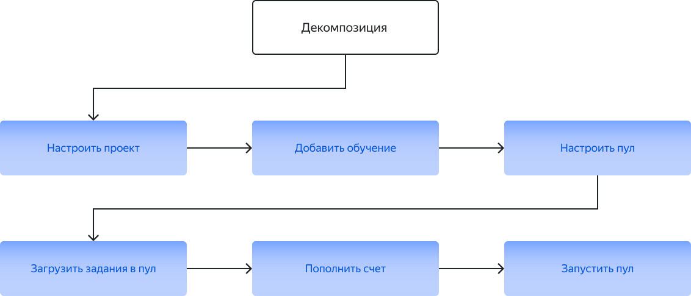

# Размещение и настройка задания

В этом разделе описан общий порядок действий по размещению задания и даны ссылки на необходимые инструкции.

## Перед началом {#before-begin}

Вы должны быть [зарегистрированы](access.md) в качестве заказчика.

Если у вас сложный проект, зарегистрируйтесь в [песочнице](sandbox.md) и создайте проект там. В ней вы можете протестировать настройки проекта в качестве исполнителя, а затем перенести их в [основную версию Толоки]({{ production-version }}) и запустить для реальных исполнителей. Так вы сможете избежать ошибок и напрасно потраченных средств, если окажется, что ваше задание не работает.

## Порядок действий {#procedure}

1. [Продумайте архитектуру решения](solution-architecture.md). Возможно, вам стоит создать не один проект, а несколько небольших взаимосвязанных проектов. Это позволит упростить задание, а значит снизить стоимость и повысить качество результатов.
1. [Создайте проект](project.md). Настройки проекта определяют [интерфейс задания](../../glossary.md#task-interface-ru), [входные и выходные данные](../../glossary.md#input-output-data-ru).
1. [Добавьте обучение](train.md) (опционально). Обучающий пул позволит исполнителям потренироваться перед началом работы, а вам позволит допустить к основному пулу (их может быть несколько) только тех, кто справился с обучением.
1. [Добавьте пул заданий](pool-main.md). Настройки пула задают все остальные настройки, например ценообразование, правила отображения заданий у исполнителей и контроль качества.
1. [Добавьте задания](pool.md) в пул.
    
    

    Сначала сделайте небольшой пробный пул (10–100 заданий).

    

1. [Пополните счет](refill-russia.md) в Толоке.
1. [Запустите пул заданий](pool-run-and-stop.md), чтобы исполнители увидели ваши задания.

    После запуска пула в течение первого часа наблюдайте за поступающими [сообщениями](messaging.md) исполнителей. Обычно исполнители быстро сообщают о проблемах с заданиями.

1. [Проверьте ответы](accept.md), если при создании пула вы настроили [отложенную приемку](../../glossary.md#left-off-acceptance-ru).
1. [Обработайте результаты](result-of-eval.md). Если качество ответов низкое, попробуйте установить причину. Возможно, вам необходимо отредактировать инструкцию или добавить больше заданий в обучении.

