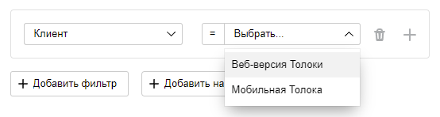

# Адаптировать задание для мобильных устройств





По умолчанию задание будет доступно и для веб-версии Толоки и для мобильного приложения.

Чтобы задание запускалось в мобильных приложениях, выполните шаги:



Не подходят для мобильных устройств:

- задания со встроенными веб-страницами (iframe)
- выделение областей на изображении;
- оценка качества видео;
- задания, где надо просматривать большие изображения;
- сравнение изображений (Side-by-side), где изображения надо на экране располагать рядом;
- задания, где надо набирать много текста.

Подойдут задания по классификации, опросники, оценка небольших текстов, модерация комментариев и другие.





Мы рекомендуем использовать [Конструктор шаблонов](../../template-builder/index.md). С ним вам будет проще адаптировать задания для мобильных устройств.

Добавьте следующий код в блок **CSS**:

```css
@media screen and (max-width: 800px) {

 .task {
  width: 93%;

 }
 .popup__text {
  width:auto;
 }

 .field{
  white-space: normal;
  display: block;
  width: 100% !important;
 }

 br {
  display: none
 }
}

@media (pointer: coarse) {
  .field__hotkey, .inplace_instruction  {
    display: none;
  }
}
```

Этот код меняет [интерфейс задания](../../glossary.md#task-interface) для устройств с шириной экрана менее 800 пикселей:

- умещает все элементы интерфейса на экране смартфона;
- следит, чтобы подсказки не выходили за границы экрана;
- убирает горячие клавиши;
- добавляет переносы строк у полей;
- убирает пробелы в виде пустых строк.







- Chrome

  1. Нажмите F12 или на правую кнопку мыши в любой части страницы и выберите пункт **Исследовать элемент**.
  1. Нажмите на значок с телефоном и планшетом, чтобы включить режим отображение для мобильных устройствах.
  1. Посмотрите, как выглядит задание на популярных мобильных платформах.

  [Подробнее в документации браузера](https://developers.google.com/web/tools/chrome-devtools/device-mode).

- Firefox

  1. Нажмите F12 или на правую кнопку мыши в любой части страницы и выберите пункт **Исследовать элемент**.
  1. Нажмите на значок с телефоном и планшетом, чтобы включить режим отображение для мобильных устройствах.
  1. Посмотрите, как выглядит задание на популярных мобильных платформах.

  [Подробнее в документации браузера]({{ mobile-mozilla }}).

- Opera

  1. Нажмите на правую кнопку мыши в любой части страницы и выберите пункт **Посмотреть код элемента**.
  1. Нажмите на значок с телефоном и планшетом, чтобы включить режим отображение для мобильных устройствах.
  1. Посмотрите, как выглядит задание на популярных мобильных платформах.

- Safari

  1. [Войдите в инструменты разработчика]({{ developer-tools-safari }})
  1. [Включите режим отображения для мобильных устройств.]({{ safari-mobile }})

- Яндекс Браузер

  1. Нажмите F12 или на правую кнопку мыши в любой части страницы и выберите пункт **Исследовать элемент**.
  1. Нажмите на значок с телефоном и планшетом, чтобы включить режим отображение для мобильных устройствах.
  1. Посмотрите, как выглядит задание на популярных мобильных платформах.





Если задание отображается плохо, вернитесь в блок CSS и добавьте в `@media screen and (max-width: 800px)` недостающие стили. Если вы не знакомы с языками CSS и HTML, воспользуйтесь услугами профессионалов или обратитесь в службу поддержки. Подробнее в разделе [Получить помощь с размещением заданий](../troubleshooting/support.md)













## Что дальше {#what-next}

- [Создайте пул заданий в проекте](pool-main.md).
- Узнайте больше про настройку [проекта](../../glossary.md#project):

    - [Написание инструкции](instruction.md).
    - [Входные и выходные данные](incoming.md).
    - [Интерфейс задания](spec.md).
    - [Настройка контроля качества](project-qa.md).



