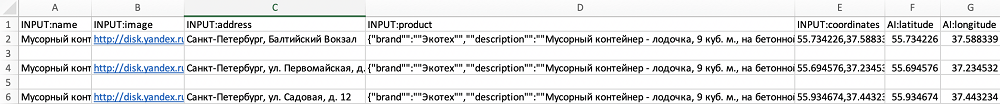

# Мониторинг объектов в полях





Сначала запустите проект в [Песочнице](https://sandbox.toloka.yandex.com/ru/). Так вы сможете избежать ошибок и потраченных средств, если окажется, что ваше задание не работает.







Возможно, для вашего проекта нужны дополнительные настройки, например, добавление новой кнопки со сценарием выполнения или добавление блока с прикреплением файлов. Подробнее об этом читайте в разделе [Примеры кастомизации](advanced-features.md).

Примеры задач, которые поможет решить пресет **Мониторинг объектов в полях****Monitoring field objects**:

- визуальный контроль качества и состояния оборудования;

- проверка наличия оборудования по заданному адресу.

Предположим, вам нужно проверить наличие оборудования на улице.

Для этого создадим такое задание: исполнителю нужно будет прийти на точку, сфотографировать оборудование со всех сторон, найти и сфотографировать табличку с адресом. Если оборудования нет, предоставить фотографии в качестве доказательств. Если к оборудованию нет доступа, сфотографировать окружение и показать причину.

Чтобы запустить задания и получить ответы:

1. [Создайте проект](#create)

1. [Создайте пул заданий](#create-task-pull)

1. [Загрузите задания](#download-task)

1. [Запустите пул и получите результаты](#get-the-results)

## Создайте проект {#create}



#### В интерфейсе:

1. Выберите пресет:

    1. 

    1. Выберите пресет **Мониторинг объектов в полях****Monitoring field objects** в блоке **Пешеходные задания****Spatial Crowdsourcing**.

1. Заполните общую информацию:

    1. Дайте проекту понятное название и краткое описание. Их увидят исполнители в списке доступных заданий.

    1. По желанию добавьте **Приватный комментарий**.

    1. Нажмите **Сохранить**.

1. 

    

    - Конструктор шаблонов

      1. Интерфейс задания описывает, как будут расположены элементы задания.

          Для этого проекта воспользуйтесь [готовым кодом](https://tb.yandex.net/editor?config=N4Igxg9gdgZglgcxALhMAOlABF9IBucApgO57JYbY64gAuAngA5Hm2GkB0ANnAM508AGkw1acOkQC2fNgG1RYyoqW1GLNng4lOAQ25EAToJAjqqvJCiTrbKqrF51rFO2I7JADxNmHNS9A2JhR4gDgggHwggLwggBwggEIg4YACINGRgMwgWOGAjCCAUiCArCCAXCDxgEwgWMWA-CDhgNwggPIggKIgeCpKAL6+Dk4AFtIuISBwsBD15jTNDTj2rfTMXW5cXj4j-iDcugBGRNyaIIC4IIAMIIDsIIXbMTnIwvM4AdZEtq5jfk6TGwAmunS6nL1MAK5zgxYgTC82hsoLopC4zlhGvNhr9lLDzhMNK4tO5OI84IRHkYBqoYapbkp7kjutpOLNTvDaEtVutkSBAAgggBYQBI5QCCICdTBCLkE7BCEc4ni83h9vhS-AiAXQgXTdI9HoYiHxZCAIVDYXilATHIipiiuOjMdiVeqWmItQsBXTSeTOZS8NS1htAHggpWirMO0Ry6Wy+Vi2w5psJ4ECV2CcPFagedOer3eUC+PwjeEl0u6TEMEEenzAJlV0MDoy5Oo2pINcCxhhxTQL4fGlpJqN4UAA1mLxp9DLTum06HQmHxkAB6QcMXQCF5wMCcKBEOiDvgAZkHdAg3Agzd0g6Yg4VAEdPorJIZB7oAGyngAsAE4AEwABgAjAAOXQPhd3x4AdgXC8-jwArJ+uifk+n5Xp+d4wL+p6cAAVkwCBtn8Vg8nSgCEIKygDSIBUeTbFgkR4dEuyZAk2yAGwgORHN6uQFNsVZiBqZpFvW0w6LoOZwNAAC0yzfCuUBIUGDpdrQgD4IDkLKMtssSADIgWCsoU4TRFgeThIkjLJNJmGCdq7F0JxAk3HykbErQekGZwfCzjpQYAgwa6yrylLaixeAAAKjlAWKeFxK5rhug4xm8a5gBO0D0Q4jHjEFTkRvyUbdEFnAQN8CY2X8KYbCQECGM2RgAPqQDl6IgpIyrGWqfhRdq+D6OWYWGRQ5ouQltBWOi+nQHo3C0jW2rtRIBnKhQCjOTQzV1q1FwdRZe6fHACqPOl4xtL0YZ4DsZGADwgcRegRKmROEpR5IAwiBCFggDiIPEGSYVgpQSTkUmyfJinKap6mabE2m2nFCwxUZY1-K5IBJSlfaij9v0LJldLZblBVFYYJUvIqEURpVcXVQ4E1A1NIAeboXlED5fnrpuA2dVAaL8K8UBgC4fUrWtGyFLdBE1OEGmxGyclSRU+ThOksTUb62ycMtfwwBmUixVD8Wme5nneb5q5k4FQo8BAoWU2j4pY3c9D9ADcvy7qIMayKiYm8mgIbIjyNlbrVWM38Ui6J4bD-nexk4BjfgALp5ia8wTUSZulhi5ZGvmIfMXjpL6EYVvISG1xNcZYcbPAayPJwvG9txhiypxXEIBmnxMBLVIrI6dKAEggmEZBJu0lNsSSHMLrPlBUkSUdEVRYLs2xSTEVQBhnIAQEwlPDVgo2-TjQk1yJeCAPQg+HbIAEiA5BUIsFFXNX6AeGzrk71Y+7Wv32svGzr-tW1stz52HXvfr4TksQHwstXcMfdJQBAfKEBliwTPgxF240L4ImEs6WIrITpwNiIUT0WBGThFZLEE6pQ8J5FfidL+CIf5-26AA-K7F6ZKjAUMYy-sIFaDqjGAysskzFjpBTWaRB9wLSIEtSGLDVpp1oA3JuSRubpEZJEE6WAiLpFKIAMRBoiAE4QCgcjKIxFwQRRRjJKLnVUZEdReFe6xHOkUNuhiP7SIqMpLa2wUh7GSIPbYeQEiYViOLY06M6Hm1eMw8UmdowazBmlPhfj-i2ytEYdEOYqF+3PnaegHQwQbF6DAI2MdYSh1Yd2NYLBDCWRIBIMA0pGaWDHKjVw89xSLwROw8Kxsob+O6LUqmnDPj6GVBAlyRtuinxCSw-66dAZBmBqDVKENOm2XCSSSJk5cxDN9hffWQYFR8E+NwMM1SLTx0bDTAh4hJAyHkFAyB8zhnbK4G7XKjwIAkEMhMlOlxBF4AAFTPMACQg4R4iv22K8qhuJ7knJNlshWBBUSXObNc25ez+qp3WiAZ5aFtEVG2IosRO0YhbROltLAF4sCABEQT5gtMg0TfqyLApFdiREwjUeS8QEhRCwH6PI50rqZFujdXe3dDoYJkoAORASjRG0ZEV+50cgpEFtJJIGQEGYWftsLlfcvQAAo2RWKwI-GSABKaRWAH4YKOpUcIFEqKfO5btCoMkX7hGcSdY1-dODPL+XEoFmzcYgtJE2VsfSGkgA7CvEAPY+wDmHFIOgXEUKhi4l8ZYvApyLk4ErYm05ZyDl6AIQw2YZ7LlVhufK2duCPHygcpgSwyqDmAbBPNxAC35QfFxKQvROBMCgIhb1V9gyPLhaJJID8EhOvAccwspyWogvzbnME6JdBcXgAYaF38GENV8UCxpbVoAzS6nNbhvCAV-AEXCzYORMgcw0ltQWpQkgVCNXEOSBKvnEtFu4wdQwd0LHIUQaeS7rb-DaBAFcbA6AZtYMO59T6EQDMvkCkyZtRng2TpBm2UpklSAQHwIBID+3OvgyAKQaz9IlqmAB4+wGll+FdWc91YLdBXJuXc0Dq7O0bFeYAFBADU93NZa7YA9kgEoSDYhRVRfkeJNiR7GdGV16h0OCyFtHgM1NhYxwA6CDaNZHJUirJu5Gsooy-IGDzqqTpZhRRd0ki7EwgcCxbouXmoHkdN00k5L3oKJY5SYrBYKXCIojBBxzqFEKI9AerI1JII-l5k6vLACSIGF6RkQeN8eiPy4oMQKLnuiH5oVh0vTdxyA6jDvsX1kZHWbMdZJiavAVLoOdYGhSfrluJ7xbwgnjLoxKKZtApA5SIPlFJEBOCQCkGCa4dGRMGx-vVHW9TINQbtmuwaG7WlbsqwsPdGwD1Hs5tEU9G9XTumeqpLaD9Ih+iSIox9snIRPuG5qMTWTaDFaLuiCApdy6VzbXFa+NINhKZ5uS7Y6nDXGpKEdelZKyWKV2Kesi3LZIJcbqRZ663hUHHbodoWfm-TjzO3gKeM8jlnaHZN7UMD65t2iB3LAD5FuH1-mbdrCout9FrRToTk3LukeawsIn3Q64k7JzeSn87qcbFp517rta+fM8g6z0TeOOc32J8j4WC5+eEKPjTjr9PUm1qVxLoFsS5a0Ou+Bgr5HoOBLGXB5dYTEN0mFxrnrWI+BgEMHAaeBla25ZA5jggC7xuDIJ1NthM3KacE3YtfneBlt0lWxkY9G3BaswyHDuSSPSco8+WjsWHuFnEfy9d4GxWilEDAM2ZYEAfJlxSi9l90C5fdC+ypn7f3L0A8Uue9B8lAfg6NVDvlJRYf2ffqyVSFrVKtwV+EYo6eP7+kW1j130BZ6VMm8bv4nOhE85R0z6vQYiFq7p6Lm8TP2dS-xOzmvH35ep+FuL7fVPiFtfVwf8Xx-b8Qcm+92uXON+K+V+wVXQvH8Gcbxtdj86MDcvcjd2c6sYNglX8ENUwH998+g0RFQncXdKZ8pn8zsT8BcxsmEJssNgZmkQ95sw9Xt21I9uho9Y9NsE8k8x8r9Udp9TsWcLtc8vdgZSQpMaNZ8O1UJuhXkPkvlh4WRWRDojM-QMgrELo8hohBM2Cn0V8A8GwLkqMIUeDyDQkI0nl4U0Jb1wgUhSI8VogEgTpUUvRuNEg4sohJF+VJDpDToO8RC2RwhsVog1VWQkUUUxF9CsBnD3R5J0FHpe5xVUFXC8IlUTorE5E8I0EKhIc8JAtChsEno5IyU3Q9sPNNUcsddMZ2D38bsJMeBegvVt88A-UNhA1+whxBxQ1w1YUo1PgY1JxLIFwE1CZvJk05w01CMOIF9s1-JdAq0c4i1pAS0UY+By0QFhia0bx8oFx8oLx61G1m1W0yi+DQwNhu0NsJIPccClC6tisJ04Ap0Z0GZrtRtGE6k-cCc6tiDQ8eFw8A1mYo9D0Y91tNsUtm9r18VCU-DmQ2RxDGVtgpDogZDogWDJd1i30P0CDLcmAf0-1XBCMgMWd1jICZdoCzdYMniYZug4BkNUNZR5RFRypsD1icN1kXdZ1kTAMFDgMDjCjQVVDqMoVNCDZtC4VXlAAsEFcIOyOyUXkJz0ULz3OUkzUOk14M5MY0AFQQVkNVA4bFXuLAE6PmdBOSe6SSAfQoVkflSw3jbYBRBLX4+IQw7YYw2oc6coMibYCoMwjBbYHzV0TeFuHIL0XUqSHI+kl1UU0datXOWYKjIgCrdk6KarOEr9EZbE2AqAq3BAgIfrTY3I36PXTGY5QOIZVMgdMaTZaaWbRqN-UJIgoPCyVpdpPZJwbpWgUhCtCs+rGrIsvGGAprYDeAksGZaJZMyKRZCZPAFZXDBst1cOHZAQOsiQaQRfEUjgsUzgbgtk9Y6UukBFfQs04w0w8wwIkoVkHIGlfVelYVPVL5dw5Sa1Uwu1HIc6FIbRMI+IrTdmdbWSVkGzH0AoExJxFla6W6CHF+DlQWE6JuLmGSJ8koIWeBRBZBZSSRSHAwolF8v0L04Uhk30orf02cnhE46dOAGk9Yy4xdCM2rJk+40gx40Mg2Sg2gagj4s9C9K9Z6Xw0821PuKoSE3XaEsAemWEm4gohE39KslEobdE8Mriwgps6Mls-3NsukAklDMhcuLyNDUBLszxa7SkvDGkigfixCn06cijFk9Q+c67RcgQvQwlVckwswsRfU6w-RKLewsExwslfw1w5zeSLwjc3w-wxIoIiRVzMImxLASI6I2IyoBIwI5I4eAfdIofVwrIhC1iqcgozgnZFsXgioukKo4NWosNTkxo5ouNNoxNTwLo1NKAdNTNIaAYsmGYwtYtUtRUKYytMdTA+YxY5YqmVYqU+TOkbY3tPY-IkSv0nONCydTC7Ci4n3fA4Sy3YsryfMkgrhMguA54nQyik9ai9w2im9P4-woEuy8Eli4TNijijZWMnipEjSuk8kw3ISwsgiqM2MRrC3L9PE8QQkshOUFZMktElS3DakgjS6+KpCnS4cvSyU0ioMIy2gHkvkyiAUxRIUwG7SxKmcucmTAoyGvAUSIHTICyr0E6SlAfFLC6ZIKRT5MCrzfub5HVE6XCMiFuYoPbfkknCEvqhKgalCoawM8rXgjEiSpk5sp6gil6hMgbOZVg4jdMxZCqCBXMjtddAssjO4ksrqMs7gDpY5Ss4EQBN9ShcGvAXmyM0Sh683OdSS6ZJGWZDDLMzDFhfs9ZQck3EsEcwW8Yccw5CpNm6alGiUjQhcrqgQ7Y5xHIV0HwwlOVFSQlelbFZBCRIlG1G0iLN04zdBWIUiSILzcIc6PCJlCiYzMEzSUChBCmgeNBDBLBHBPBOKw6z2w23SnQT1VKzsSo3saokNbKho6NWNVo9oomIqmcbo0q3orNUmXNJq2qiYhq6q-Kf8NqptFtTqhjbqntXYpSyKfqr2wagtYajCs43g3C33W6n1Ga+W+a+aRa2M8ijaN4mg9a74uiv4tvDBNOrzTPVe52a7GEk6zE79Xi-9AGqE66nxfCo+o2hrE28GjKVrPAaSokuSwtUhHWr6gBr3VSv6v+ojRGk2RkpK0G32wy-2qGky00ow8yjcqyw06IGw2ykEhwqRRygEwLNwjwty0O4Qhhry7cny0ItBfywK6IGIm80KpIlIyK6RaK09RRbIx1N+m2qGbBmchuiBhYNK7sFuzKuonKzulo+NQq4qnojNPo0qyq0e-00YqQcYstCtKeuYhYpYhtdq+epRuTRe7oHqle70rB5CrOVC4404rC84r3feyaw+9tY+uah47dC+l4qg6+qivOu+rath0Q3amh+ylmmR-5D+9i99L+vms6vi-+zBy3A25GkFAW3EqBnoN64kz6rPSECk36-DdB1E6uoG0pkG8U1ktGrDDG+FZ5J0DIKoIebmC1KlIzRm2GkneG6RjxuWeRuu2cn2gyr3Xp55HYZ0luImkmq08IC6HITFPvd+eSU9FINVcobBHlFSSumZrSzx4G7xzm0rIMkMwSoBqa2u03Y2nEpx6GSpvrUWupnAlXXgK4hW2MsJ4PCJp4y+rYWJtarbOzXbGGw7KZg6uWa2qqSWzMiqCEDM3EBoPF+pxQZMX+BANNXHJiWEOrEtT4MlqmEel5+Ya+BgMGBsvAZsXoXhboR3DMHqZaJwMcZsAAdXLGtwoCfDvG9nVAaAxgzMaFMB6HjG+BQDQHQErEGDwBBCSTpEACIQHTYWGRbuAedAE1kALV1gU104dV7UAk3QBAM2DKmo0cccfSKcfu+cJcBlrcHcVpQ8IwE8c8a8e8Z8V8d8L8H8P8QCYCUCcCSCaCOCBCK1hoPAGp0kjYPVvIDBaRXYO6SoY1011NyhS1zka16GDMLMTs7oDNrNw1vN3AU19MTMTNE1+oEt5N4MYqXoCYjYf8f8TgT8G8f8cCJ8L2BcU8b8XtoQX8TgU8O8J8G8G8J8cCH8J8J8U8J8eodV+VxoIAA)[ready-made code](https://tb.yandex.net/editor?config=N4Igxg9gdgZglgcxALhMAOlABF9IBucApgO57JYbY64gAuAngA5Hm2GkB0ANnAM508AGkw1acOkQC2fNgG1RYyoqW1GLNng4lOAQ25EAToJAjqqvJCiTrbKqrF51rFO2I7JADxNmHNS9A2JhR4ALLQEhCGcFAIWPBE3AAmWBAARgBWRGB0siAqSgC+vg5OABbSLiEgMTAQeAU4xY3K5kpOzFVuXF4+LTh43LppiZogACoSBsjC-bRWQXZzA-SdY0m6dLqcMUwArn1tFiBMm2VjULpSLnOFLc1HrX4dGq5a7pxJcIRJRg2PD1U9lKq1e1W0nF6s0eKyGI24YwAgkkkoYiHw+DNTHMAtYiLZXMDnqCungNlsdlB9oc-CtTnRzm8QLoUWiMf8-HcASUxET2iSxhCvj8-vluS0+Y4BUyIVDsTDaHDRkyAJKSKRYX58MDRJh0ODQLE8-kLfHBJ60l6kkDk7a7A7Q2m0emM6pMQwQJJ7HIchxc1SApSS-zS8EfYVwX6GX1iQO8nGh7o6XhQADWjpBe0MCKZZTodCYmIA9EWGLoBJs4GBOFAiHQi3wAMxFugQbgQVO6ItMItogCOe3RkkMRd0ADYxwAWACcACYAAwARgAHLpF4350kAOyNxtbpIAVi3ui3y6306385ge7HnAyTAQGeOpoJ1QAMjFU1hW9+Klg4FIugIEQqQwL+IESNIMY0HGNDBisziCh8ug5AaUAALRpAcrZQE+-JKjm1QAMplLoaJYAwEBZlgkBRF8lySHkxpSih+rQEsCoIWsTKsWhnB8HWeHHKcDDtiyHFOlxYK0AAAmWUC-J46Gtu2nZFraPAQGAlbsWKTqwcctoSZJVrrJs2xUQWDrypJzpnGMJBRKmRgAPq0YY9GbOi0EBrczEhvg+iRjpuGEssajcdUVhfGxUB6NwOb+VK0USGheQUAonFweFUqIUyKWxZw-Z7HAaJJEJlogGUMTmngADCvBgF+P58KR5GUdR7meYxFXEkZYVZcceXVBplnUr1lUug5TmuV1MReXkOUwUtBkOPBILDbJ8mKcpbYdl2BV8V8FZQGALhJSC1WvrQHVYGRIGthA8RkXdJC6Aw8QehqDIge22mFRNxwwF9xm2VJ1pyboClEEpKn7ep5maf9aE+bSq3Eq2oNg6ZTIafaNJg3S9n5RAdHzT1elg+jIKAZ4bAHvOK3hQAurc9z+etONhlwEZRqjq2c4m7xcPoRgE8+gRmljQ2RbQCTJJwWH5tA6GGCyBroQgHp7EwgOKsMyrEYk2R0OB37ll+kBSEwBixakepoUa4V4BADvQOlWCZbZ63HARYwqgA5PgIF1HsClm5BUh61KgXcIOYwdqjAYXfGg0hn7qoBxqFRokIWBKxH6r-nwWBSPwfAxI+NnYwQ+jx0yUAQC56QZEnRQp9laewgbhG0OMf6RzRUMB6bIxYGiKEVOV1e2VodfWo3LkoWd7KU-pLMd3PvDkijA2z0L4DQDFfHFaVRDTx3KxXbVIBEcbOSpLWoFm67sWYlg7pVg9QHxFRCl543D+0QzrmwQAAp67pPTejoHnAQUQQJgHbAJJInA25NE3jacy0sNqyzJIjMa1lL52QZIKIwXwfRrz9H5BMP1rhjFqPUSh6CJQ0NwVVRILBDD8RIBIMAjILqWHLN5VwXtaQ+xDIdXSFBxG5TYZIuKRABz6CYktBCjDqiJxniZTBWxsFOi5rQUaBxxpaP3lNGUZCqwmFUVgf0klqZSjZHsbg5oZEhk2sLZM-BxbaMjh7URhM3Ey2kp4zggFDCpiSBAEgoUiESzxNdPAAAqJJAAFMoEBWwlwgGBH6-51QpLQX6OJndCayJCQQD44TInRNiTY5KktEkgCSeMXQzk7qmwMOWU2k4P4ZKyc-PJLcTafQgBqL4MAYBGDNFgCuWpZlPQZJscCH1EFEDItwD6rVokv0yCbPOEgS58LIqxIw3iqx8Dzi+XIWAAAUcAwJQwYAASjzlDFIf0Qr-mwGiIYdsfx5L4FmbWClK53QnpwJJRTk71ItGUiKFSIQpnTKYmuWZe54DzAWYsRYpB0HQtc9C+w0iNX4o2Tg20YY1jrEWGIAhDDQLSi2PanYXLyySC5dUNsFpFhbmy4gyQXKLnQmXOKTBYjRxBNcsYABRTwVwbY3C7jBEpOAgn8g8SAdlYTz5wF0OheABhJXHFjsFWKeia6avkUVRRJUyrGsujVJE+ZJ59MyRAbJuS-zDJyKgphVNVUhmXkQPUFqzH9PUd+BlrBlWxkDSsfq0jYXlOtEYqyPj4V4HMdUACCA+DN0yNC4pybaBSGcfqRVbA6DRthQ4taJaDGhOqVEmJDqGkJJvik5Ex9oD6G+XUQwgFYqFP9fpQN6qU1IS4M22pbaJGNJvgACWmQHEueTei-mWRbNdf5OEDuuIYb8T0zRGDNr8oggVrD9qiEOtCd00iWV2VkB+UR8lHLaqc6IAgLnfLNuy-OiRomQqLXG2FE73FsO1b0e6ug50JqwXveFEGKlppMfGkM2bS3wJcgwzgVtrgEhLXW4kpqd5SLhUhxth9QWFVPva1FhNMVOqZAAdWiJIO6NExkEboH6ojtbx0NoPtqtWXwICa21rrBj2iM7VH7vwYunGK6xAMDRDJX8sADiHI7ODtBX5pXkCWtVRn049zGAAeTdtgRcumY7zzGFIbDDChU2dHQGkz4HfZmaZJZu2s5bMBXs0yRzaIcOwCboufzbnbLEbESZ7u8ILNWawI2ALKxY712qCFogYW6hCtS9F+xJbmbobwboxDSGEWpvwcYwhJms3Eyy058Lnx0Q6jgFZoVIH25CdIyFMN2irVH1StAG1A4z4X3q1VZjRsDAPyhndKAfASBGD47G5a63Yup0q1R7VfDsipgfUpLWVEpOlZALJvu1US4Kd0KXctHXVN8IgBprT37DS6ZdlZ-xHn4v60Sz55Lrn0N2bjtabLuWm6zlcyZrb9b1teYB9UXzd6osg8C2DhzzW8uzii7D9Hnn8LeeR8lgr6P0tBaa6F5zs4Cuw+K+dxNFHM0H1Q3VhHGHGtYepy1rU7XOt4453D0HZrd5Jo5+DMY1q6PnwC0xppd85umwW1DZbq3uuxgE2BoTmqIQztbdJ-R1HFhMhSek91gy-wslROiEuFcEBQBHVr9bhOqN67IjUg353pWm9ae0u7TAI2W5AtbtkdvEDYFfXk0PtuP5-JAjkzjtZEBlAfdEWI+cSrJDBdAM2fArggXpUQOswHCswpdzrthSLPyfZAOisYWLCzIBLHiglC6iV7BJVWMlFL3lUtrPWOl1bGXu2ZapXQ-LEgcq5fHvgvLMiT8FbOFyjYXKThFTETg4qq7e4XbK+V1sjVl56xXjnu2BUoOuF8fVhrzq9aCmR0K4vKuS5JjRk+tqJty+m00xELq+GcaB4W6J7R6six7cqSBraVbC5BpgBnShoVaUYnARpVo1pC6M4IbP4v5UZs4ZplINYkJMi5r5ox6rxEbnZlouKPZdDD4xrwowGu4Hzu4RItp1Jn7G5Sym5JJ1TcZmh8BO6baCbsG65VIe6sG14+7VBJIqhgQdSHpAEDJRJQAjxcbWC6AxB3QJRmy1grz56GAfQMKDohRvIoiah1jqHcAlw5xECl7O7wqMGapQYwxbATy15M6E6v4jQ1bprf6YYBBSA8Ya4bb0E2Ksxpx2KcgdxuK4g9pP7M6VRDbv6ja2rKIOpOCRp4CLwtxpE6KwaIH7yaq4FzoEGujsCWIUI2IRFoxEJ4BOIuIDaToygfC8ACA5F+KGan47ZMGiEsGzqG6VSSG0AtJtIgQKEerB5x4oQJ6HqArAp-z0RxAwajIaj6DcCzKRjogLKbqmw-SrJdLZhbIZIkDbFPojIKZlwYiVy2GCHa7CGQYX46rX4GpwBH7nZ9bmr5H4EHzS6f70bo7y43x-5bAAFjGep55zFhwLF8BQFIYwErDBoIFYFdFjGoHxzoFCbuFTaFHeFoZTZ+E1BSB5pLwgocrZHH7l5dGUEVpH4UC0F2FlIOFV49Ge5sFdGDHJJ+4h5uo-ggFW5gEYjrEO6pAzF8k24CkQEJ6PJYDJ4ICp5RBgpYQvELGPx54F6zLVrF68ZQrkkqq3FdEiFcDIq17165j5hN4t74qErEqkpNi97QyeDUqD5LbD6oSj5wysrsqcrSASlz58qenL6r7r6ipb4Sr9HEjskgByoKpH70mBKV4VLapX56rPGvH37bz9afGMbfHDa0a-Gy5hmVTXzOrAllCAFB68kh78klwSkwn0HnYImuJ4koGuB0nonsGYkS5VZmQUgEJ4FZn4nEFLxVlBHMLsFUnUGol0FlIMHxnWjMEskSF75cE8EBF8ECF1l6lIEGk6D66slIERnjD6FHrxAxApCPokBlAfR5KDznHlxgrvKzIsBgAPJXl-gTx8C54aF5L4Zmi1nuadFbn3FT6QjOEwZuGYHxFZnYk9m1Z9k1z4k-mEZC61qhFMxZR1rRHUaxENHIbWjWopGWE5GYwNxNzBqrwlJlZ5FImWpsJFEFlSj4nBweRWLdZVGRFLS1Hojlo4WeFJg8DeJtHqg-YAUs7blhJiF9G74dpjBJJAmuoB5B5LKmzbIkA7qF4QmgoZ5LEPl5Lvm54XkfS3SQDOJJDKGmwTwAFDJ7K+ramxlgyMmIrNE170X8gmnVCN44qt5Wmd42nkqUoOkD60rOkMqulLZj77SL7T7emz7z4ZCRUuQHgb5iqhlSUm7VBRmH5KobkiVfGOEPFJk34vF37sHvFi6QU0UVI-HjZ-FTZFlMhyUAEKXAFerqWGAkn3kQojm2L1lwEhqNmdlZrNm0loHQEYHlbUWiW0U4ns4v7EKlF4CDlkTzEuSLxkWLRtmUkPaVotkjXTlCH6lMnToSVe5CYRnDH+7clPQVl3RVmCmR4imVlinVnx7Px3Yylynp5xCKnZ4Z656ApqlF4l62U3E5VQWHVeJpjGnZgN5mmeWWnt7Wnd62n+WOlBX0oj5hXukT6ekz48p+kX4uQBlr5JUhk76nVLnpUH7bV2XeyzljCJm6qFWpklUP4ZkTW5VyI5kf7VX5n-E-6An-6llNU8ktU3VPWTGQFdVwm0ANk8Uggok7VomjUYkQUeFdm4zTVwVmJc4LWEkkHDk6mgZjlbU0lRpK17WbmTWOVHW9EnXsFnVJKhDvKbBRCrK8HWD8HA3ZX2F01NE20LkuXtppVDFyrcoaEGUURURcYmVmXjzrKWXerWValBEzl3EJkPHQauGB0hgdmzU4Ga2+E62HyrlIXK0s3pkfHs1g2VVc2jYy6TYDX81jBsaQScaIW8ZS0oXKphExbhRsU0A91FAFCD2BhZpxwIB0odHbYapsI2x7AT1xRY0VSDDvSWQWp4CpinljDagegJQTROAWwsaRiEEUDLjziMwAgFB2JhGFCmA1BUgHAoBoDoDRhtCZEF5jDjDOHLG4DoDv10J-0gAnlT6zCv1SgARATWgeXN6ljdKVjViBVNjhVqQ9jFRDhGCjgTgzgLgrhrgbjbi7j7hHgnhngXhXg3h3gPigMFB4CkEex4Bf3eA-1-20PDmAPAPJDUNv0nAehegUJybf3AxjK-1Zq8PQIsNAPspcMNJkwMTCLVAHgHicBbizgHgXjLgMyNhjg7iKNCB7icBjjzjLi47LgXi7jLjLhjjLgNCv232FBAA) , где уже настроена валидация и внешний вид задания.

          Исполнитель не сможет отправить задание, если:

          - его геолокация будет отличаться от заданной более, чем на 50 метров;

          - не выберет вариант выполнения задания с помощью одной из трех кнопок;

          - не загрузит фотографии объекта или фотографии, подтверждающие его отсутствие;

          - не напишет комментарий в том случае, если отсутствует доступ к объекту.

      1. 

          В данном проекте:

          - Поля входных данных:

            - `name` — строка с названием организации;
            - `image` — ссылка на изображение объекта;
            - `address` — строка с адресом задания;
            - `product` — строка с описанием объекта;
            - `coordinates` — координаты точки, куда должен прийти исполнитель.

          - Поля выходных данных:

            - `address` — строка с адресом задания;
            - `comment` — строка с комментарием, который может написать исполнитель;
            - `verdict` — строка со статусом выполнения задания;
            - `imgs_obj` — массив файлов, фотографии объекта, которые будет загружать исполнитель;
            - `more_info` — JSON-объект с дополнительной информацией об объекте;
            - `coordinates` — строка с координатами задания;
            - `imgs_address` — массив файлов, фотографии таблички с адресом, которые загрузит исполнитель;
            - `imgs_around_obj` — массив файлов, фотографии окружения на месте объекта, которые загрузит исполнитель;
            - `worker_coordinates` — координаты исполнителя в момент исполнения задания, со включенной опцией **Текущее положение**;
            - `imgs_around_no_access` — массив файлов, фотографии окружения если нет доступа к объекту, которые загрузит исполнитель.

      1. 

      1. Нажмите **Сохранить**.

    - Редактор HTML/CSS/JS

      1. 

          Блок **JS** используется для описания логики задания. Крооме того, основной контент данного задания заложен в **JS** для простоты редактирования.

          В логике шаблона заложено минимальное количество фотографий объекта, окружения на месте объекта, окружения если нет доступа к объекту. Когда нет доступа к объекту, то фотографий таблички с адресом. Если вы хотите поменять эти значения, то найдите все строчки и измените для каждого варианта выполнения задания минимальное количество фото:

          ```javascript
          if (solution.output_values.imgs_obj.length < 4)
          if (solution.output_values.imgs_around_obj.lrngth < 4)
          if (solution.output_values.imgs_around_no_access.length < 4)
          ```

          В этом проекте в переменной `texts` хранятся тексты для блока с информацией и тексты для трех вариантов выполнения задания: **Я нашел объект**; **Я на месте, но объекта нет**; **Отсутствует доступ к объекту**.

          В переменной `MAX_DISTANCE` указана максимальная удаленность от назначенной точки (по умолчанию в километрах), на которую может отойти исполнитель во время выполнения задания, в км. Вы можете указать подходящее для вас значение.

          Количество радиокнопок можно менять. Достаточно добавить или удалить в соответствующем месте объект вида:

          

          ```plaintext
          {
          'name': 'more_info.radio',
          'value': 'radio_1',
          'label': 'Вариант 1'
          }
          ```

          

          ```plaintext
          {
          'name': 'more_info.radio',
          'value': 'radio_1',
          'label': 'Option 1'
          }
          ```

          

          где `name` — путь в выходных данных, `value` — значение отдельной радиокнопки в выходных данных, `label` — отображаемое название в шаблоне.

          Количество чекбоксов можно менять. Достаточно добавить или удалить в соответствующем месте объект вида:

          

          ```plaintext
          {
          'name': 'more_info.checkboxes.checkboxe_1',
          'label': 'Вариант 1'
          }
          ```

          

          ```plaintext
          {
          'name': 'more_info.checkboxes.checkboxe_1',
          'label': 'Option 1'
          }
          ```

          

          где `name` — путь в выходных данных, `label` — отображаемое название в шаблоне. Значения у чекбоксов `true/false`.

      1. В блоке **Спецификация данных** задаются поля входных и выходных данных.

          

          

          

          

          В данном проекте:

          - Поля входных данных:

            - `name` — строка с названием организации;
            - `image` — ссылка на изображение объекта;
            - `address` — строка с адресом задания;
            - `product` — строка с описанием объекта;
            - `coordinates` — строка с координатами точки, куда должен прийти исполнитель.

          - Поля выходных данных:

            - `address` — строка с адресом задания;
            - `comment` — строка с комментарием, который может написать исполнитель;
            - `verdict` — строка со статусом выполнения задания;
            - `imgs_obj` — массив файлов, фотографии объекта, которые будет загружать исполнитель;
            - `more_info` — дополнительная информацией об объекте, тип JSON;
            - `coordinates` — строка с координатами задания;
            - `imgs_address` — массив файлов, фотографии таблички с адресом, которые загрузит исполнитель;
            - `imgs_around_obj` — массив файлов, фотографии окружения на месте объекта, которые загрузит исполнитель;
            - `worker_coordinates` — координаты исполнителя в момент исполнения задания, со включенной опцией **Текущее положение**;
            - `imgs_around_no_access` — массив файлов, фотографии окружения если нет доступа к объекту, которые загрузит исполнитель.

      1. 

      1. Нажмите кнопку  **Предпросмотр задания****Preview task**, чтобы увидеть получившееся задание.

          

          В предварительном просмотре проекта отображается одно задание со стандартными данными. Количество заданий на странице вы сможете настроить далее.

          

      1. 

      1. Нажмите **Сохранить**.

    

1. Напишите краткую и ясную инструкцию. Опишите в ней, что надо сделать, и приведите примеры.

    Вы можете подготовить инструкцию в формате HTML и вставить ее в редактор. Чтобы переключиться в режим HTML, нажмите **<>**.

    Инструкция для пешеходных заданий должна хорошо читаться на экране мобильного телефона.

1. 



## Добавьте пул заданий {#pool}

Пул — это набор оплачиваемых заданий, которые одновременно выдаются исполнителям.

1. Откройте проект и нажмите **Добавить пул**.

1. Дайте пулу любое удобное название и описание. Они доступны только вам, исполнитель будет видеть только название и описание проекта.

1. В блоке **Аудитория** добавьте **Фильтры** для отбора исполнителей. Чтобы ваши задания были доступны в мобильных приложениях Толоки исполнителям, владеющих русским языком и находящихся в Москве, установите язык и регион.

    

1. В блоке **Цена** установите цену за задание, например 0,2 $. Для пешеходных заданий всегда добавляйте одно задание на страницу.

    

    На одной странице может отображаться одно или несколько заданий. Если задания простые, то можно добавлять 10–20 заданий на одну страницу. Не рекомендуем создавать длинные страницы, поскольку это снизит скорость загрузки данных у исполнителя.

    Исполнитель получит оплату, только если выполнил все задания на странице.

    Количество заданий на странице вы определите при [загрузке заданий](#smart-mixing).

    

    

    Общее правило формирования цены — чем больше времени исполнитель тратит на выполнение, тем выше цена.

    Вы можете зарегистрироваться в Толоке как исполнитель и узнать, сколько платят другие заказчики за задания.

    

1. В блоке **Контроль качества** установите **Перекрытие** — количество исполнителей, которые должны выполнить задание. Для пешеходных заданий, как правило, 1.

1. В блоке **Контроль качества** включите опцию **Отложенная приемка** и укажите количество дней на проверку для параметра **Срок проверки**. Например, 7.

    

    [Отложенная приемка](offline-accept.md) позволяет вам просматривать [выполненные страницы заданий](../../glossary.md#completed-tasks) перед тем, как принять их и заплатить исполнителю. Задания, выполненные в несоответствии с инструкцией, можно отклонять. Максимальный срок проверки устанавливается в поле **Срок проверки**.

    

1. В блоке **Дополнительные настройки** укажите **Время** на выполнение страницы заданий. Его должно быть достаточно для того, чтобы добраться до места, найти указанную точку и загрузить фотографии. Для пешеходных заданий рекомендуем устанавливать сутки — 86 400 секунд.

1. Сохраните пул.

## Загрузите задания {#download-task}



1. Нажмите кнопку **Загрузить****Upload**. В открывшемся окне вы можете скачать шаблон файла.

    #### Использовать пример данных

    Если вы хотите посмотреть, как ваш проект будет выглядеть после запуска, но у вас еще нет заданий для разметки, вы можете загрузить в пул готовый пример данных.

    Нажмите **Использовать пример данных****Use sample data** справа от надписи **Прикрепите подготовленный файл с данными****Attach the prepared file with data**. Это позволит избежать дополнительных действий с файлами.

    После того, как вы поработали с примером данных и вас все устроило, подготовьте свои данные и загрузите их в пул.

1. Добавьте в него входные данные. Заголовок столбца с входными данными содержит слово `INPUT`. Для пешеходных заданий также нужно указать широту `AI:latitude` и долготу `AI:longitude` каждой точки. Координаты можно уточнить, например, в [Яндекс Картах]({{ ya-maps-object-search }}).

1. Загрузите задания, выбрав **Указать вручную** и установив 1 задание на странице.

## Запустите пул и получите результаты {#launch}

1. Запустите пул, нажав кнопку .

1. Следите за выполнением в блоке **Статистика пула**.

1. Как только получены первые результаты, вы можете начинать проверку.

    Чтобы проверить задания, откройте пул и нажмите **Скачать результаты**. Чтобы скачать вложения, нажмите кнопку рядом  и выберите **Скачать вложения**.

    

    По истечении установленного срока проверки все ответы будут автоматически приняты вне зависимости от качества ответа.

    

