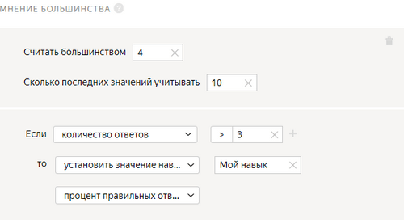
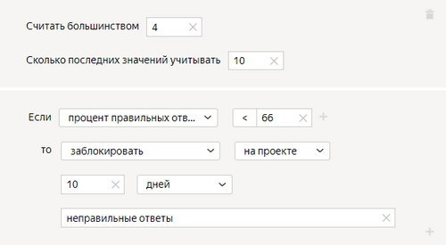
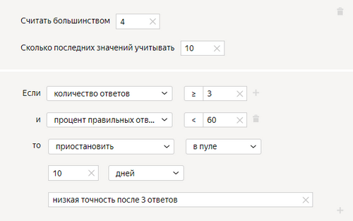
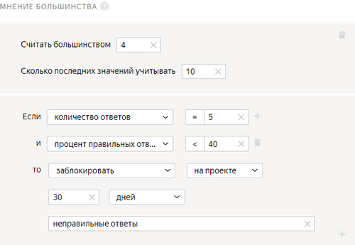

# Мнение большинства



Мнение большинства — это способ [контроля качества](../../glossary.md#quality-control), основанный на совпадении ответов большинства исполнителей, выполняющих одно и то же задание. Например, если в задании с [перекрытием](../../glossary.md#overlap), равным пяти, три исполнителя выбрали одинаковый ответ, это считается косвенным признаком правильности ответа.



Учитываются только [обычные задания](../../glossary.md#general-task), ответы на [контрольные](../../glossary.md#control-task) и [обучающие](../../glossary.md#training-task) задания игнорируются.



В зависимости от доли правильных ответов вы можете изменять значение [навыка](../../glossary.md#skill) у исполнителя либо блокировать ему доступ к заданиям.

Правило начинает действовать с того момента, когда у задания набралось полное перекрытие.



Допустим, для пула, в котором `перекрытие=5`, мы настроили правило:

Оно сработает, только когда минимум три задания из тех, что сделал исполнитель, наберут полное перекрытие. Получив ответы всех пяти исполнителей на задание, система определит, какой ответ выбрало большинство. Если ответы исполнителя на два задания из трех отличаются от ответов остальных, он потеряет доступ к проекту на 10 дней. Чтобы быстрее собрать все ответы для работы правила, включите опцию **Сохранять порядок заданий** в [параметрах пула](pool_poolparams.md#keeptaskorder).

Количество заданий на странице не влияет на работу правила. На каждое задание ответы оцениваются отдельно. Может измениться только скорость получения результатов — чем больше заданий на странице, тем дольше исполнитель их делает.



## Когда использовать {#when-use}

#### Используйте правило **Мнение большинства**, если:

- у вас нет возможности регулярно создавать и добавлять контрольные задания;
- вы хотите, чтобы ответы исполнителей проходили дополнительную проверку.

#### Не используйте, если:

- много вариантов ответа;
- к ответу нужно прикрепить файл;
- требуется расшифровка текста;
- требуется выделение объектов на фото;
- присутствуют задания, в которых нет правильного или неправильного ответа. Например: «Какой образ вам больше нравится?» или «Выберите вариант дизайна страницы, который вам нравится больше».

## Рекомендации по использованию {#advice}

#### Не добавляйте в задание много вопросов и вариантов ответа.

Чем больше у вас вариантов ответа, тем ниже вероятность, что **Мнение большинства** рассчитается правильно.

Чтобы для задания рассчиталось **Мнение большинства**, должны совпадать все ответы на все вопросы внутри задания. Если в задании несколько вопросов и/или на вопросы много вариантов ответа, то меньше вероятность, что наберется нужное для расчета навыка количество одинаковых комбинаций ответов на задание у разных исполнителей. Следовательно, это задание не будет участвовать в расчете навыка. Если **Мнение большинства** для задания не рассчиталось, то исполнителя не накажут за то, что его мнение не совпало с остальными.



#|
|| | **Исполнитель 1** | **Исполнитель 2** | **Исполнитель 3** | **Исполнитель 4** | **Исполнитель 5** ||
|| Задание 1 | OK | BAD | OK | BAD | OK ||
|| Задание 2 | BAD | OK | OK | BAD | 404 ||
|| Задание 3 | 404 | OK | 404 | OK | OK ||
|| Задание 4 | OK | BAD | OK | 404 | 404 ||
|| Задание 5 | OK | BAD | OK | 404 | OK ||
|#

У заказчика есть пять заданий, которые выполнили пять исполнителей. В каждом задании одно поле выходных данных с тремя вариантами ответа. `Перекрытие = 3`. В таком случае, задания 1, 3 и 5 попали под выставленный порог, а остальные задания не будут учитываться при подсчете **Мнение большинства**.

Навык по **Мнению большинства** у исполнителей будет такой:
Исполнитель 1 | (1+0+1)/3=66% правильных
Исполнитель 2 | (0+1+0)/3=33% правильных
Исполнитель 3 | (1+0+1)/3= 66% правильных
Исполнитель 4 | (0+1+0)/3=33% правильных
Исполнитель 5 | (1+1+1)/3=100% правильных



Например, в задании нужно выбрать минимум три подходящие категории из двадцати или отметить, что картинка не отображается. Поскольку комбинаций категорий может быть много, в расчёт правила попадут в основном те задания, где все исполнители ответили **Не отображается**. Это могут быть как правильные ответы, так и ответы недобросовестных исполнителей, которые «прокликали» таким образом задания. В любом случае, навык, рассчитанный по таким ответам, будет недостоверным.

Попробуйте [Декомпозировать задание](solution-architecture.md) или использовать [Контрольные задания](../../glossary.md#control-task). Это обеспечит более точную оценку качества исполнителей.

#### Не выставляйте порог **Считать большинством** меньше 50% от перекрытия или равным перекрытию.

Если порог ответов равен перекрытию, то в расчет правило будет брать только те задания, где все исполнители дали одинаковые ответы, а те, где мнения разошлись, учитывать не будет.



Допустим, в пуле `Перекрытие = 5` и `Считать большинством = 2`. Исполнители выполнили задание.

#|
|| | Ответ на задание ||
||Исполнитель 1 | OK||
||Исполнитель 2 | OK||
||Исполнитель 3 | BAD||
||Исполнитель 4 | BAD||
||Исполнитель 5 | 404||
|#

В этом случае исполнители 1, 2, 3 и 4 ответили правильно, а исполнитель 5 — нет. При этом невозможно понять, какой из ответов правильный.



#### Не используйте **Мнение большинства** там, где:

- много вариантов ответа;
- к ответу нужно прикрепить файл;
- требуется расшифровка текста или выделение объектов на фото, и других заданиях, где исполнители не смогут дать одинаковый ответ.

## Настройка правила {#rule}



В этом правиле все поля, кроме **Учитывать последних заданий**, обязательные. Если вы не заполните хотя бы одно из них, сохранить правило не получится.



#|
||**Поле**|**Описание**||
||**Считать большинством** | Количество совпавших ответов, которое считается **Мнением большинства** (например, 3).
**Учитывать последних заданий** | Количество последних ответов исполнителя.

Если поле не заполнено, в расчете учитываются все ответы на задания только того пула, к которому применяется правило.

Если поле заполнено, то правило считает ответы на задания в рамках значения, указанного в поле. При этом учитываются не только ответы из этого пула, но и из других пулов, где это поле заполнено.

[Подробнее](remember-values.md) о том, как работает это поле.||
||**Если** | Условие, при котором выполняется действие в поле **то**:

- **количество ответов** — количество выполненных заданий.

- **процент правильных ответов** — доля правильных ответов, т.е. совпавших с мнением большинства (от 0 до 100).

- **процент неправильных ответов** — доля неправильных ответов, т.е. не совпавших с мнением большинства (от 0 до 100).

Чтобы добавить несколько условий, нажмите .||
||**то** | Действие, выполняемое при условии:

- **принять все ответы исполнителя в пуле** — требует настройки [отложенной приемки](offline-accept.md).

    Пригодится, если исполнитель выполняет большинство заданий качественно. Пример: исполнитель выполнил больше 80% заданий правильно и вас устраивает такой результат. Правило сработает автоматически — все ответы в пуле будут приняты.

- **приостановить** — приостановить доступ исполнителя к пулу на указанное количество дней. Причина отображается только заказчику.

- **заблокировать** — закрыть доступ к проекту или всем проектам заказчика на указанное количество дней. Причина блокировки отображается только заказчику.

    Если доступ к заданиям блокируется на ограниченный срок (например, на 7 дней), после снятия блокировки история ответов исполнителя не сохраняется. Навык рассчитывается на основании новых ответов.

- **установить значение навыка** — присвоить исполнителю фиксированное значение [навыка](nav.md).

- **установить значение навыка из поля** — сохранить долю правильных ответов исполнителя на задания как значение навыка.||
|#

## Примеры правил {#examples}

Примеры приведены для простой [классификации](categorization.md). Количество заданий на странице — 10.



#### Подсчет навыка и блокировка за неправильные ответы



- Правильная настройка

  

  Оба правила работают независимо:

  1. Если исполнитель дал не меньше 3 ответов на задания, то доля правильных ответов будет записана как значение навыка.
  1. Если исполнитель дал не меньше 3 ответов на задания и доля правильных ответов меньше 65%, то он будет заблокирован на проекте.

  В расчете используется не более 10 последних ответов исполнителя на задания в рамках проекта.

- Неправильная настройка

  

  Исполнитель будет заблокирован, когда даст первый неправильный ответ на первое, второе или третье задание. При этом навык не будет установлен. Поскольку причина блокировки не указана, будет невозможно выяснить, почему исполнитель заблокирован.

- Альтернативная настройка

  

  Все правила действуют независимо:
  1. Если исполнитель дал не меньше 3 ответов на задания, то доля правильных ответов будет записана как значение навыка.
  1. Если исполнитель дал 2 неправильных ответа на 3 задания, то он будет заблокирован в пуле на 10 дней.
  1. Если исполнитель дал 2 неправильных ответа на 4 задания, то он будет заблокирован в пуле на 10 дней.
  1. Если исполнитель дал 5 или больше ответов на задания и доля правильных ответов меньше 80%, то он будет заблокирован в пуле на 10 дней.

  Такой набор правил позволяет не блокировать исполнителей за один неправильный ответ и поддерживать высокую точность.



#### Установка навыка



- Правильная настройка

  

  Если исполнитель ответит на 3 задания, ему будет установлен навык, соответствующий проценту правильных ответов.

  Используйте значение навыка для доступа к другому пулу с помощью [фильтра](filters.md).

- Пример установки фильтра

  

- Неправильная настройка

  

  Это правило никогда не начнет действовать, потому что количество учитываемых ответов (**Учитывать последних заданий**) меньше числа ответов в правиле (**количество ответов**).



#### Блокировка за неправильные ответы



- Правильная настройка

  

  Если доля правильных ответов на задания меньше 40%, то исполнитель будет заблокирован на проекте на 30 дней.

- Неправильная настройка

  

  Если доля правильных ответов на задания меньше 40%, то исполнитель будет заблокирован на проекте на 30 дней. Правило cработает один раз — сразу после пятого ответа на задание.



## Решение проблем {#troubleshooting}



Лучше использовать один [навык](../../glossary.md#skill) в проекте. Можно выбрать способ подсчета навыка:

- Подсчет навыка для каждого пула отдельно. Текущее значение навыка — это значение навыка в пуле, который выполнялся последним. Такой вариант удобен, если:

    - Пулы предназначены для разных групп исполнителей (например, настроены фильтры по городам, странам).

    - Пулы запускаются последовательно, и вы не хотите учитывать качество ответов в предыдущих пулах при подсчете навыка в выполняемом пуле.

    Этот способ подсчета действует по умолчанию при добавлении блока контроля качества в пул. Для блока по контрольным заданиям оставьте пустым поле **Учитывать последних ответов на контрольные и обучающие задания**.

- Подсчет навыка по всем выполненным заданиям в проекте. Такой вариант удобен, если пулы небольшие и вам не нужно рассчитывать навык для каждого пула.

    Этот способ подсчета доступен только для навыков по контрольным заданиям. Чтобы использовать его, заполните поле **Учитывать последних ответов на контрольные и обучающие задания** в блоках контроля качества в пулах.





Да, конечно, один и тот же навык можно назначать и использовать на различных проектах. Но чаще всего один навык используется в рамках одного проекта. Если исполнитель хорошо выполняет одно задание, это не значит, что он так же успешно справится с другим. Кроме того, используя фильтры по давно настроенным навыкам, вы ограничиваете количество доступных исполнителей.





Чтобы выполнять действия с исполнителями (назначение навыка, блокировка), основываясь на мнении большинства, нужно добавить в пул соответствующее [правило](mvote.md).

Не забудьте включить опцию **Сохранять порядок заданий** в параметрах пула. Мнение большинства применяется на проектах с заданными значениями (с радиобаттонами или чекбоксами). Для полей со свободным вводом или файлов это правило работать не будет.





К сожалению, да, может. Поэтому мы рекомендуем перед боевым заданием делать обучение или экзамен, чтобы до боевого пула добирались только те, кто хорошо прошел предыдущий этап отбора.





Считаются все ответы в задании. Если на какой-то вопрос ответ отличается, результат всего задания засчитывается как несовпадающий с ответами других исполнителей.



