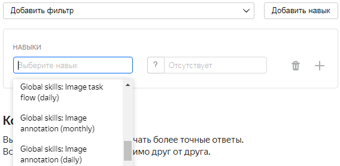

# Глобальные навыки



Это особый тип навыков в Толоке, показывающий общие компетенции исполнителей, такие как обработка текста или выделение объектов на картинках.

#### Преимущества:

- Используйте глобальные навыки, если вы хотите быстро запустить проект и набрать исполнителей, которые хорошо справляются с определенными типами заданий.
- Наши эксперименты показывают, что глобальные навыки в сочетании с традиционными методами контроля качества увеличивают корректность и консистентность разметки.

#### Особенности:

- заказчики не создают этот тип навыков;
- глобальные навыки создаются платформой на основе выполнения заданий в проектах схожей тематики;
- навыки исполнителей ежедневно актуализируются командой Толоки;
- ограничения вида `навык >80` означают «люди, ответы которых были в среднем лучше, чем ответы 80% исполнителей в проектах этой компетенции».

Чтобы воспользоваться этой возможностью, выберите **Добавить фильтр → Навыки → Выбрать глобальный навык**, после чего укажите ограничение по выбранному навыку в добавленном фильтре.

