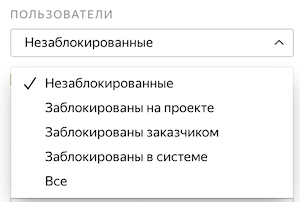

# Удалить навык

Удалить навык можно только вручную, с помощью правил контроля качества этого сделать нельзя.

1. Перейдите на страницу [Пользователи]({{ users }})
1. Выберите исполнителей, у которых надо удалить навык.

    

    

    

    Список может грузиться несколько минут. Если написано **Исполнители не найдены**, попробуйте подождать немного или воспользоваться фильтрами.

    

    

    

    Чтобы выбрать одного исполнителя, введите его идентификатор в поле поиска и нажмите **Найти**.

    Чтобы выбрать несколько исполнителей:
    1. Создайте текстовый файл и запишите в него идентификаторы исполнителей, например:
    ```
    059db2fa0927xec84a4cb9ccafc77ea4
    1a1f14bd48f0be13cb10c18sqgeb0679
    83khfalkdg78m3qhfai3kaf91h9n3ls3
    ```

    1. Нажмите кнопку **Загрузить файл****Upload file** слева внизу и выберите файл.
    1. После завершения загрузки файла нажмите кнопку **Добавить****Add**.

    

    Чтобы посмотреть подробную информацию об исполнителе, нажмите на его идентификатор.

    

    

    

    По умолчанию отображаются только незаблокированные исполнители. Если нажать на выпадающий список, то доступны другие опции:
    - **Заблокированы на проекте** — те, кого вы заблокировали в одном из пулов проекта, например на основе правила контроля качества.
    - **Заблокированы заказчиком** — те, кого вы заблокировали на всех своих проектах.
    - **Заблокированы в системе** — те, кто был заблокирован на платформе за нарушение правил, плохое качество или частые ошибки при вводе капчи.
    - **Все** — показать и заблокированных, и незаблокированных исполнителей.

    

    

    

    Поставьте галочку **Показывать только активных** и укажите количество дней, в течение которых исполнитель должен был выполнить хотя бы одно задание.

    

    

    **В левой части окна** используйте поля **Проект** и **Пул**, чтобы отобрать исполнителей, которые открывали задания в одном из ваших проектов или пулов.

    На странице со статистикой пула эти исполнители указаны в графе **Заинтересовались**.

    В столбце **Выполнено** отображается количество выполненных заданий. Если написано `0`, значит исполнитель только открыл задание, но передумал его выполнять.

    

    

    Чтобы найти исполнителей по навыку, используйте [фильтры](../../glossary.md#filtering):

    1. Нажмите **Добавить фильтр**.
    1. Прокрутите вниз и выберите **Выбрать навык**.
    1. Укажите навык и необходимое значение навыка.

    Фильтры для отбора исполнителей работают так же, как в пуле. Подробнее читайте в разделе [Фильтры](filters.md).

    

    

1. Нажмите **–Навык****–Skill**.
1. Выберите навык.
1. Нажмите кнопку **Удалить****Delete**.


## Решение проблем {#troubleshooting}



Лучше использовать один [навык](../../glossary.md#skill) в проекте. Можно выбрать способ подсчета навыка:

- Подсчет навыка для каждого пула отдельно. Текущее значение навыка — это значение навыка в пуле, который выполнялся последним. Такой вариант удобен, если:

    - Пулы предназначены для разных групп исполнителей (например, настроены фильтры по городам, странам).

    - Пулы запускаются последовательно, и вы не хотите учитывать качество ответов в предыдущих пулах при подсчете навыка в выполняемом пуле.

    Этот способ подсчета действует по умолчанию при добавлении блока контроля качества в пул. Для блока по контрольным заданиям оставьте пустым поле **Учитывать последних ответов на контрольные и обучающие задания**.

- Подсчет навыка по всем выполненным заданиям в проекте. Такой вариант удобен, если пулы небольшие и вам не нужно рассчитывать навык для каждого пула.

    Этот способ подсчета доступен только для навыков по контрольным заданиям. Чтобы использовать его, заполните поле **Учитывать последних ответов на контрольные и обучающие задания** в блоках контроля качества в пулах.





Да, конечно, один и тот же навык можно назначать и использовать на различных проектах. Но чаще всего один навык используется в рамках одного проекта. Если исполнитель хорошо выполняет одно задание, это не значит, что он так же успешно справится с другим. Кроме того, используя фильтры по давно настроенным навыкам, вы ограничиваете количество доступных исполнителей.





В пуле отображается общее число исполнителей, которые выполнили там хотя бы одну страницу заданий. Тренировочный навык может со временем теряться из-за настройки повторного прохождения. Она позволяет заново выполнить тренировку по истечении указанного срока, если исполнитель так и не приступил к заданиям в привязанных пулах или сделал слишком большой перерыв в выполнении заданий (например, из-за [блокировки](../../glossary.md#banned-worker)). Поэтому в тренировочном навыке отображаются те исполнители, которые либо недавно завершили обучение, либо регулярно выполняют ваше задание и не дают навыку исчезнуть.



