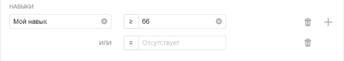

# Использование навыка

Вы можете использовать навыки для фильтрации и отбора исполнителей, чтобы назначать им задания, выдавать бонусы и рассылать сообщения.

## Отбор исполнителей для заданий {#selection}

При настройке пула в [фильтрах](filters.md) вы можете использовать навыки, чтобы:

- Отобрать исполнителей без навыка. Для этого используйте оператор `=`, а значение оставьте пустым.
- Отобрать исполнителей с любым значением навыка — используйте оператор `≠`, а значение оставьте пустым.
- Отобрать исполнителей, у которых значение навыка больше или меньше указанного.

Например, можно отобрать только тех исполнителей, у которых навык больше 66 или отсутствует:

Для [глобальных навыков](nav-cross-project.md) ограничения вида `навык >80` означают <q>люди, ответы которых были в среднем лучше, чем ответы 80% исполнителей в проектах этой компетенции</q>.

## Выдача бонусов {#awarding}

Чтобы отобрать исполнителей по навыку и выдать им [бонусы](../../glossary.md#bonus-ru):

1. Перейдите на страницу [Пользователи]({{ users }})
1. Выберите исполнителей с помощью фильтра по навыку. Для этого используйте [фильтры](../../glossary.md#filtering-ru):

    1. Нажмите **Добавить фильтр**.
    1. Прокрутите вниз и выберите **Выбрать навык**.
    1. Укажите навык и необходимое значение навыка.

1. Для начисления бонусов одному исполнителю нажмите нужную ссылку на его идентификатор в столбце **ID исполнителя****Toloker ID**.

    На открывшейся странице нажмите кнопку .

    Для начисления бонусов группе исполнителей нажмите кнопку **Выдать бонус****Issue bonus**.

1. Заполните поля в появившемся окне **Выдать бонус****Issue bonus**:

    - **Сумма на человека****Bonus per Toloker** в долларах.

    - **Тема****Topic** и **Сообщение****Message** для исполнителей. Укажите, за какие заслуги и проекты начислен бонус. Чтобы отправить сообщения на разных языках, используйте кнопки для переключения языков.

1. Нажмите кнопку **Выдать****Grant**.

    Перед этим обязательно проверьте количество человек, которым будет начислен бонус, и итоговую сумму.

    #### Пример
    

## Рассылка сообщений {#messaging}

Чтобы отобрать исполнителей для [рассылки сообщений](qa-assign.md) об изменениях в проекте или новых заданиях:

1. Перейдите на страницу **Сообщения****Messages**.
1. Нажмите .
1. Введите название навыка.

## Что дальше {#what-next}



- [изменить](nav-edit.md) значение навыка вручную;[удалить](nav-delete.md) навык для конкретного исполнителя;[просмотреть историю](nav-history.md) изменений навыка.

## Решение проблем {#troubleshooting}

#### Нужно ли создавать навык для каждого пула?

Лучше использовать один [навык](../../glossary.md#skill-ru) в проекте. Можно выбрать способ подсчета навыка:

- Подсчет навыка для каждого пула отдельно. Текущее значение навыка — это значение навыка в пуле, который выполнялся последним. Такой вариант удобен, если:

    - Пулы предназначены для разных групп исполнителей (например, настроены фильтры по городам, странам).

    - Пулы запускаются последовательно, и вы не хотите учитывать качество ответов в предыдущих пулах при подсчете навыка в выполняемом пуле.

    Этот способ подсчета действует по умолчанию при добавлении блока контроля качества в пул. Для блока по контрольным заданиям оставьте пустым поле **Учитывать последних ответов на контрольные и обучающие задания**.

- Подсчет навыка по всем выполненным заданиям в проекте. Такой вариант удобен, если пулы небольшие и вам не нужно рассчитывать навык для каждого пула.

    Этот способ подсчета доступен только для навыков по контрольным заданиям. Чтобы использовать его, заполните поле **Учитывать последних ответов на контрольные и обучающие задания** в блоках контроля качества в пулах.

#### Можно ли использовать навык не только в пуле или в одном проекте, но и в разных проектах?

Да, конечно, один и тот же навык можно назначать и использовать на различных проектах. Но чаще всего один навык используется в рамках одного проекта. Если исполнитель хорошо выполняет одно задание, это не значит, что он так же успешно справится с другим. Кроме того, используя фильтры по давно настроенным навыкам, вы ограничиваете количество доступных исполнителей.

#### Обучение прошли более 500 исполнителей, но в тренировочном навыке отображается только 30

В пуле отображается общее число исполнителей, которые выполнили там хотя бы одну страницу заданий. Тренировочный навык может со временем теряться из-за настройки повторного прохождения. Она позволяет заново выполнить тренировку по истечении указанного срока, если исполнитель так и не приступил к заданиям в привязанных пулах или сделал слишком большой перерыв в выполнении заданий (например, из-за [блокировки](../../glossary.md#banned-worker-ru)). Поэтому в тренировочном навыке отображаются те исполнители, которые либо недавно завершили обучение, либо регулярно выполняют ваше задание и не дают навыку исчезнуть.

