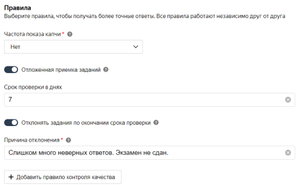
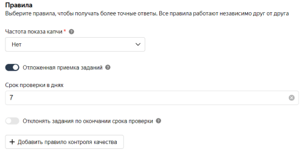
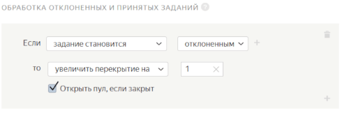

# Отложенная приемка



Отложенная приемка заданий — это параметр настройки [пула](../../glossary.md#pool), который позволяет вам проверять ответы и при этом не платить за задания, которые исполнители сделали некачественно.

[Способы проверки](accept.md#acception) вы найдете в разделе **Работа с результатами** → **Проверка ответов исполнителей**.

## Как это работает {#how-it-works}

Вы настраиваете отложенную приемку для своего пула в [проекте](../../glossary.md#project).

По мере того, как исполнители выполняют задания, их ответы попадают к вам на проверку. Вы можете принять или отклонить ответ исполнителя. Если вы отклоняете ответы, исполнитель может:

- Оспорить результат проверки в переписке с заказчиком — подать [апелляцию](accept.md#appeal).

- Написать в поддержку платформы.

- Поставить низкий балл вашему проекту.



- Пишите доходчивую инструкцию с четким алгоритмом действий, требованиями к результатам и возможными причинами их отклонения.

- Проверяйте ответы качественно — по вашей же инструкции.

- Отклоняйте страницы с ответами, если результат в значительной степени не соответствует инструкции.

    

    Если вы ставили задачу разметить 20 картинок по инструкции, а исполнитель сделал 18 из них верно, а 2 — нет, то считается, что результат выполнения не верен в незначительной мере или же верен в значительной.

    

- Объясните исполнителю, в чем его ошибка, чтобы он смог научиться и в следующий раз сделать лучше.



Проверять ответы можно вручную или с помощью исполнителей, разместив отдельное задание для проверки.



Через 30 дней после завершения заданий пул автоматически отправляется в архив. В заархивированном пуле нельзя менять решение по ответам, поэтому принять ранее отклоненные задания вы уже не сможете.



## Отклонение ответов {#declined}

- Если **вы отклоняете ответы, задания не перенаправляются автоматически** другим исполнителям.

- **Отклонить (как и принять)** один ответ на странице нельзя — **можно только всю страницу целиком** со всеми ответами на ней.

- Если [исполнитель заблокирован](../../glossary.md#banning-tolokers) по [правилам контроля качества](../../glossary.md#quality-control-rule), его ответы все равно нужно проверить.



Отклонение ответов одного задания не приводит к отклонению всех ответов этого исполнителя.



## Автоотклонение и автоприемка ответов {#auto-reject_auto-accept}

Если ваш [тип пула](pool-main.md#table_n3q_vhz_jlb) **Экзамен** или **Реабилитация**, то по окончании срока проверки все непроверенные ответы можно принять или отклонить автоматически.

#### Автоотклонение

Во время настройки или при редактировании пула включите опцию **Отклонять задания по окончании срока проверки** и укажите причину отклонения. Ее увидят те исполнители, чьи ответы будут отклонены.





#### Автоприемка

Оставьте переключатель в положении **Нет**, и задания будут автоматически приняты.





## Как включить отложенную приемку {#accept-params}

Cделайте следующие шаги перед запуском пула:

1. Выберите параметр **Отложенная приемка заданий** на странице пула в режиме редактирования.

1. Укажите **Срок проверки в днях** — количество дней на [проверку](accept.md) (от 1 до 21 дня с момента выполнения задания). Исполнитель увидит срок проверки в информации о задании на главной странице Толоки.

    

    Ставьте срок проверки до 14-ти дней. Исполнители неохотно берут задания с более долгим сроком.

    

1. Сохраните настройки — кнопка **Сохранить** внизу страницы с параметрами пула.

По мере того, как задания будут выполняться, вам будут приходить ответы.



- **Ставьте такой срок, за который вы успеете проверить ответы.** По истечении срока непроверенные ответы принимаются и оплачиваются автоматически, кроме случаев, описанных [выше](#auto-reject_auto-accept).

- **Изложите критерии приемки в инструкции для исполнителей.** Так вы улучшите качество результатов, а также уменьшите количество апелляций и вопросов о причинах отклонения задания от исполнителей.



## Дополнительные настройки {#additional-params}



Чтобы после отклонения ответов Толока автоматически перенаправила задания другим исполнителям:

1. Добавьте в пул блок контроля качества **Обработка отклоненных и принятых ответов**

1. Установите в блоке следующие значения:





Вы также можете [отсеивать исполнителей](control.md), если среди выполненных ими заданий много отклоненных ответов.

Как можно ограничивать исполнителей:

- Блокировать их (настройка блоков контроля качества).
- Приостанавливать их доступ к проектам (настройка блоков контроля качества).
- Присваивать им навык, чтобы использовать его в качестве фильтра в других проектах (настройка фильтров в параметрах пула).

Подробнее об этом в настройке правила [**Результаты проверки**](reviewing-assignments.md).



## Что дальше {#next-steps}

- [Добавьте задания в пул](pool.md).
- Узнайте больше про настройку пула:

    - [Настройка ценообразования](dynamic-pricing.md).
    - [Динамическое перекрытие](dynamic-overlap.md).
    - [Выборочная проверка мнением большинства](selective-mvote.md).
    - [Фильтры](filters.md).
    - [Соотношение скорости и качества](adjust.md).
    - [Настройка контроля качества](qa-pool-settings.md).
    - [Статья в блоге Толоки]({{ toloka-blog-pool }}).



