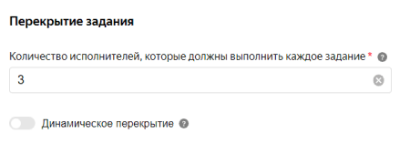

# Что такое перекрытие



Перекрытие — это количество исполнителей, которые должны выполнить каждое задание в [пуле](../../glossary.md#pool).

Установить перекрытие можно в настройках пула:

#### Советы и рекомендации

Тип задания|Рекомендуемое перекрытие
----- | -----
Большинство заданий без отложенной приемки | от 3 до 5
Простое задание | 3
Задание с отложенной приемкой | 1

Вы можете изменить перекрытие после запуска пула. Для этого откройте режим редактирования пула и установите новое значение перекрытия. Перезапускать пул не требуется. Обновление настроек обычно происходит быстро, но если заданий много, то может занять несколько минут.

#### Продвинутые виды перекрытия

- [Динамическое перекрытие](dynamic-overlap.md) позволяет изменять перекрытие в зависимости от того:

    - насколько хорошо исполнители справляются с заданием;
    - насколько согласованы ответы исполнителей.

    Этот вид перекрытия позволит экономить средства, не снижая качество разметки.

- [Выборочная проверка мнением большинства](selective-mvote.md) позволяет настроить [проверку мнением большинства](mvote.md) только для некоторых заданий.

    Этот вид перекрытия позволит экономить средства и ускорить выполнение пула.

## Решение проблем {#troubleshooting}



Да, можно. Настройте [динамическое перекрытие](dynamic-overlap.md) (incremental relabeling, IRL).





Чтобы одно и то же задание выполнило несколько разных исполнителей, используется перекрытие. Его значение устанавливается в [настройках пула](pool-edit.md).





В прогресс-баре указано количество страниц заданий с учетом перекрытия. Если перекрытие больше единицы, то количество страниц заданий будет отличаться от общего количества заданий.





В этом случае, если у вас не наберется 3 одинаковых ответа для задания (порог ответов), то ни один из исполнителей не будет считаться ни плохим, ни хорошим, потому что система не будет знать, кто из этих исполнителей ошибся.

А если вы установите «порог ответов = 2» при «перекрытии = 3», то два исполнителя, у которых совпали ответы, будут считаться хорошими, а третий исполнитель, ответ которого отличается, будет плохим.



