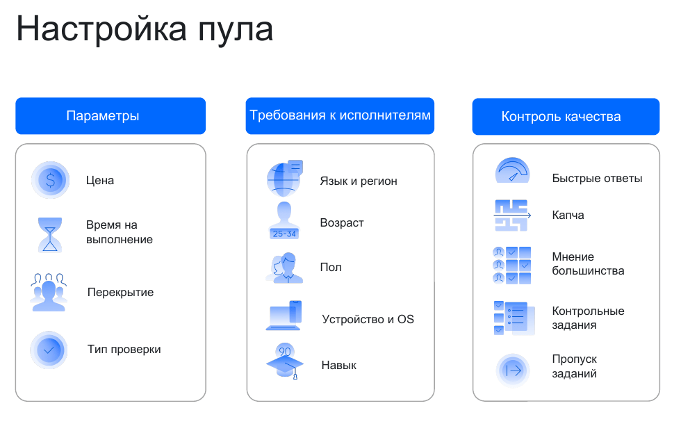

# Как устроена Толока

Для размещения задания в Толоке надо создать три разных сущности: проект, пул и загрузить сами задания. Каждая из этих сущностей отвечает за свой блок настроек задания. Этот раздел объяснит, почему Толока устроена так и какие преимущества это дает.

## Проект {#project}

_Проект_ содержит инструкцию, настройки интерфейса задания и спецификацию входных и выходных данных. Также вы можете настроить правила контроля качества, которые будут действовать для всего проекта.

Благодаря проектам вам будет проще размещать похожие задания в будущем — не придется заново настраивать интерфейс. Также вы сможете смотреть объединенную статистику по всем заданиям в проекте.

## Пул {#pool}

_Пул_ — это набор заданий, которые будут выданы исполнителям одновременно. Основные настройки пула: ценообразование, отбор исполнителей, перекрытие и контроль качества.

Разделение заданий по пулам позволит вам:

- Отбирать разных исполнителей для заданий.

    Например, текст в заданиях по модерации комментариев может быть на разных языках: одни комментарии на русском, другие на английском. Такие комментарии можно разделить по разным пулам, а в фильтрах указать язык, который должен знать исполнитель.

- Выставлять цену, перекрытие и настраивать контроль качества в зависимости от сложности заданий.

    Например, задания по расшифровке аудио длительностью в 10–20 секунд и в 50–60 секунд должны оплачиваться по-разному.

- Управлять приоритетом заданий, выдавая один пул раньше другого.

- Группировать задания, чтобы смотреть отдельную статистику по каждой группе.

## Задание {#task}

_Задания_ — это ваши данные, которые надо разметить. Каждая картинка или комментарий — это отдельное задание.

Задания бывают разных типов: обычные, контрольные (с ответами) и обучающие (с подсказками).

В Толоку вы загружаете задания в виде [файла](../../glossary.md#tsv). Структура файла должна соответствовать спецификации входных и выходных данных, которую вы настроили в проекте.



Чтобы задание выполнило несколько исполнителей, необязательно дублировать его во входных данных — задайте [перекрытие](../../glossary.md#overlap) в настройках пула.



## Страница заданий {#tasks-page}

Исполнителям задания отдаются постранично. На странице может быть одно или несколько заданий. Количество вы указываете при загрузке заданий в пул.



- Ответ исполнителя будет записан только после выполнения всех заданий на странице.
- Цену вы указываете за страницу заданий. Оплачивается только выполненная страница целиком.



У некоторых исполнителей медленный интернет, поэтому добавление нескольких заданий позволит им реже обновлять страницу, а значит быстрее выполнять ваши задания.

Но не делайте слишком много заданий на странице: качество будет хуже, а исполнители будут уставать. Размещайте на странице 5–10 простых заданий или 1–4 сложных.



Вы можете самостоятельно разделить задания на странице — это позволит сгруппировать задания, например отдать на разметку все похожие фотографии одновременно. В этом случае количество заданий на каждой странице может быть разным.



## Как это выглядит у исполнителей {#appearance}

Когда вы запускаете пул, он становится виден исполнителям в разделе **Задания**. Исполнители выбирают пул, читают инструкцию и выполняют задания.

Каждое задание на странице представляет собой фрагмент веб-страницы, в котором могут быть размещены различные объекты: картинки, текст, поля ввода.



У исполнителей нет разделения на пулы, задания и страницы заданий. Всё это они могут называть словом «задание».



Подробнее см. [Как исполнители видят пулы](./pool-main.md).

## Оплата {#payment}

За каждую принятую страницу заданий с вашего счета списываются деньги: плата за страницу заданий и [комиссия за использование Толоки](budget.md). Размер платы задается при [создании пула](pool-main.md).

Также вы можете [начислить бонус](bonus.md) одному или нескольким исполнителям.

## API Толоки {#api}

Если вам надо часто размещать похожие задания, автоматизируйте это с помощью [API Толоки](../../api/index.md).

Если вам не хватает гибкости при размещении заданий, то в API Толоки есть дополнительные возможности, которых еще нет в интерфейсе. Например, через API вы сможете указывать перекрытие для отдельных заданий и добавлять несколько правильных ответов на контрольные задания.

