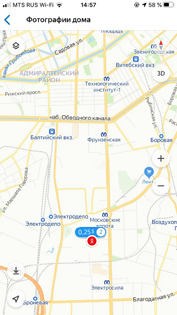
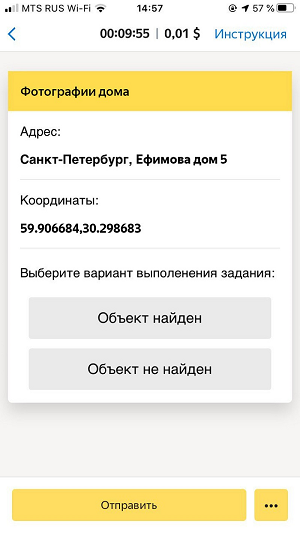
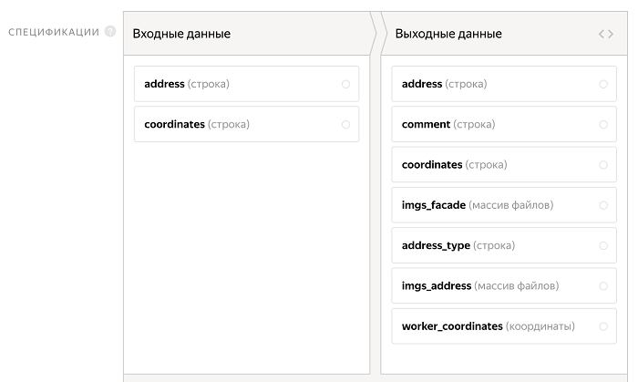
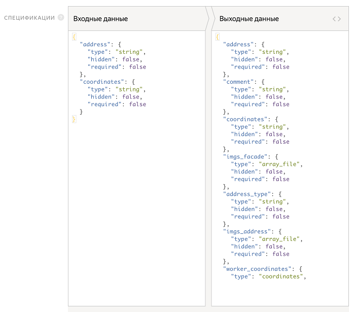

# Фото организаций



Пешеходные (полевые) задания исполнители выполняют в мобильном приложении для [Android]({{ android-app }}) и для [iOS]({{ ios-app }}). Они получают задание с точкой на карте, куда нужно прийти и сделать фотографию (в других задачах, например, [проверить наличие чего-либо](walk.md)).

Возможно, для вашего проекта нужны дополнительные настройки, например, добавление новой кнопки со сценарием выполнения или добавление блока с прикреплением файлов. Подробнее об этом читайте в разделе [Примеры кастомизации](advanced-features.md).

Примеры задач, которые поможет решить этот шаблон:

- Получить интересующие данные: адрес, телефоны, вывески, часы работы, расположение и т.д.
- Проверить, насколько просто найти организацию/торговую точку.
- Подтвердить информацию фотографией реального объекта.

Предположим, вам нужно проверить, правда ли, что по конкретному адресу есть здание. Для этого создаем задание, где исполнитель:

1. Приходит на точку по координатам.

1. Фотографирует здание со всех сторон.

1. Также фотографирует адресную табличку.

    

    Если по данному адресу нет таблички, то нужно сфотографировать табличку на одном из соседних зданий и указать это в задании.

    

#### Пример готового задания

#### Задание в списке доступных

#### Задание на карте

#### Интерфейс задания

#### Ответ исполнителя

Чтобы запустить задания и получить ответы, следуйте инструкции.

## Создайте проект {#project}

В проекте вы определяете, как будет выглядеть задание у исполнителя.

1. Нажмите кнопку **+ Создать проект** и выберите шаблон **Тайный покупатель** в блоке полевых заданий.

1. Дайте проекту понятное название и напишите краткое описание. Это увидят исполнители в списке доступных заданий.

1. 

    Испльзуйте HTML-разметку, чтобы вставлять ссылки, иллюстрации и т. д. Инструкция для пешеходных заданий должна хорошо читаться, в том числе, на экране мобильного телефона.

1. В шаблоне автоматически установлена опция **На карте** для пешеходных заданий. Это означает, что исполнитель увидит задания этого проекта на карте и сможет выбрать любое.

    **Адрес** и **Координаты** будут отображаться, когда исполнитель выберет точку на карте. Текст в этих полях содержит поле входных данных. Оно будет изменено далее.

1. Чтобы в задании показывать исполнителю название точки и ее описание, отредактируйте поля:

    - **Адрес**: `{{inputParams['address']}}`.
    - **Координаты**: `{{inputParams['coordinates']}}`.

1. 

    Определите, какие объекты будете передавать исполнителю, а какие получать от него в ответ. Для этого создайте поля входных и выходных данных в блоке **Спецификации**.

    #### Что такое входные и выходные данные?

    **Входные данные** — типы объектов, которые получит исполнитель для выполнения задания. В этом шаблоне вам понадобится текст. В других задачах бывают картинки или географические координаты.

    **Выходные данные** — типы объектов, которые будут на выходе выполненного задания. Для этого шаблона — один из двух вариантов ответа. При выборе второго ответа откроется список флажков — из них исполнитель должен выбрать подходящие варианты. В других задачах на выходе получают введенный текст или загруженный файл, например.

    Подробнее о [полях входных и выходных данных](incoming.md).

    Шаблон включает в себя:

    - Входные данные — поля:

        - `address` — адрес задания;
        - `coordinates` — координаты точки, куда должен прийти толокер.

    - Выходные данные — поля:
        - `worker_coordinates` — координаты исполнителя в момент исполнения задания, со включенной опцией «Текущее положение»;
        - `address` — адрес задания;
        - `coordinates` — координаты задания;
        - `imgs_address` — массив файлов, фотографии таблички, которые будет загружать исполнитель;
        - `imgs_facade` — массив файлов, фотографии дома, которые будет загружать исполнитель;
        - `address_type` — тип таблички, которую сфотографировал исполнитель (на нужном или соседнем доме);
        - `comment` — текстовое поле, комментарий, который может написать исполнитель;

    #### Графический режим

    

    #### JSON

    

1. Создайте интерфейс задания в блоке **HTML**. Он описывает, как будут расположены элементы задания.

    **Принципы работы с интефейсом задания по шаблону **Фото организаций****

    - В HTML-интерфейсе используются стандартные теги HTML и [специальные компоненты](spec.md) в двойных (или тройных, как для поля `comment`) фигурных скобках для полей входных и выходных данных.

    - **CSS** и **JS** используется для описания логики задания, кроме того, основной контент данного задания заложен в Java Script, для простоты редактирования.

    - В этом проекте, в переменной `texts` хранятся тексты для блока с информацией и тексты для двух вариантов выполнения задания (нашел или не нашел дом).

    - В переменную `MAX_DISTANCE` закладывается максимальное расстояние (в километрах) от назначенной точки, на которое может отойти толокер во время выполнения задания. Указывайте подходящее вам значение.

    - Для этого шаблона нужно минимальное количество фотографий дома — четыре. Если вы хотите изменить это, напишите любое другое число в строчке вместо «4»:

    - `if (solution.output_values.imgs_facade.length < 4)`

    

    Шаблон уже содержит CSS-стили, их изменять не нужно.

    

1. Нажмите кнопку **Предпросмотр**, чтобы увидеть, какое задание у вас получилось.

    В окне предварительного просмотра проекта видно одно задание со стандартными данными. Количество заданий на странице вы сможете настроить дальше.

1. Сохраните проект, нажав **Завершить редактирование**.

## Добавьте пул заданий {#pool}

Пул — это набор оплачиваемых заданий, которые одновременно выдаются исполнителям.

1. Откройте проект и нажмите **Добавить пул**.

1. Дайте пулу любое удобное название и описание. Они доступны только вам, исполнитель будет видеть только название и описание проекта.

1. В блоке **Аудитория** добавьте **Фильтры** для отбора исполнителей. Чтобы ваши задания были доступны в мобильных приложениях Толоки исполнителям, владеющих русским языком и находящихся в Москве, установите язык и регион.

1. В блоке **Цена** установите цену за задание, например 0,2 $. Для пешеходных заданий всегда добавляйте одно задание на страницу.

    #### Что такое страница заданий?

    На одной странице может отображаться одно или несколько заданий. Если задания простые, то можно добавлять 10–20 заданий на одну страницу. Не рекомендуем создавать длинные страницы, поскольку это снизит скорость загрузки данных у исполнителя.

    Исполнитель получит оплату, только если выполнил все задания на странице.

    Количество заданий на странице вы определите при [загрузке заданий](#smart-mixing).

    #### Как определить справедливую цену?

    Общее правило формирования цены — чем больше времени исполнитель тратит на выполнение, тем выше цена.

    Вы можете зарегистрироваться в Толоке как исполнитель и узнать, сколько платят другие заказчики за задания.

1. В блоке **Контроль качества** установите **Перекрытие** — количество исполнителей, которые должны выполнить задание. Для пешеходных заданий, как правило, 1.

1. В блоке **Контроль качества** включите опцию **Отложенная приемка** и укажите количество дней на проверку для параметра **Срок проверки**. Например, 7.

    #### Что такое отложенная приемка?

    [Отложенная приемка](offline-accept.md) позволяет вам просматривать [выполненные страницы заданий](../../glossary.md#completed-tasks) перед тем, как принять их и заплатить исполнителю. Задания, выполненные в несоответствии с инструкцией, можно отклонять. Максимальный срок проверки устанавливается в поле **Срок проверки**.

1. В блоке **Дополнительные настройки** укажите **Время** на выполнение страницы заданий. Его должно быть достаточно для того, чтобы добраться до места, найти указанную точку и загрузить фотографии. Для пешеходных заданий рекомендуем устанавливать сутки — 86 400 секунд.

1. Сохраните пул.

## Загрузите задания {#tasks_upload}

1. Нажмите кнопку **Загрузить****Upload**. В открывшемся окне вы можете скачать шаблон файла.

    #### Использовать пример данных

    Если вы хотите посмотреть, как ваш проект будет выглядеть после запуска, но у вас еще нет заданий для разметки, вы можете загрузить в пул готовый пример данных.

    Нажмите **Использовать пример данных****Use sample data** справа от надписи **Прикрепите подготовленный файл с данными****Attach the prepared file with data**. Это позволит избежать дополнительных действий с файлами.

    После того, как вы поработали с примером данных и вас все устроило, подготовьте свои данные и загрузите их в пул.

1. Добавьте в него входные данные. Заголовок столбца с входными данными содержит слово `INPUT`. Для пешеходных заданий также нужно указать широту `AI:latitude` и долготу `AI:longitude` каждой точки. Координаты можно уточнить, например, в [Яндекс Картах]({{ ya-maps-object-search }}).

1. Загрузите задания, выбрав **Указать вручную** и установив 1 задание на странице.

## Запустите пул и получите результаты {#launch}

1. Запустите пул, нажав кнопку .

1. Следите за выполнением в блоке **Статистика пула**.

1. Как только получены первые результаты, вы можете начинать проверку.

    Чтобы проверить задания, откройте пул и нажмите **Скачать результаты**. Чтобы скачать вложения, нажмите кнопку рядом  и выберите **Скачать вложения**.

    

    По истечении установленного срока проверки все ответы будут автоматически приняты вне зависимости от качества ответа.

    

