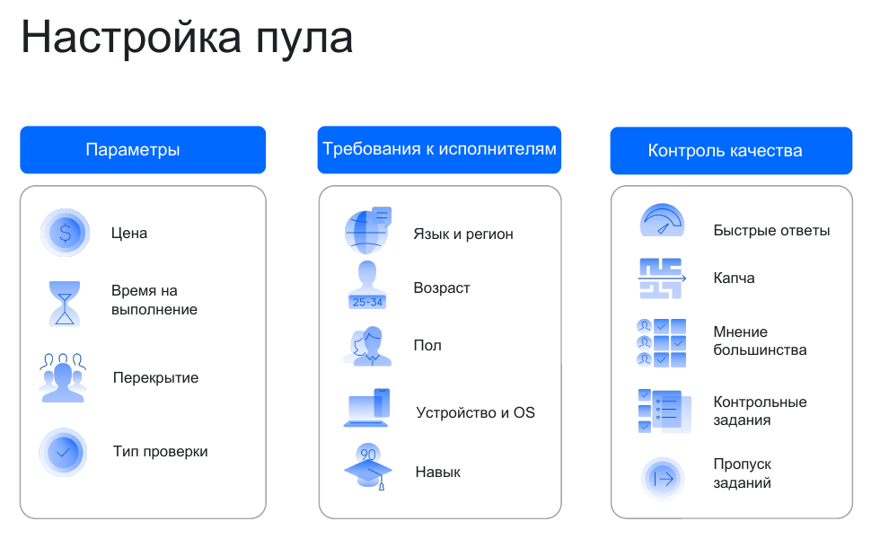

# Редактирование пула

Пул доступен для редактирования как в статусе «Закрыт», так и в статусе «Открыт». На время редактирования открытый пул перейдет в статус «CLOSED_FOR_UPDATE». Например, таким образом можно изменить размер выплаты в запущенном пуле.



Стоимость задания фиксируется в тот момент, когда исполнитель берет его в работу. Если стоимость была изменена во время выполнения задания, исполнитель получит столько, сколько было указано до редактирования.



Чтобы изменить параметры пула, нажмите кнопку **Редактировать****Edit** вверху страницы пула или  в списке пулов на странице [проекта](../../glossary.md#project).

## Общая информация {#pool-general-info}

#### **Название пула****Pool name**

Название [пула](../../glossary.md#pool), которое будете видеть только вы (как заказчик) на странице [проекта](../../glossary.md#project).

#### **Публичное описание****Public description**

Будет отображаться вместо описания проекта в списке заданий для исполнителей и у [привязанного обучения](train.md).

#### **Приватный комментарий****Private comment**

При желании вы можете добавить приватный комментарий, который будет доступен только вам.

## Цена {#pool-price-info}

#### **Цена за страницу заданий, $****Price per task suite, $**

Плата за выполнение [страницы заданий](../../glossary.md#task-page) в долларах США. Для центов используйте точку «.» в качестве разделителя. Если в поле **Тип пула****Pool type** выбрано значение **Пул с обычными заданиями****General tasks**, то минимальная цена за страницу заданий составляет 0,005 $. Для остальных типов пула вы можете указать цену, равную нулю. Подробнее об управлении ценой вы можете узнать в разделе [Настройка ценообразования](dynamic-pricing.md).

#### Интерес исполнителей к цене

Рассчитывается автоматически. Показывает, насколько цена соответствует ожиданиям исполнителей.

#### Количество задач на странице

Рассчитывается автоматически. Показывает, сколько задач на странице рекомендуется для этого типа проекта.

#### **Перекрытие****Overlap**

Количество исполнителей, которые должны выполнить каждое задание пула.

Настраивайте этот параметр, когда нужно, чтобы ваше задание обязательно выполнило несколько человек. В таких задачах, когда собирается датасет фотографий, необходимы записи аудио или проводятся опросы, это просто необходимо. Иногда это повышает качество результатов.

Чтобы сэкономить, вы можете настроить [динамическое перекрытие](../../glossary.md#dynamic-overlap) (incremental relabeling, IRL).

Динамическое перекрытие поможет сэкономить. [Подробнее.](dynamic-overlap.md)

#### Цена за 1 задание

Подсчитывается автоматически с учетом комиссии 30%.

## Аудитория {#pool-audience-info}

#### Контент для взрослых

Наличие порнографического или шокирующего контента в заданиях. Задания из таких пулов раздаются только исполнителям, которые готовы их выполнять.

Если вы не проверяли задания на наличие подобного контента, выберите опцию **В моих заданиях может содержаться шокирующий или порнографический контент****My tasks may contain shocking or pornographic content**.

#### Фильтры и навыки

Устанавливая определенные фильтры, вы выбираете для своего задания аудиторию исполнителей, которые соответствуют вашим требованиям. Есть наборы фильтров, фильтры по различным критериям и фильтры по навыкам, которые вы можете создавать самостоятельно.

Если у вас в задании работа с русскоязычными текстами, то вам не нужно, чтобы проект видели не носители русского языка. Вы можете установить фильтр по русскому языку. Аналогично вы можете ограничить исполнителей по месту проживания в конкретной стране или городе и т.д. [Подробнее](filters.md)

Если вы дадите исполнителям [обучающие задания](../../glossary.md#training-task), то можете добавить в пул навык, чтобы для новых заданий отбирать исполнителей уже с пройденным обучением. [Подробнее о навыках](nav.md)

#### **Соотношение скорости и качества****Speed/quality balance**

[Настройка](adjust.md) выбора аудитории исполнителей для своих заданий. Можно установить процент или количество исполнителей с лучшим рейтингом.

Когда исполнителей много, вы сможете быстро получить результат, но качество ответов исполнителей может быть плохим. Важно найти баланс, который вас устроит. [Подробнее](adjust.md).

## Контроль качества {#pool-quality-control-info}

#### **Частота показа капчи****Captcha frequency**

Вы можете выбрать, как часто показывать исполнителю [капчу](../../glossary.md#captcha-rule):

- «Нет» — не показывать капчу.

- «Низкая» — показывать капчу каждые 20 страниц заданий.

- «Средняя»/ «Высокая» — показывать капчу каждые 10 страниц заданий.

Чтобы показывать капчу исполнителям, настройте блок [контроля качества](captcha.md).

#### **Отложенная приемка заданий****Non-automatic acceptance**

Включите эту опцию, чтобы [проверить](accept.md)[выполненные задания](../../glossary.md#submitted-answers) вручную.

Устанавливайте тот срок, в который вы сможете проверить правильность выполнения заданий и отклонить в случае низкого качества результатов.

Подробнее об отложенной приемке можно почитать [здесь](offline-accept.md) и [здесь](accept.md).

#### **Срок проверки в днях****Review period in days**

Количество дней на приемку заданий (максимум — 21). Исполнитель увидит срок проверки:

- в информации о задании на главной странице Толоки;

- в истории выполненных заданий.

#### Правила контроля качества

Вы можете добавить и другие правила контроля качества, для этого нажмите кнопку **Добавить правило контроля качества**. Можно выбрать готовые наборы правил, либо установить нужные вам правила вручную. [Подробнее](control.md).



#### Быстрые ответы

Ограничьте доступ исполнителям, которые отвечают слишком быстро. Укажите минимальное время (в секундах), которое необходимо на выполнение страницы заданий, и задайте условие.

Например: если количество ответов > 5 и количество быстрых ответов > 3, то заблокировать на проекте на 5 дней. [Подробнее](quick-answers.md).

#### Мнение большинства

Оценивайте ответы исполнителей, сравнивая с мнением большинства: поощряйте исполнителей, которые дают правильные ответы, и блокируйте тех, кто часто ошибается.

В поле **Считать большинством** укажите количество совпавших ответов, которое считается мнением большинства, и задайте условие. Правило начинает работать, когда количество ответов на задание равно перекрытию.

Например: если количество ответов > 5 и процент правильных ответов < 60, то заблокировать на проекте на 10 дней.

#### **Обучение****Training**

Это поле доступно только, если у вас есть обучающие пулы в проекте.

[Обучающий пул](../../glossary.md#training-pool), который будет привязан к основному.

#### Уровень прохождения

Это поле доступно только, если вы заполнили поле **Обучение****Training**.

Процент правильных ответов в обучающих заданиях (от 5 до 100), необходимый для допуска к заданиям в пуле. Для подсчета используются первые ответы исполнителя в заданиях.

Минимальный уровень прохождения, который можно установить, равен 5. Исполнители, прошедшие обучение, но не достигшие заданного уровня, не будут допущены к заданиям.



## Динамическое ценообразование и перекрытие {#pool-dynamic-price-info}

#### **Динамическое ценообразование****Dynamic pricing**

Этот параметр позволяет варьировать стоимость заданий в зависимости от уровня [навыка](../../glossary.md#skill) исполнителей. [Подробнее](dynamic-pricing.md).

#### **Динамическое перекрытие****Dynamic overlap**

Этот параметр можно использовать, если вы укажете фиксированные значения для полей [входных данных](../../glossary.md#input-output-data). С ним вы можете экономить свой бюджет без установки фиксированного [перекрытия](../../glossary.md#overlap) для всех заданий пула.

Вы задаете диапазон, сервис анализирует оценки, их согласованность, уровень навыков исполнителей и при необходимости увеличивает перекрытие, не выходя из границ указанных вами значений. [Подробнее](dynamic-overlap.md).

## Дополнительные настройки {#pool-additional-settings-info}

#### **Приоритет пула внутри проекта****Priority**

Число от 0 до 100. Позволяет ранжировать пул в рамках проекта. Сначала исполнителю будут выданы задания из пула с бóльшим приоритетом.

#### **Время на страницу заданий, с****Time per task suite, sec**

Время на выполнение страницы заданий в секундах. Невыполненные задания перераспределяются другим исполнителям.

Рекомендуется выделять на задание не менее 60 секунд (с учетом времени на загрузку страницы, отправку ответов).

Если вы установите слишком большой интервал, то задания долго не будут закрываться. Если слишком маленький — задания не будут выполнены и оплачены.

#### **Время ожидания закрытия пула, с****Keep pool open after completion, sec**

Интервал, в течении которого пул будет оставаться открытым с момента выполнения всех заданий. Минимум — 0, максимум — 259 200 секунд (трое суток).

Вы можете использовать этот параметр, если, например, вам нужен открытый пул, в который вы периодически будете загружать задания.

#### **Дата закрытия пула****Pool closing date**

Дата закрытия пула. Пул закроется автоматически в указанный срок, даже если задания не были размечены.

#### **Тип пула****Pool type**

Укажите тип пула:

- **Пул с обычными заданиями****General tasks** — основной пул с вашими обычными заданиями;
- **Экзамен****Exam** — пул, в котором содержатся только [контрольные задания](../../glossary.md#control-task);
- **Тренировка****Training** — основной пул, который состоит только из [обучающих заданий](../../glossary.md#training-task) и может иметь нулевую стоимость. Используйте его, чтобы натренировать исполнителей перед выполнением реальных задач, если функциональность [обучающего пула](train.md) вам не подходит;
- **Реабилитация****Retry** — пул, который поможет исполнителям, допустившим ошибки в разметке, улучшить навык и вернуться к выполнению задания;
- **Другой****Other** — если ни один из предыдущих не подошел.



Обязательно выберите тип пула, если цена за страницу заданий равна нулю.



#### **Сохранять порядок заданий****Keep task order**

**Опция выключена (значение по умолчанию)**

Загруженные задания разбиваются на страницы и выдаются исполнителям в случайном порядке. Внутри страницы порядок заданий всегда случайный.



Если при загрузке в пул [файла](../../glossary.md#tsv-file-definition) со ссылками на картинки вы указали 2 задания на странице, то система может сформировать их следующим образом:

Задания в файле | Страница 1 | Страница 2 | Страница 3
----- | ----- | ----- | -----
Изображение 1 | Изображение 2 | Изображение 6 | Изображение 4
Изображение 2 | Изображение 5 | Изображение 1 | Изображение 3
Изображение 3 |  |  |
Изображение 4 |  |  |
Изображение 5 |  |  |
Изображение 6 |  |  |



**Опция включена**

Задания будут разбиты на страницы в том порядке, в котором они записаны в файл с заданиями.



Если при загрузке в пул файла со ссылками на картинки вы указали 2 задания на странице, то с равной вероятностью вы можете получить страницы, где вначале идет первая ссылка, а затем вторая и наоборот:

Задания в файле | Страница 1 | Страница 2 | Страница 3
----- | ----- | ----- | -----
Изображение 1 | Изображение 1 | Изображение 3 | Изображение 5
Изображение 2 | Изображение 2 | Изображение 4 | Изображение 6
Изображение 3 | _или_ | _или_ | _или_
Изображение 4 | Изображение 2 | Изображение 4 | Изображение 6
Изображение 5 | Изображение 1 | Изображение 3 | Изображение 5
Изображение 6 |  |  |



Если в пуле установлено перекрытие, следующее задание выдается только после того, как предыдущее задание выполнено нужным количеством исполнителей.

Используйте параметр **Сохранять порядок заданий**, чтобы:

- Ускорить сбор статистики для контроля [мнением большинства](mvote.md).

- Выдавать задания в порядке приоритета.

    Поместите самые важные задание в начале файла. Они выполнятся быстрее и с нужным перекрытием.

## Что дальше {#what_next}

- [Добавьте задания в пул](pool.md).
- Узнайте больше про настройку пула:
    - [Настройка ценообразования](dynamic-pricing.md).
    - [Динамическое перекрытие](dynamic-overlap.md).
    - [Выборочная проверка мнением большинства](selective-mvote.md).
    - [Фильтры](filters.md).
    - [Соотношение скорости и качества](adjust.md).
    - [Настройка контроля качества](qa-pool-settings.md).
    - [Отложенная приемка](offline-accept.md).
    - 
    - [Статья в блоге Толоки]({{ toloka-blog-pool }}).
    - 

## Решение проблем {#troubleshooting}



Попробуйте выполнить задания сами, попросите своих друзей и коллег. Найдите среднее время выполнения и добавьте к нему 50%.





Перекрытие определяет, сколько исполнителей будут выполнять задание в пуле.

Оптимальное перекрытие — это перекрытие, по результатам которого заказчик получает устраивающее его качество ответов. Для большинства заданий без [отложенной приемки](../../glossary.md#left-off-acceptance) достаточно перекрытия от «3» до «5». Если у вас простое задание, скорее всего, вам хватит перекрытия «3». Для заданий с отложенной приемкой установите перекрытие «1».





Да. [Откройте режим редактирования пула](pool-edit.md) и установите новое значение перекрытия. Перезапускать пул не требуется. Обновление настроек обычно происходит быстро, но если заданий много, то может занять несколько минут.





Количество заданий зависит от сложности и длительности выполнения. Не делайте страницы заданий слишком большими: они неудобны для исполнителей (например, при сбоях в соединении с интернетом) и не пользуются спросом.





Возможные причины:
- Вы остановили [обучающий пул](../../glossary.md#training-pool), и тем самым ограничили количество исполнителей имеющих доступ к заданиям. Запустите обучающий пул снова. Исполнителей, которым доступны задания, станет больше.

- Установлены слишком жесткие фильтры, например строгое ограничение по навыку, которого нет у большинства исполнителей.
- Слишком много исполнителей заблокированы. Сделайте правила контроля качества мягче.





- Мотивируйте исполнителей, назначив [публичный навык](nav-create.md#public) и [динамическое ценообразование](dynamic-pricing.md).
- Постарайтесь [повысить рейтинг проекта](project_rating_stat.md), чтобы ваше задание оказалось выше в списке заданий у исполнителей.
- Отрегулируйте [соотношение скорости и качества](adjust.md).
- Установите более высокий [приоритет](pool_poolparams.md#priority) пула среди всех пулов проекта.





Если вы изменили время на выполнение задания, то его значение применится к тем заданиям, которые еще не взяты исполнителями в работу. Тоже самое касается и случая, когда вы закрываете пул. У исполнителя, у которого задание активно, остается возможность его доделать.





Если вы загрузили в пул задания «Умным смешиванием», то можете остановить пул и разметить задания — отредактировать ответы, подсказки или удалить задания.

Если вы загружали их другим способом, то нужно будет клонировать пул и загрузить туда новый файл с откорректированным списком данных на разметку.



