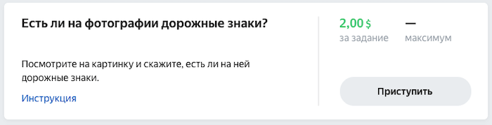
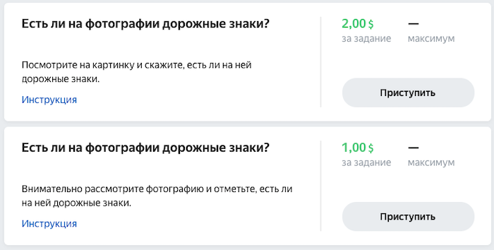

# Создание пула

Если у вас уже есть [пул](../../glossary.md#pool) и вы хотите создать такой же, [клонируйте](pool-main.md) существующий пул. Если нет, создайте новый пул.

## Новый пул {#new-pool}

Пул — это настройки блока заданий, которые будут отправлены на выполнение. [Интерфейс задания](../../glossary.md#task-interface) описан в [проекте](project.md).



Вы можете сначала отладить настройки пула в [песочнице](sandbox.md), а затем [перенести](sandbox.md#export) в основную версию Толоки вместе с проектом.



Чтобы создать пул, воспользуйтесь инструкцией:

1. Нажмите кнопку **Добавить пул****Add pool** на странице проекта.

1. Задайте параметры пула, нажмите **Сохранить****Save**.



### Параметры пула {#pool-params}



## Как исполнители видят пулы {#pool-appear}

Исполнители не видят пулы внутри проекта и не могут выбирать конкретные задания (кроме полевых, где можно выбрать точки на карте). Они также не видят настройки пулов, количество заданий и прогресс выполнения.

Если хотя бы один пул из проекта доступен исполнителю, то такой проект появится на главной странице в виде карточки с названием, описанием и ценой за задание. Выбрав проект, исполнитель получает одно задание из пула. Когда он его выполнит, получает следующее и так далее.

Исполнители увидят на главной странице одну карточку проекта, если пулы в нем отличаются только названиями, контролем качества или [фильтрами](../../glossary.md#filtering). В последнем случае карточка проекта будет состоять из заданий тех пулов, к которым у исполнителя есть доступ.

#### Исполнители увидят одну карточку проекта
Например, вы создаете «Пул 1» и «Пул 2» с одинаковыми настройками в проекте «Есть ли на фотографии дорожные знаки?». Если исполнитель имеет доступ к обоим пулам, то он увидит их как одну карточку на главной странице. 

Исполнители увидят несколько карточек, если пулы отличаются этими настройками:

- тип приемки;
- публичное описание;
- цена задания.

Это пригодится, если вы хотите объединять задания в пулах по тематикам, длительности аудиозаписей или сложности оценки.

#### Исполнители увидят несколько карточек проекта
В этом примере исполнителю доступны два пула с разной ценой и публичным описанием, поэтому он видит у себя на странице две карточки с заданиями из этого проекта. Исполнитель сможет выбрать любую из них — например, где цена выше. 

## Клонирование пула {#clone}

Чтобы клонировать пул, нажмите кнопку  вверху страницы пула или  в списке пулов на странице проекта.

Если необходимо изменить параметры пула, [откройте режим редактирования](pool-edit.md).

## Что дальше {#what_next}

- [Добавьте задания в пул](pool.md).
- Узнайте больше про настройку пула:
    - [Настройка ценообразования](dynamic-pricing.md).
    - [Динамическое перекрытие](dynamic-overlap.md).
    - [Выборочная проверка мнением большинства](selective-mvote.md).
    - [Фильтры](filters.md).
    - [Соотношение скорости и качества](adjust.md).
    - [Настройка контроля качества](qa-pool-settings.md).
    - [Отложенная приемка](offline-accept.md).
    - [Статья в блоге Толоки]({{ toloka-blog-pool }}).

## Решение проблем {#troubleshooting}



Перекрытие определяет, сколько исполнителей будут выполнять задание в пуле.

Оптимальное перекрытие — это перекрытие, по результатам которого заказчик получает устраивающее его качество ответов. Для большинства заданий без [отложенной приемки](../../glossary.md#left-off-acceptance-ru) достаточно перекрытия от «3» до «5». Если у вас простое задание, скорее всего, вам хватит перекрытия «3». Для заданий с отложенной приемкой установите перекрытие «1».





Да. [Откройте режим редактирования пула](pool-edit.md) и установите новое значение перекрытия. Перезапускать пул не требуется. Обновление настроек обычно происходит быстро, но если заданий много, то может занять несколько минут.





Попробуйте выполнить задания сами, попросите своих друзей и коллег. Найдите среднее время выполнения и добавьте к нему 50%.





Количество заданий зависит от сложности и длительности выполнения. Не делайте страницы заданий слишком большими: они неудобны для исполнителей (например, при сбоях в соединении с интернетом) и не пользуются спросом.





Лучше использовать один [навык](../../glossary.md#skill-ru) в проекте. Можно выбрать способ подсчета навыка:

- Подсчет навыка для каждого пула отдельно. Текущее значение навыка — это значение навыка в пуле, который выполнялся последним. Такой вариант удобен, если:

    - Пулы предназначены для разных групп исполнителей (например, настроены фильтры по городам, странам).

    - Пулы запускаются последовательно, и вы не хотите учитывать качество ответов в предыдущих пулах при подсчете навыка в выполняемом пуле.

    Этот способ подсчета действует по умолчанию при добавлении блока контроля качества в пул. Для блока по контрольным заданиям оставьте пустым поле **Учитывать последних ответов на контрольные и обучающие задания**.

- Подсчет навыка по всем выполненным заданиям в проекте. Такой вариант удобен, если пулы небольшие и вам не нужно рассчитывать навык для каждого пула.

    Этот способ подсчета доступен только для навыков по контрольным заданиям. Чтобы использовать его, заполните поле **Учитывать последних ответов на контрольные и обучающие задания** в блоках контроля качества в пулах.



