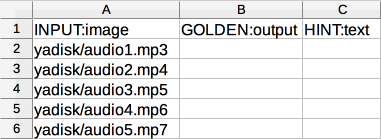
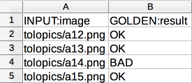
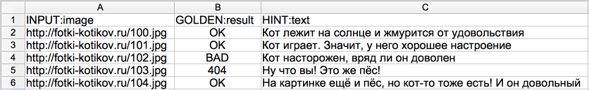

# Создание файла с заданиями

Задания загружаются в [пул](pool-main.md) в [файле с заданиями](../../glossary.md#tsv-file-definition-ru).

Скачайте шаблон файла для вашего [проекта](../../glossary.md#project-ru) на странице [пула](../../glossary.md#pool-ru). На основе шаблона подготовьте собственный файл с заданиями и загрузите его в пул.

Если в пул необходимо загрузить задания разных типов, загрузите несколько файлов, каждый из которых будет содержать задания одного типа.

## Структура файла с заданиями {#structure}

Первая строка файла содержит заголовки столбцов:
- `INPUT:<имя [поля входных данных](incoming.md)>` — входные данные заданий.

- `GOLDEN:<имя [поля выходных данных](incoming.md)>` — ответы для [контрольных заданий](../../glossary.md#control-task-ru).
- `HINT:text` — подсказка для [обучающих заданий](../../glossary.md#training-task-ru). Текст подсказки будет показан исполнителю в верхней части задания на красном фоне, если он в обучающем задании даст ответ, который отличается от указанного правильного.

- Координаты точки для [полевых заданий](walk.md):
    - `Al:latitude` — широта.

    - `Al:longitude` — долгота.

Тип задания зависит от того, какие поля заполнены:

#### Основное

Чтобы создать [основное задание](../../glossary.md#general-task-ru), заполните столбцы с заголовком `INPUT`.

#### Пример с простым объектом (строка, ссылка и т.д)

#### Пример с массивом строк


#### Контрольное

Чтобы создать контрольное задание, добавьте:

- входные данные для задания в столбцы с заголовком `INPUT`;
- правильные ответы в столбцы с заголовком `GOLDEN`.



Вы также можете добавить ответы при создании пула в [режиме разметки заданий](task_markup.md) (для этого нужно использовать [<q>умное смешивание</q>](distribute-tasks-by-pages.md#smart-mixing) при загрузке заданий).




#### Пример


#### Обучающее

Чтобы создать обучающее задание, добавьте:
- входные данные для задания в столбцы с заголовком `INPUT`;
- правильные ответы в столбцы с заголовком `GOLDEN`;
- подсказку в столбец `HINT:text`.

Для обучающих заданий удобно создавать [специальный пул](train.md).



Вы также можете добавить ответы и подсказки при создании пула в [режиме разметки заданий](task_markup.md) (для этого нужно использовать [<q>умное смешивание</q>](distribute-tasks-by-pages.md#smart-mixing) при загрузке заданий).




#### Пример


#### Полевое

Задание, которое исполнитель выбирает на карте в мобильном приложении Толока.

Чтобы создать полевое задание, добавьте:

- входные данные для задания в столбцы с заголовком `INPUT`;
- координаты в столбцы `Al:latitude` и `Al:longitude`.

#### Пример


Столбцы с [обязательными полями входных данных](incoming.md) должны быть заполнены. Остальные столбцы можно удалить, если они пустые.

## Работа с файлом {#applications}

Популярные редакторы электронных таблиц позволяют импортировать и экспортировать данные в формате TSV и XLSX:

- [MS Excel]({{ ms-excel }}).
- [LibreOffice]({{ libre-office }}).
- [Документы Google]({{ google-docs }}).

Для работы с файлами в формате JSON подойдет текстовый редактор (например, БлокнотNotepad на Windows или TextEdit на Mac OS).

Вы можете работать с данными в редакторе, а затем сохранить в требуемом формате:

#### TSV

1. Создайте электронную таблицу с [нужными заголовками](#structure) или скопируйте их из шаблона файла.
1. Добавьте данные для заданий.
1. Скопируйте всю таблицу. Вставьте ее в простой текстовый редактор (например, БлокнотNotepad на Windows или TextEdit на Mac OS).
1. Сохраните файл в кодировке UTF-8 с расширением `tsv`.

#### XLSX

1. Создайте электронную таблицу с [нужными заголовками](#structure) или скопируйте их из шаблона файла.
1. Добавьте данные для заданий.
1. Сохраните файл в формате `xlsx`.

#### JSON

1. Скачайте шаблон файла в формате `json`.
1. Откройте шаблон в текстовом редакторе и добавьте свои данные.
1. Сохраните файл.

Максимальный размер файла —100 Мб.

## Экранирование {#string}

Экранирование — замена в тексте управляющих символов, которые используются для разметки, на соответствующие текстовые подстановки. Используется, когда необходимо отобразить управляющий символ в качестве обычного.

От типа входных данных зависит то, как экранируются управляющие символы. Определите тип данных и прочтите необходимый пункт. Возможные варианты:

#### Данные с типом строка

Чтобы в поле с типом строка отобразить кавычки вида ``"``:
- Каждую такую кавычку внутри текстовых данных дополните еще одной. Другие виды кавычек (`« »` и `“ ”`) не экранируйте.

- Заключите поле в кавычки `" "`.

Неэкранированные кавычки будут удалены при обработке файла.

Данные | Пример передачи в файл | Статус | Что увидит исполнитель
----- | ----- | ----- | -----
``` монитор 24" купить `````` monitor 24" buy ``` | ``` "монитор 24"" купить" `````` "monitor 24"" buy" ``` | ``` корректный `````` correct ``` | ``` монитор 24" купить `````` monitor 24" buy ```
``` книга "Все о собаках" `````` book "All about dogs" ``` | ``` книга "Все о собаках" `````` book "All about dogs" ``` | ``` корректный, но кавычки пропадут `````` correct, but the quotes won't be displayed ``` | ``` книга Все о собаках `````` book All about dogs ```
``` книга <q>Все о собаках</q> `````` book <q>All about dogs</q> ``` | ``` "книга <q>Все о собаках</q>" `````` "book <q>All about dogs</q>" ``` | ``` корректный `````` correct ``` | ``` книга <q>Все о собаках</q> `````` book <q>All about dogs</q> ```
``` монитор 24" купить `````` monitor 24" buy ``` | ``` монитор 24" купить `````` monitor 24" buy ``` | ``` ошибка загрузки `````` loading error ``` |


#### Данные в формате JSON

#### Чтобы загрузить данные в поле с типом JSON

- Каждую кавычку вида ``"`` дополните еще одной. Другие виды кавычек (`« »` и `“ ”`) не экранируйте.

- Заключите поле в  кавычки `" "`.


Данные | Пример передачи в файл | Статус | Что увидит исполнитель
----- | ----- | ----- | -----
``` {"query": "монитор 24 дюйма купить"} `````` {"query": "monitor 24 inch buy"} ``` | ``` "{""query"": ""монитор 24 дюйма купить""}" `````` "{""query"": ""monitor 24 inch buy""}" ``` | ``` корректный `````` correct ``` | ``` монитор 24 дюйма купить `````` monitor 24 inch buy ```
``` {"query": "монитор 24 дюйма купить"} `````` {"query": "monitor 24 inch buy"} ``` | ``` "{"query": "монитор 24 дюйма купить"}" `````` "{"query": "monitor 24 inch buy"}" ``` | ``` ошибка загрузки `````` loading error ``` |


#### Чтобы отобразить кавычку внутри объекта с типом JSON

- Дополните ее еще одной кавычкой `"` или обратной косой чертой и кавычкой `\"`, в том случае, если обратной косой черты перед кавычкой не было.

- Заключите поле в кавычки `" "`.


Данные | Пример передачи в файл | Статус | Что увидит исполнитель
----- | ----- | ----- | -----
``` {"query": "монитор 24\" купить"} `````` {"query": "monitor 24\" buy"} ``` | ``` "{""query"": ""монитор 24\"" купить""}" `````` "{""query"": ""monitor 24\"" buy""}" ``` | ``` корректный `````` correct ``` | ``` монитор 24" купить `````` monitor 24" buy ```
``` {"query": "монитор 24" купить"} `````` {"query": "monitor 24" buy"} ``` | ``` "{""query"": ""монитор 24\"" купить""}" `````` "{""query"": ""monitor 24\"" buy""}" ``` | ``` корректный `````` correct ``` | ``` монитор 24" купить `````` monitor 24" buy ```
``` {"query": "книга \"Все о собаках\""} `````` {"query": "book \"All about dogs\""} ``` | ``` "{""query"": ""книга \""Все о собаках\""""}" `````` "{""query"": ""book \""All about dogs\""""}" ``` | ``` корректный `````` correct ``` | ``` книга "Все о собаках" `````` book "All about dogs" ```
``` {"query": "монитор 24\" купить"} `````` {"query": "monitor 24\" buy"} ``` | ``` "{""query"": ""монитор 24\"\" купить""}" `````` "{""query"": ""monitor 24\"\" buy""}" ``` | ``` ошибка загрузки `````` loading error ``` |
``` {"query": "книга \"Все о собаках\""} `````` {"query": "book \"All about dogs\""} ``` | ``` "{"query": "книга \"Все о собаках\""}" `````` "{"query": "book \"All about dogs\""}" ``` | ``` ошибка загрузки `````` loading error ``` |


#### Чтобы отобразить обратную косую черту `\` внутри объекта с типом JSON

- Экранируйте ее дополнительной косой чертой `\`.

- Заключите поле в кавычки `" "`.


Данные | Пример передачи в файл | Статус | Что увидит исполнитель
----- | ----- | ----- | -----
``` {"query": "множество А\B"} `````` {"query": "array A\B"} ``` | ``` "{""query"": ""множество A\\B""}" `````` "{""query"": ""array A\\B""}" ``` | ``` корректru-ruный `````` correct ``` | ``` множество A\B `````` array A\B ```
``` {"query": "множество А\B"} `````` {"query": "array A\B"} ``` | ``` "{""query"": ""множество A\B""}" `````` "{""query"": ""array A\B""}" ``` | ``` ошибка загрузки `````` loading error ``` |

#### Массив данных в формате JSON

#### Чтобы загрузить массив данных в поле с типом JSON

- Каждую кавычку типа `"` дополните еще одной кавычкой. Другие виды кавычек (`« »` и `“ ”`) не экранируйте.

- Внутри объекта добавьте обратную косую черту `\`, если ее не было, перед каждой запятой. Запятые разделяющие объекты внутри массива экранировать не нужно.

- Заключите поле в кавычки `" "`.


Данные | Пример передачи в файл | Статус | Что увидит исполнитель
----- | ----- | ----- | -----
```  [{"query": "монитор 24 дюйма купить"},{"query": "монитор 19 дюймов купить"}] ``````  [{"query": "monitor 24 inch buy"},{"query": "monitor 19 inch buy"}] ``` | ``` "{""query"": ""монитор 24 дюйма купить""},{""query"": ""монитор 19 дюймов купить""}"  `````` "{""query"": ""monitor 24 inch buy""},{""query"": ""monitor 19 inch buy""}"  ``` | ``` корректный `````` correen-comct ``` | ``` монитор 24 дюймов купить монитор 19 дюймов купить `````` monitor 24 inch buy monitor 19 inch buy ```
``` [{"query": "монитор 24 дюйма\, системный блок купить"},{"query": "монитор 17 дюймов\, системный блок купить"}]  `````` [{"query": "monitor 24 inch\, system unit buy"},{"query": "monitor 17 inch\, system unit buy"}]  ``` | ``` "{""query"": ""монитор 24 дюйма\, системный блок купить""},""query"": ""монитор 19 дюймов\, системный блок купить""}"  `````` "{""query"": ""monitor 24 inch\, system unit buy""},""query"": ""monitor 19 inch\, system unit buy""}"  ``` | ``` корректный `````` correct ``` | ``` монитор 24 дюймов, системный блок купить монитор 19 дюймов, системный блок купить `````` monitor 24 inch, system unit buy monitor 19 inch, system unit buy ```
``` [{"query": "монитор 24 дюйма купить"},{"query": "монитор 19 дюймов купить"}]  `````` [{"query": "monitor 24 inch buy"},{"query": "monitor 19 inch buy"}]  ``` | ``` "{"query": "монитор 24 дюйма купить"},{"query": "монитор 19 дюймов купить"}"  `````` "{"query": "monitor 24 inch buy"},{"query": "monitor 19 inch buy"}"  ``` | ``` ошибка загрузки `````` loading error ``` |
``` [{"query": "монитор 24 дюйма, системный блок купить"},"query": "монитор 17 дюймов, системный блок купить"}]  `````` [{"query": "monitor 24 inch, system unit buy"},"query": "monitor 17 inch, system unit buy"}]  ``` | ``` "{""query"": ""монитор 24 дюйма, системный блок купить""},""query"": ""монитор 19 дюймов, системный блок купить""}"  `````` "{""query"": ""monitor 24 inch, system unit buy""},""query"": ""monitor 19 inch, system unit buy""}"  ``` | ``` ошибка загрузки `````` loading error ``` |


#### Чтобы отобразить кавычку в массиве данных в поле с типом JSON

- Дополните ее еще одной кавычкой `"` или обратной косой чертой и кавычкой `\"`, в том случае, если обратной косой черты перед кавычкой не было. Другие виды кавычек (`« »` и `“ ”`) не экранируйте.

- Заключите поле в кавычки `" "`.


Данные | Пример передачи в файл | Статус | Что увидит исполнитель
----- | ----- | ----- | -----
```  [{"query": "монитор 24\" купить"},{"query": "монитор 19\" купить"}] ``````  [{"query": "monitor 24\" buy"},{"query": "monitor 19\" buy"}] ``` | ``` "{""query"": ""монитор 24\"" дюйма купить""},{""query"": ""монитор 19\"" купить""}"  `````` "{""query"": ""monitor 24\"" inch buy""},{""query"": ""monitor 19\"" buy""}"  ``` | ``` корректный `````` correct ``` | ``` монитор 24" купить монитор 19" купить `````` monitor 24" buy monitor 19" buy ```
```  [{"query": "монитор 24\" купить"},{"query": "монитор 19\" купить"}] ``````  [{"query": "monitor 24\" buy"},{"query": "monitor 19\" buy"}] ``` | ``` "{""query"": ""монитор 24\"" дюйма купить""},{""query"": ""монитор 19\" купить""}"  `````` "{""query"": ""monitor 24\"" inch buy""},{""query"": ""monitor 19\" buy""}"  ``` | ``` ошибка загрузки `````` loading error ``` |


#### Чтобы отобразить обратную косую черту `\` в массиве данных в поле с типом JSON

- Экранируйте ее двумя бэкслешами `\\`.

- Заключите поле в кавычки `" "`.


Данные | Пример передачи в файл | Статус | Что увидит исполнитель
----- | ----- | ----- | -----
```  [{"query": "множество A\B"},{"query": "множество C\B"}] ``````  [{"query": "array A\B"},{"query": "array C\B"}] ``` | ``` "{""query"": ""множество A\\\B""},{""query"": ""множество C\D""}"  `````` "{""query"": ""array A\\\B""},{""query"": ""array C\D""}"  ``` | ``` корректный `````` correct ``` | ``` множество A\B множество C\D `````` array A\B array C\D ```
```  [{"query": "множество A\B"},{"query": "множество C\B"}] ``````  [{"query": "array A\B"},{"query": "array C\B"}] ``` | ``` "{""query"": ""множество A\\B""},{""query"": ""множество C\\D"}"  `````` "{""query"": ""array A\\B""},{""query"": ""array C\\D"}"  ``` | ``` ошибка загрузки `````` loading error ``` |


## Что дальше {#what_next}

- [Загрузите задания в пул](task_upload.md).
- 
- Прочитайте в блоге о том, как [создать]({{ toloka-blog-create-tsv-file }}) и [подготовить]({{ toloka-blog-prepare-tsv-file }})файл с заданиями.
- 


## Решение проблем {#troubleshooting}

#### Загрузка заданий в пул

#### Сколько заданий должно быть на странице?

Количество заданий зависит от сложности и длительности выполнения. Не делайте страницы заданий слишком большими: они неудобны для исполнителей (например, при сбоях в соединении с интернетом) и не пользуются спросом.

#### Ошибки при загрузке заданий в пул

#### Как посмотреть лог обработки

Чтобы посмотреть лог обработки, нажмите **Подробнее об ошибках загрузки**. Лог обработки записан в формате JSON. Объекты внутри `result` соответствуют номеру строки загружаемого файла. Строки, обработанные с ошибкой, имеют статус `"success": false`.


Работать с большим логом удобнее, если скопировать его в текстовый редактор.



#### Ошибки в заголовках столбцов

Если [заголовки столбцов](pool_csv.md) некорректны, файл будет полностью отклонен. В остальных случаях указано количество заданий с ошибками обработки.

#### Таблица ошибок обработки

Описание | Как исправить
----- | -----
``` "parsing_error_of": "https://tlk.s3.yandex.net/wsdm2020/photos/2d5f63a3184919ce7e3e7068cf93da4b.jpg\t\t", "exception_msg": "the nameMapping array and the sourceList should be the same size (nameMapping length = 1, sourceList size = 3)" ```
**Лишние знаки табуляции.**<br/><br/>Если в загружаемом файле после данных или ссылки стоит количество разделителей столбцов `\t` больше, чем задано число столбцов во [входных данных](../../glossary.md#input-output-data-ru), то появится сообщение об ошибке.<br/><br/>Например, когда во входных определен 1 столбец, а в файле после ссылки прописано ещё два знака табуляции `\t\t`, то получится 3 столбца, 2 из которых лишние. | Удалите лишние разделители столбцов, в приведенном выше примере ошибки — оба знака (`\t\t`).
``` "exception_msg": "the nameMapping array and the sourceList should be the same size (nameMapping length = 4, sourceList size = 6)" ```
**Не совпадает количество полей в заголовке и в строке.** | Проверьте, что:<br/><br/>- указано верное количество знаков табуляции в структуре файла;<br/>- строковые значения, содержащие знак табуляции, заключены [в кавычки](pool_csv.md#string)`" "`.
``` "code": "VALUE_REQUIRED", "message": "Value must be present and not equal to null" ```
**Не указано значение обязательного поля входных данных.** | Проверьте, что заполнены все столбцы с обязательными полями входных данных.
``` "code": "INVALID_URL_SYNTAX", "message": "Value must be in valid url format" ```
**Данные в поле с типом <q>ссылка</q> (<q>url</q>) некорректны.** | Проверьте, что:<br/>- Все ссылки начинаются с префикса `http://`, `https://` или `www`.<br/>- <br/>- При [загрузке файла с Яндекс Диска](prepare-data.md) по относительной ссылке, указан тип данных **строка** для [поля входных данных](incoming.md).<br/>- 
``` "exception_msg": "unexpected end of file while reading quoted column beginning on line 2 and ending on line 4" ```
**В строке стоит непарная кавычка.** | Проверьте, что все кавычки [экранированы](pool_csv.md#string).

#### Как понять сколько заданий будет на странице у исполнителя?

Вы можете указать сколько заданий будет на странице при загрузке заданий в пул. Подробнее о способах распределения заданий по страницам можно узнать [здесь](distribute-tasks-by-pages.md).

#### Как загрузить файл с принятыми решениями обратно в Толоку для случая, когда выставлена отложенная приемка? Где описан формат загружаемых данных?

Для загрузки файла используйте кнопку **Загрузить результаты**. Формат можно посмотреть [здесь](accept.md).

Проверка ответов выполняется в файле с заданиями.

#### Почему после запуска первого проекта не приходят ответы и все загруженные задания отмечаются как "Обучающие"?

Проверьте поле `hint`. Для обычных заданий это поле должно быть пустым.

#### Как правильно сформировать файл задания, чтобы не было ошибок?

В файле с основными заданиями должны быть заполнены столбцы с заголовками `INPUT`. Вы можете увидеть эти заголовки, если скачаете образец файла из пула.

Если создаете контрольные задания, то заполните столбцы с правильными ответами — `GOLDEN`.

Если обучающие, то также понадобится заполнить столбец `HINT:text`. Для основных заданий все столбцы кроме `INPUT` не нужны, их можно удалить.

Формат файла должен быть TSV, XLSX или JSON, кодировка — UTF-8.
 
Если вы разместили файлы на Яндекс Диске, посмотрите видео, [как указать ссылки на них в файле с заданиями](https://youtu.be/hIJ6IGaDgeU).

Подробнее о создании файла в [Руководстве](pool_csv.md). Если при загрузке возникают ошибки, поищите вашу ошибку на этой [странице](task_upload.md).

#### Почему при загрузке задания, в котором нужно просмотреть изображение и написать фидбэк, появляется ошибка синтаксиса?

Ошибка будет возникать, если на вход ожидается тип URL, а приходит строка.

Причин может быть две:
- Входное поле имеет тип "ссылка".
- Пул работает на неактуальной версии проекта. То есть создан до того, как вы изменили тип входного поля.

#### Какое максимальное количество заданий может быть на одной странице?

Зависит от задания. Технически можно много.

Но, во-первых, исполнители неохотно берутся за задания, которые требуют много времени на выполнение. То есть, они скорее сделают 10 заданий по одной минуте, чем одно задание на 10 минут.

Во-вторых, при большом количестве заданий на странице может быть проблема с загрузкой файлов для разметки. Например, картинок.

Третий момент — контроль качества и оценка выполнения всей страницы. Если вы используете дооценку заблокированных исполнителей, то лучше дробить задание на более мелкие части, чтобы в переразметку отправлялось меньше заданий. Это позволит уложиться в бюджет.

#### Как в интерфейсе при загрузке файла указываются настройки умного смешивания?

Настройки умного смешивания указываются для файла — не для пула.

При первой загрузке файла указанные настройки будут применяться для всех файлов, загруженных в дальнейшем в этот пул.

#### Как определить время на выполнение задания?
Попробуйте выполнить задания сами, попросите своих друзей и коллег. Найдите среднее время выполнения и добавьте к нему 50%.
#### Чем отличаются task и task_suite?

Task — это отдельное задание. Task suite — страница с заданиями. Исполнитель получает оплату за страницу заданий.

#### Одно и то же задание попало на разные страницы

Одно и то же задание может попасть на разные страницы, если:

- Существует динамическое перекрытие (incremental relabeling, IRL). Например на странице было 5 заданий, по 4-м из них ответы согласовались так, что общий ответ зачелся как верный. Пятое задание будет замешано в другой набор, поскольку оно не попало в финальный ответ и его необходимо <q>дооценить</q>.
- У разных заданий существует разное перекрытие. Те задания, у которых перекрытие указано больше, будут дополнительно показываться в наборах с другими оставшимися заданиями в пуле.
- Если [правило контроля качества](../../glossary.md#quality-control-rules-ru) меняет перекрытие у задания, то оно окажется в другом наборе.

#### Файл с заданиями


#### Почему при генерации файла со ссылками на картинки с Яндекс Диска они не отображаются?

Про подключение Яндекс Диска вы можете прочитать [здесь](prepare-data.md).

В шаблоне проекта должно быть прописано, например, следующее:

``, где `img` — входное поле строкового формата.

Для тестирования используйте файл `example.jpg`. Его URL вы можете найти в .

#### Почему в предпросмотре выводятся сразу все фотографии из файла с заданиями?

Каждое задание должно быть описано на отдельной строке в файле с заданиями. Подробнее об этом вы можете прочитать [здесь](pool_csv.md).

Когда вы создадите пул, то в нем будет настройка количества заданий на странице.

#### Как в файле с обучающим заданием прописать несколько known_solutions?

Загрузить в пул задания с разными ответами через интерфейс невозможно. Можно только через [API]({{ toloka-api-tasks }})

#### Куда добавится файл, если добавить его к запущенному пулу?

Если у вас выставлена галочка **Сохранять порядок заданий**, то разметка начнется после того, как будут взяты в работу предыдущие загруженные задания. Если такой галочки нет, то нет и гарантии, что задания будут раздаваться последовательно.

#### Как правильно организовать структуру файла для загрузки данных, если среди входящих данных есть JSON?

Все значения записываются в один столбец. Не забудьте экранировать кавычки. Подробнее об экранировании кавычек для формата JSON можно узнать в [Руководстве](pool_csv.md#json).

#### Как во входном файле записывать массив?

Массив строк во входных данных записывается через запятую. Например: `INPUT:typestext1, text2, text3, text4`

#### Имеет ли значение порядок следования поля INPUT и полей GOLDEN в файле?

Порядок следования полей в файле значения не имеет. Можете делать так, как удобно.

#### Если для каких-то входящих колонок в файле с заданиями не будет заголовков, то они будут пропущены при импорте? Либо если они будут иметь заголовки без INPUT:.. префикса?

Нет, если вы загрузите в пул файл с несуществующими заголовками, система выдаст ошибку загрузки. Все обязательные INPUT поля, используемые в спецификации должны быть в файле с заданиями. Лишних полей и столбцов быть не должно.

Если вы не хотите показывать какие-то данные исполнителям, но они вам нужны в файле, создайте для них необязательные скрытые входные поля в проекте.

#### Входные данные

#### Как внутри элементов массива сделать так, чтобы запятые не воспринимались как разделитель элементов?

Заэкранируйте запятые обратным слэшем `\`.

#### Как будет отображаться то, что я напишу в столбце "hint"?

Текст из поля `hint` будет показан исполнителю в верхней части задания на красном фоне, если он в обучающем задании даст ответ, который отличается от указанного правильного.

Если текст из поля `hint` необходимо отразить в несколько строк, то переносы добавляются в файл, а текст заключается в кавычки.

#### Что означают строчки "Add your text here"?

Add your text here — это подсказка, которая говорит о том, что текст в поле вы можете заменить на свои данные для задания. О структуре файла и его заполнении можно узнать [здесь](pool_csv.md).

#### Почему при экранировании слова в кавычках другими кавычками, на выходе все кавычки пропадают?

Из-за наличия кавычек в одном слове загружать ответ следует таким образом: `"Сколько букв в слове ""Лихтенштейн"""`. Если внутри текста есть экранирование кавычками, то весь текст следует заключать в кавычки. Подробнее описано в [Руководстве](pool_csv.md#string).

#### Как задавать ссылку в поле GOLDEN?

Текст в поле GOLDEN должен в точности совпадать с эталоном.

Обычно, если копировать ссылку из браузера на определенный сайт, они будут иметь одинаковый формат. Другое дело, если ссылка была обрезана или набрана на клавиатуре.

Проверьте ссылки, которые используете. Решить задачу с унификацией ссылок можно несколькими способами:
- Добавить требования к формату ссылок в инструкцию и подсказки в обучении.
- Обрезать полученные ссылки в js с помощью regexp и записать результат в новое выходное поле, а после сравнить полученное значение с эталоном.

