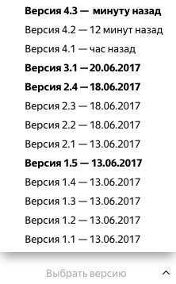

# Возврат к предыдущей версии проекта

Все изменения в [проекте](../../glossary.md#project) сохраняются в истории версий. Вы можете просматривать предыдущие версии или вернуться к любой из них.

Номер версии (например, **1.2**) состоит из двух чисел:

1. Мажорная версия (первое число) появляется при изменении [обязательных полей](incoming.md#required) выходных или выходных данных:
    - добавлении, удалении или переименовании обязательного поля;
    - изменение поля с необязательного на обязательное;
    - изменение параметров поля, не совместимые с текущей спецификацией:
    - уменьшение максимального или увеличение минимального количества элементов в массиве;
    - изменение допустимых значений для строк;
    - уменьшение максимальной или увеличение минимальной длины строки;
    - уменьшение максимального или увеличение минимального значения для числа.

1. Минорная версия (второе число) появляется при любых других изменениях в проекте.



Изменения мажорной версии проекта не отразятся на существующих [пулах](../../glossary.md#pool).



Чтобы вернуться к предыдущей версии проекта:
1. Перейдите к редактированию проекта.
1. Нажмите **Выбрать версию** внизу страницы.

    

    

    

1. Выберите версию. Параметры проекта вернутся к состоянию выбранной версии.
1. Сохраните проект, чтобы сделать выбранную версию проекта актуальной.

## Что дальше {#what_next}

- [Создайте пул заданий в проекте](pool-main.md).

