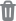
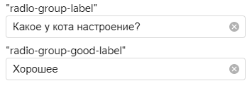
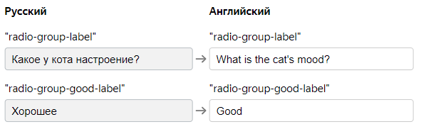

# Перевод на другие языки



Если ваши задания нацелены на исполнителей из разных стран, вы можете перевести проект на их родные языки.

У проекта, переведенного на несколько языков есть ряд преимуществ, перед другими проектами:

- исполнитель, увидев, описание и инструкцию на родном языке с большей вероятностью возьмет задание;
- исполнители лучше поймут суть задания.

Если проект предполагает перевод на несколько языков, рекомендуем создать проект на английском и выбрать его качестве исходного.



Добавить перевод можно только в новом интерфейсе создания проектов.



## Добавление перевода {#project-lang}

Воспользуйтесь инструкцией или посмотрите [видео](https://youtu.be/1grLt774P-s?rel=0).

1. Во время создания или редактирования проекта откройте шаг **Переводы на другие языки**.

1. Выберите **Исходный язык** и добавьте язык для перевода.

1. Добавьте все переводы и сохраните.

## Как это работает {#how-it-works}

Толока подбирает наиболее удобный язык, ориентируясь на язык исполнителя в интерфейсе и профиле.

## Удаление и редактирование {#delete-edit}

Чтобы удалить или отредактировать готовый перевод откройте шаг **Перевод на другие языки** и нажмите  для удаления и  для редактирования.

## Параметры переводов {#param}

#|
|| **Параметр** | **Описание** ||
||**Исходный язык** | Основной язык, используемый в настройках проекта.||
||**Переводы** | Здесь отображаются выбранные вами языки и состояние их перевода.||
||**Язык** | Отображает все языки, которые вы выбрали, а также их статусы.

-  — язык активен и будет отображаться у исполнителей.

-  — язык неактивен. Если вы добавили язык, но не заполнили поля, язык будет неактивен и исполнители его не увидят.||
||**Название и описание** | Отображает информацию про текущее состояние перевода названия и описания проекта.||
||**Инструкция** | Отображает информацию про текущее состояние перевода инструкции проекта.||
||**Интерфейс задания** | Отображает информацию про текущее состояние перевода интерфейса задания.||
|#

## Перевод интерфейса задания {#interface-translate}



Перевод элементов интерфейса доступен только в редакторе конструктора шаблонов.



1. При создании или редактировании проекта на шаге **Интерфейс задания** добавьте в конфигурации к текстовым свойствам:

    - компонент для перевода `helper.translate`;
    - ключ (`key`) — то значение, в котором будет храниться перевод.

    Например, так свойство `label` выглядит до:

    ```json
    {
        "type": "field.radio-group",
        "label": "Какое у кота настроение?"
    }
    ```

    Так свойство `label` выглядит после того, как к нему добавили компонент перевода и ключ `radio-group-label`:

    ```json
    {
        "type": "field.radio-group",
        "label": {
            "type": "helper.translate",
            "key": "radio-group-label"
        }
    }
    ```

    Ключи вы создаете сами, поэтому нужно давать такое имя ключа, чтобы было понятно:

    - к какому компоненту относится ключ;
    - к какому значению внутри компонента он относится.

    Например, имя ключа `radio-group-good-label` означает, что он относится:

    - к компоненту `field.radio-group`;
    - к значению `good`;
    - к свойству `label`.

    Имя ключа можно писать как на латинице, так и на кириллице.

1. Добавьте тексты для ключей на исходном языке.

    В этом примере мы добавили два ключа: `radio-group-label` и `radio-group-good-label`. Остается добавить в них нужные тексты для дальнейшего перевода на другие языки.

    

    Сохраните изменения в интерфейсе.

1. На шаге **Переводы на другие языки** выберите нужные языки и добавьте переводы ключей интерфейса задания.

    

