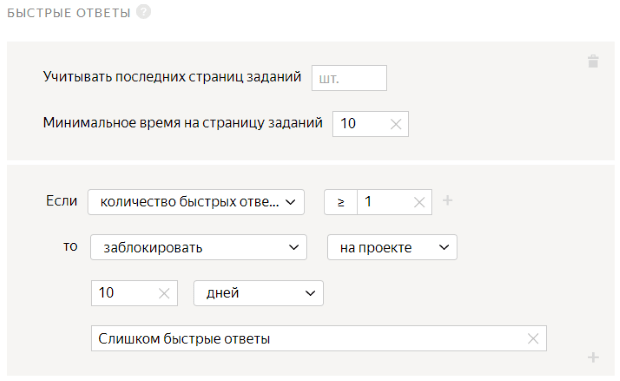

# Опросы





Сначала запустите проект в [Песочнице]({{ sandbox }}). Так вы сможете избежать ошибок и потраченных средств, если окажется, что ваше задание не работает.



Опросы предназначены для сбора информации с целью проведения какого-либо исследования. Количество респондентов устанавливается в [перекрытии](pool_poolparams.md#ovlp), а требования к ним — добавлением [фильтров](filters.md).

Возможно, для вашего задания нужны дополнительные проекты, например предварительная проверка датасета или проверка ответов исполнителей. Подробнее об этом читайте в разделе [Декомпозиция задания](solution-architecture.md).

Предположим, вы хотите узнать, где завтракают и что предпочитают русскоязычные респонденты. Для этого создадим единственное задание на странице и в [пуле](../../glossary.md#pool): исполнитель видит несколько вопросов с вариантами ответов.






Чтобы запустить задания и получить ответы:

1. [Создайте проект](#project)
1. [Добавьте пул заданий](#pool)
1. [Загрузите задания](#tasks_upload)
1. [Настройте контроль качества](#quality_control)
1. [Запустите пул и получите результаты](#launch)

## Создайте проект {#project}



#### В интерфейсе:

1. Выберите пресет:

    1. 

    1. 

1. Заполните общую информацию:

    1. Дайте проекту понятное название и краткое описание. Их увидят исполнители в списке доступных заданий.

    1. По желанию добавьте **Приватный комментарий**.

    1. Нажмите **Сохранить**.

1. 

    

    - Конструктор шаблонов

      1. 

          Воспользуйтесь [готовым кодом](https://ya.cc/t/5dOreK6G3tvhtr) для этого проекта, где уже настроена валидация и внешний вид задания. Исполнитель не сможет отправить задание, пока не ответит на каждый из вопросов.

          [Подробнее о настройке условий](../../template-builder/best-practices/conditions.md) в конструкторе шаблонов.

      1. 

          - Поле входных данных — строка `theme` для загрузки опроса. Оно не используется в интерфейсе и может содержать любой текст.

          - Поля выходных данных:

            - обязательная строка `place`, в которую будет записан ответ исполнителя на вопрос «Где вы обычно завтракаете?»;
            - обязательная строка `food`, в которую будет записан ответ исполнителя на вопрос «Что вы чаще всего едите на завтрак?»;
            - обязательная строка `drink`, в которую будет записан ответ исполнителя на вопрос «Что вы пьете на завтрак (помимо воды)?».

      1. 

    - Редактор HTML/CSS/JS

      1. Определите, какие объекты будете передавать исполнителю и получать от него в ответ. Для этого необходимо создать поля входных и выходных данных в блоке **Спецификация данных**.

          

          

          

          Подробнее о [полях входных и выходных данных](incoming.md).

          

          Удалите все поля выходных данных и добавьте нужные:

          - Поле входных данных — строка `theme` для загрузки опроса. Оно не используется в интерфейсе и может содержать любой текст.

          - Поля выходных данных:

            - обязательная строка `place`, в которую будет записан ответ исполнителя на вопрос «Где вы обычно завтракаете?»;
            - обязательная строка `food`, в которую будет записан ответ исполнителя на вопрос «Что вы чаще всего едите на завтрак?»;
            - обязательная строка `drink`, в которую будет записан ответ исполнителя на вопрос «Что вы пьете на завтрак (помимо воды)?».

          

          

          

          

          

          

      1. Создайте интерфейс задания в блоке **HTML**. Он описывает, как будут расположены элементы задания.

          В HTML-интерфейсе можно использовать стандартные теги HTML и [специальные выражения](spec.md) в двойных фигурных скобках для полей входных и выходных данных.

          ```html
          <div>
          <div>Где вы обычно завтракаете?</div>
          {{field type="radio"name="place"value="home" label="Дома"}}
          {{field type="radio" name="place" value="university" label="В учебном заведении"}}
          {{field type="radio" name="place" value="work" label="На работе"}}
          {{field type="radio" name="place" value="cafe" label="В кафе"}}<br/><br/><br/>
          </div>
          <div>
          <div>Что вы чаще всего едите на завтрак?</div>
          {{#field type="select"name="food" placeholder="" width="300px"}}
          {{select_item value="kasha" text="Кашу / Мюсли / Хлопья"}}
          {{select_item value="egg" text="Яичницу / Омлет / Яйца (вареные, всмятку)"}}
          {{select_item value="sandwich" text="Бутерброды / Булочки / Блины / Оладьи"}}
          {{select_item value="curd" text="Творог / Йогурт / Запеканку / Сырники"}}
          {{select_item value="other" text="Другое"}}
          {{/field}}<br/><br/><br/>
          </div>
          <div>
          <div>Что вы пьете на завтрак?</div>
          {{field class="option" type="radio"name="drink" value="coffee" label="Кофе / Чай"}}
          {{field class="option" type="radio" name="drink" value="milk" label="Молоко"}}
          {{field class="option" type="radio" name="drink" value="juice" label="Сок"}}
          {{field class="option" type="radio" name="drink" value="other" label="Другое"}}<br/><br/><br/>
          </div>
          <div>
          Благодарим вас за участие в нашем опросе!
          </div>
          ```

          Эта запись означает, что исполнитель увидит три вопроса с вариантами ответов.

          Очистите блоки JavaScript и CSS.

      1. Нажмите кнопку  **Предпросмотр задания**, чтобы увидеть получившееся задание.

          

          В предварительном просмотре проекта отображается одно задание со стандартными данными. Количество заданий на странице вы сможете настроить далее.

          

      1. 

    

1. Для опроса [инструкция](../../glossary.md#instructions) не требуется. Пожелания и рекомендации по заполнению опроса поместите в [интерфейс задания](../../glossary.md#task-interface).

    

    Не оставляйте свои контактные данные. Это противоречит [Соглашению с заказчиком]({{ customeragreement }}).

    

1. 

Подробнее о работе с проектом читайте в разделе [Проект](project.md).

## Добавьте пул заданий {#pool}

Пул — это набор оплачиваемых заданий, которые одновременно выдаются исполнителям.

1. Откройте проект и нажмите **Добавить пул**.

1. Дайте пулу любое удобное название — оно доступно только вам, исполнитель увидит название проекта.

1. В блоке **Аудитория** добавьте **Фильтры** для отбора исполнителей. Чтобы ваше задание было доступно только исполнителям, владеющим русским языком, установите фильтры **Регион по номеру телефона** и **Языки**: выберите исполнителей из России, Украины, Казахстана и Беларуси, которые в своем профиле отметили знание русского языка.

    

1. В блоке **Цена** установите цену в долларах США за [страницу заданий](../../glossary.md#task-suite), например, `0.01`. В опросе страница заданий должна содержать одно задание. Если вам нужна помощь в оценке задач, почитайте про [настройку ценообразования](dynamic-pricing.md#section_wb1_lhl_vlb).

1. В блоке **Контроль качества** установите **Перекрытие задания** — количество исполнителей, которые должны выполнить задание. Для начала установите небольшое количество, например, 100. Если вы видите, что этого недостаточно для выборки, увеличьте перекрытие.

1. В блоке **Дополнительные настройки** укажите **Время** на выполнение страницы заданий, например, 600 секунд.

1. Нажмите кнопку **Создать пул**.

## Загрузите задания {#tasks_upload}



1. Нажмите кнопку **Загрузить**. В открывшемся окне вы можете скачать шаблон файла.

1. Добавьте в него входные данные. Заголовок столбца с входными данными содержит слово `INPUT`. Чтобы загрузить задание, добавьте любой текст в столбец `INPUT`. Строка из поля входных данных не используется в интерфейсе. Остальные столбцы оставьте пустыми.

    

1. Загрузите задания, выбрав **Указать вручную** и установив 1 задание на странице.

## Настройте контроль качества {#quality_control}

[Блоки контроля качества](control.md) позволяют отсеивать невнимательных исполнителей. Контроль качества можно настраивать как в проекте, так и в пуле.

1. 

1. Добавьте блок **Быстрые ответы** и укажите следующие значения:

    

    Это означает, что если исполнитель выполнит хотя бы одну страницу заданий быстрее чем за 10 секунд, он будет заблокирован на проекте и не сможет выполнять задания 10 дней.

1. Добавьте блок **Повторное выполнение заданий после блокировки исполнителя**.

    Для опросов нужно добавлять оба правила всегда — они эффективны только в паре для таких заданий. Часто в опросе одна страница с заданиями. Это правило дополняет быстрые ответы так, чтобы в итоге получить необходимое количество ответов, а не просто заблокировать тех, кто слишком быстро отвечает.

    

    **Повторное выполнение заданий после блокировки исполнителя** увеличивает перекрытие, значит, и бюджет тоже.

    

    Отклоняйте задания по описанным в инструкции условиям. Чтобы у вас была репутация хорошего заказчика, не отклоняйте автоматически такие быстрые ответы. На простые опросы легко ответить меньше, чем за 20 секунд.

    

    Это означает, что если исполнитель заблокирован за [быстрые ответы](../../glossary.md#fast-responses), в результате чего его ответы не учтены, задание этого исполнителя будет [повторно](restore-task-overlap.md) отправлено на выполнение другому исполнителю.

## Запустите пул и получите результаты {#launch}

1. Запустите пул, нажав кнопку .

1. Следите за выполнением в блоке **Статистика пула**.

1. Запустите агрегацию результатов, когда пул будет полностью выполнен. Для этого около кнопки **Скачать результаты** нажмите .

    Агрегация ответов нужна для того, чтобы у вас была полная картина по всем результатам. Подробнее [об агрегации](result-aggregation.md).

1. Отслеживайте ход агрегации на странице **Операции**. По завершении нажмите кнопку **Скачать**.

1. Если ответов исполнителей недостаточно для анализа, то увеличьте **Перекрытие**, чтобы получить больше ответов.

    

    1. Остановите пул, нажав кнопку .

    1. В правом верхнем углу нажмите **Редактировать**.

    1. Измените значение в блоке **Перекрытие**.

    1. Нажмите кнопку **Сохранить** и запустите пул.

    

## Решение проблем {#troubleshooting}



1. Создать проект из пустого шаблона.

1. Напишите свой вопрос в блоке HTML.

1. Если ответ должен быть [развёрнутый](t-components/text.md), то добавьте нужное количество компонентов для ввода текста.

1. Если ответ должен быть [коротким](t-components/string.md), то добавьте нужное количество компонентов для ввода строки.

1. Для каждого из компонентов придумайте своё название (name) и создайте соответствующее количество выходных полей с типом строка с таким же названием. В них будут записываться ответы.

1. Сделайте все выходные поля обязательными.

1. Входное поле сделайте техническим. Оно будет использоваться только для создания файла с заданиями.

1. Придумайте название входному полю и укажите для него тип строка, как это сделано в пошаговом [руководстве по созданию опроса](questionnaire.md).





В опросе имеется техническое входное поле. В него можно передать любую информацию — она не будет видна исполнителям.

Загрузите одно задание и в перекрытии укажите количество человек, которое хотите опросить.





