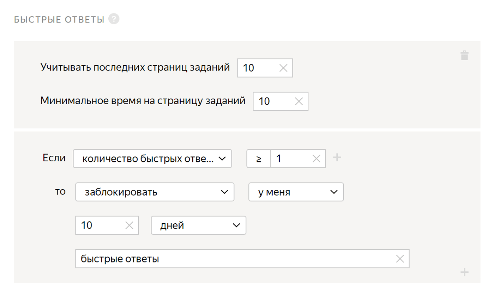

# Быстрые ответы

Правило используется для того, чтобы отсеять недобросовестных исполнителей, которые выполняют задания слишком быстро и небрежно. Также вы сможете обеспечить защиту от роботов, которые могут исказить итоговые результаты разметки пула.



Если вам необходима дополнительная защита от роботов, воспользуйтесь [капчей](captcha.md).



## Когда использовать {#when-use}

Ограничьте доступ к заданиям исполнителям, которые отвечают слишком быстро, чтобы:

- Приостанавливать доступ исполнителям, которые отвечают недобросовестно. В этом случае установите время, достаточное для выполнения [страницы заданий](../../glossary.md#task-suite) с помощью случайных ответов.

- Обеспечить защиту от роботов. В этом случае времени на выполнение страницы заданий должно быть в 2 раза меньше.

Чтобы оценить время, нужное для выполнения одной страницы:

- [выполните задание в песочнице](sandbox.md#self), если еще не запустили задание;

- посмотрите **Среднее время выполнения страницы заданий****Average assignment completion time** в [статистике пула](pool_statistic-pool.md#avgtime), если задание уже запущено.

## Как настроить {#rule}

#|
|| Поле | Описание ||
||**Учитывать последних страниц заданий****Recent task suites to use** | Количество последних страниц заданий, которые выполнил исполнитель.

Если поле не заполнено, в расчете учитываются все последние страницы заданий только того пула, к которому применяется правило.

Если поле заполнено, то правило считает последние страницы заданий в рамках значения, указанного в поле. При этом учитываются не только страницы заданий из этого пула, но и из других пулов, где это поле заполнено.

Подробнее о том, как работает это поле, читайте в разделе [Параметр «Помнить значений»](remember-values.md).||
||**Минимальное время на страницу заданий****Minimum time per task suite** | Время выполнения страницы заданий (в секундах). Все, что выполнено быстрее, считается быстрым ответом.||
||**Если****If** | Условие, при котором выполняется действие в поле **то****then**:

- **количество ответов****number of responses** — количество последних ответов исполнителя (меньше или равно количеству в поле **Учитывать последних страниц заданий****Recent task suites to use**).

- **количество быстрых ответов****number of fast responses** — допустимое количество быстрых ответов (из последних).

Чтобы добавить несколько условий, нажмите .||
||**то****then** | Действие, выполняемое при условии:

- **установить значение навыка****assign skill value** — присвоить исполнителю фиксированное значение [навыка](nav.md).

- **принять все ответы исполнителя в пуле****accept all assignments from this performer in the pool** — требует настройки [отложенной приемки](offline-accept.md).

    Пригодится, если исполнитель выполняет большинство заданий качественно. Пример: исполнитель выполнил больше 80% заданий правильно и вас устраивает такой результат. Правило сработает автоматически — все ответы в пуле будут приняты.

- **приостановить****suspend** — приостановить доступ исполнителя к пулу на указанное количество дней. Причина отображается только заказчику.

- **заблокировать****ban** — закрыть доступ к проекту или всем проектам заказчика на указанное количество дней. Причина блокировки отображается только заказчику.

    Если доступ к заданиям блокируется на ограниченный срок (например, на 7 дней), после снятия блокировки история ответов исполнителя не сохраняется. Навык рассчитывается на основании новых ответов.||
|#

## Примеры правил {#examples}

**Задача**: вы заметили, что пул закрылся слишком быстро и итоговый результат оказался неудовлетворительным. Чтобы такого больше не повторялось, вы решили отсеять исполнителей, которые выполняют задания слишком быстро.

Примеры приведены для простой [классификации](categorization.md). Количество заданий на странице — 10.



#### Блокировка за быстрые ответы



- Правильная настройка

  

  Если исполнитель выполнит страницу заданий быстрее чем за 10 секунд, он будет заблокирован и не сможет больше выполнять ваши задания.

- Неправильная настройка

  

  Это правило никогда не начнет действовать, потому что количество учитываемых ответов (**Учитывать последних страниц заданий****Recent task suites to use**) меньше числа последних ответов в правиле (**количество последних ответов****number of responses**).

- Приостановка в пуле за быстрые ответы

  

  Если исполнитель выполнит две страницы заданий быстрее чем за 20 секунд, ему будет ограничен доступ к пулу и он не сможет выполнять ваши задания 10 дней.



## Решение проблем {#troubleshooting}



Попробуйте выполнить задания сами, попросите своих друзей и коллег. Найдите среднее время выполнения и добавьте к нему 50%.





Лучше использовать один [навык](../../glossary.md#skill) в проекте. Можно выбрать способ подсчета навыка:

- Подсчет навыка для каждого пула отдельно. Текущее значение навыка — это значение навыка в пуле, который выполнялся последним. Такой вариант удобен, если:

    - Пулы предназначены для разных групп исполнителей (например, настроены фильтры по городам, странам).

    - Пулы запускаются последовательно, и вы не хотите учитывать качество ответов в предыдущих пулах при подсчете навыка в выполняемом пуле.

    Этот способ подсчета действует по умолчанию при добавлении блока контроля качества в пул. Для блока по контрольным заданиям оставьте пустым поле **Учитывать последних ответов на контрольные и обучающие задания**.

- Подсчет навыка по всем выполненным заданиям в проекте. Такой вариант удобен, если пулы небольшие и вам не нужно рассчитывать навык для каждого пула.

    Этот способ подсчета доступен только для навыков по контрольным заданиям. Чтобы использовать его, заполните поле **Учитывать последних ответов на контрольные и обучающие задания** в блоках контроля качества в пулах.





Да, конечно, один и тот же навык можно назначать и использовать на различных проектах. Но чаще всего один навык используется в рамках одного проекта. Если исполнитель хорошо выполняет одно задание, это не значит, что он так же успешно справится с другим. Кроме того, используя фильтры по давно настроенным навыкам, вы ограничиваете количество доступных исполнителей.





Да, в настройках [быстрых ответов](quick-answers.md) указывается время за выполнение 1 страницы с заданиями.





Автоматически отклонить ответы заблокированного исполнителя нельзя.





