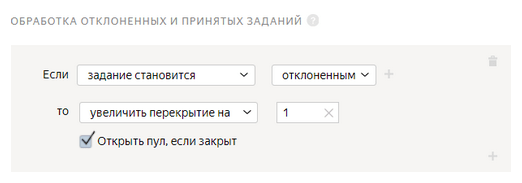

# Обработка отклоненных и принятых заданий

Вы можете включить опцию [Отложенная приемка](offline-accept.md), чтобы [отклонять или принимать](accept.md) задания, которые выполнили исполнители. Задания отклоняются и принимаются постранично.



По окончанию срока проверки, указанного в поле **Срок проверки в днях****Review period in days**, задания принимаются автоматически.



## Когда использовать {#when-use}

Это правило пригодится, когда нужно:

- Отправлять отклоненные задания на повторное выполнение другим исполнителям.

    Если вы отклонили задание, вы можете захотеть, чтобы его выполнил другой исполнитель вместо того, чье задание вы отклонили. Для этого вы можете увеличить [перекрытие](../../glossary.md#overlap) только для этого задания. Это особенно полезно, когда у вас стоит перекрытие равное единице.

- Сэкономить на повторном выполнении уже принятых заданиях.

    Если вы проверили и приняли задание, то возможно нет смысла, чтобы задание выполняли и другие исполнители. Для этого вы можете уменьшать перекрытие только для принятых заданий.

## Настройка правила {#rule}



Все поля этого правила — обязательные. Если вы не заполните хотя бы одно из них, правило сохранить не получится.



#|
||**Поле**|**Описание**||
||**Если****If** | Условие, при котором выполняется действие в поле **то****then**:

- **число непроверенных ответов****submitted assignments** — количество [страниц заданий](../../glossary.md#task-suite), которые выполнены и ожидают проверки.

- **число принятых ответов****approved assignments** — количество страниц заданий, принятых в результате отложенной приемки.

- **число отклоненных ответов****rejected assignments** — количество страниц заданий, отклоненных в результате отложенной приемки.

- **задание становится принятым****assignment becomes approved** — в результате отложенной приемки страница заданий принята.

- **задание становится принятым после отклонения**** assignment becomes approved after rejection** — в результате отложенной приемки страница заданий было сначала отклонена, но затем принята.

    

    Учтите, нельзя изменить статус задания, если [пул](../../glossary.md#pool) заданий был [отправлен в архив](pool-archive.md).

    

- **задание становится отклоненным****assignment becomes rejected** — в результате отложенной приемки страница заданий отклонена.

Чтобы добавить несколько условий, нажмите .||
||**то****then** | Действие, выполняемое при условии:

- **увеличить перекрытие на****extend overlap by** — позволяет повторно отправить [страницу заданий](../../glossary.md#task-suite) на выполнение другим исполнителям.

    Чтобы задание было автоматически отправлено на повторное выполнение, даже если ваш пул уже выполнен и закрыт, включите опцию **Открыть пул, если закрыт****Open pool if closed**.

- **уменьшить перекрытие на****extend overlap by** — позволяет уменьшить количество выполнений страницы заданий исполнителями. Например, используйте это действие, чтобы отменить повторное выполнение уже принятых заданий.||
|#

## Пример правила {#examples}

В задаче надо отправить отклоненные и выполненные повторно задания на проверку. Или после отклонения отдать их новым исполнителям.



- Правильная настройка

  

  Если по результатам отложенной приемки задания исполнителя отклонены, они будут отправлены на повторное выполнение другому исполнителю.

- Неправильная настройка

  

  Если по результатам отложенной приемки задания исполнителя отклонены, они не будут отправлены на повторное выполнение другому исполнителю.



## Решение проблем {#troubleshooting}



Перекрытие определяет, сколько исполнителей будут выполнять задание в пуле.

Оптимальное перекрытие — это перекрытие, по результатам которого заказчик получает устраивающее его качество ответов. Для большинства заданий без [отложенной приемки](../../glossary.md#assignment-review) достаточно перекрытия от «3» до «5». Если у вас простое задание, скорее всего, вам хватит перекрытия «3». Для заданий с отложенной приемкой установите перекрытие «1».





Да. [Откройте режим редактирования пула](pool-edit.md) и установите новое значение перекрытия. Перезапускать пул не требуется. Обновление настроек обычно происходит быстро, но если заданий много, то может занять несколько минут.



