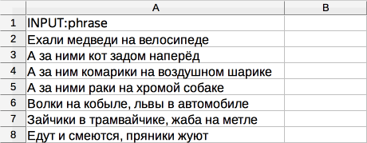

# Запись речи





Сначала запустите проект в [Песочнице]({{ sandbox }}). Так вы сможете избежать ошибок и потраченных средств, если окажется, что ваше задание не работает.



Задания для записи речи удобнее всего запускать для выполнения в мобильном приложении для [Android]({{ android-app }}) и для [iOS]({{ ios-app }}). Мобильные приложения позволяют записывать звук прямо в задании через встроенный диктофон устройства.

Возможно, для вашего задания нужны дополнительные проекты, например предварительная проверка датасета или проверка ответов исполнителей. Подробнее об этом читайте в разделе [Декомпозиция задания](solution-architecture.md).

Предположим, вам нужно собрать аудиозаписи, в которых исполнители произносят ваш текст. Для этого создадим такое задание: исполнителю будет предложена текстовая фраза и должен приложить аудиозапись в качестве ответа.

Чтобы запустить задания и получить ответы:

1. [Создайте проект](#project)
1. [Добавьте пул заданий](#pool)
1. [Загрузите задания](#tasks_upload)
1. [Запустите пул и получите результаты](#launch)

## Создайте проект {#project}



#### В интерфейсе:

1. Выберите пресет:

    1. 

    1. Выберите пресет **Запись речи на диктофон****Voice recording**.

1. Заполните общую информацию:

    1. Дайте проекту понятное название и краткое описание. Их увидят исполнители в списке доступных заданий.

    1. По желанию добавьте **Приватный комментарий**.

    1. Нажмите **Сохранить**.

1. 

    

    - Конструктор шаблонов

      1. 

          Воспользуйтесь [готовым кодом](https://ya.cc/t/smZEOmz13tviUh)[ready-made code](https://ya.cc/t/or7qYOff3tvicE) для этого проекта, где уже настроена валидация и внешний вид задания. Исполнитель не сможет отправить задание, если не загрузит аудиозапись.

          Подробнее о [настройке условий](../../template-builder/best-practices/conditions.md) в Справке конструктора шаблонов.

      1. 

          В данном проекте:

          - Поле входных данных: `text` — текст, который должен произнести исполнитель.

          - Поле выходных данных: `audio_record` — аудиозапись, которую должен загрузить исполнитель.

    - Редактор HTML/CSS/JS

      1. 

      1. В блоке **Спецификация данных** задаются параметры входных и выходных данных.

          

          

          

          

          

          

      1. Нажмите кнопку  **Предпросмотр задания****Preview task**, чтобы увидеть получившееся задание.

          

          В предварительном просмотре проекта отображается одно задание со стандартными данными. Количество заданий на странице вы сможете настроить далее.

          

      1. 

    

1. 

1.  1. Напишите краткую и ясную инструкцию. Опишите в ней, что надо сделать, и приведите примеры.

    Вы можете подготовить инструкцию в формате HTML и вставить ее в редактор. Чтобы переключиться в режим HTML, нажмите **<>**.

    1. Нажмите **Завершить**.

Подробнее о работе с проектом читайте в разделе [проект](project.md).

## Добавьте пул заданий {#pool}

Пул — это набор оплачиваемых заданий, которые одновременно выдаются исполнителям.

1. Откройте проект и нажмите **Добавить пул**.

1. Дайте пулу любое удобное название и описание. Они доступны только вам, исполнитель будет видеть только название и описание проекта.

1. В блоке **Аудитория** добавьте **Фильтры****Filters** для отбора исполнителей. Чтобы ваше задание было доступно только исполнителям, владеющим русским языком, установите фильтры **Регион по номеру телефона** и **Языки**: выберите исполнителей из России, Украины, Казахстана и Беларуси, которые в своем профиле отметили знание русского языка.

    

1. Если в задании не будет взрослого контента в любом виде, отключите **Контент для взрослых****Adult content**.

1. В блоке **Цена** установите цену за страницу заданий, например 0,02 $.

    

    На одной странице может отображаться одно или несколько заданий. Если задания простые, то можно добавлять 10–20 заданий на одну страницу. Не рекомендуем создавать длинные страницы, поскольку это снизит скорость загрузки данных у исполнителя.

    Исполнитель получит оплату, только если выполнил все задания на странице.

    Количество заданий на странице вы определите при [загрузке заданий](#smart-mixing).

    

    

    Общее правило формирования цены — чем больше времени исполнитель тратит на выполнение, тем выше цена.

    Вы можете зарегистрироваться в Толоке как исполнитель и узнать, сколько платят другие заказчики за задания.

    

1. В блоке **Контроль качества** установите **Перекрытие****Overlap** — количество исполнителей, которые должны выполнить задание. Значение зависит от того, сколько вариантов одной и той же фразы вы хотите собрать. Если достаточно одного, поставьте 1.

1. Включите опцию **Отложенная приемка****Offline accept** и укажите количество дней на проверку в поле **Срок проверки****Review period**. Например, 7.

1. В блоке **Дополнительные настройки** укажите **Время****Time** на выполнение страницы заданий. Его должно быть достаточно, в том числе для чтения инструкции и загрузки задания. Например, 1200 секунд.

1. Сохраните пул.

## Загрузите задания {#tasks_upload}



1. Нажмите кнопку **Загрузить**. В открывшемся окне вы можете скачать шаблон файла с заданиями.

1. Добавьте в файл входные данные. Заголовок столбца с входными данными содержит слово `INPUT`. Заполните колонку `INPUT:phrase` текстами, которые нужно надиктовать, остальные колонки нужно убрать.

    

1. Загрузите задания, выбрав **Указать вручную****Set manually** и установив,например, 5 заданий на странице. Это значит, что на одной странице будет 5 фраз и исполнителю нужно будет приложить 5 аудиофайлов.

## Запустите пул и получите результаты {#launch}

1. Запустите пул, нажав кнопку .

1. Следите за выполнением в блоке **Статистика пула****Pool statistics**.

1. Начинайте проверку, как только получены первые результаты. По истечении установленного срока все ответы будут автоматически приняты вне зависимости от качества ответа.

    Чтобы проверить задания и скачать приложенные файлы, откройте пул и нажмите кнопку **Скачать результаты****Download results**, а затем **Скачать вложения**.

    

    Формат файлов, получаемых из мобильных приложений Толоки, — WAV 16KHz 16bit PCM.

    

## Решение проблем {#troubleshooting}



Для Толоки задачу нужно декомпозировать. Задание на 30 минут для одного человека со всеми фразами лучше разбить на отдельные фразы и предложить разным исполнителям. Шаблон для создания задания такого типа не потребует от исполнителя установки отдельного диктофона.

Возьмите наше пошаговое описание создания [задания по записи фраз на диктофон](record-audio.md).

Во входных данных можно передать фразу, которую должен произнести исполнитель (включить навигацию), и скорость речи (normal speed). Эти данные вам и нужно будет записать в файл с заданиями. О создании файла и его структуре можно прочитать в [Руководстве](pool_csv.md).

В предпросмотре по умолчанию 4 задания на странице. Их количество для вашего проекта можно будет указать при загрузке файла с заданиями. [Подробнее о предпросмотре](spec.md).

Например, если вам нужно, чтобы один человек произнес одну и ту же фразу 10 раз, сделайте на странице 10 заданий. Стоимость указывается за целую страницу. Определить, сколько человек должно произнести ту или иную фразу, можно с помощью перекрытия в пуле. Кстати, не забудьте о фильтрах в пуле, чтобы отобрать только исполнителей, владеющих русским языком и выдать задание на мобильном: клиент = мобильная Толока.

Вы можете поручить проверку записанных фраз другим исполнителям, создав отдельный проект. Как это сделать кратко описано [здесь](record-audio.md).





Если вы передаёте тексты во входные данные, то достаточно загрузить в пул 2 разных задания: в одном из них в поле `INPUT: <имя входного поля>` вы передадите текст № 1, в другом — текст № 2.

Если текст в самом шаблоне задания, в блоке HTML, то нужно клонировать проект. Чтобы исполнитель мог сделать только одно задание в вашем проекте, используйте правило [Выполненные задания](submitted-answers.md). Можно назначить навык или заблокировать исполнителя, после того, как он отправит один ответ.





Если никто из исполнителей не смог отправить задание, скорее всего проблема в валидации в JS. Проверьте её ещё раз.

Перенесите проект в сендбокс и попробуйте выполнить задание самостоятельно в песочнице.





Добавьте к компоненту для вставки картинки параметры `real-size=true` и `screenshot=true`.



 



Если картинки, аудио или видео с Яндекс Диска не отображаются в [инструкции](../../glossary.md#instructions) или на [странице задания](../../glossary.md#task-suite), убедитесь, что вы правильно подключили Диск и загрузили файлы.

- [Как подключить Яндекс Диск](prepare-data.md#prepare-data__connect)
- [Как загрузить файлы для инструкции](prepare-data.md#prepare-data__instruction)
- [Как загрузить файлы для задания](prepare-data.md#prepare-data__interface)



Для создания задания возьмите за основу [шаблон для разметки видео]({{ templates-video-new }}).

Чтобы разместить ваши видеоролики на Яндекс Диске, его нужно подключить и настроить проект.



Подробная видеоинструкция об этом [в нашем блоге]({{ toloka-blog-yadisk }}).







Проблема в шаблоне задания. Проверьте, что:

- Для поля входных данных, куда вы передаете ссылку на файл, в проекте указан тип «строка».

- В компоненте в шаблоне задания используется выражение proxy.

- Формат относительных ссылок в файле с заданиями указан верно: <уникальное имя>/<путь и имя файла>.

Подробная инструкцию и видео на странице [Использование файлов с Яндекс Диска](prepare-data.md).



 



- В настройках проекта в поле **Входные данные** указан тип _ссылка_. Необходимо выбрать тип _строка_.

- В [файле с заданиями](../../glossary.md#tsv) указаны абсолютные ссылки на файлы для заданий. Необходимо вставить ссылку вида `<уникальное имя>/<путь и имя файла>`. Например: `yadisk/image1.jpg` или `yadisk/photos/image1.png`.

- Фото с Яндекс Диска используются в инструкции к заданию в мобильном приложении. Чтобы фото отобразилось в инструкции, используйте только прямые ссылки.

- Файлы удалены или находятся не в той папке на Диске, на которую ведет ссылка.

- OAuth-токен не активен. Обновите токен на странице [Интеграция]({{ integration }}).

Чтобы файлы, загруженные на Яндекс Диск (картинки, аудио, видео), отображались у исполнителя, нужно:

1. Подключить Яндекс Диск в профиле.

1. Установить тип строка для поля [входных данных](../../glossary.md#input-output-data).

1. Вставлять ссылку на файл при помощи компонента `proxy`.

[Подробная инструкция](prepare-data.md)













Попробуйте воспользоваться рекомендациями с [этой страницы]({{ yadisk-uploading }}) или написать в службу поддержки Яндекс Диска.





