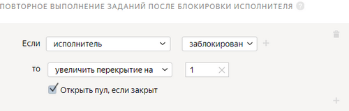
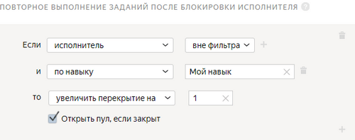

# Повторное выполнение заданий после блокировки исполнителя

Используйте это правило, если исполнитель был заблокирован, и вы хотите, чтобы его задания выполнил кто-то еще.



Не используйте данное правило в [пулах](../../glossary.md#pool-ru) с [динамическим перекрытием](dynamic-overlap.md). Это правило увеличит значение максимального [перекрытия](../../glossary.md#overlap-ru).



## Когда использовать {#when-use}

Если вы хотите получить по каждому заданию в заданном перекрытии ответы <q>хороших</q> исполнителей и не боитесь заплатить за это больше.



Применение этого правила может привести к увеличению стоимости пула.



Ответы заблокированных исполнителей будут учтены, если не отклонить их вручную при помощи отложенной приемки. Чтобы отправить задания этих исполнителей на повторную разметку, настройте правило.

Чтобы выгрузить ответы незаблокированных исполнителей:

1. Зайдите в проект.
1. Зайдите в пул.
1. Справа вверху нажмите **Скачать результаты**.
1. Активируйте опцию **Не учитывать ответы заблокированных исполнителей**.
1. Нажмите **Скачать результаты**.

#### Не используйте, если:

- не хотите, чтобы увеличивалось перекрытие по заданиям;
- хотите, чтобы окончательный бюджет на разметку пула не превысил стартовый;
- у вас настроено [динамическое перекрытие](dynamic-overlap.md) (incremental relabeling, IRL). Это правило увеличит значение максимального перекрытия.

## Настройка правила {#rule}



Все поля этого правила — обязательные. Если вы не заполните хотя бы одно из них, правило сохранить не получится.



Поле
 |
Описание

----- | -----
**Если****If** | Условие, при котором выполняется действие в поле **то****then**: - **заблокирован****banned** — доступ исполнителя к заданиям заблокирован по одному из [правил контроля качества](../../glossary.md#quality-control-rules-ru) (например, контрольные задания, мнение большинства, [быстрые ответы](../../glossary.md#fast-responses-rule-ru), [пропуск заданий](../../glossary.md#skipped-tasks-ru), ввод [капчи](../../glossary.md#captcha-rule-ru)).      - **вне фильтра****filtered out** — исполнитель перестал соответствовать хотя бы одному из установленных [фильтров](filters.md).      - **по навыку****skill** — исполнитель перестал соответствовать фильтру по определенному навыку.  Чтобы добавить несколько условий, нажмите .
**то****then** | Действие, выполняемое при условии:  - **увеличить перекрытие на****extend overlap by** — позволяет повторно отправить [страницу заданий](../../glossary.md#task-page-ru) на выполнение другим исполнителям.          Чтобы задание было автоматически отправлено на повторное выполнение, даже если ваш пул уже выполнен и закрыт, включите опцию **Открыть пул, если закрыт****Open pool if closed**.

## Примеры правил {#examples}

**Задача**: распределить фотографии для датасета по разным категориям. Если исполнитель был заблокирован по одному из правил контроля качества (например, [быстрые ответы](quick-answers.md)) или перестал соответствовать навыку, то его ответы не зачтутся и будут переданы на выполнение другому исполнителю.

#### Правильная настройка

#### Повторная отправка заданий при блокировке исполнителя

Если исполнитель заблокирован по одному из правил контроля качества, его задания будут отправлены на повторное выполнение другому исполнителю.

#### Повторная отправка заданий при несоответствии исполнителя фильтру по навыку

Если исполнитель перестал соответствовать фильтру по навыку, в результате чего его ответы не учтены, его задания будут отправлены на повторное выполнение другому исполнителю.

#### Неправильная настройка

#### Повторная отправка заданий при блокировке исполнителя

Если исполнитель заблокирован по одному из правил контроля качества, его задания не будут отправлены на повторное выполнение другому исполнителю.

#### Повторная отправка заданий при несоответствии исполнителя фильтру по навыку

Если исполнитель перестал соответствовать фильтру по навыку, в результате чего его ответы не учтены, его задания не будут отправлены на повторное выполнение другому исполнителю.

## Решение проблем {#troubleshooting}

#### Какое перекрытие лучше установить?

Перекрытие определяет, сколько исполнителей будут выполнять задание в пуле.

Оптимальное перекрытие — это перекрытие, по результатам которого заказчик получает устраивающее его качество ответов. Для большинства заданий без [отложенной приемки](../../glossary.md#left-off-acceptance-ru) достаточно перекрытия от <q>3</q> до <q>5</q>. Если у вас простое задание, скорее всего, вам хватит перекрытия <q>3</q>. Для заданий с отложенной приемкой установите перекрытие <q>1</q>.

#### Можно ли изменить перекрытие после запуска пула?

Да. [Откройте режим редактирования пула](pool-edit.md) и установите новое значение перекрытия. Перезапускать пул не требуется. Обновление настроек обычно происходит быстро, но если заданий много, то может занять несколько минут.

#### Нужно ли создавать навык для каждого пула?

Лучше использовать один [навык](../../glossary.md#skill-ru) в проекте. Можно выбрать способ подсчета навыка:

- Подсчет навыка для каждого пула отдельно. Текущее значение навыка — это значение навыка в пуле, который выполнялся последним. Такой вариант удобен, если:

    - Пулы предназначены для разных групп исполнителей (например, настроены фильтры по городам, странам).

    - Пулы запускаются последовательно, и вы не хотите учитывать качество ответов в предыдущих пулах при подсчете навыка в выполняемом пуле.

    Этот способ подсчета действует по умолчанию при добавлении блока контроля качества в пул. Для блока по контрольным заданиям оставьте пустым поле **Учитывать последних ответов на контрольные и обучающие задания**.

- Подсчет навыка по всем выполненным заданиям в проекте. Такой вариант удобен, если пулы небольшие и вам не нужно рассчитывать навык для каждого пула.

    Этот способ подсчета доступен только для навыков по контрольным заданиям. Чтобы использовать его, заполните поле **Учитывать последних ответов на контрольные и обучающие задания** в блоках контроля качества в пулах.

#### Можно ли использовать навык не только в пуле или в одном проекте, но и в разных проектах?

Да, конечно, один и тот же навык можно назначать и использовать на различных проектах. Но чаще всего один навык используется в рамках одного проекта. Если исполнитель хорошо выполняет одно задание, это не значит, что он так же успешно справится с другим. Кроме того, используя фильтры по давно настроенным навыкам, вы ограничиваете количество доступных исполнителей.

#### В каком формате нужно подавать результаты обработки, чтобы отфильтровать лишних исполнителей по <q>Мнению большинства</q>?

Чтобы выполнять действия с исполнителями (назначение навыка, блокировка), основываясь на мнении большинства, нужно добавить в пул соответствующее [правило](mvote.md).

Не забудьте включить опцию **Сохранять порядок заданий** в параметрах пула. Мнение большинства применяется на проектах с заданными значениями (с радиобаттонами или чекбоксами). Для полей со свободным вводом или файлов это правило работать не будет.

#### Как прямо в процессе выполнения заданий разделять исполнителей на тех, кто справляется хорошо, и тех, кто справляется плохо, и остановить работу плохих исполнителей?

Вы можете создать пул заданий для всех исполнителей и выделить в нем навыки, присвоенные исполнителям. Тогда вы сможете открывать задания только для тех исполнителей, которые имеют нужные навыки.

