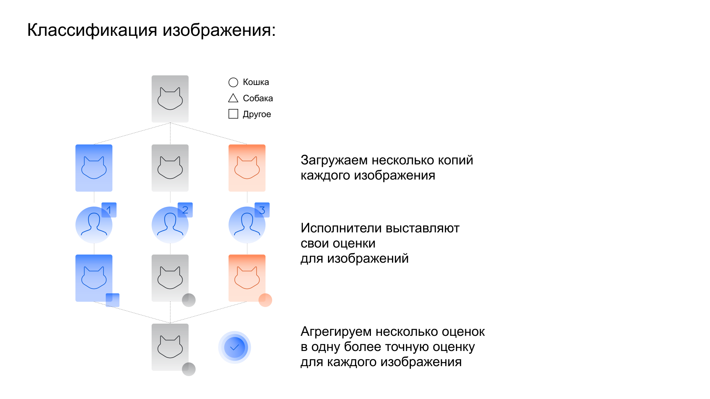

# Агрегация результатов



Если задания выданы с [перекрытием](../../glossary.md#overlap) 2 и больше, запустите агрегацию результатов. Толока обработает все ответы исполнителей на задание и выдаст итоговый ответ и степень его достоверности. 



Если вы запускали [пул](../../glossary.md#pool) с отложенной приемкой, убедитесь, что все ответы [приняты](accept.md).



1. Откройте [пул](pool-main.md).

1. Нажмите  рядом с кнопкой **Скачать результаты****Download results**.

1. Выберите способ агрегации:

    - [Агрегация результатов по методу Дэвида — Скина](#dawid-skene)
    - [Агрегация результатов по навыку](#aggr-by-skill)

Агрегация займет от нескольких минут до нескольких часов. Следите за процессом на странице [Операции]({{ operations }}). После завершения агрегации скачайте файл с результатами.

Чтобы получать уведомления и письма о завершении агрегации результатов, настройте оповещения:

1. Войдите в аккаунт.

1. Перейдите в **Профиль → Уведомления → Выполнение пула или агрегации****Profile → Notifications → Pool or aggregation completed****Профиль → Уведомления → Выполнение пула или агрегации**.

1. Выберите способ оповещения:

    - Почта — письма придут на вашу электронную почту.

    - Сообщения — уведомления придут в **Сообщения** вашего аккаунта. Кроме вас их увидят те, у кого настроен [совместный доступ](multiple-access.md) к вашему аккаунту.

    - Браузер — уведомления придут на устройства, с которых вы вошли в свой аккаунт.

## Агрегация результатов по методу Дэвида — Скина {#dawid-skene}

Метод агрегации Дэвида — Скина учитывает неоднородность исполнителей при агрегации ответов. [Статистическая значимость]({{ statistical-significance }}) итогового ответа определяется на основе анализа ответов всех исполнителей.

#### Принцип работы

Метод рассчитывает для каждого исполнителя `|L|²` параметров, где `L` — это множество всех уникальных значений для агрегации.

Параметры, которые использует метод, создаются автоматически для каждого пула и используются только в расчетах. В результатах агрегации вы не увидите эти параметры.



Поскольку этот метод оценивает для каждого исполнителя `|L|²` параметров, мы не рекомендуем использовать агрегацию Дэвида — Скина в тех случаях, когда исполнитель размечает количество заданий `< |L|²`. Иначе вы можете получить низкое качество агрегации.



По итогам агрегации вы получите файл с ответами. Поле `CONFIDENCE: <название поля выходных данных>` — значимость ответа в процентах.

#### Преимущества

Данные для агрегации можно загружать любым способом.

#### Особенности

Метод Дэвида — Скина — это нетривиальный алгоритм агрегации. Ознакомьтесь с особенностями и узнайте [подробнее о модели](https://www.jstor.org/stable/2346806).

- Метод не гарантирует, что для агрегации результата будут использоваться исходные ответы исполнителей. Алгоритм учитывает параметры качества исполнителей и закономерности в ответах. Соответственно, он может выдать результат, которого нет в ответах исполнителей на это задание.

    

    В задании на классификацию изображений все три исполнителя выбрали первый вариант ответа. В другом аналогичном задании эти же три человека выбрали первый вариант, а четвертый исполнитель выбрал второй вариант. Если в следующем задании ответ четвертого исполнителя окажется единственным, то метод Дэвида — Скина  может признать такой ответ ошибочным и выдать другой результат.

    

- Агрегация Дэвида — Скина работает с [контрольными](../../glossary.md#control-task) и [обучающими](../../glossary.md#training-task) заданиями так же как и с основными. Существует вероятность того, что в файле с ответами поле `OUTPUT:result` для контрольного задания не совпадет с реальным ответом на это задание (поле `GOLDEN:result`).

- Если в вашем проекте есть выходные данные с отметкой `"required": false` и исполнители не заполнят это поле данных, то данное поле не будет участвовать в агрегации.

    Например, у вас есть 1000 заданий: в 999 из них исполнители не разметили поле `label`, а один разметил его как `label=x`. В результате агрегации это поле данных будет иметь `CONFIDENCE = 100%`, так как только одно задание из тысячи попало под условия агрегации.



Метод Дэвида — Скина подбирает для каждого исполнителя его [матрицу ошибок]({{ error-matrix }}), и популярность в ответах. Это происходит с помощью EM-алгоритма.

Принцип работы EM-алгоритма заключается в том, что собираются наиболее точные агрегированные ответы для каждого задания, фиксируя матрицы ошибок и популярность ответов. Среди всех ответов алгоритм пытается найти наилучшие популярности и матрицы ошибок. Процесс происходит в несколько шагов. В качестве начальной уверенности в правильном ответе используется мнение большинства.

[Описание метода Дэвида — Скина](https://www.jstor.org/stable/2346806) на английском.

Если вы хотите узнать, как метод Дэвида — Скина реализован в Толоке, ознакомьтесь с [документацией Crowd-Kit](https://toloka.ai/en/docs/crowd-kit/reference/crowdkit.aggregation.classification.dawid_skene.DawidSkene.md).





В агрегации учитываются только принятые задания.



#### Требования

Основным требованием для этой агрегации являются поля выходных данных:



- Поля, которые можно агрегировать

  - Строки и числа с допустимыми значениями.

      Допустимое значение должно совпадать с параметром `value` в нужном элементе интерфейса.

  - Логический тип.

  - Целые числа с минимальным и максимальным значениями. Разница между ними не должна превышать 32.

      Если в выходном поле слишком много возможных вариантов ответа, механизм динамического перекрытия не сможет агрегировать данные.

  

- Поля, которые нельзя агрегировать

  - Массив.
  - Файл.
  - Географические координаты.
  - Объект JSON.



#### Как проверить

Если у вас есть сомнения в том, что агрегация методом Дэвида — Скина  работает корректно, вы можете:

- отправить задания на повторную разметку и сравнить полученные результаты;
- проверить задание вручную.

## Агрегация результатов по навыку {#aggr-by-skill}

Анализирует ответы на основе уровня доверия к исполнителю. Уровень доверия определяется навыком, который вы выберете. Навык — оценка вероятности того, что исполнитель сделал задание правильно.

#### Преимущества

- Если в вашем проекте обрабатывается большое количество данных, результаты агрегации будут точнее, по сравнению с методом Дэвида — Скина.
- Вы сами выбираете поля выходных данных, которые нужно агрегировать.

#### Особенности

Навык исполнителя имеет «вес». Чем выше навык, тем больше мы доверяем конкретному исполнителю и считаем, что его ответ правильный.

По итогам агрегации вы получите файл с ответами. Поле `CONFIDENCE: <название поля выходных данных>` — уверенность в агрегированном ответе. В нашем случае это вероятность того, что названный ответ правильный.



Задания размечали три исполнителя с разным значением навыка «Мой навык»: у первого исполнителя навык — 70, у второго — 80, у третьего — 90.

На первое задание все исполнители ответили **OK**. В этом случае мы уверены на 100%, что **ОК** — это правильный ответ.

На второе задание первый и третий исполнители ответили **OK**, а второй — **BAD**. В этом случае мы сравним навыки исполнителей и на основе этого посчитаем уверенность в ответе.





Термины:

- $q[i]$ — точность исполнителя;
- $K$ — константа для сглаживания;
- $z[j]$ — наиболее популярный ответ;
- $z[x]$ — вероятность того, что оценка правильная.

Точность исполнителя $q[i]$ считаем по формуле:

$q[i] = \frac{K+correct.golden.sets[i]}{2×K+total.golden.sets[i]}$,

где:

$K$ — константа для сглаживания (начиная от 0,5) при недостаточном количестве ответов на контрольные задания.

При наличии нескольких оценок для задания высчитывается наиболее популярный ответ — для каждого варианта ответа суммируем $q[i]$ исполнителей, выбравших его. Ответ с большей суммой считаем более правильным. Назовем эту оценку $z[j]$.

[По теореме Байеса]({{ baies }}) считаем апостериорную вероятность того, что оценка $z[j]$ правильная.

В качестве априорного распределения оценок будет считать равномерное. Для оценки $z[x]$ априорная вероятность:

$P(z[x]) = \frac{1}{Y}$,

где:

$Y$ — количество вариантов ответов.

Далее считаем вероятность того, что оценка $z[j]$ правильная.

Если исполнитель ответил $z[j]$, то вероятность этого равна точности исполнителя $q[i]$ . Если ответил иначе, то вероятность этого равна:

$\frac{1-q[i]}{Y-1}$,

где:

$(1 - q[i])$ — оставшаяся вероятность;

$(Y - 1)$ — количество оставшихся ответов.

Таким образом рассчитывается то, что вероятности ошибок равномерно распределены по оставшимся оценкам.

Взяв все ответы исполнителей и, например, вариант $z[x]$ , мы считаем вероятность того, что исполнители ответят таким образом, при условии, что правильным ответом был $z[x]$:

```javascript
func z_prob(x int) : float {
    d = 1.0
    for w[i]: workers
         if answers[w[i]] == z[x]
            d *= q[i]
         else
            d *= (1 - q[i]) / (Y - 1)
    return d
}
```

Далее по теореме Байеса считаем вероятность того, что ответ $z[j]$ правильный:

```javascript
r = 0
for z[i]: answer_options
    r += z_prob(i) * (1 / Y)

eps = z_prob(j) * (1 / Y) / r
```





В агрегации учитываются только принятые задания.



#### Требования



- Пул с динамическим перекрытием

  Чтобы запустить агрегацию необходимо корректно настроить динамическое перекрытие. Для этого:

  1. Выберите навык. Советуем выбирать навык, рассчитываемый как доля [правильных ответов на контрольные задания](goldenset.md). Тогда результаты агрегации будут наиболее точными.

  1. Выберите поля выходных данных.

      

      - Строки и числа с допустимыми значениями.

      Допустимое значение должно совпадать с параметром `value` в нужном элементе интерфейса.

      - Логический тип.

      - Целые числа с минимальным и максимальным значениями. Разница между ними не должна превышать 32.

      Если в выходном поле слишком много возможных вариантов ответа, механизм динамического перекрытия не сможет агрегировать данные.

      Допустимое значение должно совпадать с параметром `value` в нужном элементе интерфейса.

      

- Пул без динамического перекрытия

  Вы сможете запустить агрегацию по навыку, если пул соответствует следующим требованиям:

  1. У вас есть навык, который определяет уровень доверия к ответам исполнителя. Лучше всего использовать навык, рассчитываемый как доля [правильных ответов на контрольные задания](goldenset.md).

  1. В проекте [поля выходных данных](incoming.md), имеют допустимые значения.

      

      - Строки и числа с допустимыми значениями.

      Допустимое значение должно совпадать с параметром `value` в нужном элементе интерфейса.

      - Логический тип.

      - Целые числа с минимальным и максимальным значениями. Разница между ними не должна превышать 32.

      Если в выходном поле слишком много возможных вариантов ответа, механизм динамического перекрытия не сможет агрегировать данные.

      

      

  1. Задания в пул были загружены при помощи [«умного смешивания»](distribute-tasks-by-pages.md#smart-mixing).



## Решение проблем {#troubleshooting}



В способе вычисления. В обоих агрегациях уверенность означает то же самое.





Модель агрегации Dawid-Skene анализирует ответы исполнителей и создает матрицу ошибок каждого толокера. Так вычисляется статистическая значимость толокера для каждого ответа. [Подробнее о модели](https://www.jstor.org/stable/2346806).











На странице пула есть кнопка **К списку операций****Lisf of Operations**.





Невозможно агрегировать поля проекта, которые не имеют допустимых значений. Необходимо указывать возможные значения для всех полей всех типов.





Необходимо использовать [«умное смешивание»](distribute-tasks-by-pages.md#smart-mixing) .



