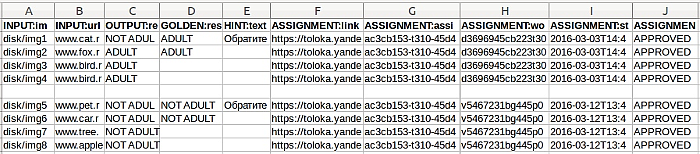
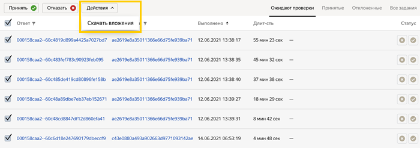

# Получение результатов

Ответы исполнителей можно скачать в виде файла по мере выполнения заданий.

Если задания выданы с [перекрытием](../../glossary.md#overlap) больше 2, запустите [агрегацию](result-aggregation.md). Толока обработает все ответы исполнителей на задание и сформирует итоговый ответ.

## Получение файла с ответами {#tsv}

Чтобы получить файл с ответами всех исполнителей, нажмите кнопку **Скачать результаты****Download results** на странице [пула](../../glossary.md#pool).

#### Поля в файле с ответами

- `INPUT:<название поля входных данных>` — входные данные заданий.

- `OUTPUT:<название поля выходных данных>` — ответы исполнителей. Для [обучающих заданий](../../glossary.md#training-task) приводятся ответы, которые были даны при первой попытке выполнить задание.

- `GOLDEN:<название поля выходных данных>` — ответы для [контрольных заданий](../../glossary.md#control-task).

- `HINT:text` — подсказки для обучающих заданий.

- Информация о выполнении задания (дублируется для всех заданий на странице):

    - `ASSIGNMENT:link` — ссылка на просмотр [страницы заданий](../../glossary.md#task-suite).

    - `ASSIGNMENT:assignment_id` — идентификатор выданной страницы заданий.

    - `ASSIGNMENT:worker_id` — идентификатор исполнителя, который выполнил задание.

    - `ASSIGNMENT:started` — дата и время выдачи страницы задания.

    - `ASSIGNMENT:status` — статус задания: `SUBMITTED` — выполнено, `APPROVED` — принято, `REJECTED` — отклонено.

#### Пример файла



Ответы, которые выполнил заблокированный исполнитель до блокировки, будут учтены и оплачены. Чтобы исключить их из результатов и агрегаций, выберите опцию **Не учитывать ответы заблокированных пользователей**. Из файла будут убраны только результаты тех исполнителей, кто заблокирован на момент выгрузки результатов, а не на момент разметки пула.



## Получение файлов {#file-download}

Если в заданиях требовалось отправить файл, файл с ответами будет содержать идентификаторы файлов, полученных от исполнителей. Чтобы скачать файлы на свой компьютер, нажмите кнопку  на странице пула.

В пуле можно скачать все файлы одним архивом не больше 4 ГБ. Если архив слишком большой и превышает 4 ГБ, то используйте следующие рекомендации:

- Выберите только один статус или укажите меньший период.

    Например, если нужно проверить задания, то не скачивайте принятые и отклоненные, а скачайте только непроверенные.

    Если файл все равно превышает допустимый размер, уменьшите период и скачайте архивы несколькими партиями. Период можно уменьшить до 1 дня.

- На странице пула нажмите кнопку **Проверить задания** (или **Просмотреть задания**, если задания уже приняты), чтобы перейти на страницу с ответами исполнителей. Каждая строка содержит ответ исполнителя на одну страницу заданий.

    Выделите нужные ответы и нажмите . Скачайте архивы несколькими партиями. За один раз можно выделить и скачать не более 100 ответов.

    

- Используйте [API Толоки](../../api/concepts/attachments.md) для скачивания файлов с ответами.

## Решение проблем {#troubleshooting}



Нет, после отправки задания исполнитель уже не может внести в него изменения. Неверно [выполненные задания](../../glossary.md#completed-tasks) можно добавить в новый пул.





Нет, в самом задании ничего исправить нельзя. Но это можно сделать вручную при обработке файла с результатами.





Можно только принять или отклонить это задание.





Можно закрывать доступ исполнителей к пулу по слишком [быстрым ответам](quick-answers.md), по регулярному несовпадению с [мнением большинства](mvote.md) или если исполнитель делает много ошибок в [контрольных заданиях](goldenset.md). Задания, выполненные такими исполнителями, можно [выдать другим исполнителям](restore-task-overlap.md).





Просто [начислите толокеру бонус](bonus.md) без изменения статуса задания. Изменить статус задания в пуле в этой ситуации уже невозможно.





Примите задание и скорректируйте инструкцию. Иначе вы нарушаете [**Соглашение с заказчиком**]({{ customeragreement }}), согласно которому нужно четко прописывать требования к выполнению задания и ожидаемым от исполнителя результатам.





Нет. Например, на странице 10 заданий стоимостью 0,1 $, а исполнитель сделал только 2 из них неправильно.

Вы не можете принять правильные ответы и заплатить ему часть стоимости - 0,08 $. Страницы с ответами принимаются либо отклоняются только целиком.





Добавьте уведомление в описание проекта (например: «Внимание! В инструкции произошли изменения») и напишите сообщение всем исполнителям, которые выполняли ваши задания. Для этого:

- Назначьте им скрытый навык или воспользуйтесь уже имеющимся [навыком](nav-assign.md) по пулу.

- Перейдите в **Сообщения**, нажмите **Написать** → **Группе** → **Добавить фильтр** → **Выбрать свой навык** → **&lt;название навыка&gt;****Write** → **Group** → **Add filter** → **Choose your skill** → **&lt;skill name&gt;**.

- Если вы создали новый навык, то укажите то значение, которое присвоили выбранной группе, например 1. Если вы используете существующий навык, то укажите минимально допустимое значение.





Рейтинг проекта — это средняя оценка по всем категориям. Обращайте особое внимание на категории, по которым вы набрали наименьшее количество баллов.





Возможно, ваши задания показались сложными исполнителям. Попробуйте упростить их.





Сократите инструкцию и перепишите более простым языком, добавьте картинки и примеры.





Сделайте интерфейс [более удобным](spec.md) и интуитивно понятным, не заставляйте исполнителя совершать дополнительные ненужные действия, используйте горячие клавиши.

С 15 декабря 2021 года задания в пулах по умолчанию доступны для веб версии Толоки и мобильного приложения. Если ваше задание не подходит для мобильных устройств, возможно вы забыли добавить фильтр **Клиент****Client**.





Регулярно отвечайте на [сообщения исполнителей](messaging.md). Постарайтесь обеспечить максимально быструю обратную связь. Своевременно исправляйте ошибки и уведомляйте исполнителей об изменениях с помощью рассылок.

Если вы не понимаете, в чем проблема, запустите мини-опросник и поинтересуйтесь у исполнителей, выполнявших ваши задания, что именно им нравится и не нравится.





При загрузке строк в файле двойные кавычки обозначают область, внутри которой можно использовать спецсимволы: табы или переносы строк. Толока заключает все, что находится между кавычками в одну строку и получается одно задание. Чтобы использовать кавычки внутри такой области, нужно их экранировать еще одной кавычкой. [Подробнее здесь](pool_csv.md#string).





Если толокер написал и стер информацию, то будет `null`, иначе — `undefined`.





В результатах отображаются ответы всех исполнителей, в том числе и заблокированных. Чтобы исключить их ответы из результатов, выберите опцию **Не учитывать ответы заблокированных исполнителей**. Убраны будут ответы тех исполнителей, кто заблокирован на момент выгрузки результатов, а не на момент разметки пула.





Когда скачиваете файл с результатами, поставьте галочки **Время старта** и **Время отправки**. В файле будут точные дата и время, когда исполнитель взял страницу заданий на выполнение и отправил ее в формате UTC.



