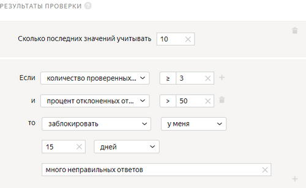
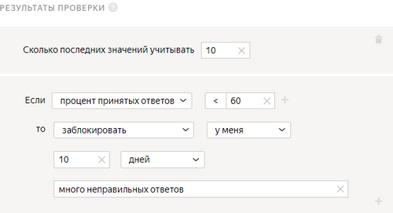
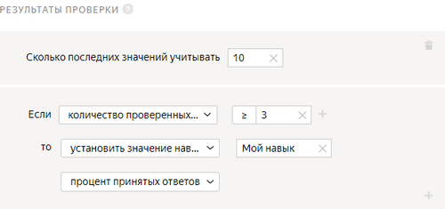

# Результаты проверки

Если вы самостоятельно проверяете задания исполнителей и не хотите, чтобы в будущем исполнители, которые допустили много ошибок, выполняли ваши задания, настройте это правило контроля качества.

## Когда использовать {#when-use}

Если в [пуле](../../glossary.md#pool) настроена [отложенная приемка](offline-accept.md), добавьте правило, чтобы:
- устанавливать исполнителю [навык](../../glossary.md#skill) на основе его ответов;

- блокировать доступ исполнителям, которые дают неправильные ответы.

Используйте правило, если вы не хотите, чтобы исполнитель, который часто ошибается, выполнял задания в ваших новых пулах или проектах.

Чтобы отклоненные задания отправлялись на повторное выполнение другим исполнителям, настройте правило [Повторное выполнение отклоненных заданий](reassessment-after-accepting.md).

## Настройка правила {#rule}



#|
||**Поле**|**Описание**||
||**Учитывать последних заданий****Recent values to use** | Количество последних ответов исполнителя.

Если поле не заполнено, в расчете учитываются все ответы на задания только того пула, к которому применяется правило.

Если поле заполнено, то правило считает ответы на задания в рамках значения, указанного в поле. При этом учитываются не только ответы из этого пула, но и из других пулов, где это поле заполнено.

[Подробнее](remember-values.md) о том, как работает это поле.||
||**Если****If** | Условие, при котором выполняется действие в поле **то****then**:

- **количество проверенных ответов****total reviewed responses** — количество проверенных заданий исполнителя.

- **процент принятых ответов****accepted responses (%)** — доля принятых заданий исполнителя (от 0 до 100).

- **процент отклоненных ответов****rejected responses (%)** — доля отклоненных заданий исполнителя (от 0 до 100).

Чтобы добавить несколько условий, нажмите .||
||**то****then** | Действие, выполняемое при условии:

- **установить значение навыка из поля****assign skill from the field** — сохранить долю принятых ответов исполнителя как значение [навыка](nav.md).

- **заблокировать****ban** — закрыть доступ к проекту или всем проектам заказчика на указанное количество дней. Причина блокировки отображается только заказчику.

    Если доступ к заданиям блокируется на ограниченный срок (например, на 7 дней), после снятия блокировки история ответов исполнителя не сохраняется. Навык рассчитывается на основании новых ответов.

- **установить значение навыка****assign skill value** — присвоить исполнителю фиксированное значение [навыка](nav.md).

- **принять все ответы исполнителя в пуле****accept all assignments from this performer in the pool** — требует настройки [отложенной приемки](offline-accept.md).

    Пригодится, если исполнитель выполняет большинство заданий качественно. Пример: исполнитель выполнил больше 80% заданий правильно и вас устраивает такой результат. Правило сработает автоматически — все ответы в пуле будут приняты.

- **приостановить****suspend** — приостановить доступ исполнителя к пулу на указанное количество дней. Причина отображается только заказчику.||
|#

## Примеры правил {#examples}

Вы понимаете, что исполнитель недостаточно хорошо справился с заданиями. Такому исполнителю можно заблокировать доступ к заданиям, которые вы собираетесь делать.

Также можно назначить навык, с помощью которого вы можете, либо заблокировать доступ к заданиям для исполнителей, либо поощрить тех, которые хорошо справились с заданиями.

#### Блокировка за неправильные ответы





- Правильная настройка

  

  Если более 50% ответов исполнителя будут отклонены, он будет заблокирован и не сможет выполнять ваши задания 15 дней.

- Неправильная настройка

  

  Исполнитель будет заблокирован после первого отклоненного ответа, потому что не указано количество проверенных заданий.



#### Установка навыка

После проверки 3 ответов исполнителя ему будет установлен навык, соответствующий проценту правильных ответов. Используйте значение навыка для доступа к другому пулу с помощью [фильтра](filters.md).





## Решение проблем {#troubleshooting}



Лучше использовать один [навык](../../glossary.md#skill) в проекте. Можно выбрать способ подсчета навыка:

- Подсчет навыка для каждого пула отдельно. Текущее значение навыка — это значение навыка в пуле, который выполнялся последним. Такой вариант удобен, если:

    - Пулы предназначены для разных групп исполнителей (например, настроены фильтры по городам, странам).

    - Пулы запускаются последовательно, и вы не хотите учитывать качество ответов в предыдущих пулах при подсчете навыка в выполняемом пуле.

    Этот способ подсчета действует по умолчанию при добавлении блока контроля качества в пул. Для блока по контрольным заданиям оставьте пустым поле **Учитывать последних ответов на контрольные и обучающие задания**.

- Подсчет навыка по всем выполненным заданиям в проекте. Такой вариант удобен, если пулы небольшие и вам не нужно рассчитывать навык для каждого пула.

    Этот способ подсчета доступен только для навыков по контрольным заданиям. Чтобы использовать его, заполните поле **Учитывать последних ответов на контрольные и обучающие задания** в блоках контроля качества в пулах.





Да, конечно, один и тот же навык можно назначать и использовать на различных проектах. Но чаще всего один навык используется в рамках одного проекта. Если исполнитель хорошо выполняет одно задание, это не значит, что он так же успешно справится с другим. Кроме того, используя фильтры по давно настроенным навыкам, вы ограничиваете количество доступных исполнителей.





Можно закрывать доступ исполнителей к пулу по слишком [быстрым ответам](quick-answers.md), по регулярному несовпадению с [мнением большинства](mvote.md) или если исполнитель делает много ошибок в [контрольных заданиях](goldenset.md). Задания, выполненные такими исполнителями, можно [выдать другим исполнителям](restore-task-overlap.md).





Нет, после отправки задания исполнитель уже не может внести в него изменения. Неверно [выполненные задания](../../glossary.md#submitted-answers) можно добавить в новый пул.



