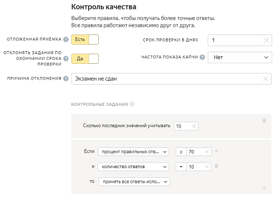

# Как сэкономить



Каждый заказчик стремится оптимизировать свои расходы. В этом разделе описаны основные способы, которые помогут сэкономить деньги, не снизив качества разметки.

## Декомпозируйте задания {#decomposition}

Воспользуйтесь [декомпозицией](solution-architecture.md). Делайте задания проще, так они будут дешевле. Если задание сложное, то вы не получите хороший результат сразу, а будете вынуждены снова отправлять задания в пул, чтобы другие исполнители их сделали.

## Воспользуйтесь динамическим перекрытием {#din-price}

[Динамическое перекрытие](dynamic-overlap.md) (incremental relabeling, IRL) дает возможность изменять перекрытие в зависимости от того:

- насколько хорошо исполнители справляются с заданием;
- насколько согласованы ответы исполнителей.

С такой настройкой перекрытия вы сможете экономить на количестве исполнителей, которые проходят задания, а значит, общая стоимость разметки пула будет ниже.

## Используйте отложенную приемку {#post}

[Отложенная приемка](offline-accept.md) позволяет вам проверять ответы, при этом не платить за задания, которые исполнители сделали некачественно.

Используйте **Отложенную приемку** если:

- Задание предполагает ответы в свободной форме или отправку файлов с данными.

- Вы уверены, что успеете проверить ответы исполнителей. В противном случае по истечении срока непроверенные ответы принимаются и оплачиваются автоматически.

## Настройте выборочную проверку мнением большинства {#mvote}

Вы можете настроить [выборочную проверку мнением большинства](selective-mvote.md) для основных заданий. Это помогает экономить средства и ускорить выполнение пула. Вы можете установить, с каким промежутком задания с повышенным перекрытием будут отображаться у исполнителя, в зависимости от количества выполненных заданий.

Например, в вашем пуле установлено перекрытие = 3. Вы не доверяете ответам новых исполнителей и хотите дополнительно их проверить. Тогда вы настраиваете выборочную проверку мнением большинства. Если за последние четырнадцать дней исполнитель выполнил десять заданий, то каждому третьему заданию установить перекрытие = 5, если выполнил двадцать заданий, то каждому пятому заданию установить перекрытие = 5.

Без такой настройки вы бы были вынуждены установить перекрытие = 5 для каждого задания в пуле. И если разметить все задания с перекрытием = 5, а не только некоторые, то это будет дороже.

## Настройте динамическое ценообразование {#price-set}

[Динамическое ценообразование](dynamic-pricing.md) — позволяет устанавливать повышенную ставку за страницу заданий для тех исполнителей, у которых выше уровень навыка. Так вы можете мотивировать исполнителей выполнять задания качественнее.

В некоторых случаях такая настройка удорожает разметку. Например, если ваше задание не требует от исполнителей высоких навыков. В таком случае использовать динамическое ценообразование не нужно.

## Используйте дробную оплату на неполных страницах {#mixer}

Воспользуйтесь опцией [Умное смешивание](distribute-tasks-by-pages.md#smart-mixing) и **Отдавать неполную страницу**. Так вы сможете сэкономить на оплате за неполную страницу заданий.

## Условно-бесплатные экзамены {#exams}

В Толоке заказчик платит за экзамены, включая те, которые исполнители не сдали. Это та плата, за которую заказчик не получает пользы, так как исполнитель не прошел экзамен, а значит, не выполнит ни одного основного задания.

В этом случае можно настроить автоматическое принятие заданий с автоотклонением заданий по окончании срока проверки. Для этого вам потребуется:

1. Выберите тип пула — **Экзамен**.

1. В настройке пула включите **Отложенную приемку**.

1. Переведите переключатель в положение **Да** и укажите причину отклонения. Ее увидят те исполнители, чьи ответы будут отклонены.

1. Поставить срок проверки заданий один день.

1. Добавить блок контроля качества **Контрольные задания** и установить условие **если процент правильных ответов ≥ N**, и **количество ответов = N**, то принять все ответы исполнителя.

1. Добавить в инструкцию описание нового правила.

1

В этом случае, если процент правильных ответов будет больше или равен 70, то все ответы исполнителя будут автоматически приняты. При этом, все непроверенные ответы будут отклонены.



## Сжимайте картинки {#pictures}

Сжимайте вес картинок, чтобы задание открывалось и отображалось корректно. Исполнители будут тратить меньше времени и трафика на загрузку картинок.

## Настройте горячие клавиши {#hotkeys}

Создавайте горячие клавиши. Так исполнителю будет проще выполнять задания. Помните: чем меньше времени уходит на выполнение задания, тем меньше оплата.

## Экономьте с помощью API Толоки {#api}

#### Используйте слияние заданий

Задания, в которых входные данные полностью одинаковые, можно объединять. Это позволит вам экономить средства, если одно и то же задание оказалось загруженным в разные пулы.

[Подробнее](../../api/concepts/tasks.md).

#### Настройте частоту выдачи контрольных заданий

С помощью API Толоки можно настроить частоту выдачи контрольных заданий. Например, на первой странице заданий сделать каждое пятое задание контрольным, на последующих — каждое десятое. Такая настройка позволит сохранить качество пула и ускорить выполнение заданий.

Для этого используйте ключ `golden_task_distribution_function`.

[Подробнее](../../api/concepts/create-pool.md).

#### Настройте предварительные ответы

В дополнение к **Динамическому перекрытию** используйте `baseline_solutions`, чтобы ускорить выполнение перекрытия. В `baseline_solutions` используются предварительные ответы — данные, имитирующие ответы исполнителей. Например, вам нужно определить, что на изображении: кошка или собака. Допустим ваша нейронная сеть определила, что на изображении может быть собака с вероятностью 80 %, кошка с уверенностью 40 %. Вы можете использовать ответы нейронной сети. В зависимости от ответов исполнителей, перекрытие будет повышаться или оставаться без изменений.

[Подробнее](../../api/concepts/create-task.md).

