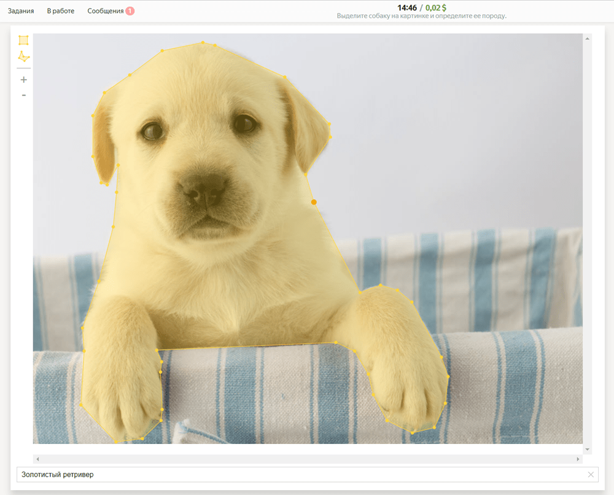
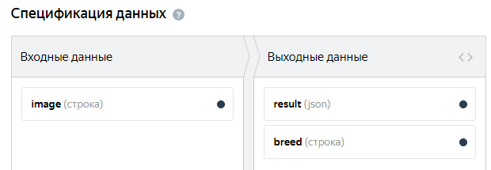
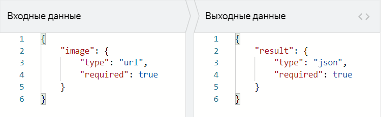
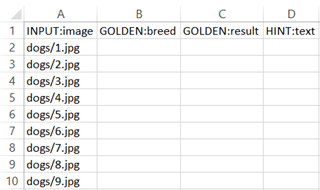

# Распознавание объектов и выделение областей



Сначала запустите проект в [Песочнице]({{ sandbox }}). Так вы сможете избежать ошибок и потраченных средств, если окажется, что ваше задание не работает.



Для выделения области на картинках в Толоке есть специальный редактор. С его помощью исполнитель сможет выделить область в виде многоугольника или прямоугольника.

Предположим, у вас есть много фотографий с животными и вам нужно выделить собак и определить их породу. Для этого создадим задание: исполнитель видит фотографию, он должен выделить на ней собаку и указать ее породу.







Чтобы запустить задания и получить ответы:

1. [Создайте проект](#project)
1. [Добавьте пул заданий](#pool)
1. [Загрузите задания](#tasks_upload)
1. [Настройте контроль качества](#quality_control)
1. [Запустите пул и получите результаты](#launch)

## Создайте проект {#project}




#### В интерфейсе:

1. Выберите пресет:

    1. Нажмите кнопку **+ Создать проект**.

    1. Выберите пресет **Выделение областей на изображении**.

1. Заполните общую информацию:

    1. Дайте проекту понятное название и краткое описание. Их увидят исполнители в списке доступных заданий.

    1. По желанию добавьте **Приватный комментарий**.

    1. Нажмите **Сохранить**.

1. Отредактируйте интерфейс задания:

    

    В этом туториале показано, как создать интерфейс задания в редакторе HTML/JS/CSS. Вы также можете попробовать создать интерфейс задания в [Конструкторе шаблонов]({{ tb-quickstart }}).

    

    1. Определите, какие объекты будете передавать исполнителю и получать от него в ответ. Для этого необходимо создать поля входных и выходных данных в блоке **Спецификация данных**.

       

       

       

       

       Подробнее о [полях входных и выходных данных](incoming.md).

       Шаблон включает в себя поля:

       - Поле входных данных — ссылка `image` для загрузки картинки.

          Измените тип данных на строку, чтобы использовать ссылки на свои файлы или [загружать картинки](prepare-data.md), хранящиеся на Яндекс Диске.

       - Поле выходных данных — поле `result` с типом json, в которое будет записан объект JSON c координатами точек.

          Добавьте поле выходных данных — обязательная строка `breed`, в которую будет записана порода собаки, указанная исполнителем.

       

       - Графический режим

         

       - JSON

         

       

       Создайте интерфейс задания в блоке **HTML**. Он описывает, как будут расположены элементы задания.

       В HTML-интерфейсе можно использовать стандартные теги HTML и [специальные выражения](spec.md) в двойных фигурных скобках для полей входных и выходных данных.

       

       ```html
       {{field type="image-annotation"name="result" src=(proxyimage)}}
       {{field type="input"name="breed" placeholder="Укажите породу собаки" width="100%"}}
       ```

       

       ```html
       {{field type="image-annotation"name="result" src=(proxyimage)}}
       {{field type="input"name="breed" placeholder="Enter the dog's breed" width="100%"}}
       ```

       

       Эта запись означает, что задание будет выглядеть так:

       - картинка с инструментом для выделения области;
       - поле для ввода текста.

       Блоки CSS и JavaScript оставьте без изменений.

    1. Нажмите кнопку  **Предпросмотр задания****Preview task**, чтобы увидеть получившееся задание.

       

       В предварительном просмотре проекта отображается одно задание со стандартными данными. Количество заданий на странице вы сможете настроить далее.

       

    1. 

1. Напишите инструкцию для исполнителей:

    1. Напишите краткую и ясную инструкцию (см. [советы](faq.md)). Опишите в ней, что надо сделать, и приведите примеры.

      Вы можете подготовить инструкцию в формате HTML и вставить её в редактор. Чтобы переключиться в режим HTML, нажмите **<>**.

    1. Нажмите кнопку **Завершить**.

## Добавьте пул заданий {#pool}

Пул — это набор оплачиваемых заданий, которые одновременно выдаются исполнителям.

1. Откройте проект и нажмите **Добавить пул**.

1. Дайте пулу любое удобное название — оно доступно только вам, исполнитель увидит название проекта.

1. В блоке **Аудитория****Audience** добавьте **Фильтры****Filters** для отбора исполнителей. Чтобы ваше задание было доступно только исполнителям, владеющим русским языком, установите фильтры **Регион по номеру телефона** и **Языки**: выберите исполнителей из России, Украины, Казахстана и Беларуси, которые в своем профиле отметили знание русского языка.

    

1. В блоке **Цена** установите цену за [страницу заданий](../../glossary.md#task-suite), например, `0.02`.

    

    На одной странице может отображаться одно или несколько заданий. Если задания простые, то можно добавлять 10–20 заданий на одну страницу. Не рекомендуем создавать длинные страницы, поскольку это снизит скорость загрузки данных у исполнителя.

    Исполнитель получит оплату, только если выполнил все задания на странице.

    Количество заданий на странице вы определите при [загрузке заданий](#smart-mixing).

    

    

    Общее правило формирования цены — чем больше времени исполнитель тратит на выполнение, тем выше цена.

    Вы можете зарегистрироваться в Толоке как исполнитель и узнать, сколько платят другие заказчики за задания.

    

1. В блоке **Контроль качества****Quality control** установите **Перекрытие задания****Task overlap** — количество исполнителей, которые должны выполнить задание. Для заданий выделения области на картинках, как правило, 1.

1. Включите опцию **Отложенная приемка** и укажите количество дней на проверку для параметра **Срок проверки**. Например, 7.

    

    [Отложенная приемка](offline-accept.md) позволяет вам просматривать [выполненные страницы заданий](../../glossary.md#submitted-answers) перед тем, как принять их и заплатить исполнителю. Задания, выполненные в несоответствии с инструкцией, можно отклонять. Максимальный срок проверки устанавливается в поле **Срок проверки**.

    

1. В блоке **Дополнительные настройки****Additional settings** укажите **Время на страницу заданий****Time per task suite**. Его должно быть достаточно, в том числе для чтения инструкции и загрузки задания. Например, 1200 секунд.

1. Нажмите кнопку **Создать пул****Create a pool**.

## Загрузите задания {#tasks_upload}



1. Нажмите кнопку **Загрузить**. В открывшемся окне вы можете скачать шаблон файла.

    

    Если вы хотите посмотреть, как ваш проект будет выглядеть после запуска, но у вас еще нет заданий для разметки, вы можете загрузить в пул готовый пример данных.

    Нажмите **Использовать пример данных****Use sample data** справа от надписи **Прикрепите подготовленный файл с данными****Attach the prepared file with data**. Это позволит избежать дополнительных действий с файлами.

    После того, как вы поработали с примером данных и вас все устроило, подготовьте свои данные и загрузите их в пул.

    

1. Добавьте в файл входные данные. Заголовок столбца с входными данными содержит слово `INPUT`. Остальные столбцы оставьте пустыми.

    

1. Загрузите задания, выбрав **Указать вручную****Set manually** и установив, например, 4 задания на странице.

## Настройте контроль качества {#quality_control}

[Блоки контроля качества](control.md) позволяют отсеивать невнимательных исполнителей. Контроль качества можно настраивать как в проекте, так и в пуле.



Настройки контроля качества в проекте будут действовать во всех пулах проекта, и изменить их настройку в одном из пулов будет невозможно.



1. 

1. Добавьте блок **Быстрые ответы**.

    Значение параметра **Минимальное время на страницу** зависит от количества заданий на этой странице. Чтобы определить настроение кота, достаточно 2-4 секунды. Значит, на страницу с 10-ю заданиями может хватить 20-30 секунд.

    Один раз можно ошибиться неумышленно, а вот после 2-3 закономерных раз можно и заблокировать исполнителя на какое-то время.

    Укажите следующие значения:

    

1. Добавьте правило контроля качества **Результаты проверки****Review results** и укажите следующие значения:

    Это означает, что если 35% и более ответов исполнителя будут отклонены, он будет заблокирован и не сможет больше выполнять ваши задания 15 дней. Правило начинает действовать после проверки 3 ответов исполнителя.

## Запустите пул и получите результаты {#launch}

1. Запустите пул, нажав кнопку .

1. Следите за выполнением в блоке **Статистика пула**.

1. Как только получены первые результаты, вы можете начинать [проверку](accept.md). По истечении установленного срока все ответы будут автоматически приняты вне зависимости от их качества.

    Чтобы проверить задания, откройте пул и нажмите **Проверить задания**.

    

    Координаты точек будут записаны в [формате JSON](t-components/image-annotation.md#coordinates).

    

## Что дальше {#what-next}

- Пройдите аналогичный [туториал с декомпозицией](image-segmentation-overview.md) задания на 3 разных проекта.
- Почитайте подробнее [про декомпозицию заданий](solution-architecture.md).

## Решение проблем {#troubleshooting}



Размеры изображений могут быть разные.





Чтобы добавить горячую клавишу, в методе onKey пропишите следующее действие:

```javascript
onKey: function(key) {
    var el = this.getDOMElement().querySelector(".image-annotation-editor__shape-polygon");

    if (key === 'D') {
      el.click();
      el.classList.add('image-annotation-editor__shape_active')
    }
```





Для замыкания используйте горячую клавишу **C**.

Вы также можете воспользоваться [библиотекой](https://github.com/vmit/image-annotation), чтобы настроить горячие клавиши под свои задачи.





Задачу с выделением областей на изображении с помощью Толоки рекомендуем решать в трёх проектах:

1. Сортировка изображений, на которых есть объект.

    1. [Создайте задание](categorization.md), используя шаблон «Классификация изображений».

    1. Отсортируйте изображения, на которых есть искомый объект.

    1. Покажите изображение исполнителю и задайте вопрос: есть объект на картинке? Ответ — Да/Нет.

1. Выделение объекта на изображениях.

    1. Выделите объект на изображениях, которые отобрали в предыдущем проекте. Такой проект у вас уже есть. Задание запускается с отложенной приемкой.

    1. Используйте правила контроля качества: быстрые ответы, отложенная приемка, дооценка после приёмки. [Описание правил и примеры](control.md).

1. Проверка выделения объектов.

    1. Создайте задание, используя шаблон по выделению областей.

    1. Скройте редактор и задайте вопрос: объект выделен верно? Ответ — Да/Нет.

    1. Во входных данных передайте картинки и координаты размеченных областей из предыдущего задания.

    Запустив полученный пул с перекрытием 3-5 или с динамическим перекрытием, вы сможете агрегировать результаты, а затем загрузить данные для проверки в проект 2.

    Чтобы не допускать к проверке тех исполнителей, которые работали над вторым проектом, назначайте им навык. Используйте этот навык в качестве фильтра в пулах третьего проекта.





Добавить валидацию ответа в зависимости от чекбокса можно с помощью JavaScript. Пример доступен в шаблоне «Поиск данных в сети».





Основные варианты решения:

- Выделите произвольную область на картинке (например, поставьте квадрат в правый верхний угол). В этом случае в инструкции к проекту для проверяющих это тоже должно быть отражено.

- Предложите пропустить задание и сообщить о нём в личном сообщении. Сообщения проверяются заказчиком и, если объекта действительно нет, задание удаляется из пула путем обнуления перекрытия.

- Добавьте в интерфейс дополнительный чекбокс «нет объекта». Настройте в JS проверку, чтобы в задании был выделен объект, либо проставлен чекбокс. В этом случае в интерфейс задания для контроля также нужно добавить информацию о значении этого чекбокса.





Для краудсорсинга такое задание лучше декомпозировать. Чем проще задание, тем оно будет дешевле и качественнее итоговый результат. Стоимость разметки одного класса объектов на фото может составить примерно 0,01 $.

Возьмите за основу шаблон «Выделение областей на изображении». Пошаговое руководство по созданию проекта такого типа вы найдёте на [этой странице](selection.md).

Редактор, который используется в шаблоне, позволяет добавлять выпадающий список для маркировки выделенного объекта. Посмотрите как это сделать в описании редактора (вкладка [Выпадающий список](t-components/image-annotation.md)).





Можно сделать выделение + выпадающий список с выбором категории. Посмотрите как это сделать в описании редактора (вкладка [Выпадающий список](t-components/image-annotation.md)).





Координаты относительно самого изображения.





В стандартном шаблоне с редактором для выделения областей не получится использовать контрольные задания, поскольку для того, чтобы ответ засчитался системой верным, объект, выделенный исполнителем, должен в точности совпасть с эталоном. А это практически невозможно. Поэтому поле GOLDEN можно оставить пустым в файле с заданиями или просто удалить все столбцы кроме INPUT.



 



Проблема в шаблоне задания. Проверьте, что:

- Для поля входных данных, куда вы передаете ссылку на файл, в проекте указан тип «строка».

- В компоненте в шаблоне задания используется выражение proxy.

- Формат относительных ссылок в файле с заданиями указан верно: <уникальное имя>/<путь и имя файла>.

Подробная инструкция и видео на странице [Использование файлов с Яндекс Диска](../concepts/prepare-data.md).







В стандартном шаблоне с редактором для выделения областей не получится использовать контрольные задания, поскольку для того, чтобы ответ засчитался системой верным, объект, выделенный исполнителем, должен в точности совпасть с эталоном. А это практически невозможно. Поэтому поле GOLDEN можно оставить пустым в файле с заданиями или просто удалить все столбцы кроме INPUT.

Использование [обучения](../../glossary.md#training-pool) и основного пула с типом **Тренировка** в проекте по выделению областей на картинке не принесет результата, так как для правильного ответа необходимо, чтобы выделение исполнителя полностью совпало с эталоном. А это практически невозможно.

Поэтому такие задания обычно запускаются с отложенной приемкой: исполнитель дает ответ, а затем после проверки, задание отклоняется или принимается.

Для предварительного отбора исполнителей подойдет так называемое «экзаменационное задание». Проверяйте задания и выставляйте навык по проценту принятых ответов. Для этого добавьте в пул правило «Результаты проверки». Чтобы к разметке основного пула приступили только хорошие исполнители, поставьте в нем фильтр по навыку.







Если картинки, аудио или видео с Яндекс Диска не отображаются в [инструкции](../../glossary.md#task-instruction) или на [странице задания](../../glossary.md#task-suite), убедитесь, что вы правильно подключили Диск и загрузили файлы.

- [Как подключить Яндекс Диск](prepare-data.md#prepare-data__connect)
- [Как загрузить файлы для инструкции](prepare-data.md#prepare-data__instruction)
- [Как загрузить файлы для задания](prepare-data.md#prepare-data__interface)



Для создания задания возьмите за основу [шаблон для разметки видео]({{ templates-video-new }}).

Чтобы разместить ваши видеоролики на Яндекс Диске, его нужно подключить и настроить проект.

Подробная видеоинструкция об этом [в нашем блоге]({{ toloka-blog-yadisk }}).





Проблема в шаблоне задания. Проверьте, что:

- Для поля входных данных, куда вы передаете ссылку на файл, в проекте указан тип «строка».

- В компоненте в шаблоне задания используется выражение proxy.

- Формат относительных ссылок в файле с заданиями указан верно: <уникальное имя>/<путь и имя файла>.

Подробная инструкцию и видео на странице [Использование файлов с Яндекс Диска]({{ using-files-yandex-disk }}).



 



- В настройках проекта в поле **Входные данные** указан тип _ссылка_. Необходимо выбрать тип _строка_.

- В [файле с заданиями](../../glossary.md#tsv-file-definition) указаны абсолютные ссылки на файлы для заданий. Необходимо вставить ссылку вида `<уникальное имя>/<путь и имя файла>`. Например: `yadisk/image1.jpg` или `yadisk/photos/image1.png`.

- Фото с Яндекс Диска используются в инструкции к заданию в мобильном приложении. Чтобы фото отобразилось в инструкции, используйте только прямые ссылки.

- Файлы удалены или находятся не в той папке на Диске, на которую ведет ссылка.

- OAuth-токен не активен. Обновите токен на странице [Интеграция]({{ integration }}).

Чтобы файлы, загруженные на Яндекс Диск (картинки, аудио, видео), отображались у исполнителя, нужно:

1. Подключить Яндекс Диск в профиле.

1. Установить тип строка для поля [входных данных](../../glossary.md#input-output-data).

1. Вставлять ссылку на файл при помощи компонента `proxy`.

[Подробная инструкция](prepare-data.md)













Попробуйте воспользоваться рекомендациями с [этой страницы]({{ yadisk-uploading }}) или написать в службу поддержки Яндекс Диска.





