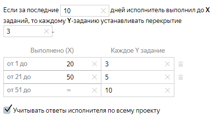
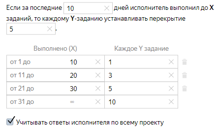

# Выборочная проверка мнением большинства



## Перед началом {#before-start}

Для того чтобы настроить **выборочную проверку мнением большинства**, вам понадобится: готовый проект, пул и файл с заданиями.

## Теория {#theory}

Эта функция позволяет настроить [проверку мнением большинства](mvote.md) только для некоторых заданий.

В зависимости от того, сколько заданий выполнил исполнитель за `N` дней, [перекрытие](../../glossary.md#overlap) для определенных заданий будет выше или ниже, чем в настройках пула.



#### Уменьшение перекрытия

В пуле установлено перекрытие 4. Чтобы ускорить выполнение пула и снизить стоимость разметки, мы снизим перекрытие для каждого 3, 5 и 10 задания.

Исполнитель A за последние 10 дней выполнил 15 заданий. Исполнитель B — 30. Исполнитель C — 60.

Для исполнителя A каждое 3 задание будет выдаваться с перекрытием 3, для исполнителя B — каждое 5, для C — каждое 10.

Так мы можем снижать перекрытие для более опытных исполнителей.

#### Повышение перекрытия

В пуле установлено перекрытие 2. В этом проекте есть опытные исполнители, которые выполняют задания качественно. Мы хотим повысить перекрытие для новых исполнителей и периодически проверять ответы опытных исполнителей. Для этого мы повысим перекрытие для каждого 1, 3, 5 и 10 задания.

Исполнитель A за последние 10 дней выполнил 5 заданий. Исполнитель B — 15. Исполнитель C — 25. Исполнитель E — 40.

Для исполнителя A каждое задание будет выдаваться с перекрытием 5, для исполнителя B — каждое 3, для C — каждое 5, для E — каждое 10.

Так мы повысим перекрытие для неопытных исполнителей и сэкономим средства на ответах опытных исполнителей.



#### Когда использовать

Используйте **выборочную проверку мнением большинства**, если:

- в проекте мало или нет контрольных заданий;

- у вас есть опытные исполнители, которым вы доверяете.

#### Как выдаются проверочные задания

- В открытом пуле исполнителю выдаются проверочные задания, которые не набрали свое перекрытие.

- Если таких заданий в открытом пуле нет, они переносятся туда из архивных и закрытых пулов в рамках этого же проекта.

- Если в проекте нет проверочных заданий, у которых перекрытие меньше установленного, в качестве проверочного выдается случайное задание из текущего открытого пула.

## Практика {#practice}

Чтобы добавить **выборочную проверку мнением большинства**:

1. Загрузите задания в пул при помощи [умного смешивания](distribute-tasks-by-pages.md#smart-mixing).

1. Перейдите в режим редактирования пула.

1. Под заголовком **Настройки «умного смешивания»** нажмите кнопку .

1. Укажите, за какое количество дней учитывать ответы, исполнителей, а также перекрытие для заданий с выборочной проверкой большинства.

1. Установите интервалы выполненных заданий и количество проверочных заданий для каждого интервала.



## Советы и рекомендации {#help}

- Не используйте **выборочную проверку мнением большинства** там, где:

    - много вариантов ответа и много вопросов в задании;

    - к ответу нужно прикрепить файл;

    - требуется расшифровка текста или выделение объектов на фото, и других заданиях, где исполнители не смогут дать одинаковый ответ.

- Используйте **выборочную проверку мнением большинства** вместе с правилами контроля качества [быстрые ответы](quick-answers.md) и [пропуск заданий](skipped-assignments.md). Так вы отсеите недобросовестных исполнителей, которые пропускают задания или выполняют их слишком быстро, что напрямую влияет на количество выполненных заданий, а значит и на перекрытие.



## Что дальше {#what-next}

- [Добавьте задания в пул](pool.md)

- Узнайте больше про настройку перекрытия:

    - [Динамическое перекрытие](dynamic-overlap.md)

