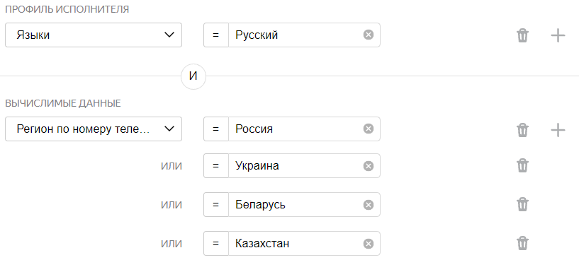

# Сравнение изображений (Side-by-side)





Сначала запустите проект в [Песочнице]({{ sandbox }}). Так вы сможете избежать ошибок и потраченных средств, если окажется, что ваше задание не работает.



Этот [пресет проекта](../../glossary.md#project-template) подходит для тех случаев, когда нужно попарно (англ. side-by-side, SbS) сравнивать похожие или разные изображения, иллюстрации, интерфейсы.

Примеры задач, которые поможет решить этот пресет:

- Нужно понять, какой дизайн интерфейса больше нравится исполнителям.
- Тестирование разных вариантов изображения в объявлениях для таргетированной рекламы.
- Выбрать лучшие изображения к публикациям, иллюстрации или фоны рабочего стола.

Предположим, у вас есть фотографии с котами и вы хотите понять — это одно и то же изображение или разные. Для этого создадим задание: исполнителю нужно сравнить два фото и дать ответ — это дубликаты или нет.





## Перед началом {#before_start}

Чтобы использовать в проекте свои изображения, вам нужно будет загрузить их в хранилище, из которого вы сможете получить ссылки на файлы. Например, ваш сервер, фотохостинг или облачное хранилище:

- [Инструкция](use-object-storage.md) по использованию файлов с Yandex Cloud.
- [Инструкция](prepare-data.md) по использованию файлов с Яндекс Диска.

Если у вас сложный проект, зарегистрируйтесь в [песочнице](sandbox.md) и создайте [проект](../../glossary.md#project) там. В ней вы сможете:

1. Протестировать настройки проекта в качестве исполнителя.

1. Затем [перенести](sandbox.md#export) их в **основную версию Толоки****production version**

1. Запустить для реальных исполнителей.

Так вы сможете избежать ошибок и напрасно потраченных средств, если окажется, что ваше задание не работает.

## Создание проекта {#create_project}

В проекте вы определяете, как будет выглядеть задание у исполнителя.

#### В интерфейсе:

1. Выберите пресет:

    1. 

    1. 

1. Заполните общую информацию:

    1. Дайте проекту понятное название и краткое описание. Их увидят исполнители в списке доступных заданий.

    1. По желанию добавьте **Приватный комментарий**.

    1. Нажмите **Сохранить**.

1. 

    

    - Конструктор шаблонов

      1. 

          Для этого проекта воспользуйтесь [готовым кодом](https://ya.cc/t/dJpLleEY3tviwM)[ready-made code](https://ya.cc/t/ZZ0n5-Kt3tvj6B), где уже настроена валидация, горячие клавиши и внешний вид задания. Исполнитель не сможет отправить задание, если не выберет варианта ответа.

          Подробнее о [настройке условий](../../template-builder/best-practices/conditions.md) в Справке конструктора шаблонов.

      1. 

          В данном проекте:

          - Поля входных данных:

              - `image_left` — ссылка для загрузки левого изображения;
              - `image_right` — ссылка для загрузки правого изображение.

          - Поле выходных данных: `result` — строка, в которую будет записан ответ исполнителя.

      1. Большинство людей просматривает изображения слева направо, поэтому первое изображение может влиять на восприятие второго. Если перемешивать изображения в заданиях, повышается достоверность результатов опроса. Картинки в парах будут отображаться каждый раз в новом порядке для разных исполнителей.

          

          Что делать, если вам нужно сравнить:

          

          - Можно перемешать картинки вручную при создании [файла с заданиями](../../glossary.md#tsv) и ссылками. Сделайте два задания с разным порядком картинок. В файле с заданиями (с помощью Excel, например) добавьте ещё одну строчку с двумя ссылками, которые будут располагаться иначе по сравнению с первой строчкой. Одна строчка — одна страница с одним заданием для исполнителя. Так будет после настроек, [описанных ниже](#smart-mixing).

          

          - На следующем шаге **Добавление пула заданий** надо будет настроить [правило контроля качества](../../glossary.md#quality-control-rule)**Выполненные задания** так, чтобы один исполнитель получал только одно задание "в руки".

          Добавьте блок и установите следующие параметры: 

          Это означает, что после того, как исполнитель выполнит одно задание, ему не будут предлагать следующее. Ответ будет принят и задание завершено.

          

          

          Можно сделать, чтобы в интерфейсе они отображались в случайном порядке. Рекомендуем создать тестовый проект [по инструкции](item_more_similar.md) из раздела **Какой из найденных объектов больше похож на исходный**.

          

          

    - Редактор HTML/CSS/JS

      1. 

          

          Для этого проекта оставьте блоки **HTML**, **JS** и **CSS** без изменений.

      1. В блоке **Спецификация данных** задаются поля входных и выходных данных.

          

          

          

          

          Подробнее о [полях входных и выходных данных](incoming.md).

          

      1. Большинство людей просматривает изображения слева направо, поэтому первое изображение может влиять на восприятие второго. Если перемешивать изображения в заданиях, повышается достоверность результатов опроса. Картинки в парах будут отображаться каждый раз в новом порядке для разных исполнителей.

          

          Что делать, если вам нужно сравнить:

          

          - Можно перемешать картинки вручную при создании [файла с заданиями](../../glossary.md#tsv) и ссылками. Сделайте два задания с разным порядком картинок. В файл с заданиями (с помощью Excel, например) добавьте ещё одну строчку с двумя ссылками, которые будут располагаться иначе по сравнению с первой строчкой. Одна строчка — одна страница с одним заданием для исполнителя. Так будет после настроек, [описанных ниже](#smart-mixing).

          

          - На следующем шаге **Добавление пула заданий** надо будет настроить [правило контроля качества](../../glossary.md#quality-control-rule)**Выполненные задания** так, чтобы один исполнитель получал только одно задание "в руки".

          Добавьте блок и установите следующие параметры: 

          Это означает, что после того, как исполнитель выполнит одно задание, ему не будут предлагать следующее. Ответ будет принят и задание завершено.

          

          

          Можно сделать, чтобы в интерфейсе они отображались в случайном порядке. Понадобится отредактировать спецификацию, а также блоки **HTML** и **JS**. Рекомендуем создать тестовый проект [по инструкции](item_more_similar.md) из раздела **Какой из найденных объектов больше похож на исходный**.

          

          

      1. Нажмите кнопку , чтобы увидеть получившееся задание.

          

          В предварительном просмотре проекта отображается одно задание со стандартными данными. Количество заданий на странице вы сможете настроить далее.

          

          Проверьте работу опций задания. В правом нижнем углу нажмите **Отправить**.

          Чтобы выйти из режима предпросмотра, внизу слева нажмите **Выйти**.

      1. 

    

1. Напишите краткую и ясную инструкцию. Опишите в ней, что надо сделать, и приведите примеры.

    Вы можете подготовить инструкцию в формате HTML и вставить ее в редактор. Чтобы переключиться в режим HTML, нажмите **<>**.

1. Нажмите **Завершить**.

Подробнее о работе с проектом читайте в разделе [проект](project.md).

## Добавление пула заданий {#add_pull}

Пул — это набор оплачиваемых заданий, которые одновременно выдаются исполнителям.

1. Откройте проект и нажмите **Добавить пул**.

1. Дайте пулу любое удобное название и описание. Они доступны только вам, исполнитель будет видеть только название и описание проекта.

1. В блоке **Цена** установите цену за страницу заданий, например `0.01`.

    

    На одной странице может отображаться одно или несколько заданий. Если задания простые, то можно добавлять 10–20 заданий на одну страницу. Не рекомендуем создавать длинные страницы, поскольку это снизит скорость загрузки данных у исполнителя.

    Исполнитель получит оплату, только если выполнил все задания на странице.

    Количество заданий на странице вы определите при [загрузке заданий](#load_tasks).

    

    

    Общее правило формирования цены — чем больше времени исполнитель тратит на выполнение, тем выше цена.

    Вы можете зарегистрироваться в Толоке как исполнитель и узнать, сколько платят другие заказчики за задания.

    

1. В блоке **Аудитория** добавьте **Фильтры** для отбора исполнителей. Чтобы ваше задание было доступно только исполнителям, владеющим русским языком, установите язык и страну по номеру телефона.

    

    

1. В разделе **Соотношение скорости и качества** можно ничего не менять.

1. В блоке **Контроль качества** задайте настройки контроля качества для пула. [Правила контроля качества](control.md) позволяют отсеивать невнимательных исполнителей. Контроль также можно [настраивать и в проекте](project-qa.md).

    - Типичные настройки контроля качества для таких задач — это **Быстрые ответы**. Добавьте блок и укажите следующие значения:

        

        Значит, если исполнитель выполнит хотя бы одну страницу заданий быстрее, чем за 5 секунд, он будет заблокирован и не сможет больше выполнять ваши задания 10 дней.

    

1. Установите **Перекрытие задания** — количество исполнителей, которые должны выполнить задание. Для заданий сравнения изображений — 20.

1. В блоке **Дополнительные настройки** укажите **Время на страницу заданий**. Его должно быть достаточно, в том числе для чтения инструкции и загрузки задания. Например, 600 секунд.

1. Нажмите кнопку **Создать пул**.

## Загрузка заданий {#load_tasks}



1. Нажмите кнопку **Загрузить**. В открывшемся окне вы можете скачать шаблон файла.

1. Добавьте в него входные данные. Заголовки столбцов со входными данными содержат слово `INPUT`. Остальные столбцы оставьте пустыми.

    

1. Загрузите задания, выбрав **Указать вручную**. Установите значение 1.

    

    Правило распределения заданий на страницах **Указать вручную** означает, что заданий на странице будет столько, сколько вы укажете в этой настройке.

    

## Запуск пула и получение результатов {#pull_launch}

1. Запустите пул, нажав кнопку .

1. Следите за выполнением в блоке **Статистика пула**.

1. Запустите агрегацию результатов, когда пул будет полностью выполнен. Для этого около кнопки **Скачать результаты** нажмите ** → Агрегация результатов по методу Дэвида — Скина**** → Dawid-Skene aggregation model**.

    В этом варианте файл с заданиями и агрегированными ответами содержит значимость ответа в процентах — поле CONFIDENCE. Результаты показывают, насколько мы можем верить в то, что правая (или левая) картинка лучше. Подробнее [об агрегации](result-aggregation.md).

1. Отслеживайте ход агрегации на странице **Операции**. По завершении нажмите кнопку **Скачать**.

## Решение проблем {#troubleshooting}







Если картинки, аудио или видео с Яндекс Диска не отображаются в [инструкции](../../glossary.md#instructions) или на [странице задания](../../glossary.md#task-suite), убедитесь, что вы правильно подключили Диск и загрузили файлы.

- [Как подключить Яндекс Диск](prepare-data.md#prepare-data__connect)
- [Как загрузить файлы для инструкции](prepare-data.md#prepare-data__instruction)
- [Как загрузить файлы для задания](prepare-data.md#prepare-data__interface)



Для создания задания возьмите за основу [шаблон для разметки видео]({{ templates-video-new }}).

Чтобы разместить ваши видеоролики на Яндекс Диске, его нужно подключить и настроить проект.

Подробная видеоинструкция об этом [в нашем блоге]({{ toloka-blog-yadisk }}).





Проблема в шаблоне задания. Проверьте, что:

- Для поля входных данных, куда вы передаете ссылку на файл, в проекте указан тип «строка».

- В компоненте в шаблоне задания используется выражение proxy.

- Формат относительных ссылок в файле с заданиями указан верно: <уникальное имя>/<путь и имя файла>.

Подробная инструкцию и видео на странице [Использование файлов с Яндекс Диска](prepare-data.md).



 



- В настройках проекта в поле **Входные данные** указан тип _ссылка_. Необходимо выбрать тип _строка_.

- В [файле с заданиями](../../glossary.md#tsv) указаны абсолютные ссылки на файлы для заданий. Необходимо вставить ссылку вида `<уникальное имя>/<путь и имя файла>`. Например: `yadisk/image1.jpg` или `yadisk/photos/image1.png`.

- Фото с Яндекс Диска используются в инструкции к заданию в мобильном приложении. Чтобы фото отобразилось в инструкции, используйте только прямые ссылки.

- Файлы удалены или находятся не в той папке на Диске, на которую ведет ссылка.

- OAuth-токен не активен. Обновите токен на странице [Интеграция]({{ integration }}).

Чтобы файлы, загруженные на Яндекс Диск (картинки, аудио, видео), отображались у исполнителя, нужно:

1. Подключить Яндекс Диск в профиле.

1. Установить тип строка для поля [входных данных](../../glossary.md#input-output-data).

1. Вставлять ссылку на файл при помощи компонента `proxy`.

[Подробная инструкция](prepare-data.md)











Попробуйте воспользоваться рекомендациями с [этой страницы]({{ yadisk-uploading }}) или написать в службу поддержки Яндекс Диска.





- В настройках проекта в поле **Входные данные** указан тип _ссылка_. Необходимо выбрать тип _строка_.

- В [файле с заданиями](../../glossary.md#tsv) указаны абсолютные ссылки на файлы для заданий. Необходимо вставить ссылку вида `<уникальное имя>/<путь и имя файла>`. Например: `yadisk/image1.jpg` или `yadisk/photos/image1.png`.

- Фото с Яндекс Диска используются в инструкции к заданию в мобильном приложении. Чтобы фото отобразилось в инструкции, используйте только прямые ссылки.

- Файлы удалены или находятся не в той папке на Диске, на которую ведет ссылка.

- OAuth-токен не активен. Обновите токен на странице [Интеграция]({{ integration }}).

Чтобы файлы, загруженные на Яндекс Диск (картинки, аудио, видео), отображались у исполнителя, нужно:

1. Подключить Яндекс Диск в профиле.

1. Установить тип строка для поля [входных данных](../../glossary.md#input-output-data).

1. Вставлять ссылку на файл при помощи компонента `proxy`.

[Подробная инструкция](prepare-data.md)





Проблема в шаблоне задания. Проверьте, что:

- Для поля входных данных, куда вы передаете ссылку на файл, в проекте указан тип «строка».

- В компоненте в шаблоне задания используется выражение proxy.

- Формат относительных ссылок в файле с заданиями указан верно: <уникальное имя>/<путь и имя файла>.

Подробная [инструкция и видео](prepare-data.md).Подробная [инструкция](prepare-data.md).





Чтобы добавить картинки с помощью ссылок на Яндекс Диск:

- Используйте ссылку, например: /api/proxy/yadisk/image1.jpg .

- В настройках профиля заказчика перейдите в .

- Настройте интеграцию с внешними сервисами.

    [Подробно об использовании файлов с Яндекс Диска](prepare-data.md).







1. Используйте шаблон **Сравнение изображений (Side-by-side)****Image comparison (Side-by-side)**.

1. В файле с заданиями укажите ссылки на сравниваемые картинки.

1. В файле создайте задания, в которых все картинки будут попарно сравниваться:

    - Картинка 1 и Картинка 2

    - Картинка 1 и Картинка 3

    - Картинка 2 и Картинка 3

1. Обработайте результаты.

Также вы можете изменить проект так, чтобы исполнитель видел сразу 3 картинки и выбирал одну из них.





Добавьте к компоненту для вставки картинки параметры `real-size=true` и `screenshot=true`.





Размеры изображений могут быть разные.



