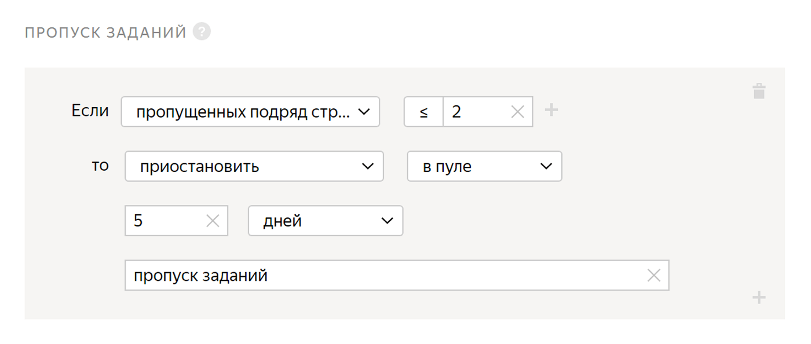

# Пропуск заданий



Ограничьте доступ к заданиям в [пуле](../../glossary.md#pool) исполнителям, которые пропускают несколько [страниц заданий](../../glossary.md#task-suite) подряд.



Все поля этого правила — обязательные. Если вы не заполните хотя бы одно из них, правило сохранить не получится.



Исполнители могут [пропускать страницы заданий](pool_statistic-pool.md#skipped-tasks), которые кажутся им объемными или сложными и выбирать более легкие задания. Оплата при этом остается одинаковой. Например, исполнитель оценивает статьи на медицинские темы: содержат ли они рецепты, дозировки, упоминания конкретных лекарств. Он может пропускать длинные тексты и размечать лишь короткие, на чтение которых уходит 10–20 секунд.

Вы можете настроить это правило, чтобы ограничить исполнителям доступ к пулу.

Перед тем как установить пропуск заданий, мы рекомендуем ознакомиться с разделом [Советы по составлению заданий](faq.md).

## Когда использовать {#when-use}

Ограничьте доступ к заданиям в [пуле](../../glossary.md#pool) исполнителям, которые пропускают несколько страниц заданий подряд, если:

- задания разные по объему и исполнители могут пропускать большие задания, выполняя только короткие;
- задания надо выполнять последовательно и пропуск заданий может повлиять на качество.

#### Не используйте, если:

- в пулах мало заданий. Например, если задание — опрос на одну страницу и исполнитель, пропустит эту страницу, то он больше не сможет выполнять задания в пуле, а значит банить его не нужно;

- задания одинаковы по объему;

- сложность задания невозможно оценить, а значит у исполнителей не будет желания пропускать задания в поисках более легкого.

## Как настроить {#rule}



Все поля этого правила — обязательные. Если вы не заполните хотя бы одно из них, правило сохранить не получится.



#|
||**Поле**|**Описание**||
||**Если****If** | Условие, при котором выполняется действие в поле **то****then**:

- **пропущенных подряд страниц заданий****task pages skipped in a row** — количество пропущенных подряд страниц заданий.||
||**то****then** | Действие, выполняемое при условии:

- **заблокировать****ban** — закрыть доступ к проекту или всем проектам заказчика на указанное количество дней. Причина блокировки отображается только заказчику.

    Если доступ к заданиям блокируется на ограниченный срок (например, на 7 дней), после снятия блокировки история ответов исполнителя не сохраняется. Навык рассчитывается на основании новых ответов.

- **принять все ответы исполнителя в пуле****accept all assignments from this performer in the pool** — требует настройки [отложенной приемки](offline-accept.md).

    Пригодится, если исполнитель выполняет большинство заданий качественно. Пример: исполнитель выполнил больше 80% заданий правильно и вас устраивает такой результат. Правило сработает автоматически — все ответы в пуле будут приняты.

- **приостановить****suspend** — приостановить доступ исполнителя к пулу на указанное количество дней. Причина отображается только заказчику.

- **установить значение навыка****assign skill value** — присвоить исполнителю фиксированное значение [навыка](nav.md).||
|#

## Пример правила {#examples}

**Задача**: вы проводите социологический опрос. Чтобы результаты были точными, необходимо чтобы исполнитель ответил на большинство вопросов.



- Правильная настройка

  

  Если исполнитель пропустит 2 страницы заданий подряд, ему будет ограничен доступ к пулу, и он не сможет выполнять ваши задания 5 дней.

- Неправильная настройка

  

  Если исполнитель пропустит 2 страницы заданий подряд, все его ответы будут приняты автоматически.

  

  При такой настройке, если исполнитель пропустит меньше 2 страниц заданий подряд, то ему будет ограничен доступ к пулу, и он не сможет выполнять ваши задания 5 дней.





## Решение проблем {#troubleshooting}



Лучше использовать один [навык](../../glossary.md#skill) в проекте. Можно выбрать способ подсчета навыка:

- Подсчет навыка для каждого пула отдельно. Текущее значение навыка — это значение навыка в пуле, который выполнялся последним. Такой вариант удобен, если:

    - Пулы предназначены для разных групп исполнителей (например, настроены фильтры по городам, странам).

    - Пулы запускаются последовательно, и вы не хотите учитывать качество ответов в предыдущих пулах при подсчете навыка в выполняемом пуле.

    Этот способ подсчета действует по умолчанию при добавлении блока контроля качества в пул. Для блока по контрольным заданиям оставьте пустым поле **Учитывать последних ответов на контрольные и обучающие задания**.

- Подсчет навыка по всем выполненным заданиям в проекте. Такой вариант удобен, если пулы небольшие и вам не нужно рассчитывать навык для каждого пула.

    Этот способ подсчета доступен только для навыков по контрольным заданиям. Чтобы использовать его, заполните поле **Учитывать последних ответов на контрольные и обучающие задания** в блоках контроля качества в пулах.





Да, конечно, один и тот же навык можно назначать и использовать на различных проектах. Но чаще всего один навык используется в рамках одного проекта. Если исполнитель хорошо выполняет одно задание, это не значит, что он так же успешно справится с другим. Кроме того, используя фильтры по давно настроенным навыкам, вы ограничиваете количество доступных исполнителей.





К сожалению, да, может. Поэтому мы рекомендуем перед боевым заданием делать обучение или экзамен, чтобы до боевого пула добирались только те, кто хорошо прошел предыдущий этап отбора.





Если исполнителю уже начислены деньги за задания, то обратно их не вернуть.



