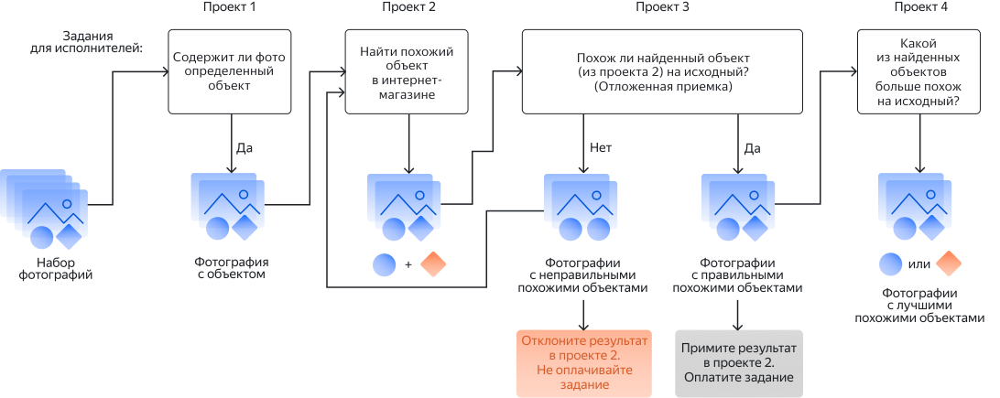

# Декомпозиция задания

Прежде чем начать создавать [проект](../../glossary.md#project), задумайтесь: не стоит ли разделить его на несколько проектов поменьше? Это называется _декомпозиция_.

Например в разделе [Поиск характеристик товара (пример с декомпозицией)](data-collection.md) задание предлагается разбить на четыре проекта:

- [Проект 1. Содержит ли фотография определенный объект?](contain_item.md) — это подготовка данных (фильтрация).

- [Проект 2. Найти похожий объект в интернет-магазине](find_an_item_in_store.md) — это исходное задание.

- [Проект 3. Похож ли найденный объект на исходный?](item_look_similar.md) — это проверка ответов.

- [Проект 4. Какой из найденных объектов больше похож на исходный?](item_more_similar.md) — это выбор наиболее подходящего ответа.

## Преимущества декомпозиции {#concept_l2j_phn_nlb}

Архитектуру решения из нескольких проектов лучше продумать заранее, так как проекты могут быть связаны:

- Результат из одного проекта может быть [входными данными](../../glossary.md#input-output-data) для другого проекта.

- В одном проекте вы можете присваивать [навык](../../glossary.md#skill) исполнителю, чтобы в другом проекте фильтровать исполнителей по этому навыку.

После декомпозиции:

- Задания становятся проще и выполняются быстрее.

- Задания требуют меньше навыков.

- В [интерфейсе задания](../../glossary.md#task-interface) проще настроить горячие клавиши, это тоже ускорит работу исполнителей.

- [Инструкция](../../glossary.md#task-instruction) задания будет короче и понятнее, и не будет отталкивать исполнителей.

- Вы можете делать задания дешевле по причинам выше.

- Качество выполнения заданий будет выше и его будет проще контролировать.

- Разработка несколько простых заданий может оказаться проще, чем одного большого задания. У вас будет меньше сложностей при создании интерфейса и написании инструкции.

## Когда использовать декомпозицию {#concept_vd5_4zb_nlb}

Зачастую в отдельный проект можно вынести задачи по подготовке данных и проверке ответов исполнителей. Главную часть задания порой тоже можно разделить на несколько проектов.

### Подготовка данных в отдельном проекте {#concept_l4v_h4g_nlb}

- Есть ли у вас данные, на основе которых надо выполнять задание?

    Сбор данных для анализа можно доверить исполнителям в отдельном проекте.

- Надо ли фильтровать ваши данные?

    Допустим, вы хотите создать задание «Выделить дорожные знаки на изображении», но вы не уверены, что на всех изображениях есть дорожные знаки. Создайте отдельный проект с заданием «Есть ли дорожные знаки на изображении», чтобы отфильтровать лишние изображения.

    Задание на фильтрацию данных обычно стоит дешево и может помочь вам сэкономить на самом важном задании, а также упростить инструкцию и интерфейс задания.

### Проверка ответов в отдельном проекте {#concept_vxt_h4g_nlb}

- Проверку ответов на задания можно доверить исполнителям в отдельном проекте. Например, если вы хотите создать проект «Найти похожие товары», включите в этом проекте [отложенную приемку](../../glossary.md#left-off-acceptance) заданий и создайте отдельный проект с заданием «Похожи ли эти товары?», чтобы проверить ответы отклонить неправильные ответы и не платить за них.

    

    В отложенной приемке указывается [срок проверки](../../glossary.md#review-time), после которого задания принимаются автоматически. Вам надо уложиться в этот срок: успеть завершить проект про проверку заданий и отклонить задания в основном проекте задания.

    

- Если ответы исполнителей нельзя объединить автоматически, то выбор наиболее подходящего ответа можно доверить исполнителям в отдельном проекте. Например, если ответы — это изображения похожих товаров, а вам нужно только одно такое изображение.



В основном проекте проставляйте исполнителям навык, чтобы на этапе проверки ответов допустить к проверке только тех исполнителей, у которых нет этого навыка.



### Декомпозиция заданий {#concept_o3r_h4g_nlb}

Чем проще задание — тем лучше результаты. Если в задании больше одного вопроса, то возможно его стоит разделить на несколько проектов. Вот несколько примеров, когда нужна декомпозиция:

- Если для некоторых вопросов в задании нужна дополнительная фильтрация.

    Например, если вы показываете исполнителю фото котика и просите ответить на вопросы «какого цвета котик?» и «котик спит?», то лучше разделить это задание на два проекта. Для ответа на второй вопрос понадобится дополнительный этап фильтрации данных, так как на фото должны быть видны глаза котика.

- Если для ответа на разные вопросы задания требуются разные навыки исполнителя.

    Допустим, что помимо вопросов из предыдущего пункта, вы еще хотите выяснить, какая порода у котика. Для этого вам нужны исполнители, которые разбираются в этом вопросе.

- Если исполнитель должен дать общее решение по множеству критериев.

    Например, проверить множество параметров объявления и решить, какой категории покупателей оно будет интересно. Лучше задавать конкретные вопросы по объявлению и на основе сочетаний ответов выносить решение самостоятельно, так результаты будут точнее.

Некоторые задания состоят из нескольких вопросов, но декомпозиция в них не нужна, например:

- Опросы — здесь важно, чтобы на все вопросы ответил один исполнитель.

- Полевые задания — если вам надо проверить разные данные об одной и той же организации, нет смысла одного исполнителя просить проверить, работает ли организация, а другого просить посмотреть часы работы на двери.

## Примеры {#concept_fwm_xlg_nlb}

Примеры, в которых используется декомпозиция:

- [Поиск характеристик товара (пример с декомпозицией)](data-collection.md)

- [Распознавание объектов и выделение областей (пример с декомпозицией)](image-segmentation-overview.md)

Также рекомендуется пройти [видео-курс для заказчиков]({{ videocourse-about-decomposition }}). Там объясняется, как разделять проекты и делается тестовое задание, состоящее из трех проектов: фильтрация данных, выполнение задания и проверка ответов.

## Что дальше {#what_next}

- [Создайте новый проект](project.md), чтобы разместить ваше задание.

## Решение проблем {#problem-solution}



Если в вашем задании много объектов разного типа для выделения, то его стоит декомпозировать. Например, в одном проекте предложить исполнителям выделить только цифры, во втором — дверные проёмы и окна, в третьем — стены, в четвёртом — сантехнику.

Чем проще получится задание, тем оно будет дешевле, и тем качественнее будет итоговый результат. Устанавливайте стоимость разметки одного класса объектов на фото примерно 0,01 $

[Используйте](selection.md) шаблон **Выделение областей на изображении**. Через редактор из этого шаблона можно добавить выпадающий список для маркировки выделенного объекта. Посмотрите как это сделать в [описании](t-components/image-annotation.md#annotation) редактора (вкладка **Выпадающий список**).





Для Толоки задачу нужно декомпозировать. Задание на 30 минут для одного человека со всеми фразами лучше разбить на отдельные фразы и предложить разным исполнителям. Шаблон для создания задания такого типа не потребует от исполнителя установки отдельного диктофона.

Возьмите наше пошаговое описание создания [задания по записи фраз на диктофон](record-audio.md).

Во входных данных можно передать фразу, которую должен произнести исполнитель (включить навигацию), и скорость речи (normal speed). Эти данные вам и нужно будет записать в файл с заданиями. О создании файла и его структуре можно прочитать в [Руководстве](pool_csv.md).

В предпросмотре по умолчанию 4 задания на странице. Их количество для вашего проекта можно будет указать при загрузке файла с заданиями. [Подробнее о предпросмотре](spec.md).

Например, если вам нужно, чтобы один человек произнес одну и ту же фразу 10 раз, сделайте на странице 10 заданий. Стоимость указывается за целую страницу. Определить, сколько человек должно произнести ту или иную фразу, можно с помощью перекрытия в пуле. Кстати, не забудьте о фильтрах в пуле, чтобы отобрать только исполнителей, владеющих русским языком и выдать задание на мобильном: клиент = мобильная Толока.

Вы можете поручить проверку записанных фраз другим исполнителям, создав отдельный проект. Как это сделать кратко описано [здесь](record-audio.md).



