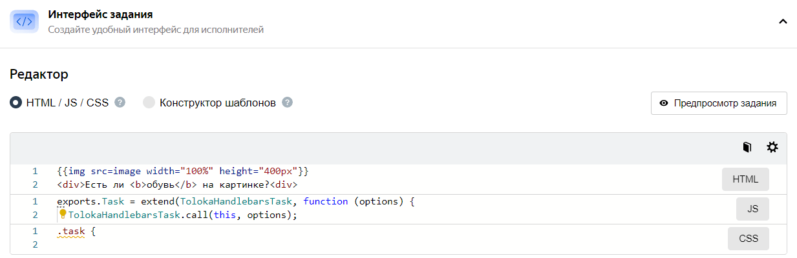

# Интерфейс задания





**Интерфейс задания****Task interface** определяет внешний вид задания для исполнителя и логику обработки ответов.

Удобный интерфейс повысит качество результатов и позволит исполнителям выполнять задания быстрее, а это позволит вам снизить цену за задание.



О том, как сделать удобный интерфейс, читайте в нашем блоге статью «9 правил хорошего тона в интерфейсах»: [часть 1]({{ toloka-blog-interfaces-1 }}), [часть 2]({{ toloka-blog-interfaces-2 }}).



О том, как сделать удобный интерфейс, читайте статью в нашей [базе знаний]({{ toloka-knowledge-base }}).



## Блок настройки интерфейса {#interface-section}

Наведите на элемент на изображении, чтобы увидеть всплывающую подсказку:





Чтобы раскрыть блоки **HTML**, **CSS** и **JS**, нажмите на название блока справа.



## Блок HTML {#html}

Добавьте в этот блок элементы для всех [входных и выходных данных](incoming.md), которые вы хотите отобразить в интерфейсе задания. Вы можете использовать специальные компоненты или HTML-теги внутри тега `<body>`.

В качестве шаблонизатора для HTML используется [Handlebars](t-components/handlebars.md).



1. Откройте помощник по созданию интерфейса задания. Для этого в блоке **Интерфейс задания****Task interface** нажмите кнопку  и выберите компонент.

    Нажмите **Подробнее****More**, чтобы посмотреть пример и полный список параметров.

1. Скопируйте выражение с помощью кнопки  и вставьте его в блок HTML.

1. Укажите имя поля из входных или выходных данных.





- **Отобразить текст в задании.** Добавьте во входные данные поле `text` с типом **строка**. Затем в интерфейсе задания (в блоке HTML) вы сможете добавить этот текст в качестве переменной, например:



    ```html
    <p>Прочитайте текст: not_var{{text}}</p>
    ```

    

    ```html
    <p>Read the text: not_var{{text}}</p>
    ```

    

- **Загрузить файл в задание, например картинку.** Добавьте во входные данные поле `url` с типом **ссылка**. Затем добавьте компонент [Картинка](t-components/img.md) в интерфейс задания (в блок HTML) и укажите имя поля в атрибуте `src`:

    ```html
    {{img src=url width="400px" height="300px"}}
    ```

- **Оформить ссылку на файл с Яндекс Диска.**
    Если элемент интерфейса будет использоваться для передачи ссылок на файлы с Яндекс Диска, в блоке HTML добавьте к названию поля входных данных слово `proxy`. В зависимости от типа элемента оформление поля будет выглядеть по разному. Например:

    #|
    ||**HTML-тег**|**Компонент**||
    ||Ссылка на аудио:

    `<audio src="not_var{{audio_link}}" controls>`

    **↓**

    `<audio src="not_var{{proxy audio_link}}" controls>` | Ссылка на изображение:

    `{{img src=image }}`

    **↓**

    `{{img src=(proxy image)}}`||
    |#

    Подробнее в разделе [Яндекс Диск](prepare-data.md).

    





- **Попросить исполнителя ввести текст.** Добавьте в выходные данные поле `input` с типом **строка**. Сделайте поле обязательным. Затем добавьте компонент [Поле для ввода текста](t-components/text.md) в интерфейс задания (в блок HTML) и укажите имя поля в атрибуте `name`:

    ```html
    {{field type="textarea" name="input" width="270px" rows=5}}
    ```

- **Попросить выбрать одно из значений.** Добавьте в выходные данные поле `result` с типом **строка**. Сделайте поле обязательным и укажите допустимые значения `Yes` и `No`. Затем добавьте компонент [Переключатель](t-components/radiobuttons.md) в интерфейс задания (в блок HTML) и укажите имя поля в атрибуте `name`:

    

    ```html
    {{field type="radio" name="result" label="Да" value="Yes" hotkey="1"}}
    {{field type="radio" name="result" label="Нет" value="No" hotkey="2"}}
    ```

    

    ```html
    {{field type="radio" name="result" label="Yes" value="Yes" hotkey="1"}}
    {{field type="radio" name="result" label="No" value="No" hotkey="2"}}
    ```

    



## Блок JS {#js}

В блоке **JS** вы можете добавить дополнительные правила обработки ответа на JavaScript. Для этого разработаны [специальные расширения для классов заданий](spec-advanced.md).

Кроме того, вы можете подключать JavaScript-библиотеки для создания интерфейса. Например, если у вас есть несколько [проектов](../../glossary.md#project) с похожими заданиями, сохраните описание методов в отдельном файле и подключите его как библиотеку.

Чтобы подключить JavaScript-библиотеку, нажмите кнопку  в блоке **Интерфейс задания****Task interface** и добавьте ссылки на библиотеки в поле **JS**.

## Блок CSS {#css}

В блоке **CSS** вы можете объявлять оформление для тегов и классов. Например, отступ снизу после текстового поля с классом `task-text`:

```css
.task-text{
  margin-bottom: 15px;
};
```

Кроме того, вы можете подключать CSS-библиотеки. Для этого нажмите кнопку  в блоке **Интерфейс задания****Task interface** и добавьте ссылки на библиотеки в поле **CSS**.

## Возможности предпросмотра {#preview}



Изменение входных и выходных данных, а также количества заданий на странице не сохраняются после выхода из **Предпросмотра****Preview**.



Чтобы увидеть получившееся задание, нажмите кнопку **Предпросмотр****Preview**. В предварительном просмотре отображается страница с заданием, которое имеет стандартные данные. Измените входные данные и убедитесь, что изображения, ссылки или текст правильно отображаются на [странице заданий](../../glossary.md#task-suite). Также вы можете выполнить и получить ответы на одно или несколько заданий.



Вы можете изменить количество заданий со стандартными данными на странице Предпросмотра:

1. Нажмите кнопку **Изменить входные данные****Change input data**.

1. Чтобы добавить задание, нажмите кнопку **Добавить задание****Add task**.

    Чтобы удалить задание, нажмите на его номер, затем нажмите .

1. Нажмите кнопку **Применить****Apply**.





Добавьте входные данные, чтобы проверить отображение файлов или текстовых подсказок на странице задания. Для этого нажмите кнопку **Изменить входные данные****Change input data** и выберите один из способов:



- Заполнение таблицы

  1. Измените поля с входными данными.

        Чтобы сделать задание [контрольным](../../glossary.md#control-task) или [обучающим](../../glossary.md#training-task), добавьте правильные ответы и подсказку (кнопка **Добавить правильные ответы****Add correct answers**).

        Для перехода к другому заданию, нажмите номер задания внизу таблицы. Чтобы удалить задание, нажмите кнопку .

  1. Нажмите кнопку **Применить****Apply**.

- Загрузка файла

  1. Скачайте пример загрузочного файла по ссылке **Скачать пример файла****Download example file**.

  1. [Добавьте данные](pool_csv.md) для заданий в файл.

  1. Сохраните файл в кодировке UTF-8 с расширением [tsv](pool_csv.md).

  1. Нажмите кнопку **Загрузить файл****Upload file** и выберите файл.

  1. Проверьте корректность заполнения полей в **Таблице****Table**.

      Если заголовки столбцов некорректны, вы получите сообщение «Ошибка при загрузке файла».

      Если не указано значение обязательного поля входных данных или количество полей в заголовке и в строке не совпадает, задание не загрузится. Обновите страницу, чтобы вернуться к просмотру, исправьте ошибки в файле и загрузите его снова.

  1. Нажмите кнопку **Применить****Apply**.

- Данные в формате JSON

  1. Выберите вид **JSON**.

  1. Подставьте необходимые для проверки данные [в формате JSON]({{ json-format }}).

      Если рамка поля стала красной, JSON не валидный и данные не сохранятся.

  1. Нажмите кнопку **Применить****Apply**.



Выполните задание и нажмите кнопку **Отправить****Submit**.





Вы можете проверить получение некоторых данных со страницы задания.

Чтобы проверить получение текстовых комментариев или ответов из флажка (checkbox), заполните соответствующие поля заданий и нажмите кнопку **Отправить**. Затем нажмите **Посмотреть ответы**.



Проверить получение файлов, изображений, аудио или видео, отправленных со страницы задания, можно в [Песочнице](../../glossary.md#sandbox). Для этого завершите создание проекта, создайте аналогичный проект в Песочнице и [выполните](sandbox.md) его, используя аккаунт доверенного пользователя.





## Элементы управления в задании {#controls}

Чтобы изменить набор элементов управления, нажмите кнопку **Показать общие элементы интерфейса** внизу блока **Интерфейс задания****Task Interface**.

По умолчанию на странице заданий отображаются:

- **Оставшееся время** (отсчитывает время выполнения задания).

- **Цена за страницу** заданий.

- **Название задания** (название проекта).

- Кнопки **Написать заказчику****Message to requester**, **Инструкция****Guidelines**, **На весь экран****Fullscreen**, **Отправить****Submit**, **Пропустить****Skip**, **Выйти****Exit**.





[Прочитайте статью]({{ toloka-blog-interfaces-1 }}) в блоге о том, как сделать интерфейс задания понятным и удобным.



Прочитайте [статью]({{ toloka-knowledge-base }}) о том, как сделать интерфейс задания понятным и удобным.





## Что дальше {#what-next}

- [Адаптируйте интерфейс задания для мобильных устройств](mobile.md).

- [Создайте пул заданий в проекте](pool-main.md).

- Узнайте больше про настройку проекта:

    - [Написание инструкции](instruction.md).

    - [Входные и выходные данные](incoming.md).

    - [Настройка контроля качества](project-qa.md).

## Решение проблем {#troubleshooting}





Если никто из исполнителей не смог отправить задание, скорее всего проблема в валидации в JS. Проверьте её ещё раз.

Перенесите проект в сендбокс и попробуйте выполнить задание самостоятельно в песочнице.





Чтобы проверить, как выглядит задание на экране мобильного телефона, можно переключиться в режим эмуляции в браузерах Chrome или Safari и отредактировать блок CSS.

Также вы можете воспользоваться мобильной версией сендбокса. Чтобы получить к ней доступ, напишите в службу поддержки.





Текст под кат можно убрать с помощью стилей CSS как в самом задании, так и в инструкции. Пример кода можно посмотреть [здесь]({{ text-under-the-cut }}).





Посмотреть пример вы можете в комментариях к [проекту]({{ how-to-insert-a-calendar }}). В примере есть формат выходных данных и библиотеки, которые нужно подключить.

Чтобы подключить библиотеки:

1. В режиме редактирования проекта нажмите «шестеренку».
1. В открывшемся поле слева введите ссылки и нажмите **Ввод**.





В режиме предпросмотра проверить загрузку файлов нельзя, но это можно сделать в песочнице, выполнив своё задание. Для этого нужно зарегистрироваться в сендбоксе в качестве исполнителя и добавить логин в доверенные на странице **Пользователи**. Подробнее можете прочитать в этой [статье](sandbox.md) .









Чтобы передать `label` во входных данных, укажите в нём имя входного поля.

Например, если у вас входное поле `asd` с типом строка, то компонент может быть записан так: `{{field type="checkbox" name="like" label=asd hotkey="q"}}`.

Если вы хотите передавать различные значения лейблов в разных заданиях или количество чекбоксов может меняться, то воспользуйтесь [конкатенацией](t-components/helpers.md#concat).





Названия выходных полей должны отличаться: для каждого чекбокса своё имя. Подробнее об этом компоненте [здесь](t-components/checkboxes.md).





1. Посмотрите как это реализовано в шаблоне .

1. Для решения второй задачи вы можете добавить ещё одну валидацию по аналогии с этой:



    ```javascript
    if (solution.output_values.url && solution.output_values.check) {return {task_id:
    this.getTask().id,errors: {'url': {code: 'Вставьте ссылку или отметьте галочкой,что сайта нет'}}}}
    ```

    

    ```javascript
    if (solution.output_values.url && solution.output_values.check) {return {task_id:
    this.getTask().id,errors: {'url': {code: ''Insert a link or check the box if the site doesn't exist'}}}}
    ```

    





Вы можете сделать это с помощью [конкатенации](t-components/helpers.md#concat).

Посмотрите примеры проектов, которые могут помочь вам в создании интерфейса:

- [с чекбоксами]({{ project-with-checkboxes }})
- [с выпадающим списком]({{ project-with-drop-down-list }})
- [с радиобаттонами]({{ project-with-radiobutton }})

Во входном поле массив значений необходимо передавать через запятую. Для каждого из них в интерфейсе будет сформирован вариант ответа. Входные/выходные данные к проектам-примерам указаны в комментариях на codepen.io.





Вероятно, проблема в блоке JS. Попробуйте удалить его содержимое, после чего проверьте кнопку **Отправить** в режиме предпросмотра.





Добавить валидацию ответа в зависимости от чекбокса возможно с помощью JavaScript. Пример доступен в шаблоне «Поиск данных в сети».





Используйте [конкатенацию](t-components/helpers.md#concat), например:

```html
{{field type="checkbox" name=(concat "result." @index ) label=(concat "checkbox –
          " @index) size="L"}}
```





Снять выбор нельзя. Только изменить на другую радиокнопку с ответом.





Добавить валидацию ответа в зависимости от чекбокса можно с помощью JavaScript. Пример доступен в шаблоне «Поиск данных в сети».





Установите фон в CSS для элемента `.task` или `.task-suite`. Например, черный:

```css
.task-suite {
background-color: #000000;
}
.task {
background-color: #000000;
}
```

Также вы можете присвоить класс области интерфейса, где находится изображение, и установить фон только для этой области.





В HTML шаблона укажите следующий код:



```html
<input type=""range"" list=""rng"" class=""res"">
```

а в JS в onRender прописать следующее:

```javascript
onRender: function() {
// DOM-элемент задания сформирован (доступен через #getDOMElement())
//Добавляем служебные переменные
var $root = $(this.getDOMElement());
var _this = this;
var solution = TolokaHandlebarsTask.prototype.getSolution.apply(this, arguments);

$root.on('change', '.res', function(){
var range_result = $(this).val()
_this.setSolutionOutputValue('result', range_result);

return solution;
})

}
```



```html
<input type=""range"" list=""rng"" class=""res"">
```

and include the following in onRender in your JS:

```javascript
onRender: function() {
// Generated DOM element for the task (available via #getDOMElement())
//Adding auxiliary variables
var $root = $(this.getDOMElement());
var _this = this;
var solution = TolokaHandlebarsTask.prototype.getSolution.apply(this, arguments);

$root.on('change', '.res', function(){
var range_result = $(this).val()
_this.setSolutionOutputValue('result', range_result);

return solution;
})

}
```







Расширить окно HTML не получится. Чтобы раскрыть поля JS и CSS, кликните в любую область в пределах поля.





Да, вы можете не использовать наши компоненты для создания интерфейсов, а создать собственный дизайн страницы с заданиями. Для этого удалите библиотеку из шаблона проекта:

- откройте настройки под «шестеренкой».
- удалите `$TOLOKA_ASSETS/js/toloka-handlebars-templates.js`.

В [Руководстве заказчика](spec-advanced.md) описана вся структура классов и как они устроены.





Если после сохранения инструкции пропадают теги или атрибуты (например, `checked="true"`), значит они не поддерживаются. Полный список допустимых в инструкции тегов можно найти в [руководстве](instruction.md#html-yes).





Мы не задумывали, что в этом окошке будет вестить какая-то сложная разработка. Как правило, контент подготавливают в стороннем редакторе, который имеет подсветку, а в окошко копируют готовый вариант перед обновлением.

В аспекте доступности TolokaHandlebars для редактирования нет отличий между нашим окошком и редактором.











Если это в JS, то укажите в конце индекс:

```javascript
this.getTask().input_values['name'][2]solution.output_values['result'][2]
```

Если в интерфейсе, то следующим образом: 







Попробуйте отключать расширения браузера. Они могут блокировать загрузку iframe.





Укажите название входного поля, куда передаёте ссылку, без скобок:



```html
{{field type="button-clicked" name="ads" label="Нажми меня" href=name_escape
            action=true}}
```



```html
{{field type="button-clicked" name="ads" label="Click me" href=name_escape
          action=true}}
```







В качестве входного поля передайте массив строк. Например, как показано на скриншоте: 

В HTML используйте специальный handlebar, чтобы итерироваться по этому полю. Конструкция будет выглядеть следующим образом:

```html
{{#each words}}
{{field type="radio" name="result" value=this label=this}}
{{/each}}
```





Заключите входное поле в двойные фигурные скобки `not_var{{text}}`.





Заключите входное поле в тройные фигурные скобки `{not_var{{input_field}}}`.

Подробнее об использовании компонента можно узнать в [Руководстве заказчика](t-components/html.md).





Для решения задачи с динамическим количеством выходных полей воспользуйтесь рекомендациями с [этой страницы](t-components/helpers.md).





Чтобы текст из входного поля отображался с HTML-тегами, можно использовать `<pre>`. Например:`<pre>not_var{{text}}</pre>`.

Так текст будет записан как есть, в одну строку со скроллом.Чтобы убрать скролл и не растягивать карточку с заданием, добавьте в блок CSS:

```css
.task {
  max-width: 800px;
}
pre {
  white-space: pre-wrap;
}
```









Подробнее про расширение шаблона на JS вы можете прочитать [здесь](spec-advanced.md).

Чтобы разметка Vue не конфликтовала с синтаксисом Handlebars нужно отключить библиотеку toloka-handlebars-templates и наследоваться от классов Task/TaskSuite.





Попробуйте добавить условие на наличие второй шкалы:

```javascript
setSolution: function(solution) {
var secondScale = this.getDOMElement().querySelector('.second-scale');

if(secondScale) {
secondScale.style.display = solution.output_values.grammar === 'no' ? 'block' : 'none';
}

TolokaHandlebarsTask.prototype.setSolution.call(this, solution);
},
```





Проверить формат ссылки можно с помощью регулярных выражений. Для этого в шаблоне задания добавьте валидацию ссылки на JavaScript c помощью `regexp`.

Например: `var regexp = /^(https://www.myurl.com/).{4,200}$/`.

Или можно добавить регулярное выражение в выходные данные в поле `input` с типом **строка**. Сделайте поле обязательным. Затем добавьте компонент **Поле для ввода текста** в интерфейс задания (в блок HTML) и укажите имя поля в атрибуте `name`:

```html
{{field type="textarea" name="input" width="270px" rows=5}}
```









Добавьте к компоненту для вставки картинки параметры `real-size=true` и `screenshot=true`.





Чтобы добавить горячую клавишу, в методе onKey пропишите следующее действие:

```javascript
onKey: function(key) {
          var el = this.getDOMElement().querySelector(".image-annotation-editor__shape-polygon");

          if (key === 'D') {
          el.click();
          el.classList.add('image-annotation-editor__shape_active')
          }
```

Воспользуйтесь [этой библиотекой](https://github.com/vmit/image-annotation), если потребуются дальнейшие модификации редактора по выделению областей.





В этом случае нужно оставить поле необязательным в выходных данных и прописать валидацию в зависимости от ответа исполнителя. Вы можете посмотреть, как это решено в шаблоне «Классификация текстов».





Добавьте `sources="CAMERA"` в атрибуты к компоненту для загрузки картинки, чтобы запретить добавлять фото из галереи.





Вы можете сделать выделение и выпадающий список с выбором категории. Посмотрите, как это реализовано на [этой странице](t-components/image-annotation.md) (вкладка **Выпадающий список**).





В шаблоне **Сравнение изображений (Side-by-side)****Image comparison (Side-by-side)** используется не HTML-тег, а компонент. Поэтому нужно подставить прокси в круглых скобках по [образцу](t-components/img.md): `{{img src=(proxy image)}}`.





Существуют четыре основных варианта решения:

- [Декомпозировать задачу](solution-architecture.md): сначала отбрать картинки с нужными объектами, затем выделить на них области.

- Выделить произвольную область на картинке. Например, поставьте квадрат в правый верхний угол.

    Добавьте информацию об этом в инструкцию для проверяющих.

- Предложить исполнителю пропустить задание и сообщить о нём в личном сообщении. Сообщения проверяются заказчиком и, если объекта действительно нет, задание будет удалено из пула (путем обнуления перекрытия).

- Добавить в интерфейс чекбокс «нет объекта» и настройте в JS проверку, что в задании либо выделен объект, либо поставлена галочка.

    Для контроля добавьте в интерфейс задания информацию о значении этого чекбокса.





