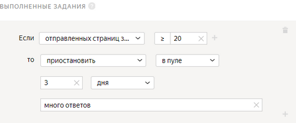

# Выполненные задания

Иногда важно привлечь к задаче как можно больше исполнителей. Вы можете ограничить количество заданий в [пуле](../../glossary.md#pool) на каждого исполнителя или [установить лимит](income.md) на дневной заработок в [проекте](../../glossary.md#project).

## Когда использовать {#when-use}

Используйте это правило, если:
- хотите получить ответы как можно большего числа исполнителей (в этом случае установите низкий порог, например, одну [страницу заданий](../../glossary.md#task-page));

- обеспечить защиту от роботов (в этом случае порог должен быть выше, например, 10% заданий пула).

#### Рекомендации по использованию.

Не устанавливайте большие значения правила в пулах, где исполнители не успеют выполнить необходимое количество заданий.

## Настройка правила {#rule}



Все поля этого правила — обязательные. Если вы не заполните хотя бы одно из них, правило сохранить не получится.



#|
||**Поле**|**Описание**||
||**Если****If** | Условие, при котором выполняется действие в поле **то****then**:

- **отправленных страниц заданий****submitted assignments** — количество страниц заданий в пуле, выполненных исполнителем.||
||**то****then** | Действие, выполняемое при условии:

- **установить значение навыка****assign skill value** — присвоить исполнителю фиксированное значение [навыка](nav.md).

- **принять все ответы исполнителя в пуле****accept all assignments from this performer in the pool** — требует настройки [отложенной приемки](offline-accept.md).

    Пригодится, если исполнитель выполняет большинство заданий качественно. Пример: исполнитель выполнил больше 80% заданий правильно и вас устраивает такой результат. Правило сработает автоматически — все ответы в пуле будут приняты.

- **приостановить****suspend** — приостановить доступ исполнителя к пулу на указанное количество дней. Причина отображается только заказчику.

- **заблокировать****ban** — закрыть доступ к проекту или всем проектам заказчика на указанное количество дней. Причина блокировки отображается только заказчику.

    Если доступ к заданиям блокируется на ограниченный срок (например, на 7 дней), после снятия блокировки история ответов исполнителя не сохраняется. Навык рассчитывается на основании новых ответов.||
|#

## Пример правила {#examples}

**Задача**: вы проводите социологический опрос. Чтобы собрать ответы от максимального числа исполнителей, настройте правило **выполненные задания**.

#### Правильная настройка

Если исполнитель выполнит больше 20 страниц заданий, ему будет ограничен доступ к пулу и он больше не сможет выполнять ваши задания.



## Решение проблем {#troubleshooting}



Лучше использовать один [навык](../../glossary.md#skill-ru) в проекте. Можно выбрать способ подсчета навыка:

- Подсчет навыка для каждого пула отдельно. Текущее значение навыка — это значение навыка в пуле, который выполнялся последним. Такой вариант удобен, если:

    - Пулы предназначены для разных групп исполнителей (например, настроены фильтры по городам, странам).

    - Пулы запускаются последовательно, и вы не хотите учитывать качество ответов в предыдущих пулах при подсчете навыка в выполняемом пуле.

    Этот способ подсчета действует по умолчанию при добавлении блока контроля качества в пул. Для блока по контрольным заданиям оставьте пустым поле **Учитывать последних ответов на контрольные и обучающие задания**.

- Подсчет навыка по всем выполненным заданиям в проекте. Такой вариант удобен, если пулы небольшие и вам не нужно рассчитывать навык для каждого пула.

    Этот способ подсчета доступен только для навыков по контрольным заданиям. Чтобы использовать его, заполните поле **Учитывать последних ответов на контрольные и обучающие задания** в блоках контроля качества в пулах.





Да, конечно, один и тот же навык можно назначать и использовать на различных проектах. Но чаще всего один навык используется в рамках одного проекта. Если исполнитель хорошо выполняет одно задание, это не значит, что он так же успешно справится с другим. Кроме того, используя фильтры по давно настроенным навыкам, вы ограничиваете количество доступных исполнителей.





Да, может, если оба пула ему доступны. Чтобы ограничить доступ исполнителя к следующим заданиям, используйте правило [Выполненные задания](submitted-answers.md) — выберите блокировку на проекте.





Если вы передаете тексты во входные данные, то достаточно загрузить в пул 2 разных задания: в одном из них в поле `INPUT:<имя входного поля>` вы передадите текст № 1, в другом — текст № 2. А если текст в самом шаблоне задания в блоке HTML, то да, нужно клонировать проект. Чтобы исполнитель мог сделать только одно задание в вашем проекте, используйте правило [Выполненные задания](submitted-answers.md). Можно назначить навык или заблокировать исполнителя после того, как он отправит один ответ.



