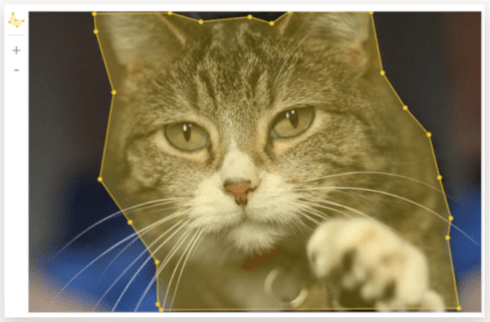

# Картинка с возможностью выделения областей





В этом разделе описано, как добавить к картинке редактор для выделения областей при помощи инструментов HTML/JS/CSS. Вы также можете попробовать создать редактор для [выделения областей](../../../template-builder/operations/select-areas.md) в Конструкторе шаблонов.



Редактор дает возможность выделить область на картинке либо прямоугольником, либо произвольным многоугольником:





Не добавляйте [обучающие и контрольные задания](../pool.md) в [проект](../../../glossary.md#project) с редактором для выделения области на картинке.



## Добавление редактора {#adding_editor}



- Картинка

  Если вам нужно добавить редактор для картинки без выделенных объектов:

  1. Подключите библиотеку $TOLOKA_ASSETS/js/image-annotation.js (нажмите  в блоке **Интерфейс задания** на странице проекта).

  1. Включите в HTML-код интерфейса компонент `{{field type="image-annotation"``name="<название выходного поля>"``src=<URL изображения>}}`. Например:

      ```html
      {{field type="image-annotation" name="result" src=image}}
      ```

      Полный список параметров см. в [таблице](#parametry).

  1. Добавьте во [входные данные](../incoming.md) поле для указания ссылки на картинку. Если вы храните картинки на [Яндекс Диске](../prepare-data.md), используйте тип **строка**, а не **ссылка**.

  1. В выходные данные добавьте поле `result` с типом **json**.

  В поле `result` будет записан объект JSON c координатами точек. Например:

  ```json
  [{"data":{"p1":{"x":0.472,"y":0.413},"p2":{"x":0.932,"y":0.877}},"type":"rectangle"},
  {"data":[{"x":0.143,"y":0.807},{"x":0.317,"y":0.87},{"x":0.511,"y":0.145},{"x":0.328,"y":0.096},{"x":0.096,"y":0.554}],"type":"polygon"}]
  ```

  Значения _x_ и _y_ — числа от 0 до 1. Длина и ширина изображения принимаются за 1, начало координат находится в левом верхнем углу картинки.

- Картинки с выделенными объектами

  Если у вас есть картинки с выделенными объектами и вы хотите загрузить их в задание:

  1. Подключите библиотеку $TOLOKA_ASSETS/js/image-annotation.js (нажмите  в блоке **Интерфейс задания** на странице проекта).

  1. Включите в HTML-код интерфейса компонент `{{field type="image-annotation"``name="<название выходного поля>"``src=<URL изображения>``annotations=<название входного поля>}}`. Например:

      ```html
      {{field type="image-annotation" name="result" src=image annotations=polygon}}
      ```

  1. Добавьте во [входные данные](../incoming.md):

      - Поле для указания ссылки на картинку. Если вы храните картинки на [Яндекс Диске](../prepare-data.md), используйте тип **строка**, а не **ссылка**.

      - Поле `polygon` с типом **json** для передачи координат выделенной области.

  1. В выходные данные тоже добавьте поле `result` с типом **json**. Поле для записи результатов обязательно для этого компонента. Если исполнитель поменяет выделенную область, туда будут записаны обновленные координаты.

  1. [Экранируйте](../pool_csv.md#json) JSON c координатами точек и добавьте в [файл с заданиями](../../../glossary.md#tsv).



#### Параметры

#|
||**Параметр**|**Описание**|**Обязательный**|**Значение по умолчанию**||
||`type`| Тип поля: `image-annotation` — редактор для выделения области на картинке. | да | нет||
||`name`| Атрибут для поля выходных данных. Содержит имя поля выходных данных. | да | нет||
||`src`| URL изображения. Варианты значений:

- URL из входных данных задания. Например, из поля с идентификатором `url`: `src=image`.

- Прямая ссылка. Рекомендуется использовать протокол HTTPS. Например: `src="https://mywebsite.ru/img1.png"`.

- Относительная ссылка. Если вы используете [файлы с Яндекс Диска](../prepare-data.md), укажите компонент `proxy` и название поля входных данных. Например, для поля с названием `image` запишите `src=(proxy image)`. Измените тип поля на строку. | да | нет||
||`annotations`| Атрибут для поля входных данных. Содержит название поля входных данных. Сюда можно передавать координаты разметки для последующего редактирования. Формат данных — объект JSON. | нет | нет||
|#

## Горячие клавиши {#hotkeys}

По умолчанию в задании будут работать горячие клавиши:

- **С** закрывает многоугольник — соединяет линией первую и последнюю точки.

- **D** удаляет выделенную точку, выделенный объект или последнюю точку при создании многоугольника.

- Стрелки перемещают выделенную точку. При нажатой клавише **Alt** — медленнее. При нажатых клавишах **Alt+Shift** — быстрее.

- **Tab** — переход от выделенной точки к следующей.

- **Shift+Tab** — переход от выделенной точки к предыдущей.

Расскажите исполнителям о горячих клавишах в [инструкции](../../../glossary.md#instructions), чтобы ускорить выполнение задания.

## Инструменты для выделения {#selection_tools}

По умолчанию в [интерфейс задания](../../../glossary.md#task-interface) будет добавлен один инструмент редактора — многоугольник.

Вы можете изменить набор инструментов:



- Добавить прямоугольник

  Чтобы добавить прямоугольник, удалите CSS-селектор:

  ```css
  .image-annotation-editor__shape-rectangle {
    display: none;
  }
  ```

- Скрыть многоугольник

  Чтобы скрыть многоугольник, добавьте CSS-селектор:

  ```css
  .image-annotation-editor__shape-polygon {
    display: none;
  }
  ```

- Скрыть прямоугольник

  Чтобы скрыть прямоугольник, добавьте CSS-селектор:

  ```css
  .image-annotation-editor__shape-rectangle {
    display: none;
  }
  ```



## Аннотация {#annotation}

Чтобы использовать аннотации, вставьте в блок JS один из этих примеров:



- Текстовое поле ввода

   

  ```javascript
  exports.Task = extend(TolokaHandlebarsTask, function (options) {
      TolokaHandlebarsTask.call(this, options);
  }, {
      onRender: function() {
          var field = this.getField('result');
          var editor = field.getEditor();
          editor.annotationInterface = field.createAnnotationInterface({
              createInterfaceElement: function() {
                  this._input = document.createElement('input');
                  this._input.addEventListener('input', function() {
                      this._shape.annotation = this._input.value;
                  }.bind(this));
                  return this._input;
              },
              onShow: function(shape) {
                  this._shape = shape;
                  this._input.value = shape.annotation;
              }
          });
     },
    onDestroy: function() {
      // Задание завершено, можно освобождать (если были использованы) глобальные ресурсы
    }
  });

  function extend(ParentClass, constructorFunction, prototypeHash) {
    constructorFunction = constructorFunction || function () {};
    prototypeHash = prototypeHash || {};
    if (ParentClass) {
      constructorFunction.prototype = Object.create(ParentClass.prototype);
    }
    for (var i in prototypeHash) {
      constructorFunction.prototype[i] = prototypeHash[i];
    }
    return constructorFunction;
  }
  ```

  

  ```javascript
  exports.Task = extend(TolokaHandlebarsTask, function (options) {
      TolokaHandlebarsTask.call(this, options);
  }, {
      onRender: function() {
          var field = this.getField('result');
          var editor = field.getEditor();
          editor.annotationInterface = field.createAnnotationInterface({
              createInterfaceElement: function() {
                  this._input = document.createElement('input');
                  this._input.addEventListener('input', function() {
                      this._shape.annotation = this._input.value;
                  }.bind(this));
                  return this._input;
              },
              onShow: function(shape) {
                  this._shape = shape;
                  this._input.value = shape.annotation;
              }
          });
     },
    onDestroy: function() {
      // Task is completed. Global resources can be released (if used)
    }
  });

  function extend(ParentClass, constructorFunction, prototypeHash) {
    constructorFunction = constructorFunction || function () {};
    prototypeHash = prototypeHash || {};
    if (ParentClass) {
      constructorFunction.prototype = Object.create(ParentClass.prototype);
    }
    for (var i in prototypeHash) {
      constructorFunction.prototype[i] = prototypeHash[i];
    }
    return constructorFunction;
  }
  ```

  

- Выпадающий список

   

  ```javascript
  var listOption =
  [["Животные","Кошка","Собака","Птичка"]];
  var listValues =
  [
  ["-","Cat","Dog","Bird"]
  ];
  var bigListValues = [];
  for(var i=0;i<listValues.length;i++){
      for (var j=0;j<listValues[i].length;j++){
          if(j != 0){
              bigListValues[bigListValues.length] = listValues[i][j];
          }
      }
  }

  exports.Task = extend(TolokaHandlebarsTask, function (options) {
      TolokaHandlebarsTask.call(this, options);
  }, {
      onRender: function() {
          var field = this.getField('result');
          var editor = field.getEditor();
          editor.annotationInterface = field.createAnnotationInterface({
              createInterfaceElement: function() {
                  this._select = document.createElement('select');
                  for(var j=0;j<listOption.length;j++){
                      var listGroup = listOption[j];
                      var valuesGroup = listValues[j];
                      var optgroup = document.createElement("optgroup");
                      optgroup.setAttribute('label', listGroup[0]);
                      for (var i = 1; i < listGroup.length; i++) {
                          var option = document.createElement("option");
                          if (i == 0) {
                              option.setAttribute('disabled', 'disabled');
                          }
                          option.value = valuesGroup[i];
                          option.className = "seletOpt";
                          var oText = document.createTextNode(listGroup[i]);
                          option.appendChild(oText);
                          optgroup.appendChild(option);
                      }
                      this._select.appendChild(optgroup);
                  }
                  this._select.addEventListener('change', function() {
                      this._shape.annotation = this._select.value;
                      _.each(bigListValues, function(value) {
                          this._polygonEl.classList.remove(value.toLowerCase());
                      }.bind(this));
                      this._polygonEl.classList.add(this._select.value.toLowerCase());
                  }.bind(this));
                  return this._select;
              },
              onShow: function(shape, el) {
                  console.log("shape: ", shape)
                  console.log("el: ", el)
                  this._shape = shape;
                  this._select.value = shape.annotation;
                  this._polygonEl = el;
              }
          });
     },
    onDestroy: function() {
      // Задание завершено, можно освобождать (если были использованы) глобальные ресурсы
    }
  });

  function extend(ParentClass, constructorFunction, prototypeHash) {
    constructorFunction = constructorFunction || function () {};
    prototypeHash = prototypeHash || {};
    if (ParentClass) {
      constructorFunction.prototype = Object.create(ParentClass.prototype);
    }
    for (var i in prototypeHash) {
      constructorFunction.prototype[i] = prototypeHash[i];
    }
    return constructorFunction;
  }
  ```

  

  ```javascript
  var listOption =
  [["Animals","Cat","Dog","Bird"]];
  var listValues =
  [
  ["-","Cat","Dog","Bird"]
  ];
  var bigListValues = [];
  for(var i=0;i<listValues.length;i++){
      for (var j=0;jlistValues[i].length;j++){
          if(j != 0){
              bigListValues[bigListValues.length] = listValues[i][j];
          }
      }
  }

  exports.Task = extend(TolokaHandlebarsTask, function (options) {
      TolokaHandlebarsTask.call(this, options);
  }, {
      onRender: function() {
          var field = this.getField('result');
          var editor = field.getEditor();
          editor.annotationInterface = field.createAnnotationInterface({
              createInterfaceElement: function() {
                  this._select = document.createElement('select');
                  for(var j=0;j<listOption.length;j++){
                      var listGroup = listOption[j];
                      var valuesGroup = listValues[j];
                      var optgroup = document.createElement("optgroup");
                      optgroup.setAttribute('label', listGroup[0]);
                      for (var i = 1; i  listGroup.length; i++) {
                          var option = document.createElement("option");
                          if (i == 0) {
                              option.setAttribute('disabled', 'disabled');
                          }
                          option.value = valuesGroup[i];
                          option.className = "seletOpt";
                          var oText = document.createTextNode(listGroup[i]);
                          option.appendChild(oText);
                          optgroup.appendChild(option);
                      }
                      this._select.appendChild(optgroup);
                  }
                  this._select.addEventListener('change', function() {
                      this._shape.annotation = this._select.value;
                      _.each(bigListValues, function(value) {
                          this._polygonEl.classList.remove(value.toLowerCase());
                      }.bind(this));
                      this._polygonEl.classList.add(this._select.value.toLowerCase());
                  }.bind(this));
                  return this._select;
              },
              onShow: function(shape, el) {
                  console.log("shape: ", shape)
                  console.log("el: ", el)
                  this._shape = shape;
                  this._select.value = shape.annotation;
                  this._polygonEl = el;
              }
          });
     },
    onDestroy: function() {
      // Task is completed. Global resources can be released (if used)
    }
  });

  function extend(ParentClass, constructorFunction, prototypeHash) {
    constructorFunction = constructorFunction || function () {};
    prototypeHash = prototypeHash || {};
    if (ParentClass) {
      constructorFunction.prototype = Object.create(ParentClass.prototype);
    }
    for (var i in prototypeHash) {
      constructorFunction.prototype[i] = prototypeHash[i];
    }
    return constructorFunction;
  }
  ```

  





Чтобы исполнитель мог ввести аннотацию к выделенной области или выбрать ее из списка, в задание нужно добавить элемент интерфейса (например, текстовое поле, выпадающий список):

1. Получите объект редактора `getEditor()` и интерфейса для аннотаций `getField('result')` в методе `onRender()`:

    ```javascript
    var field = this.getField('result');
    var editor = field.getEditor();
    ```

1. Установите реализацию интерфейса для аннотаций в методах:

    - `createInterfaceElement()` — вызывает DOM-элемент интерфейса (вызывается один раз при инициализации).

    - `onShow(shape, options)` — отображает интерфейс для аннотаций, когда исполнитель наводит мышку на выделенную область. Получает на вход JSON с координатами точек многоугольника. В этот JSON можно записать аннотацию, которую ввел исполнитель.



Взаимодействие исполнителя с редактором вызывает следующие события:

- `shape:start` — начало выделения области.

- `shape:finish` — завершение выделения.

- `shape:cancel` — удаление точки.

- `shape:remove` — удаление выделения.

Подписаться на эти события можно так:



```javascript
editor.on('shape:start', function() {
    /* обработка события */
});
```



```javascript
editor.on('shape:start', function() {
/* event handling */
});
```



