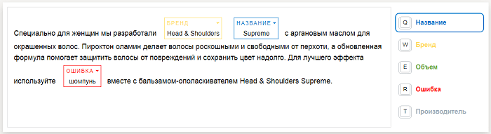

# Редактор для сегментации текста



Справочник по настройке интерфейса описывает работу редактора HTML/JS/CSS. Вы также можете попробовать создать редактор для сегментации текста в [Конструкторе шаблонов](../../../template-builder/reference/field.text-annotation.md)[Template Builder](../../../../en/docs/template-builder/reference/field.text-annotation.md).



Исполнители могут размечать текст при помощи редактора в веб-версии Толоки. Вы помещаете текст в редактор, а исполнитель выделяет отдельные слова и целые фразы, а потом — размечает их подходящими тегами.



Редактор для сегментации текста не работает на мобильных устройствах.



Чтобы задание было доступно только исполнителям, которые заходят из браузеров, нужно добавить фильтр **Клиент****Client** и выбрать **Веб-версия Толоки****Toloka web version**. Так исполнители не увидят задание в мобильных приложениях, но смогут зайти из мобильного браузера. Чтобы запретить выполнять задания из мобильных браузеров, добавьте еще один фильтр **Категория устройства****Device type** = **Персональный компьютер****Personal computer**.

## Что может редактор {#what}

Редактор поддерживает 10 цветов для [тегов-категорий](#adding_editor). Можно добавлять и больше 10-ти тегов, но тогда цвета начнут повторяться. Первый из указанных вами тегов активен.

Рисунок 1. Пример работы в редакторе





Подумайте над [декомпозицией задания](../../concepts/solution-architecture.md). Чем больше тегов, тем сложнее инструкция и процесс проверки ответов.



## Как настроить {#whats-inside}

Чтобы исполнители могли пользоваться редактором, подключите библиотеки, добавьте JS-код и стили CSS.



Если вы используете пустой шаблон:

1. На странице редактирования проекта в блоке **Интерфейс задания** нажмите 

1. В блоке **Библиотеки **добавьте:

    - JS `toloka-handlebars-templates.js`

    - JS `https://yastat.net/s3/toloka/presets/TemplateVideoModeration/494c560d-0f4e-4e71-928f-5d9710522893.js`

    - CSS `https://yastat.net/s3/toloka/presets/TemplateVideoModeration/26a20e48-5dfb-4acc-abbf-a8ab7d91bf3f.css`

1. В блок **Спецификация** добавьте поля, которые использует редактор:

    - Во входные данные добавьте поле `input` с типом **строка**.

    - В выходные данные добавьте поля `result` с типом **json** и `text_review_mode` с типом **массив json**.

1. В блоке HTML добавьте компонент: `not_var{{textAnnotationInterface input tagsData}}`

1. Добавьте код в блоке JS: 

    ```javascript
    var tagsData = [
    {
    'tag_color': 'Синий',
    'tag_name': 'Название',
    'tag_hotkey': 'q'
    },
    {
    'tag_color': 'Желтый',
    'tag_name': 'Бренд',
    'tag_hotkey': 'w'
    },
    {
    'tag_color': 'Зеленый',
    'tag_name': 'Объем',
    'tag_hotkey': 'e'
    },
    {
    'tag_color': 'Красный',
    'tag_name': 'Ошибка',
    'tag_hotkey': 'r'
    },
    {
    'tag_color': 'Серый',
    'tag_name': 'Производитель',
    'tag_hotkey': 't'
    }
    ];

    function extend(ParentClass, constructorFunction, prototypeHash) {
    constructorFunction = constructorFunction || function () {};
    prototypeHash = prototypeHash || {};
    if (ParentClass) {
    constructorFunction.prototype = Object.create(ParentClass.prototype);
    }
    for (var i in prototypeHash) {
    constructorFunction.prototype[i] = prototypeHash[i];
    }
    return constructorFunction;
    }

    exports.Task = extend(TolokaHandlebarsTask, function(options) {
    TolokaHandlebarsTask.call(this, options);
    }, {
    getTemplateData: function() {
    var data = TolokaHandlebarsTask.prototype.getTemplateData.apply(this, arguments);
    data.tagsData = updateTagsData(tagsData);

    return data;
    },
    onRender: function() {
    var tagsData = this.getTask().input_values.tagsData;
    createTextAnnotationInterface.call(this, tagsData);
    },
    addError: function(message, field, errors) {
    errors || (errors = {
    task_id: this.getOptions().task.id,
    errors: {}
    });
    errors.errors[field] = {
    message: message
    };

    return errors;
    },

    validate: function(solution) {
    var errors = null;

    // Если не выделено ни одного слова, показываем сообщение об ошибке.

    if (Object.keys(solution.output_values).length === 0 || Object.keys(solution.output_values.result).length === 0) {
    errors = this.addError('Выделите хотя бы одно слово', '__TASK__', errors);
    }

    return errors || TolokaHandlebarsTask.prototype.validate.call(this, solution);
    },
    onDestroy: function() {
    // Задание завершено, можно освобождать (если были использованы) глобальные ресурсы
    }
    });
    ```

    

    ```javascript
    var tagsData = [
    {
    'tag_color': 'Blue',
    'tag_name': 'Name',
    'tag_hotkey': 'q'
    },
    {
    'tag_color': 'Yellow',
    'tag_name': 'Brand',
    'tag_hotkey': 'w'
    },
    {
    'tag_color': 'Green',
    'tag_name': 'Volume',
    'tag_hotkey': 'e'
    },
    {
    'tag_color': 'Red',
    'tag_name': 'Error',
    'tag_hotkey': 'r'
    },
    {
    'tag_color': 'Gray',
    'tag_name': 'Manufacturer',
    'tag_hotkey': 't'
    }
    ];

    function extend(ParentClass, constructorFunction, prototypeHash) {
    constructorFunction = constructorFunction || function () {};
    prototypeHash = prototypeHash || {};
    if (ParentClass) {
    constructorFunction.prototype = Object.create(ParentClass.prototype);
    }
    for (var i in prototypeHash) {
    constructorFunction.prototype[i] = prototypeHash[i];
    }
    return constructorFunction;
    }

    exports.Task = extend(TolokaHandlebarsTask, function(options) {
    TolokaHandlebarsTask.call(this, options);
    }, {
    getTemplateData: function() {
    var data = TolokaHandlebarsTask.prototype.getTemplateData.apply(this, arguments);
    data.tagsData = updateTagsData(tagsData);

    return data;
    },
    onRender: function() {
    var tagsData = this.getTask().input_values.tagsData;
    createTextAnnotationInterface.call(this, tagsData);
    },
    addError: function(message, field, errors) {
    errors || (errors = {
    task_id: this.getOptions().task.id,
    errors: {}
    });
    errors.errors[field] = {
    message: message
    };

    return errors;
    },

    validate: function(solution) {
    var errors = null;

    // If no words are selected, we show an error message.

    if (Object.keys(solution.output_values).length === 0 || Object.keys(solution.output_values.result).length === 0) {
    errors = this.addError('Select at least one word', '__TASK__', errors);
    }

    return errors || TolokaHandlebarsTask.prototype.validate.call(this, solution);
    },
    onDestroy: function() {
    // The task is completed, you can release global resources (if you used them)
    }
    });
    ```

    

1. В блоке CSS добавьте стили: 

    ```css
    /* Задание на странице */
    .task {
    display: block;
    max-width: 1200px;
    margin: 20px auto;
    font-size: 18px;
    }

    .task-suite {
    height: 100%;
    }

    /* Отображение задания на мобильных устройствах */
    @media screen and (max-width: 767px) {
    .task {
    border: none;
    }

    .task_focused {
    box-shadow: none;
    -webkit-box-shadow: none;
    }
    }
    ```

    

    ```css
    /* Task on the page */
    .task {
    display: block;
    max-width: 1200px;
    margin: 20px auto;
    font-size: 18px;
    }

    .task-suite {
    height: 100%;
    }

    /* Task display on mobile devices */
    @media screen and (max-width: 767px) {
    .task {
    border: none;
    }

    .task_focused {
    box-shadow: none;
    -webkit-box-shadow: none;
    }
    }
    ```

    

1. Нажмите кнопку **Предпросмотр** и посмотрите, что получилось.



## Описание тегов {#adding_editor}

Для сегментации текста в редакторе используются теги-категории. У каждого тега есть три параметра:

- tag_color — в какой цвет будет перекрашен текст. Редактор поддерживает 10 цветов для тегов.

- tag_name — в какую категорию нужно отнести выделенный текст.

- tag_hotkey — на какую кнопку нажать, чтобы было быстрее.



- Синий — **Q**.
- Желтый — **W**.
- Зеленый — **E**.
- Серый — **T**.
- Красный — **R**.
- Коричневый — **Y**.
- Фиолетовый — **U**.
- Оранжевый — **I**.
- Розовый — **A**.
- Бирюзовый — **S**.



Вы можете менять цвет тега, название и назначенную горячую клавишу. Список цветов менять нельзя — он зашит в js-библиотеку редактора для выделения текста.





```javascript
var tagsData = [
  {
    'tag_color': 'Синий',
    'tag_name': 'Название',
    'tag_hotkey': 'q'
  },
  {
    'tag_color': 'Желтый',
    'tag_name': 'Бренд',
    'tag_hotkey': 'w'
  },
  {
    'tag_color': 'Зеленый',
    'tag_name': 'Объем',
    'tag_hotkey': 'e'
  },
  {
    'tag_color': 'Красный',
    'tag_name': 'Ошибка',
    'tag_hotkey': 'r'
  },
  {
    'tag_color': 'Серый',
    'tag_name': 'Производитель',
    'tag_hotkey': 't'
  },
  {
    'tag_color': 'Коричневый',
    'tag_name': 'Название',
    'tag_hotkey': 'y'
  },
  {
    'tag_color': 'Фиолетовый',
    'tag_name': 'Бренд',
    'tag_hotkey': 'u'
  },
  {
    'tag_color': 'Оранжевый',
    'tag_name': 'Объем',
    'tag_hotkey': 'i'
  },
  {
    'tag_color': 'Розовый',
    'tag_name': 'Ошибка',
    'tag_hotkey': 'a'
  },
  {
    'tag_color': 'Бирюзовый',
    'tag_name': 'Производитель',
    'tag_hotkey': 's'
  }
];
```



```javascript
var tagsData = [
  {
    'tag_color': 'Blue',
    'tag_name': 'Name',
    'tag_hotkey': 'q'
  },
  {
    'tag_color': 'Yellow',
    'tag_name': 'Brand',
    'tag_hotkey': 'w'
  },
  {
    'tag_color': 'Green',
    'tag_name': 'Volume',
    'tag_hotkey': 'e'
  },
  {
    'tag_color': 'Red',
    'tag_name': 'Error',
    'tag_hotkey': 'r'
  },
  {
    'tag_color': 'Gray',
    'tag_name': 'Manufacturer',
    'tag_hotkey': 't'
  },
  {
    'tag_color': 'Brown',
    'tag_name': 'Name',
    'tag_hotkey': 'y'
  },
  {
    'tag_color': 'Violet',
    'tag_name': 'Brand',
    'tag_hotkey': 'u'
  },
  {
    'tag_color': 'Orange',
    'tag_name': 'Volume',
    'tag_hotkey': 'i'
  },
  {
    'tag_color': 'Pink',
    'tag_name': 'Error',
    'tag_hotkey': 'a'
  },
  {
    'tag_color': 'Turquoise',
    'tag_name': 'Manufacturer',
    'tag_hotkey': 's'
  }
];
```





## Входные и выходные данные {#data-platforms}

Выходные поля редактора в спецификации нужно сделать необязательными, потому что в JS заложена проверка, что выделено хотя бы одно слово и у него есть тег. Отправить задание без разметки у исполнителя не получится.

В редакторе используются:

- Поле `input` с типом «строка», куда подставляется текст для разметки.

- Поле `result` в формате JSON. Через него вы получаете информацию о результате выполнения задания.

- Поле `text_review_mode` — техническое. Оно нужно, чтобы в режиме проверки задания отображались теги.

Когда [размечаете](../../concepts/task_markup.md) контрольные и обучающие задания в интерфейсе Толоки, отмечайте галочками все поля выходных данных. Иначе выделенные тегами слова в нем не отобразятся.



Не меняйте названия полей входных и выходных данных, иначе редактор не будет работать.



## Как работать с редактором {#how-to}

Используйте эту информацию для инструкции к заданию. Пусть исполнители поймут все сразу:

- Если выделить фразу, то она отметится активным тегом.

- Если текст относится к другой категории, нажмите стрелочку в рамке выделенного слова или фразы и выберите новый тег из списка.

- Выделение можно убрать: нажать значок крестика в правом верхнем углу.

