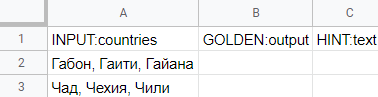

# Поле для ввода строки с саджестом





Саджест — это текстовые подсказки, которые отображаются, когда исполнитель устанавливает курсор в поле ввода строки. Подсказки могут быть:

- одинаковыми во всех заданиях;
- своими в каждом задании.



- Одинаковые подсказки

  1. Задайте массив строчек-подсказок в блоке **JS** (метод `getTemplateData`), чтобы включить его в набор [входных данных](../../../glossary.md#input-output-data)[проекта](../../../glossary.md#project):

      

      

      ```javascript
      exports.Task = extend(TolokaHandlebarsTask, function (options) {
      TolokaHandlebarsTask.call(this, options);
      }, {
      getTemplateData: function() {
      var data = TolokaHandlebarsTask.prototype.getTemplateData.apply(this, arguments);
      data. < название массива > = ['строка 1', 'строка 2', ...
      'строка n'
      ];
      return data;
      },
      onRender: function() {
      // DOM-элемент задания сформирован (доступен через #getDOMElement())
      },
      onDestroy: function() {
      // Задание завершено, можно освобождать (если были использованы) глобальные ресурсы
      }
      });

      function extend(ParentClass, constructorFunction, prototypeHash) {
      constructorFunction = constructorFunction || function () {};
      prototypeHash = prototypeHash || {};
      if (ParentClass) {
      constructorFunction.prototype = Object.create(ParentClass.prototype);
      }
      for (var i in prototypeHash) {
      constructorFunction.prototype[i] = prototypeHash[i];
      }
      return constructorFunction;
      }
      ```

      

      ```javascript
      exports.Task = extend(TolokaHandlebarsTask, function (options) {
      TolokaHandlebarsTask.call(this, options);
      }, {
      getTemplateData: function() {
      var data = TolokaHandlebarsTask.prototype.getTemplateData.apply(this, arguments);
      data. < array name > = ['string 1', 'string 2', ...
      'string n'
      ];
      return data;
      },
      OnRender: function () {
      //Generated DOM element for the task (available via #getDOMElement())
      },
      onDestroy: function () {
      //The task is completed, you can release global resources (if you used them) }
      });

      function extend(ParentClass, constructorFunction, prototypeHash) {
      constructorFunction = constructorFunction || function () {};
      prototypeHash = prototypeHash || {};
      if (ParentClass) {
      constructorFunction.prototype = Object.create(ParentClass.prototype);
      }
      for (var i in prototypeHash) {
      constructorFunction.prototype[i] = prototypeHash[i];
      }
      return constructorFunction;
      }
      ```

      

      

      

      

      ```javascript
      exports.Task = extend(TolokaHandlebarsTask, function (options) {
      TolokaHandlebarsTask.call(this, options);
      }, {
      getTemplateData: function() {
      var data = TolokaHandlebarsTask.prototype.getTemplateData.apply(this, arguments);
      data.countries = ['Poland', 'Lithuania', 'Russia', 'Belarus', 'Latvia', 'Germany', 'France'];
      return data;
      },
      onRender: function() {
      // DOM-элемент задания сформирован (доступен через #getDOMElement())
      },
      onDestroy: function() {
      // Задание завершено, можно освобождать (если были использованы) глобальные ресурсы
      }
      });

      function extend(ParentClass, constructorFunction, prototypeHash) {
      constructorFunction = constructorFunction || function () {};
      prototypeHash = prototypeHash || {};
      if (ParentClass) {
      constructorFunction.prototype = Object.create(ParentClass.prototype);
      }
      for (var i in prototypeHash) {
      constructorFunction.prototype[i] = prototypeHash[i];
      }
      return constructorFunction;
      }
      ```

      

      ```javascript
      exports.Task = extend(TolokaHandlebarsTask, function (options) {
      TolokaHandlebarsTask.call(this, options);
      }, {
      getTemplateData: function() {
      var data = TolokaHandlebarsTask.prototype.getTemplateData.apply(this, arguments);
      data.countries = ['Poland', 'Lithuania', 'Russia', 'Belarus', 'Latvia', 'Germany', 'France'];
      return data;
      },
      OnRender: function () {
      //Generated DOM element for the task (available via #getDOMElement())
      },
      onDestroy: function () {
      //The task is completed, you can release global resources (if you used them) }
      });

      function extend(ParentClass, constructorFunction, prototypeHash) {
      constructorFunction = constructorFunction || function () {};
      prototypeHash = prototypeHash || {};
      if (ParentClass) {
      constructorFunction.prototype = Object.create(ParentClass.prototype);
      }
      for (var i in prototypeHash) {
      constructorFunction.prototype[i] = prototypeHash[i];
      }
      return constructorFunction;
      }
      ```

      

      

  1. Добавьте в блок **HTML** компонент `{{field type="suggest" name="<название выходного поля>" source=<название массива>}}`. Пример:

      ```plaintext
      {{field type="suggest" name="result" source=countries allowCustomInput=true}}
      ```

- Разные подсказки

  1. Добавьте в блок **HTML** компонент `{{field type="suggest" name="<название выходного поля>" source=<название входного поля>}}`. Пример:

      ```plaintext
      {{field type="suggest" name="result" source=countries allowCustomInput=true}}
      ```

  1. Добавьте поле с типом массив строк в описании входных данных. Например:

      ```json
      {
      "counries": {
      "type": "array_string",
      "required": true
      }
      }
      ```

  1. [Экранируйте](../pool_csv.md#json) данные и добавьте их в [файл с заданиями](../../../glossary.md#tsv).

      

      

      



#### Параметры

#|
||**Параметр**|**Описание**|**Обязательный**|**Значение по умолчанию**||
||`type` | Тип поля: `suggest` — поле для ввода строки с подсказками. | да | нет||
||`name` | Атрибут для поля выходных данных. Содержит имя поля выходных данных. | да | нет||
||`source` | Название массива строк с подсказками. Например: `source=countries`. Массив определяется в JS-коде проекта (метод `getTemplateData`). | да | нет||
||`allowCustomInput` | Возможность для исполнителя игнорировать подсказки и ввести свою строку. | нет | `false`||
||`validation-show` | Расположение всплывающих подсказок (отображаются, если ответ не прошел валидацию). Расположение указывается относительно поля ввода.

Допустимые значения:

- Над полем ввода: `"top-left"` (слева), `"top-center"` (посередине), `"top-right"` (справа).

- Под полем ввода: `"bottom-left"` (слева), `"bottom-center"` (посередине), `"bottom-right"` (справа).

- Слева от поля ввода: `"left-top"` (сверху), `"left-center"` (посередине), `"left-bottom"` (внизу).

- Справа от поля ввода: `"right-top"` (сверху), `"right-center"` (посередине), `"right-bottom"` (внизу).

- Не показывать сообщение (`"false"`). | нет | `"top-left"`||
||`placeholder` | Текст, отображаемый в пустом поле ввода.



Если указано значение `value`, в поле ввода отображается `value`, а не `placeholder`.



| нет | нет||
||`hotkey` | Горячая клавиша для наведения фокуса на поле. | нет | нет||
||`value` | Значение, которое нужно записать в ответы, если исполнитель не заполнил поле.



Значение `value` отображается в пустом поле ввода вместо `placeholder`.



| нет | нет||
||`class` | CSS-класс для поля. Например: `class="mytask_field"`. | нет | `".field" ".field_type_suggest"`||
|#

