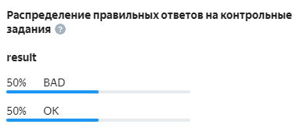
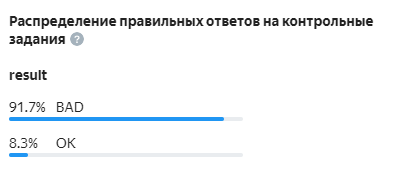

# Самостоятельная разметка

Вы можете сделать основное задание [контрольным](../../glossary.md#control-task-ru), указав правильный ответ, или [обучающим](../../glossary.md#training-task-ru), добавив правильный ответ и подсказку.

#### Какой должна быть хорошая подсказка?

Избегайте формулировок формата: <q>Вы ответили неправильно, ответьте правильно</q>. Исполнитель ничему не научится, если текст в подсказках не будет пояснять суть ошибки.

Подсказки следует делать понятными, объяснять, какой именно ответ надо выбрать и почему.




## Как разметить задания {#section_czh_fj2_ghb}

1. Убедитесь, что пул не запущен.
1. Нажмите кнопку **Разметить****Edit** в блоке **Задания пула****Pool tasks**.
1. Перейдите на вкладку **Основные**, **Контрольные** или **Обучающие**. Создайте контрольное или обучающее задание из задания другого типа.
1. Отметьте ответы, которые нужно учитывать при проверке. (Справа приведен список [полей с выходными данными](incoming.md).)
1. Нажмите кнопку **Сохранить и перейти к следующему**.

#### Пример разметки задания

В примере добавлен правильный ответ для контрольного задания. При проверке будет учитываться только выбор в поле `result` (Хорошее / Плохое / Ошибка загрузки).

## Повысить надежность контрольных заданий {#answer_distribution}

После того, как вы создали контрольные задания, убедитесь, что различные варианты правильных ответов встречаются в равной степени. Это поможет избежать случайное угадывание ответов со стороны исполнителей.

1. Перейдите на страницу разметки задания.
1. Откройте вкладку .
    Распределение ответов указано в процентах.




При составлении контрольных заданий в качестве правильных указывайте только ответы по существу. Так, для задания, в котором нужно распределить изображения по категориям, вариант **Ошибка загрузки изображения** не будет считаться ответом по существу.




#### Пример распределения ответов

#### Правильно

#### Неправильно


## Как редактировать задания {#task-edit}

1. Убедитесь, что пул не запущен.
1. Нажмите кнопку **Разметить** в блоке **Задания пула**.
1. Перейдите на вкладку, которая соответствует типу задания.
1. Найдите задание в списке и нажмите значок  . Вам откроется режим редактирования.

## Как удалить задание из пула {#delete-task}

1. Убедитесь, что пул не запущен.
1. Нажмите кнопку **Разметить** в блоке **Задания пула**.
1. Перейдите на вкладку, которая соответствует типу задания.
1. Найдите задание в списке и нажмите значок . Также задание можно удалить из пула в [режиме редактирования](#task-edit).



Если [через API]({{ toloka-api-stop-assigning-tasks }}) настроить перекрытие равное 0, то задание можно не удалять, так как оно будет не видно исполнителям.




## Что дальше {#what_next}

- [Добавьте обучающий пул](train.md).
- 
    [Пополните счет](refill.md)
    
    Пополните счет:
    - [Инструкция для резидентов РФ](refill-russia.md).
    - [Инструкция для нерезидентов](refill.md).
    
- [Запустите пул](pool-run-and-stop.md).
- 
- Прочитайте [статью]({{ toloka-blog-task-markup }}) о создании контрольных и обучающих заданий.
- 


## Решение проблем {#troubleshooting}

#### Загрузка заданий в пул

#### Ошибки при загрузке заданий в пул

#### Как посмотреть лог обработки

Чтобы посмотреть лог обработки, нажмите **Подробнее об ошибках загрузки**. Лог обработки записан в формате JSON. Объекты внутри `result` соответствуют номеру строки загружаемого файла. Строки, обработанные с ошибкой, имеют статус `"success": false`.


Работать с большим логом удобнее, если скопировать его в текстовый редактор.



#### Ошибки в заголовках столбцов

Если [заголовки столбцов](pool_csv.md) некорректны, файл будет полностью отклонен. В остальных случаях указано количество заданий с ошибками обработки.

#### Таблица ошибок обработки

Описание | Как исправить
----- | -----
``` "parsing_error_of": "https://tlk.s3.yandex.net/wsdm2020/photos/2d5f63a3184919ce7e3e7068cf93da4b.jpg\t\t", "exception_msg": "the nameMapping array and the sourceList should be the same size (nameMapping length = 1, sourceList size = 3)" ```
**Лишние знаки табуляции.**<br/><br/>Если в загружаемом файле после данных или ссылки стоит количество разделителей столбцов `\t` больше, чем задано число столбцов во [входных данных](../../glossary.md#input-output-data-ru), то появится сообщение об ошибке.<br/><br/>Например, когда во входных определен 1 столбец, а в файле после ссылки прописано ещё два знака табуляции `\t\t`, то получится 3 столбца, 2 из которых лишние. | Удалите лишние разделители столбцов, в приведенном выше примере ошибки — оба знака (`\t\t`).
``` "exception_msg": "the nameMapping array and the sourceList should be the same size (nameMapping length = 4, sourceList size = 6)" ```
**Не совпадает количество полей в заголовке и в строке.** | Проверьте, что:<br/><br/>- указано верное количество знаков табуляции в структуре файла;<br/>- строковые значения, содержащие знак табуляции, заключены [в кавычки](pool_csv.md#string)`" "`.
``` "code": "VALUE_REQUIRED", "message": "Value must be present and not equal to null" ```
**Не указано значение обязательного поля входных данных.** | Проверьте, что заполнены все столбцы с обязательными полями входных данных.
``` "code": "INVALID_URL_SYNTAX", "message": "Value must be in valid url format" ```
**Данные в поле с типом <q>ссылка</q> (<q>url</q>) некорректны.** | Проверьте, что:<br/>- Все ссылки начинаются с префикса `http://`, `https://` или `www`.<br/>- <br/>- При [загрузке файла с Яндекс Диска](prepare-data.md) по относительной ссылке, указан тип данных **строка** для [поля входных данных](incoming.md).<br/>- 
``` "exception_msg": "unexpected end of file while reading quoted column beginning on line 2 and ending on line 4" ```
**В строке стоит непарная кавычка.** | Проверьте, что все кавычки [экранированы](pool_csv.md#string).

#### Как понять сколько заданий будет на странице у исполнителя?

Вы можете указать сколько заданий будет на странице при загрузке заданий в пул. Подробнее о способах распределения заданий по страницам можно узнать [здесь](distribute-tasks-by-pages.md).

#### Как загрузить файл с принятыми решениями обратно в Толоку для случая, когда выставлена отложенная приемка? Где описан формат загружаемых данных?

Для загрузки файла используйте кнопку **Загрузить результаты**. Формат можно посмотреть [здесь](accept.md).

Проверка ответов выполняется в файле с заданиями.

#### Почему после запуска первого проекта не приходят ответы и все загруженные задания отмечаются как "Обучающие"?

Проверьте поле `hint`. Для обычных заданий это поле должно быть пустым.

#### Как правильно сформировать файл задания, чтобы не было ошибок?

В файле с основными заданиями должны быть заполнены столбцы с заголовками `INPUT`. Вы можете увидеть эти заголовки, если скачаете образец файла из пула.

Если создаете контрольные задания, то заполните столбцы с правильными ответами — `GOLDEN`.

Если обучающие, то также понадобится заполнить столбец `HINT:text`. Для основных заданий все столбцы кроме `INPUT` не нужны, их можно удалить.

Формат файла должен быть TSV, XLSX или JSON, кодировка — UTF-8.
 
Если вы разместили файлы на Яндекс Диске, посмотрите видео, [как указать ссылки на них в файле с заданиями](https://youtu.be/hIJ6IGaDgeU).

Подробнее о создании файла в [Руководстве](pool_csv.md). Если при загрузке возникают ошибки, поищите вашу ошибку на этой [странице](task_upload.md).

#### Почему при загрузке задания, в котором нужно просмотреть изображение и написать фидбэк, появляется ошибка синтаксиса?

Ошибка будет возникать, если на вход ожидается тип URL, а приходит строка.

Причин может быть две:
- Входное поле имеет тип "ссылка".
- Пул работает на неактуальной версии проекта. То есть создан до того, как вы изменили тип входного поля.

#### Какое максимальное количество заданий может быть на одной странице?

Зависит от задания. Технически можно много.

Но, во-первых, исполнители неохотно берутся за задания, которые требуют много времени на выполнение. То есть, они скорее сделают 10 заданий по одной минуте, чем одно задание на 10 минут.

Во-вторых, при большом количестве заданий на странице может быть проблема с загрузкой файлов для разметки. Например, картинок.

Третий момент — контроль качества и оценка выполнения всей страницы. Если вы используете дооценку заблокированных исполнителей, то лучше дробить задание на более мелкие части, чтобы в переразметку отправлялось меньше заданий. Это позволит уложиться в бюджет.

#### Как в интерфейсе при загрузке файла указываются настройки умного смешивания?

Настройки умного смешивания указываются для файла — не для пула.

При первой загрузке файла указанные настройки будут применяться для всех файлов, загруженных в дальнейшем в этот пул.

#### Как определить время на выполнение задания?
Попробуйте выполнить задания сами, попросите своих друзей и коллег. Найдите среднее время выполнения и добавьте к нему 50%.
#### Чем отличаются task и task_suite?

Task — это отдельное задание. Task suite — страница с заданиями. Исполнитель получает оплату за страницу заданий.

#### Одно и то же задание попало на разные страницы

Одно и то же задание может попасть на разные страницы, если:

- Существует динамическое перекрытие (incremental relabeling, IRL). Например на странице было 5 заданий, по 4-м из них ответы согласовались так, что общий ответ зачелся как верный. Пятое задание будет замешано в другой набор, поскольку оно не попало в финальный ответ и его необходимо <q>дооценить</q>.
- У разных заданий существует разное перекрытие. Те задания, у которых перекрытие указано больше, будут дополнительно показываться в наборах с другими оставшимися заданиями в пуле.
- Если [правило контроля качества](../../glossary.md#quality-control-rules-ru) меняет перекрытие у задания, то оно окажется в другом наборе.

#### Сколько заданий должно быть на странице?

Количество заданий зависит от сложности и длительности выполнения. Не делайте страницы заданий слишком большими: они неудобны для исполнителей (например, при сбоях в соединении с интернетом) и не пользуются спросом.

#### Сколько контрольных заданий нужно добавлять?

Рекомендуем добавлять не менее 1% контрольных заданий в пул. А для маленьких пулов — 5–10%.

#### Почему так

Все контрольные задания показываются исполнителю только один раз. Если вы используете умное смешивание, то определяете, сколько контрольных заданий должно быть на каждой странице. Если на странице одно контрольное задание, то максимальное число страниц, которое может выполнить исполнитель, равно количеству контрольных заданий в пуле. Если вы увеличиваете количество контрольных заданий на странице, во столько же раз снижается число доступных исполнителю страниц.

Доступных страниц не должно быть слишком мало. Иначе:

- правильно оценить качество его ответов не получится;
- исполнитель не будет заинтересован выполнять такие задания, так как потратит много времени на изучение инструкций, а получит мало заработка.

#### Пример

#### Большой пул 1% контрольных заданий (хорошо)

В пуле 10 000 заданий, из них 100 контрольных (1%). На одной странице 10 заданий, из них 1 контрольное. Следовательно, один исполнитель может сделать до 100 страниц.

#### Маленький пул 1% контрольных заданий (плохо)

В пуле 100 заданий, из них 1 контрольное (1%). На одной странице 10 заданий, из них 1 контрольное. Следовательно, один исполнитель может сделать только 1 страницу.

#### Маленький пул 10% контрольных заданий (хорошо)

В пуле 100 заданий, из них 10 контрольных (10%). На одной странице 10 заданий, из них 1 контрольное. Следовательно, один исполнитель может сделать до 10 страниц.

Если в открытом пуле мало контрольных заданий, [добавьте новые контрольные задания](#add-gs).

#### Зачем

Если пул большой, а контрольных заданий мало, может сложиться ситуация, что активным исполнителям, которые сделали много заданий в проекте, перестают показываться новые страницы с заданиями. Это происходит, когда исполнитель выполнил все контрольные задания в пуле.



Чтобы отсеивать исполнителей, используйте блок контроля качества [Контрольные задания](control.md). Чтобы ранжировать исполнителей по качеству ответов на контрольные задания, используйте [навык](nav.md).




#### Как засчитываются правильные ответы на контрольные вопросы?

Правило контрольных заданий начинает действовать после того, как исполнитель дал ответы на заданное число контрольных заданий. Если у вас в пуле есть и [обучающие](../../glossary.md#training-task-ru), и контрольные задания, то вы можете установить учитывать ответы на те и другие (параметр **Количество ответов**) или только на контрольные (параметр **Количество контрольных ответов**).

Как только нужное количество ответов набрано, Толока подсчитывает процент правильных и неправильных ответов и выполняет действие (назначить навык, заблокировать в пуле или на проекте). Далее этот процент обновляется по мере выполнения заданий исполнителем. Количество последних ответов исполнителя, которое учитывается в расчете, задается в поле **Учитывать последних ответов на контрольные и обучающие задания**. Если оставить его пустым, будут учитываются все ответы исполнителя в пуле.

