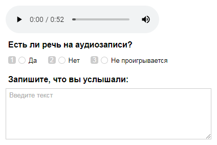
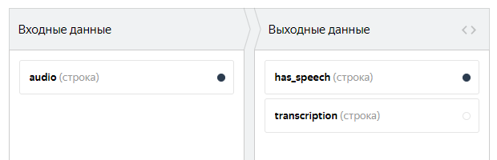
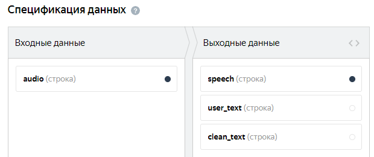
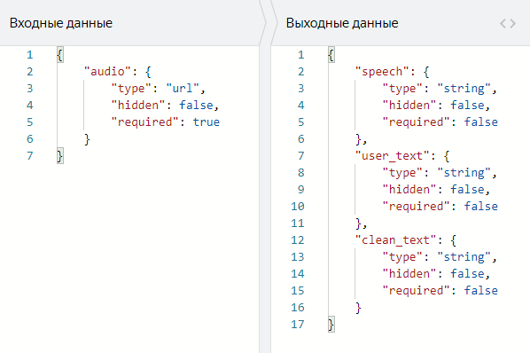
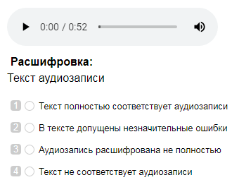

# Транскрипция аудио



Сначала запустите проект в [Песочнице]({{ sandbox }}). Так вы сможете избежать ошибок и потраченных средств, если окажется, что ваше задание не работает.



Вы можете публиковать задания для расшифровки небольших аудиозаписей. Желательно, чтобы в одном [пуле](../../glossary.md#pool-ru) записи были одинаковой длины.

Возможно, для вашего задания нужны дополнительные проекты, например предварительная проверка датасета или проверка ответов исполнителей. Подробнее об этом читайте в разделе [Декомпозиция задания](solution-architecture.md).

Предположим, вам нужно расшифровать аудиозапись. Для этого создадим такое задание: исполнителю будет предложена аудиозапись во встроенном плеере, и он должен набрать текст, который услышит на записи.

#### Пример готового задания

Чтобы запустить задания и получить ответы:

1. [Создайте проект](#project)
1. [Добавьте пул заданий](#pool)
1. [Загрузите задания](#tasks_upload)
1. [Настройте контроль качества](#quality_control)
1. [Запустите пул и получите результаты](#launch)
1. [Поручите проверку исполнителям](#peer-review)

## Создайте проект {#project}



#### В интерфейсе:

1. 

1. Заполните общую информацию:

    1. Дайте проекту понятное название и краткое описание. Их увидят исполнители в списке доступных заданий.

    1. По желанию добавьте **Приватный комментарий**.

    1. Нажмите **Сохранить**.

1. 

    #### Конструктор шаблонов

    1. 

    В шаблоне уже настроена проверка, прослушано ли аудио целиком. Исполнитель не сможет отправить задание, не прослушав аудиозапись. [Подробнее о настройке условий]({{ tb-conditions }}) в конструкторе шаблонов.

    Чтобы посмотреть, как еще можно настроить этот шаблон, перейдите на страницу [Транскрипция аудио]({{ tb-audio-transcript }}) в Справке конструктора шаблонов.

    1. Нажмите **Показать спецификации**, чтобы увидеть поля входных и выходных данных.

    Поля входных данных создаются из кода на вкладке **Пример входных данных**.

    Поля выходных данных создаются на основе того, в каких компонентах используется `data.output`, а также какие значения в нем разрешены.

    Подробнее о [полях входных и выходных данных]({{ tb-create-specs }}) в конструкторе шаблонов.

    - Измените тип данных на строку, чтобы использовать ссылки на свои файлы или [загружать аудиофайлы](prepare-data.md#interface), хранящиеся на Яндекс Диске.

    - Поля выходных данных:
    - строка `has_speech`, в которую будет записано значение поля **Есть ли речь на аудиозаписи?**;
    - строка `transcription`, в которую будет записан введенный исполнителем текст.

    

    #### Что такое входные и выходные данные?

    

    

    

    1. 

    #### Редактор HTML/CSS/JS

    1. 

    

    Блок JavaScript оставьте без изменений. В нем настроена проверка, прослушано ли аудио целиком. Исполнитель не сможет отправить задание, не прослушав аудиозапись.

    1. Шаблон включает в себя поля входных и выходных данных:

    - Поле входных данных — ссылка `audio` на аудиофайл. 
    Измените тип данных на строку, чтобы использовать ссылки на свои файлы или [загружать аудиофайлы](prepare-data.md#interface), хранящиеся на Яндекс Диске.
    
    - Поля выходных данных:
    - строка `speech`, в которую будет записано значение поля **Есть ли речь на аудиозаписи?**;
    - строка `user_text`, в которую будет записан введенный исполнителем текст;
    - строка `clean_text`, в которую будет записан обработанный текст (используется для проверки ответов с помощью контрольных заданий).

    #### Графический режим
    
    #### JSON
    

    #### Что такое входные и выходные данные?

    

    

    Подробнее о [полях входных и выходных данных](incoming.md).

    Используйте готовый список полей или настройте его под свои задачи. Если вы добавили в шаблон задания элементы интерфейса, создайте для них поля в блоке **Спецификация данных**.

    1. Нажмите кнопку  **Предпросмотр задания****Preview task**, чтобы увидеть получившееся задание.

    

    В предварительном просмотре проекта отображается одно задание со стандартными данными. Количество заданий на странице вы сможете настроить далее.

    

    1. 

1. 1. Напишите краткую и ясную инструкцию. Опишите в ней, что надо сделать, и приведите примеры.

    Вы можете подготовить инструкцию в формате HTML и вставить ее в редактор. Чтобы переключиться в режим HTML, нажмите **<>**.

    1. Нажмите **Завершить**.

## Добавьте пул заданий {#pool}

Пул — это набор оплачиваемых заданий, которые одновременно выдаются исполнителям.

1. Откройте проект и нажмите **Добавить пул**.
1. Дайте пулу любое удобное название — оно доступно только вам, исполнитель увидит название проекта.
1. В блоке **Аудитория** добавьте **Фильтры****Filters** для отбора исполнителей. Чтобы ваше задание было доступно только исполнителям, владеющим русским языком, установите фильтры **Регион по номеру телефона** и **Языки**: выберите исполнителей из России, Украины, Казахстана и Беларуси, которые в своем профиле отметили знание русского языка.
    Задания на расшифровку удобнее запускать для выполнения в веб-версии Толоки, чтобы исполнитель мог набирать текст на клавиатуре. Нажмите **Добавить фильтр**, выберите в разделе «Вычислимые данные» фильтр «Категория устройства» и укажите для него значение «Персональный компьютер».

    

1. В блоке **Цена** установите цену за [страницу заданий](../../glossary.md#task-page-ru), например, 0,05 $. Цена зависит от длительности аудиозаписи.
    #### Что такое страница заданий?

    На одной странице может отображаться одно или несколько заданий. Если задания простые, то можно добавлять 10–20 заданий на одну страницу. Не рекомендуем создавать длинные страницы, поскольку это снизит скорость загрузки данных у исполнителя.

    Исполнитель получит оплату, только если выполнил все задания на странице.

    Количество заданий на странице вы определите при [загрузке заданий](#smart-mixing).

    #### Как определить справедливую цену?

    Общее правило формирования цены — чем больше времени исполнитель тратит на выполнение, тем выше цена.

    Вы можете зарегистрироваться в Толоке как исполнитель и узнать, сколько платят другие заказчики за задания.

1. В блоке **Контроль качества** установите **Перекрытие****Overlap** — количество исполнителей, которые должны выполнить задание. Для расшифровки речи, как правило, 1.
1. В блоке **Контроль качества** включите опцию **Отложенная приемка** и укажите количество дней на проверку для параметра **Срок проверки**. Например, 7.
    #### Что такое отложенная приемка?

    [Отложенная приемка](offline-accept.md) позволяет вам просматривать [выполненные страницы заданий](../../glossary.md#submitted-answers-ru) перед тем, как принять их и заплатить исполнителю. Задания, выполненные в несоответствии с инструкцией, можно отклонять. Максимальный срок проверки устанавливается в поле **Срок проверки**.

1. В блоке **Дополнительные настройки** укажите **Время****Time** на выполнение страницы заданий. Его должно быть достаточно, в том числе для чтения инструкции, загрузки задания, прослушивания аудиозаписи и набора текста. Например, 1200 секунд.
1. Сохраните пул.

## Загрузите задания {#tasks_upload}



1. Нажмите кнопку **Загрузить**. В открывшемся окне вы можете скачать шаблон файла с заданиями.
1. Добавьте в файл входные данные. Заголовок столбца с входными данными содержит слово `INPUT`. В качестве значений укажите URL-ссылки на свои файлы. Если ссылок нет, рекомендуем выложить файлы на [Yandex Cloud](use-object-storage.md).
    
    Для работы с файлами на Яндекс Диске потребуется немного изменить проект и спецификацию. Укажите тип данных **строка** для поля входных данных `audio`, в котором вы будете передавать ссылку на файл. В блоке HTML добавьте в аудиоплеер `proxy` перед названием входного поля `audio`: `src="{{proxy [audio](usecases-keys.md#image)}}"`. Формат ссылок при использовании Яндекс Диска `<уникальное имя>/audio1.mp3`, где уникальное имя — название вашего прокси.
    
1. Загрузите задания, выбрав **Указать вручную****Set manually** и установив, например, 4 задания на странице. Это значит, что на одной странице будет 4 аудиозаписи, под каждой аудиозаписью текстовое поле для расшифровки.
1. Нажмите кнопку **Добавить** — ваши задания загружены в пул.

## Настройте контроль качества {#quality_control}

[Блоки контроля качества](control.md) позволяют отсеивать невнимательных исполнителей. Контроль качества можно настраивать как в проекте, так и в пуле.



Настройки контроля качества в проекте будут действовать во всех пулах проекта, и изменить их настройку в одном из пулов будет невозможно.



1. 

1. Добавьте блок **Быстрые ответы**.
    Значение параметра **Минимальное время на страницу** зависит от двух характеристик: количества заданий на этой странице и длины записей. В примере мы задаем 4 задания, а длина записей неизвестна. Прикидываем адекватный порог для правила.

    Делаем скидку на технические ошибки, например, не загрузилось и не проигралось несколько записей. Исполнитель быстро отправит ответы к такому заданию и это не будет ошибкой. Давайте добавим два правила.

    - Одно — чтобы отлавливать ботов. Задаем 10-15 секунд на ответ. Блокируем после 2-х быстрых ответов.

    Это означает, что если исполнитель выполнит 2 и более страницы с заданиями быстрее, чем за 10 секунд, он будет заблокирован и не сможет больше выполнять ваши задания 10 дней.

    - Со вторым правилом будем исключать тех, кто несерьезно относится к заданию, невнимательно перепечатывает текст, допускает ошибки или пропускает слова. Параметр **Минимальное время на страницу заданий** тут зависит от длины записей и от того, сколько их на странице, а также от того, насколько сложно записать текст (плохо слышно, есть термины, особенности записи транскрипции и т.п.). Блокируем, как минимум, после 3-х быстрых ответов.

    Это означает, что если исполнитель даст минимум 3 ответа быстрее, чем за 30 секунд, он будет заблокирован и не сможет больше выполнять ваши задания 5 дней.

1. Добавьте блок **Контрольные задания****Control tasks**, чтобы отсеять исполнителей, которые часто ошибаются.

    

    Добавляйте контрольные ответы при выполнении двух условий:

    - перекрытие вашего пула больше 1;
    - у вас выключена [Отложенная приемка](offline-accept.md).

    

    #### Как создать файл с контрольными заданиями

    1. Для создания контрольных заданий [разметьте задания](task_markup.md) в интерфейсе.

    2. При разметке поставьте галочку, что нужно учитывать поля `clean_text` и `speech` (не ставьте галочку для `user_text`). Поле `clean_text` сравнивает с ответом обработанный результат исполнителя, чтобы избежать ошибок из-за лишних пробелов, больших букв, запятых и т.п.

    1. Нажмите **Добавить блок контроля качества****Add Quality Control Rule**.

    1. Найдите в списке блок **Правила****Rules** и выберите пункт **Контрольные задания****Control tasks**.

    1. Задайте правило для контрольного задания: если **количество ответов****number of responses** на контрольные вопросы **≥ 3** и **процент правильных ответов****correct responses (%)** на контрольные вопросы **< 60**, то **заблокировать****ban** исполнителя **на проекте на 10 дней****on project****10 days**. В качестве причины укажите **Контрольное задание**.

    Это означает, что если исполнитель выполнил более трех контрольных заданий и дал неправильные ответы более чем в 60% из них, он будет заблокирован и не сможет выполнять задания на этом проекте в течение 10 дней.

1. Добавьте правило контроля качества **Результаты проверки****Review results** и укажите следующие значения:
1. Добавьте [Обработку отклоненных и принятых заданий](reassessment-after-accepting.md). Когда значение перекрытия "1", стоит отправить задания в пул снова — на переделку другим исполнителям.
1. Создайте навык. Это пригодится в том случае, если вы будете создавать отдельный проект для проверки ответов другими исполнителями. Перейдите на страницу **Skills****Навыки**, нажмите кнопку **+Add skill****+Добавить навык** и укажите название навыка, например «Расшифровщик».
    #### Что такое навык?
    [Навык](nav.md) — это оценка какого-либо аспекта работы исполнителя (число от 0 до 100). Навык может начисляться исполнителю за правильные ответы на [контрольные задания](goldenset.md), а также назначаться произвольно.
    Вы можете использовать значение навыка при [отборе исполнителей](filters.md#nav).

1. Добавьте блок **Выполненные задания****Submitted answers** и укажите следующие значения:

## Запустите пул и получите результаты {#launch}

1. Запустите пул, нажав кнопку .
1. Следите за выполнением в блоке **Статистика пула**.
1. Как только получены первые результаты, вы можете начинать [проверку](accept.md). По истечении установленного срока все ответы будут автоматически приняты вне зависимости от их качества.
    Чтобы проверить задания, откройте пул и нажмите **Проверить задания**.

## Поручите проверку исполнителям {#peer-review}

Отдайте результаты на проверку исполнителям в качестве задания. Чтобы это задание было доступно исполнителям, которые не расшифровывали аудиозаписи, установите **фильтр****filter**.

1. Откройте пул и нажмите **Скачать результаты****Download results**.
1. Создайте проект с типом [классификация](categorization.md).
    #### Пример готового задания
    

1. Создайте интерфейс задания, чтобы исполнитель увидел:
    - аудиозапись в аудиоплеере;
    - расшифровку записи;
    - варианты ответов:
    - Текст полностью соответствует аудиозаписи.
    - В тексте допущены незначительные ошибки.
    - Аудиозапись расшифрована не полностью.
    - Текст не соответствует аудиозаписи.

    Добавьте во входные данные поле `assignment_id`, куда вы передадите ID ответа, который нужно проверить.

1. Добавьте пул и укажите в нем **Перекрытие****Overlap** — 3.
1. Добавьте фильтр для отбора исполнителей без навыка:
1. Загрузите в пул задания и запустите его.
1. Когда пул будет полностью выполнен, запустите [агрегацию результатов](result-aggregation.md).
1. Примите задания расшифровки, в которых нет ошибок. Остальные отклоните, указав причину.

## Решение проблем {#troubleshooting}
 
#### Не загружаются файлы с Яндекс Диска

Если картинки, аудио или видео с Яндекс Диска не отображаются в [инструкции](../../glossary.md#task-instruction-ru) или на [странице задания](../../glossary.md#task-page-ru), убедитесь, что вы правильно подключили Диск и загрузили файлы.

####  Как сделать задание, в котором исполнитель должен просматривать видео с Яндекс Диска?

Для создания задания возьмите за основу [шаблон для разметки видео]({{ templates-video-new }}).

Чтобы разместить ваши видеоролики на Яндекс Диске, его нужно подключить и настроить проект.
 
Подробная видеоинструкция об этом [в нашем блоге]({{ toloka-blog-yadisk }}).

#### Почему в задании по выделению объектов на изображении не отображаются изображения с Яндекс Диска?

Проблема в шаблоне задания. Проверьте, что:
- Для поля входных данных, куда вы передаете ссылку на файл, в проекте указан тип <q>строка</q>.
- В компоненте в шаблоне задания используется выражение proxy.
- Формат относительных ссылок в файле с заданиями указан верно: <уникальное имя>/<путь и имя файла>.
Подробная инструкцию и видео на странице [Использование файлов с Яндекс Диска]({{ using-files-yandex-disk }}).
 
#### Частые ошибки при подключении Диска и загрузке файлов

- В настройках проекта в поле **Входные данные** указан тип _ссылка_. Необходимо выбрать тип _строка_.
- В [файле с заданиями](../../glossary.md#tsv-file-definition-ru) указаны абсолютные ссылки на файлы для заданий. Необходимо вставить ссылку вида `<уникальное имя>/<путь и имя файла>`. Например: `yadisk/image1.jpg` или `yadisk/photos/image1.png`.
- Фото с Яндекс Диска используются в инструкции к заданию в мобильном приложении. Чтобы фото отобразилось в инструкции, используйте только прямые ссылки.
- Файлы удалены или находятся не в той папке на Диске, на которую ведет ссылка.
- OAuth-токен не активен. Обновите токен на странице [Интеграция]({{ integration }}).

Чтобы файлы, загруженные на Яндекс Диск (картинки, аудио, видео), отображались у исполнителя, нужно:
1. Подключить Яндекс Диск в профиле.
1. Установить тип строка для поля [входных данных](../../glossary.md#input-output-data-ru).
1. Вставлять ссылку на файл при помощи компонента `proxy`.

[Подробная инструкция](prepare-data.md)


#### Файлы на Яндекс Диск загружаются слишком медленно. Как ускорить загрузку?

Попробуйте воспользоваться рекомендациями с [этой страницы]({{ yadisk-uploading }}) или написать в службу поддержки Яндекс Диска.


