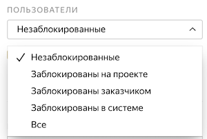

# Просмотр исполнителей

На странице [Исполнители]({{ users }}) доступны все исполнители, которые открывали хотя бы одно из ваших заданий. На этой странице вы сможете отобрать исполнителей, чтобы:

- [Назначить или отнять навык](nav.md).

- [Заблокировать или разблокировать доступ](ban.md). Например, если вы по ошибке заблокировали исполнителя.
- [Выдать бонус](bonus.md) за хорошее выполнение. Лояльные исполнители будут охотнее выполнять ваши задания.

#### Как отобрать исполнителей



Список может грузиться несколько минут. Если написано **Исполнители не найдены**, попробуйте подождать немного или воспользоваться фильтрами.




#### Если вы знаете идентификаторы исполнителей

Чтобы выбрать одного исполнителя, введите его идентификатор в поле поиска и нажмите **Найти**.

Чтобы выбрать несколько исполнителей:
1. Создайте текстовый файл и запишите в него идентификаторы исполнителей, например:
    ```
    059db2fa0927xec84a4cb9ccafc77ea4
    1a1f14bd48f0be13cb10c18sqgeb0679
    83khfalkdg78m3qhfai3kaf91h9n3ls3
    ```

1. Нажмите кнопку **Загрузить файл****Upload file** слева внизу и выберите файл.
1. После завершения загрузки файла нажмите кнопку **Добавить****Add**.



Чтобы посмотреть подробную информацию об исполнителе, нажмите на его идентификатор.



#### Показать заблокированных исполнителей

По умолчанию отображаются только незаблокированные исполнители. Если нажать на выпадающий список, то доступны другие опции:
- **Заблокированы на проекте** — те, кого вы заблокировали в одном из пулов проекта, например на основе правила контроля качества.
- **Заблокированы заказчиком** — те, кого вы заблокировали на всех своих проектах.
- **Заблокированы в системе** — те, кто был заблокирован на платформе за нарушение правил, плохое качество или частые ошибки при вводе капчи.
- **Все** — показать и заблокированных, и незаблокированных исполнителей.

#### Исключить тех, кто давно не пользовался Толокой
Поставьте галочку **Показывать только активных** и укажите количество дней, в течение которых исполнитель должен был выполнить хотя бы одно задание.
#### Найти тех, кто открывал или выполнял мои задания

**В левой части окна** используйте поля **Проект** и **Пул**, чтобы отобрать исполнителей, которые открывали задания в одном из ваших проектов или пулов.

На странице со статистикой пула эти исполнители указаны в графе **Заинтересовались**.

В столбце **Выполнено** отображается количество выполненных заданий. Если написано `0`, значит исполнитель только открыл задание, но передумал его выполнять.

#### Найти исполнителей с навыком

Чтобы найти исполнителей по навыку, используйте [фильтры](../../glossary.md#filtering-ru):

1. Нажмите **Добавить фильтр**.
1. Прокрутите вниз и выберите **Выбрать навык**.
1. Укажите навык и необходимое значение навыка.

Фильтры для отбора исполнителей работают так же, как в пуле. Подробнее читайте в разделе [Фильтры](filters.md).

Вы можете скачать список отобранных исполнителей. Для этого нажмите **Скачать в XLS** справа вверху.
 
Прочитайте в [блоге]({{ toloka-blog-performers-selection }}) о том, как отбирать исполнителей.


## Решение проблем {#troubleshooting}

#### Можно ли использовать навык не только в пуле или в одном проекте, но и в разных проектах?

Да, конечно, один и тот же навык можно назначать и использовать на различных проектах. Но чаще всего один навык используется в рамках одного проекта. Если исполнитель хорошо выполняет одно задание, это не значит, что он так же успешно справится с другим. Кроме того, используя фильтры по давно настроенным навыкам, вы ограничиваете количество доступных исполнителей.

#### Обучение прошли более 500 исполнителей, но в тренировочном навыке отображается только 30

В пуле отображается общее число исполнителей, которые выполнили там хотя бы одну страницу заданий. Тренировочный навык может со временем теряться из-за настройки повторного прохождения. Она позволяет заново выполнить тренировку по истечении указанного срока, если исполнитель так и не приступил к заданиям в привязанных пулах или сделал слишком большой перерыв в выполнении заданий (например, из-за [блокировки](../../glossary.md#banned-worker-ru)). Поэтому в тренировочном навыке отображаются те исполнители, которые либо недавно завершили обучение, либо регулярно выполняют ваше задание и не дают навыку исчезнуть.

#### Как посмотреть информацию об исполнителях

Информация об исполнителях, которые участвовали в ваших заданиях, доступна на странице  [Исполнители]({{ users }}). Чтобы посмотреть информацию об исполнителе, выберите его идентификатор. Заказчику доступны следующие данные профиля исполнителя: страна и город, возраст, образование, знание языков. Во вкладке **Метаинформация** можно узнать версию браузера и операционной системы, тип User-agent, регион, определённый по IP, и другие параметры исполнителя. Чтобы отобрать исполнителей для [пула](../../glossary.md#pool-ru) по данным профиля, устройству, геопозиции и другим параметрам, используйте [фильтры](filters.md).

#### Проверяется ли информация, указанная исполнителем в профиле?

Исполнители сами указывают информацию в профиле при регистрации. Мы не требуем документов, удостоверяющих личность, при регистрации в Толоке. Если профиль кажется нам подозрительным, мы просим его владельца уточнить данные.

#### Знают ли исполнители свой идентификатор?

Нет, идентификатор исполнителя доступен только заказчику.

#### Почему в настройках пула можно отфильтровать исполнителей по полу, хотя в профиле информации о поле нет?

Заказчику недоступна полная информация о конкретных исполнителях. Например, он не видит их дату рождения, пол, фамилию и имя. При этом в настройках пула заказчику доступны фильтры по дате рождения и полу. Они позволяют отобрать группу исполнителей, не получая информации о каждом в отдельности. Это уменьшает риск деанонимизации исполнителей.

