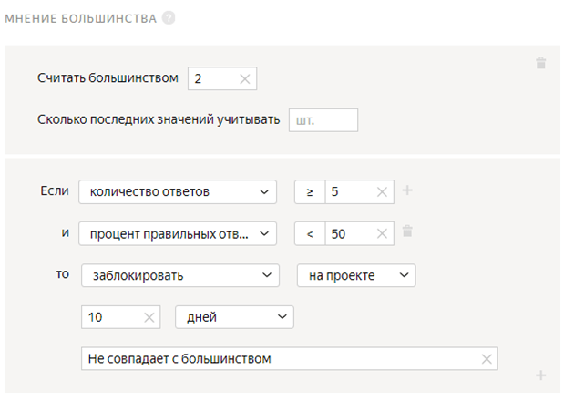

# Классификация видео





Сначала запустите проект в [Песочнице]({{ sandbox }}). Так вы сможете избежать ошибок и потраченных средств, если окажется, что ваше задание не работает.



[Проекты](../../glossary.md#project) этого типа предназначены для классификации видео. Вы можете использовать их для:

- модерации контента;
- распределения видео по заданным категориям;
- оценки, насколько видео нравится исполнителям;
- оценки видео на наличие шумов и других визуальных недостатков.

Например, у вас есть много видеороликов, и нужно определить, какие из них более качественные. Для этого создайте задание, в котором исполнители посмотрят видео и оценят их качество.

## Перед началом {#before_start}

- Чтобы использовать в проекте свои видео, вам нужно загрузить их в хранилище, из которого вы сможете получить ссылки на файлы. Например, ваш сервер, видеохостинг или облачное хранилище:

    - [Инструкция](use-object-storage.md) по использованию файлов с Yandex Cloud.

    - [Инструкция](prepare-data.md) по использованию файлов с Яндекс Диска.

    - Если вы используете видео с YouTube, замените ссылки вида `https://www.youtube.com/watch?v=example` на `https://www.youtube.com/embed/example`.

- Убедитесь, что видео отображаются одинаково в компьютерной и мобильной версиях Толоки. Видео может не воспроизводиться или воспроизводиться неверно в мобильной версии. В этом случае при создании пула ограничьте доступ исполнителям с мобильных устройств.

    Подробнее о [настройке заданий для мобильных устройств](mobile.md).

    

    Видеоплеер поддерживает только формат .mp4 с кодировкой H.264 или H.265.

    

- Если у вас сложный проект, зарегистрируйтесь в [песочнице](sandbox.md) и создайте проект там. В ней вы сможете:

    1. Протестировать настройки проекта в качестве исполнителя.

    1. Затем [перенести](sandbox.md#export) их в **основную версию Толоки**.

    1. Запустить для реальных исполнителей.

    Так вы сможете избежать ошибок и напрасно потраченных средств, если окажется, что ваше задание не работает.

## Создайте проект {#create-project}

Откройте [Толоку для заказчика]({{ yandex-toloka }}).

#### В интерфейсе:

1. Выберите пресет:

    1. 

    1. Выберите пресет **Классификация жестов рук**.

1. Заполните общую информацию:

    1. Дайте проекту понятное название и краткое описание. Их увидят исполнители в списке доступных заданий.

    1. По желанию добавьте **Приватный комментарий**.

    1. Нажмите **Сохранить**.

1. 

    

    - Конструктор шаблонов

      1. 

          Для этого проекта воспользуйтесь готовым шаблоном, где уже настроена валидация, горячие клавиши и внешний вид задания. Исполнитель не сможет отправить задание, если не выберет вариант ответа.

          Подробнее в Справке конструктора шаблонов:

          - [настройка условий](../../template-builder/best-practices/conditions.md);

          - настройка шаблона [Оценка видео](../../template-builder/templates/video-moderation.md).

      1. 

          В данном проекте:

          - Поле входных данных: `video` — ссылка для загрузки видео.

          - Поле выходных данных: `result` — строка, в которую будет записан ответ исполнителя.

    - Редактор HTML/CSS/JS

      1. 

          #### Если вы используете видео с YouTube

          Добавьте в интерфейс элемент **Встроенный фрейм**:

          ```html
          <iframe src=not_var{{video}} width="560" height="315" frameborder="0" allow="accelerometer; autoplay; encrypted-media; gyroscope; picture-in-picture" allowfullscreen></iframe>
          ```

      1. В блоке **Спецификация данных** задаются поля входных и выходных данных.

          

          

          

          

          

          В данном проекте:

          - Поле входных данных: `video` — ссылка для загрузки видео.

          

          Если вы используете видео с **YouTube**, для входного поля `video` укажите тип данных строка.

          

          - Поле выходных данных: `result` — строка, в которую будет записан ответ исполнителя.

      1. Нажмите кнопку  **Предпросмотр задания**, чтобы увидеть получившееся задание.

          

          В предварительном просмотре проекта отображается одно задание со стандартными данными. Количество заданий на странице вы сможете настроить далее.

          

      1. 

      1. 

      1. 

    

1. 1. Напишите краткую и ясную инструкцию. Опишите в ней, что надо сделать, и приведите примеры.

    Вы можете подготовить инструкцию в формате HTML и вставить ее в редактор. Чтобы переключиться в режим HTML, нажмите **<>**.

    1. Нажмите **Завершить**.

Подробнее о работе с проектом читайте в разделе [проект](project.md).

## Создайте пул {#create-pool}

Пул — это набор оплачиваемых заданий, которые одновременно выдаются исполнителям.

1. Откройте страницу проекта по оценке качества видео.

1. Нажмите кнопку **Добавить пул**.

1. Укажите **Название пула**.

1. (опционально) Укажите приватное описание:

    1. Включите опцию **Добавить приватное описание**.

    1. В поле **Приватное описание** введите описание пула. Эта информация доступна только вам.

1. В блоке **Аудитория** добавьте **Фильтры** для отбора исполнителей.

    - Чтобы задание было доступно только исполнителям, владеющим русским языком:

    1. Нажмите **Добавить фильтр**.

    1. Добавьте фильтры **Регион по номеру телефона** и **Языки**: выберите исполнителей из России, Украины, Казахстана и Беларуси, которые в своем профиле отметили знание русского языка.

    - 

1. 

1. В блоке **Цена** установите цену за страницу заданий, например 0,02 $.

    

    На одной странице может отображаться одно или несколько заданий. Если задания простые, то можно добавлять 10–20 заданий на одну страницу. Не рекомендуем создавать длинные страницы, поскольку это снизит скорость загрузки данных у исполнителя.

    Исполнитель получит оплату, только если выполнил все задания на странице.

    Количество заданий на странице вы определите при [загрузке заданий](#smart-mixing).

    

    

    Общее правило формирования цены — чем больше времени исполнитель тратит на выполнение, тем выше цена.

    Вы можете зарегистрироваться в Толоке как исполнитель и узнать, сколько платят другие заказчики за задания.

    

1. [Правила контроля качества](control.md) позволяют отсеивать невнимательных исполнителей. В блоке **Контроль качества** добавьте:

    - **Контрольные задания** — отсеивает исполнителей, которые часто ошибаются в контрольных заданиях.

    1. Нажмите **Добавить блок контроля качества**.

    1. Найдите в списке блок **Правила** и выберите пункт **Контрольные задания**.

    1. Задайте правило для контрольного задания: если **количество ответов** на контрольные вопросы **≥ 3** и **процент правильных ответов** на контрольные вопросы **< 60**, то **заблокировать** исполнителя **на проекте на 10 дней**. В качестве причины укажите **Контрольное задание**.

        

        Это означает, что если исполнитель выполнил более трех контрольных заданий и дал неправильные ответы более чем в 60% из них, он будет заблокирован и не сможет выполнять задания на этом проекте в течение 10 дней.

    - **Быстрые ответы** — отсеивает исполнителей, которые отвечают слишком быстро.

    1. В поле **Учитывать последних страниц заданий** введите количество последних страниц заданий, выполненных исполнителем. Например, `5`.

    1. В поле **Минимальное время на страницу заданий** укажите время в секундах. Например, `20`.

    1. Задайте правило для быстрого ответа: если **количество быстрых ответов**** ≥ 1**, то **заблокировать****у меня** на **10 дней**. В поле **Причина** введите **Быстрые ответы**.

        

        Это означает, что если исполнитель выполнит хотя бы одну страницу заданий быстрее, чем за 20 секунд, он не сможет выполнять ваши задания 10 дней.

    - **Мнение большинства** — контроль на основе ответов большинства исполнителей.

    1. В поле **Считать большинством** укажите `2`.

    1. Задайте правило: если **количество ответов** **≥ 5** и **процент правильных ответов** **< 50**, то **заблокировать** исполнителя **на проекте на 10 дней**. В качестве причины укажите **Не совпадает с большинством**.

        

        Это означает, что если исполнитель выполнил более десяти заданий, и его ответы не совпали с мнением большинства других исполнителей, он не сможет выполнять задания на этом проекте в течение 10 дней.

        

        Правило начинает действовать, когда количество ответов на задание равно перекрытию. Чтобы быстрее получить нужное число ответов, включите опцию **Сохранять порядок заданий** в [настройках пула](#pool-parameters).

        

1. Установите перекрытие — количество исполнителей, которые должны выполнить задание. В разделе **Перекрытие** укажите значение поля **Перекрытие**. Для заданий этого типа, как правило, `3-5`.

1. Укажите **Дополнительные настройки** пула:

    1. Укажите значение поля **Время на страницу заданий в секундах**. Времени должно быть достаточно для чтения инструкции, загрузки задания, просмотра видео и ответа. Например, `1200` секунд.

    1. Включите опцию **Сохранять порядок заданий**.

1. Нажмите кнопку **Сохранить**.

## Загрузите задания {#upload-file}



1. На странице пула нажмите кнопку **Загрузить**. В открывшемся окне вы можете скачать шаблон файла с заданиями.

1. Настройте параметры загрузки файла:

    1. Выберите **Умное смешивание**.

    1. В поле **Основных заданий** укажите `9`.

    1. В поле **Обучающих заданий** укажите `0`.

    1. В поле **Контрольных заданий** укажите `1`.

    1. Нажмите кнопку **Загрузить**.

    1. В открывшемся окне выберите файл с заданиями для загрузки и нажмите кнопку **Открыть**.

    1. В открывшемся окне проверьте количество заданий и нажмите кнопку **Добавить**.

1. Создайте [контрольное задание](goldenset.md):

    1. Нажмите кнопку **Разметить**.

        

        Если вместо **умного смешивания** было выбрано другое, необходимо нажать кнопку **Разметить**. Если такой кнопки нет, удалите файл и загрузите заново.

        

    1. В открывшемся окне нажмите кнопку **Создать контрольные**.

    1. В открывшемся окне в разделе **Создать контрольное задание** слева отметьте пункт **result**.

    1. Выберите правильный ответ на вопрос.

    1. Нажмите кнопку **Сохранить и перейти к следующему**.

    1. Нажмите **Оцените качество видео**, чтобы выйти из режима разметки заданий.

        

        В небольших пулах контрольные задания должны составлять около 10% от всех заданий. Включайте разные варианты правильных ответов в равных количествах. Посмотрите распределение ответов на странице **Разметить задания** на вкладке **Контрольные**.

        

1. Нажмите кнопку , чтобы запустить пул.

## Получите результаты {#get-results}

1. Рядом с кнопкой **Скачать результаты** нажмите кнопку .

1. Выберите пункт списка **Агрегация результатов по методу Дэвида — Скина**. Подробнее об [Агрегации результатов по методу Дэвида — Скина](result-aggregation.md#dawid-skene).

1. В открывшемся окне нажмите **Да**.

1. Наверху страницы нажмите **Перейти к списку операций**.

1. Когда операция завершится, скачайте файл с результатами. Для этого в столбце **Файлы** нажмите **Скачать**.



Для того чтобы избежать нежелательных ошибок, сначала рекомендуем выполнить проект в [Песочнице]({{ sandbox }}).



## Решение проблем {#troubleshooting}



Для создания задания возьмите за основу [шаблон для разметки видео]({{ templates-video-new }}).

Чтобы разместить ваши видеоролики на Яндекс Диске, его нужно подключить и настроить проект.

Подробная видеоинструкция об этом [в нашем блоге]({{ toloka-blog-yadisk }}).





Можно взять за основу шаблон [для разметки видео]({{ templates-video }}).

Чтобы разместить ваши видеоролики на Яндекс Диске, его нужно подключить и настроить проект.

Подробная видеоинструкция есть в нашем [блоге]({{ toloka-blog-yadisk }}).





Если картинки, аудио или видео с Яндекс Диска не отображаются в [инструкции](../../glossary.md#instructions) или на [странице задания](../../glossary.md#task-suite), убедитесь, что вы правильно подключили Диск и загрузили файлы.

- [Как подключить Яндекс Диск](prepare-data.md#prepare-data__connect)
- [Как загрузить файлы для инструкции](prepare-data.md#prepare-data__instruction)
- [Как загрузить файлы для задания](prepare-data.md#prepare-data__interface)



Для создания задания возьмите за основу [шаблон для разметки видео]({{ templates-video-new }}).

Чтобы разместить ваши видеоролики на Яндекс Диске, его нужно подключить и настроить проект.

Подробная видеоинструкция об этом [в нашем блоге]({{ toloka-blog-yadisk }}).





Проблема в шаблоне задания. Проверьте, что:

- Для поля входных данных, куда вы передаете ссылку на файл, в проекте указан тип «строка».

- В компоненте в шаблоне задания используется выражение proxy.

- Формат относительных ссылок в файле с заданиями указан верно: <уникальное имя>/<путь и имя файла>.

Подробная инструкцию и видео на странице [Использование файлов с Яндекс Диска](prepare-data.md).





- В настройках проекта в поле **Входные данные** указан тип _ссылка_. Необходимо выбрать тип _строка_.

- В [файле с заданиями](../../glossary.md#tsv) указаны абсолютные ссылки на файлы для заданий. Необходимо вставить ссылку вида `<уникальное имя>/<путь и имя файла>`. Например: `yadisk/image1.jpg` или `yadisk/photos/image1.png`.

- Фото с Яндекс Диска используются в инструкции к заданию в мобильном приложении. Чтобы фото отобразилось в инструкции, используйте только прямые ссылки.

- Файлы удалены или находятся не в той папке на Диске, на которую ведет ссылка.

- OAuth-токен не активен. Обновите токен на странице [Интеграция]({{ integration }}).

Чтобы файлы, загруженные на Яндекс Диск (картинки, аудио, видео), отображались у исполнителя, нужно:

1. Подключить Яндекс Диск в профиле.

1. Установить тип строка для поля [входных данных](../../glossary.md#input-output-data).

1. Вставлять ссылку на файл при помощи компонента `proxy`.

[Подробная инструкция](prepare-data.md)







Попробуйте воспользоваться рекомендациями с [этой страницы]({{ yadisk-uploading }}) или написать в службу поддержки Яндекс Диска.





