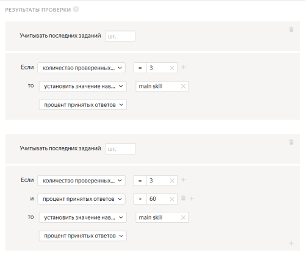

# Добавление заданий в пул



## Загрузка заданий {#concept_iy1_3kh_5mb}



Количество заданий зависит от сложности и длительности выполнения. Не делайте страницы заданий слишком большими: они неудобны для исполнителей (например, при сбоях в соединении с интернетом) и не пользуются спросом.





Попробуйте выполнить задания сами, попросите своих друзей и коллег. Найдите среднее время выполнения и добавьте к нему 50%.





Вы можете указать сколько заданий будет на странице при загрузке заданий в пул. Подробнее о способах распределения заданий по страницам можно узнать [здесь](../concepts/distribute-tasks-by-pages.md).







Про подключение Яндекс Диска вы можете прочитать [здесь](../concepts/prepare-data.md).

В шаблоне проекта должно быть прописано, например, следующее:

``, где `img` — входное поле строкового формата.

Для тестирования используйте файл `example.jpg`. Его URL вы можете найти в **Профиль → Интеграция с внешними сервисами**.







Каждое задание должно быть описано на отдельной строке в файле с заданиями. Подробнее об этом вы можете прочитать [здесь](../concepts/pool_csv.md).

Когда вы создадите пул, то в нем будет настройка количества заданий на странице.





Заэкранируйте запятые обратным слэшем `\`.





Для загрузки файла используйте кнопку **Загрузить результаты**. Формат можно посмотреть [здесь](../concepts/accept.md).

Проверка ответов выполняется в файле с заданиями.





Текст из поля `hint` будет показан исполнителю в верхней части задания на красном фоне, если он в обучающем задании даст ответ, который отличается от указанного правильного.

#### Пример


Если текст из поля `hint` необходимо отразить в несколько строк, то переносы добавляются в файл, а текст заключается в кавычки.





Add your text here — это подсказка, которая говорит о том, что текст в поле вы можете заменить на свои данные для задания. О структуре файла и его заполнении можно узнать [здесь](../concepts/pool_csv.md).





Из-за наличия кавычек в одном слове загружать ответ следует таким образом: `"Сколько букв в слове ""Лихтенштейн"""`. Если внутри текста есть экранирование кавычками, то весь текст следует заключать в кавычки. Подробнее описано в [Руководстве](../concepts/pool_csv.md#string).





Проверьте поле `hint`. Для обычных заданий это поле должно быть пустым.





В файле с основными заданиями должны быть заполнены столбцы с заголовками `INPUT`. Вы можете увидеть эти заголовки, если скачаете образец файла из пула.

Если создаете контрольные задания, то заполните столбцы с правильными ответами — `GOLDEN`.

Если обучающие, то также понадобится заполнить столбец `HINT:text`. Для основных заданий все столбцы кроме `INPUT` не нужны, их можно удалить.

Формат файла должен быть TSV, XLSX или JSON, кодировка — UTF-8.


Если вы разместили файлы на Яндекс Диске, посмотрите видео, [как указать ссылки на них в файле с заданиями](https://youtu.be/hIJ6IGaDgeU).


Подробнее о создании файла в [Руководстве](../concepts/pool_csv.md). Если при загрузке возникают ошибки, поищите вашу ошибку на этой [странице](../concepts/task_upload.md).





Ошибка будет возникать, если на вход ожидается тип URL, а приходит строка.

Причин может быть две:

- Входное поле имеет тип "ссылка".

- Пул работает на неактуальной версии проекта. То есть создан до того, как вы изменили тип входного поля.





Зависит от задания. Технически можно много.

Но, во-первых, исполнители неохотно берутся за задания, которые требуют много времени на выполнение. То есть, они скорее сделают 10 заданий по одной минуте, чем одно задание на 10 минут.

Во-вторых, при большом количестве заданий на странице может быть проблема с загрузкой файлов для разметки. Например, картинок.

Третий момент — контроль качества и оценка выполнения всей страницы. Если вы используете дооценку заблокированных исполнителей, то лучше дробить задание на более мелкие части, чтобы в переразметку отправлялось меньше заданий. Это позволит уложиться в бюджет.





Загруженные ссылки на картинки в файле Толока разделит на страницы в зависимости от того, какой способ распределения заданий вы выбрали. Подробнее читайте на странице [Способы распределения заданий](../concepts/distribute-tasks-by-pages.md).





Порядок следования полей в файле значения не имеет. Можете делать так, как удобно.





Загрузить в пул задания с разными ответами через интерфейс невозможно. Можно только через [API]({{ toloka-api-tasks }})





Если в настройках пула включена опция **Сохранять порядок заданий****Keep task order**, то разметка новых заданий начнется после того, как будут взяты в работу предыдущие. Если опция выключена, то нет и гарантии, что задания будут раздаваться последовательно.





Массив строк во входных данных записывается через запятую. Например: `INPUT:types   text1, text2, text3, text4`





Все значения записываются в один столбец. Не забудьте экранировать кавычки. Подробнее об экранировании кавычек для формата JSON можно узнать в [Руководстве](../concepts/pool_csv.md#json).





Нет, если вы загрузите в пул файл с несуществующими заголовками, система выдаст ошибку загрузки. Все обязательные INPUT поля, используемые в спецификации должны быть в файле с заданиями. Лишних полей и столбцов быть не должно.

Если вы не хотите показывать какие-то данные исполнителям, но они вам нужны в файле, создайте для них необязательные скрытые входные поля в проекте.





Текст в поле GOLDEN должен в точности совпадать с эталоном.

Обычно, если копировать ссылку из браузера на определенный сайт, они будут иметь одинаковый формат. Другое дело, если ссылка была обрезана или набрана на клавиатуре.

Проверьте ссылки, которые используете. Решить задачу с унификацией ссылок можно несколькими способами:

- Добавить требования к формату ссылок в инструкцию и подсказки в обучении.

- Обрезать полученные ссылки в js с помощью regexp и записать результат в новое выходное поле, а после сравнить полученное значение с эталоном.





Настройки умного смешивания указываются для файла — не для пула.

При первой загрузке файла указанные настройки будут применяться для всех файлов, загруженных в дальнейшем в этот пул.





Все значения записываются в один столбец. Не забудьте экранировать кавычки.

Подробнее об экранировании кавычек для формата JSON можно узнать в [Руководстве](../concepts/pool_csv.md).





Task — это отдельное задание. Task suite — страница с заданиями. Исполнитель получает оплату за страницу заданий.







Чтобы посмотреть лог обработки, нажмите **Подробнее об ошибках загрузки**. Лог обработки записан в формате JSON. Объекты внутри `result` соответствуют номеру строки загружаемого файла. Строки, обработанные с ошибкой, имеют статус `"success": false`.



Работать с большим логом удобнее, если скопировать его в текстовый редактор.





#### Ошибки в заголовках столбцов

Если [заголовки столбцов](../concepts/pool_csv.md) некорректны, файл будет полностью отклонен. В остальных случаях указано количество заданий с ошибками обработки.

#### Таблица ошибок обработки

```json
"parsing_error_of": "https://tlk.s3.yandex.net/wsdm2020/photos/2d5f63a3184919ce7e3e7068cf93da4b.jpg\t\t", "exception_msg": "the nameMapping array and the sourceList should be the same size (nameMapping length = 1, sourceList size = 3)"
```

#|
|| **Описание** | **Как исправить** ||
||**Лишние знаки табуляции.**
Если в загружаемом файле после данных или ссылки стоит количество разделителей столбцов `\t` больше, чем задано число столбцов во [входных данных](../../glossary.md#input-output-data), то появится сообщение об ошибке.
Например, когда во входных определен 1 столбец, а в файле после ссылки прописано ещё два знака табуляции `\t\t`, то получится 3 столбца, 2 из которых лишние. | Удалите лишние разделители столбцов, в приведенном выше примере ошибки — оба знака (`\t\t`).||
|#

```json
"exception_msg": "the nameMapping array and the sourceList should be the same size (nameMapping length = 4, sourceList size = 6)"
```

#|
|| **Описание** | **Как исправить** ||
||**Не совпадает количество полей в заголовке и в строке.** | Проверьте, что:

- указано верное количество знаков табуляции в структуре файла;
- строковые значения, содержащие знак табуляции, заключены [в кавычки](../concepts/pool_csv.md#string)`" "`.||
|#

```json
"code": "VALUE_REQUIRED", "message": "Value must be present and not equal to null"
```

#|
|| **Описание** | **Как исправить** ||
||**Не указано значение обязательного поля входных данных.** | Проверьте, что заполнены все столбцы с обязательными полями входных данных.||
|#

```json
"code": "INVALID_URL_SYNTAX", "message": "Value must be in valid url format"
```

#|
|| **Описание** | **Как исправить** ||
||**Данные в поле с типом «ссылка» («url») некорректны.** | Проверьте, что:

- Все ссылки начинаются с префикса `http://`, `https://` или `www`.
- При [загрузке файла с Яндекс Диска](../concepts/prepare-data.md) по относительной ссылке, указан тип данных **строка** для [поля входных данных](../concepts/incoming.md).||
|#

```json
"exception_msg": "unexpected end of file while reading quoted column beginning on line 2 and ending on line 4"
```

#|
|| **Описание** | **Как исправить** ||
||**В строке стоит непарная кавычка.** | Проверьте, что все кавычки [экранированы](../concepts/pool_csv.md#string).||
|#





Одно и то же задание может попасть на разные страницы, если:

- Существует динамическое перекрытие (incremental relabeling, IRL). Например на странице было 5 заданий, по 4-м из них ответы согласовались так, что общий ответ зачелся как верный. Пятое задание будет замешано в другой набор, поскольку оно не попало в финальный ответ и его необходимо «дооценить».

- У разных заданий существует разное перекрытие. Те задания, у которых перекрытие указано больше, будут дополнительно показываться в наборах с другими оставшимися заданиями в пуле.

- Если [правило контроля качества](../../glossary.md#quality-control-rules) меняет перекрытие у задания, то оно окажется в другом наборе.





Если вы передаёте тексты во входные данные, то достаточно загрузить в пул 2 разных задания: в одном из них в поле `INPUT: <имя входного поля>` вы передадите текст № 1, в другом — текст № 2.

Если текст в самом шаблоне задания, в блоке HTML, то нужно клонировать проект. Чтобы исполнитель мог сделать только одно задание в вашем проекте, используйте правило [Выполненные задания](../concepts/submitted-answers.md). Можно назначить навык или заблокировать исполнителя, после того, как он отправит один ответ.



[Другой вопрос](support.md#help)



## Использование файлов из облачных хранилищ {#concept_yvk_jkh_5mb}



Если картинки, аудио или видео с Яндекс Диска не отображаются в [инструкции](../../glossary.md#task-instruction) или на [странице задания](../../glossary.md#task-page), убедитесь, что вы правильно подключили Диск и загрузили файлы.

- [Как подключить Яндекс Диск](../concepts/prepare-data.md#prepare-data__connect)
- [Как загрузить файлы для инструкции](../concepts/prepare-data.md#prepare-data__instruction)
- [Как загрузить файлы для задания](../concepts/prepare-data.md#prepare-data__interface)



Для создания задания возьмите за основу [шаблон для разметки видео]({{ templates-video-new }}).

Чтобы разместить ваши видеоролики на Яндекс Диске, его нужно подключить и настроить проект.


Подробная видеоинструкция об этом [в нашем блоге]({{ toloka-blog-yadisk }}).






Проблема в шаблоне задания. Проверьте, что:

- Для поля входных данных, куда вы передаете ссылку на файл, в проекте указан тип «строка».

- В компоненте в шаблоне задания используется выражение proxy.

- Формат относительных ссылок в файле с заданиями указан верно: <уникальное имя>/<путь и имя файла>.

Подробная инструкцию и видео на странице [Использование файлов с Яндекс Диска]({{ using-files-yandex-disk }}).





- В настройках проекта в поле **Входные данные** указан тип _ссылка_. Необходимо выбрать тип _строка_.

- В [файле с заданиями](../../glossary.md#tsv-file-definition) указаны абсолютные ссылки на файлы для заданий. Необходимо вставить ссылку вида `<уникальное имя>/<путь и имя файла>`. Например: `yadisk/image1.jpg` или `yadisk/photos/image1.png`.

- Фото с Яндекс Диска используются в инструкции к заданию в мобильном приложении. Чтобы фото отобразилось в инструкции, используйте только прямые ссылки.

- Файлы удалены или находятся не в той папке на Диске, на которую ведет ссылка.

- OAuth-токен не активен. Обновите токен на странице [Интеграция]({{ integration }}).

Чтобы файлы, загруженные на Яндекс Диск (картинки, аудио, видео), отображались у исполнителя, нужно:

1. Подключить Яндекс Диск в профиле.

1. Установить тип строка для поля [входных данных](../../glossary.md#input-output-data).

1. Вставлять ссылку на файл при помощи компонента `proxy`.

[Подробная инструкция](../concepts/prepare-data.md)







Попробуйте воспользоваться рекомендациями с [этой страницы]({{ yadisk-uploading }}) или написать в службу поддержки Яндекс Диска.





Чтобы добавить картинки с помощью ссылок на Яндекс Диск, используйте ссылку вида `/api/proxy/<имя прокси>/<имя файла>.<тип>`. Например: `/api/proxy/my-proxy/example.jpg`

Подробнее об этом читайте в разделе [Добавить файлы в инструкцию](../concepts/prepare-data.md).





Проблема в шаблоне задания. Проверьте, что:

- Для поля входных данных, куда вы передаете ссылку на файл, в проекте указан тип «строка».

- В компоненте в шаблоне задания используется выражение proxy.

- Формат относительных ссылок в файле с заданиями указан верно: <уникальное имя>/<путь и имя файла>.


Подробная [инструкция и видео](../concepts/prepare-data.md).
 
Подробная [инструкция](../concepts/prepare-data.md).






Можно взять за основу шаблон [для разметки видео]({{ templates-video }}).

Чтобы разместить ваши видеоролики на Яндекс Диске, его нужно подключить и настроить проект.


Подробная видеоинструкция есть в нашем [блоге]({{ toloka-blog-yadisk }}).




[Другой вопрос](support.md#help)



## Обучение-экзамен-реабилитация {#concept_i2g_kkh_5mb}



Обучающие и контрольные вопросы будут иметь спецификацию проекта. Но вы можете сделать отдельный проект и разместить в нем инструкцию, опросник, приложить примеры видео. А потом по ответам назначить навык. По этому навыку вы будете допускать исполнителей к основному проекту.





В пуле отображается общее число исполнителей, которые выполнили там хотя бы одну страницу заданий. Тренировочный навык может со временем теряться из-за настройки [повторного прохождения](../concepts/train.md). Она позволяет заново пройти обучение по истечении указанного срока, если исполнитель так и не приступил к заданиям в привязанных пулах или сделал слишком большой перерыв в выполнении заданий (например, из-за [блокировки](../../glossary.md#banned-worker)). Поэтому в тренировочном навыке отображаются те исполнители, которые либо недавно завершили обучение, либо регулярно выполняют ваше задание и не дают навыку исчезнуть.





Экзаменационным мы называем пул, в котором содержатся только контрольные задания. Обычно он делается небольшим и служит для проверки того, как исполнители научились выполнять задание после чтения инструкции и прохождения обучения.

В отличие от пула для основной разметки, ответы на все задания вам уже известны. Стоимость можно установить нулевой. По результатам ответов на контрольные задания вы можете назначить исполнителям навык и далее указать его в основном пуле в качестве фильтра. Например, `≥ 80` или `≠ Отсутствует`. Составление экзамена не обязательно, в простых заданиях достаточно тренировки. Но многие заказчики используют также и экзамен.





За количество дней, в течение которых сохраняется тренировочный навык, отвечает параметр **Повторное прохождение**.

Навык удаляется спустя указанное количество дней, если исполнитель:

- Получил значение навыка ниже значения в поле **Уровень прохождения**.

- Не выполнил ни одного задания, к которому привязано обучение, в течение этого срока.

С истекшим навыком вашим исполнителям нужно проходить обучение заново.





В файле задания оставьте пустыми контрольные значения для необязательных выходных данных.





1. Перейдите в карточку исполнителя.
1. Выберите вкладку **Профиль**.
1. Найдите в списке нужный навык и скачайте историю его изменений.





В обучающем пуле задания имеют бесконечное перекрытие. Пока открыт пул, к которому оно привязано, и запущено само обучение, задания из него будут видны исполнителям. Подробнее об [обучающих пулах](../concepts/train.md).





Текст в поле GOLDEN должен в точности совпадать с эталоном.

Обычно, если копировать ссылку из браузера на определенный сайт, они будут иметь одинаковый формат. Другое дело, если ссылка была обрезана или набрана на клавиатуре.

Проверьте ссылки, которые используете. Решить задачу с унификацией ссылок можно несколькими способами:

- Добавить требования к формату ссылок в инструкцию и подсказки в обучении.

- Обрезать полученные ссылки в js с помощью regexp и записать результат в новое выходное поле, а после сравнить полученное значение с эталоном.





Умное смешивание задается при загрузке заданий в пул. После создания пула нажмите **Загрузить** и выбираете соответствующий способ формирования страниц с заданиями. При этом вы можете загрузить их отдельными файлами, либо одним файлом, расположив в любом порядке.





Через интерфейс пул можно закрыть вручную в любое время, но задать определенное количество прошедших обучающий пул и затем закрыть его автоматически не получится.





Обучение помогает исполнителям тренироваться выполнять задание и разобраться с инструкцией.

На основе его результатов заказчик может отобрать в основной пул тех исполнителей, которые справились достаточно хорошо.

Однако, одно лишь прохождение обучающего пула не гарантирует, что тот или иной исполнитель станет в дальнейшем качественно выполнять основные задания. Вероятно, исполнители, которые прошли обучение с высоким уровнем точности, могли обменяться друг с другом правильными ответами.

Помимо обучения нужно добавлять в основные пулы правила контроля качества и [контрольные задания](../concepts/control.md). Это позволит контролировать качество исполнителя на всём протяжении его работы над заданием.

Если же задание предполагает ответы в свободной форме или получение файлов с данными, используйте **Отложенную приемку**, чтобы выплачивать вознаграждение после проверки.





Это техническая особенность [обучающих пулов](../../glossary.md#training-pool). В них задания загружаются только таким образом. Если вы хотите использовать в обучении способ **Указать вручную****Set manually**, создайте основной пул, укажите тип пула **Тренировка** и установите нулевую стоимость.





Первый пул сделайте на базе [обучающего пула](../../glossary.md#training-pool). А второй — на базе основного и укажите тип пула **Экзамен**. Если в нем будут только контрольные и/или обучающие задания, такой пул может иметь нулевую стоимость.

В экзаменационном пуле можно назначить навык, который будет определять результат сдачи экзамена и служить допуском в основной пул. Например: `Если количество ответов ≥ 10 , то установить навык из поля <экзаменационный навык> % правильных ответов.`

В требованиях к исполнителям экзаменационного пула укажите: `<экзаменационный навык> <80 или = отсутствует>`.

Установите в основном пуле фильтр: `<экзаменационный навык> >=80 и <основной навык> >=70 или = отсутствует>`. Значения навыка вы сможете подобрать в зависимости от того, насколько хорошо исполнители справляются с вашим заданием.





Создайте основной пул с типом **Тренировка**. Добавьте только [обучающие задания](../../glossary.md#training-task). Назначьте навык правилом **Контрольные задания**. Чтобы допустить к основным заданиям исполнителей с любым уровнем навыка, установите в основном пуле фильтр: `<навык> >= 0` или `<навык> ≠ 0`.

Но мы не советуем допускать к основным заданиям тех, кто не справился с обучением.





Если установлено неполное прохождение и указано количество страниц, которое нужно пройти, то для прохождения обучения не нужно проходить обучение целиком. Если такие настройки не выставлены, то для получения тренировочного навыка нужно пройти все задания в обучающем пуле.





Создать реабилитацию можно также, как и экзамен. В параметрах пула выберите тип **Реабилитация**. В фильтрах реабилитационного пула укажите верхнее и нижнее значение <основного навыка> исполнителей, которым он будет доступен.

Например, если в основную разметку попадают исполнители с навыком 70 и выше, то в реабилитационный пул можно отправить тех, чей навык между 69 и 40.

Чтобы получилось «окно», нужно указать навык дважды с верхним и нижним значением. Например: `<основной навык > <70 и <основной навык > >=40`.
Советуем не делать экзамен и реабилитацию слишком длинными — исполнители не любят выполнять бесплатные задания. Достаточно 10-20 заданий в зависимости от их сложности.





Да, считается.





В сущность обучения заложена функция отбора исполнителей для основного задания. Именно поэтому обучение должно быть связано с основным пулом и становится неактивным, как только этот пул закрывается.

Исполнитель проходит обучение, чтобы получить доступ к оплачиваемым заданиям. Если обучение необязательное, то скорее всего, будет мало желающих его проходить. Технически такое «факультативное» обучение можно реализовать на базе основного пула с обучающими заданиями внутри.

Чтобы оно показывалось отдельно от других пулов, снимите галочку **использовать описание проекта** и укажите в этом поле, что это необязательный обучающий набор заданий. В параметрах пула выберите тип **Тренировка**





В обучающем пуле отложенная приемка невозможна.

Но вы можете создать обучающий пул с типом **Тренировка** на базе обычного пула и в нем выставить отложенную приемку.





Создать такое обучение невозможно, потому что для того, чтобы ответ засчитался верным, он должен в точности совпасть с эталоном.

Для проектов со свободным вводом или файлами-вложениями можно сделать отборочное задание с отложенной приемкой. Тех, кто хорошо справится, можно будет пропустить по навыку в основной пул.





Необходимо в блоке **Результат проверки** в поле **Учитывать последних заданий** указать количество последних ответов исполнителя.

Например, требуется создать экзамен размером в три задания по одному заданию на страницу. Если исполнитель выполняет два из трех правильно, то получит навык.

Если задание с отложенной приемкой, то чтобы настроить правило по такой логике, необходимо указать 3 в параметре количество проверенных ответов. На скриншоте в первом случае навык получат все исполнители, которые выполнили 3 страницы заданий и ответы которых проверены, а во втором — только те, у которых приняты 2 или 3 задания.







Чтобы ответ на контрольное или обучающее задание был засчитан как верный, он должен полностью совпасть с эталоном. Для этого текст нужно нормализовать с помощью JavaScript: удалить пробелы, знаки препинания, специальные символы и заглавные буквы, а результат записать в отдельное выходное поле. Такой обработанный ответ можно уже сравнивать с контрольным.

Другой вариант отбора исполнителей для проекта такого типа — отложенная приемка.





Для обучающих заданий необходимо:

- Правильные ответы пометить в колонке `GOLDEN:result`.

- Заполнить колонку `HINT:text`, куда записывается подсказка в случае выбора неверного варианта ответа.



[Другой вопрос](support.md#help)

## Изменение запущенного пула {#concept_olz_kkh_5mb}



Если вы изменили время на выполнение задания, то его значение применится к тем заданиям, которые еще не взяты исполнителями в работу. Тоже самое касается и случая, когда вы закрываете пул. У исполнителя, у которого задание активно, остается возможность его доделать.





Если вы загрузили в пул задания «Умным смешиванием», то можете остановить пул и разметить задания — отредактировать ответы, подсказки или удалить задания.

Если вы загружали их другим способом, то нужно будет клонировать пул и загрузить туда новый файл с откорректированным списком данных на разметку.





Все задания после загрузки попадают в один список, поэтому один файл удалить не получится.

- **Если пул не запускался**, то удалите все задания. Для этого в блоке **Задания пула** нажмите кнопку **Удалить**. Далее загрузите в пул только один файл.

- **Если пул запускался**, то удалите задания по [одному через режим разметки](../concepts/task-markup-by-yourself.md#delete-task).



[Другой вопрос](support.md#help)

