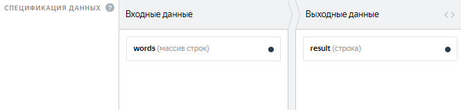

# Настройка проекта





## Настройка проекта {#project}

## Инструкция {#concept_llj_dkp_smb}



Чтобы добавить картинки с помощью ссылок на Яндекс Диск:

1. Используйте ссылку, например: /api/proxy/yadisk/image1.jpg .

1. В настройках профиля заказчика перейдите в **Интеграция с внешними сервисами → Настройки прокси**.

1. Настройте интеграцию с внешними сервисами.

    [Подробно об использовании файлов с Яндекс Диска](../concepts/prepare-data.md).





Существуют три основных варианта решения:

- Разместить инструкцию в самом задании так, чтобы она не сильно перегружала интерфейс.

- Сделать инструкцию [в виде бокового окна]({{ instr-in-form-of-side-window }}), чтобы можно было быстро развернуть и скрыть.

- Разместить инструкцию под катом или [добавить подсказки-вопросы к отдельным элементам интерфейса]({{ hints-questions }}).
Для лучшего результата рекомендуем предварительно отобрать подходящих исполнителей и выставить правила контроля качества.





Нет, но вы можете разместить ссылку на них.





Недопустимые теги удаляются при сохранении проекта — их нельзя использовать. [Список допустимых тегов](../concepts/instruction.md#html).





По умолчанию в обучении отображается инструкцию проекта. Чтобы написать отдельную инструкцию, снимите флажок **Использовать инструкцию проекта**. Не забывайте обновлять инструкцию к обучению, если что-то меняется в инструкции к основному заданию.





Если после сохранения инструкции пропадают теги или атрибуты (например, `checked="true"`), значит они не поддерживаются. Полный список допустимых в инструкции тегов можно найти в [руководстве](../concepts/instruction.md#html-yes).



[Другой вопрос](support.md#help)

## Настройка интерфейса задания {#concept_gss_fkp_smb}



Добавьте к компоненту для вставки картинки параметры `real-size=true` и `screenshot=true`.





Чтобы добавить горячую клавишу, в методе onKey пропишите следующее действие:

```javascript
onKey: function(key) {
          var el = this.getDOMElement().querySelector(".image-annotation-editor__shape-polygon");

          if (key === 'D') {
          el.click();
          el.classList.add('image-annotation-editor__shape_active')
          }
```

Воспользуйтесь [этой библиотекой](https://github.com/vmit/image-annotation), если потребуются дальнейшие модификации редактора по выделению областей.





В режиме предпросмотра проверить загрузку файлов нельзя, но это можно сделать в песочнице, выполнив своё задание. Для этого нужно зарегистрироваться в сендбоксе в качестве исполнителя и добавить логин в доверенные на странице **Пользователи**. Подробнее можете прочитать в этой [статье](../concepts/sandbox.md) .





Если никто из исполнителей не смог отправить задание, скорее всего проблема в валидации в JS. Проверьте её ещё раз.

Перенесите проект в сендбокс и попробуйте выполнить задание самостоятельно в песочнице.





Чтобы проверить, как выглядит задание на экране мобильного телефона, можно переключиться в режим эмуляции в браузерах Chrome или Safari и отредактировать блок CSS.

Также вы можете воспользоваться мобильной версией сендбокса. Чтобы получить к ней доступ, напишите в службу поддержки.





Используйте [конкатенацию](../concepts/t-components/helpers.md#concat), например:

```html
{{field type="checkbox" name=(concat "result." @index ) label=(concat "checkbox –
          " @index) size="L"}}
```





Если это в JS, то укажите в конце индекс:

```javascript
this.getTask().input_values['name'][2]solution.output_values['result'][2]
```

Если в интерфейсе, то следующим образом: 





Попробуйте отключать расширения браузера. Они могут блокировать загрузку iframe.





Чтобы передать `label` во входных данных, укажите в нём имя входного поля.

Например, если у вас входное поле `asd` с типом строка, то компонент может быть записан так: `{{field type="checkbox" name="like" label=asd hotkey="q"}}`.

Если вы хотите передавать различные значения лейблов в разных заданиях или количество чекбоксов может меняться, то воспользуйтесь [конкатенацией](../concepts/t-components/helpers.md#concat).





Текст под кат можно убрать с помощью стилей CSS как в самом задании, так и в инструкции. Пример кода можно посмотреть [здесь]({{ text-under-the-cut }}).





Укажите название входного поля, куда передаёте ссылку, без скобок:

```html
{{field type="button-clicked" name="ads" label="Нажми меня" href=name_escape
            action=true}}
```





1. Посмотрите как это реализовано в шаблоне [«Поиск данных в сети»](../concepts/internet-search.md).

1. Для решения второй задачи вы можете добавить ещё одну валидацию по аналогии с этой:

    ```javascript
    if (solution.output_values.url && solution.output_values.check) {return {task_id:
    this.getTask().id,errors: {'url': {code: 'Вставьте ссылку или отметьте галочкой,что сайта нет'}}}}
    ```





Названия выходных полей должны отличаться: для каждого чекбокса своё имя. Подробнее об этом компоненте [здесь](../concepts/t-components/checkboxes.md).





Добавить валидацию ответа в зависимости от чекбокса возможно с помощью JavaScript. Пример доступен в шаблоне «Поиск данных в сети».





Посмотреть пример вы можете в комментариях к [проекту]({{ how-to-insert-a-calendar }}). В примере есть формат выходных данных и библиотеки, которые нужно подключить.

Чтобы подключить библиотеки:

1. В режиме редактирования проекта нажмите «шестеренку».

1. В открывшемся поле слева введите ссылки и нажмите **Ввод**.





Вероятно, проблема в блоке JS. Попробуйте удалить его содержимое, после чего проверьте кнопку **Отправить** в режиме предпросмотра.





Вы можете сделать это с помощью [конкатенации](../concepts/t-components/helpers.md#concat).

Посмотрите примеры проектов, которые могут помочь вам в создании интерфейса:

- [с чекбоксами]({{ project-with-checkboxes }})

- [с выпадающим списком]({{ project-with-drop-down-list }})

- [с радиобаттонами]({{ project-with-radiobutton }})

Во входном поле массив значений необходимо передавать через запятую. Для каждого из них в интерфейсе будет сформирован вариант ответа. Входные/выходные данные к проектам-примерам указаны в комментариях на codepen.io.





Снять выбор нельзя. Только изменить на другую радиокнопку с ответом.





В этом случае нужно оставить поле необязательным в выходных данных и прописать валидацию в зависимости от ответа исполнителя. Вы можете посмотреть, как это решено в шаблоне «Классификация текстов».





Добавьте `sources="CAMERA"` в атрибуты к компоненту для загрузки картинки, чтобы запретить добавлять фото из галереи.





Попробуйте добавить условие на наличие второй шкалы:

```javascript
setSolution: function(solution) {
var secondScale = this.getDOMElement().querySelector('.second-scale');

if(secondScale) {
secondScale.style.display = solution.output_values.grammar === 'no' ? 'block' : 'none';
}

TolokaHandlebarsTask.prototype.setSolution.call(this, solution);
},
```





Вы можете сделать выделение и выпадающий список с выбором категории. Посмотрите, как это реализовано на [этой странице](../concepts/t-components/image-annotation.md) (вкладка **Выпадающий список**).





Подробнее про расширение шаблона на JS вы можете прочитать [здесь](../concepts/spec-advanced.md).

Чтобы разметка Vue не конфликтовала с синтаксисом Handlebars нужно отключить библиотеку toloka-handlebars-templates и наследоваться от классов Task/TaskSuite.





В шаблоне **Сравнение изображений (Side-by-side)** используется не HTML-тег, а компонент. Поэтому нужно подставить прокси в круглых скобках по [образцу](../concepts/t-components/img.md): `{{img src=(proxy image)}}`.





Установите фон в CSS для элемента `.task` или `.task-suite`. Например, черный:

```css
.task-suite {
background-color: #000000;
}
.task {
background-color: #000000;
}
```

Также вы можете присвоить класс области интерфейса, где находится изображение, и установить фон только для этой области.





Проверить формат ссылки можно с помощью регулярных выражений. Для этого в шаблоне задания добавьте валидацию ссылки на JavaScript c помощью `regexp`.

Например: `var regexp = /^(https://www.myurl.com/).{4,200}$/`.

Или можно добавить регулярное выражение в выходные данные в поле `input` с типом **строка**. Сделайте поле обязательным. Затем добавьте компонент **Поле для ввода текста** в интерфейс задания (в блок HTML) и укажите имя поля в атрибуте `name`:

```html
{{field type="textarea" name="input" width="270px" rows=5}}
```





Добавить валидацию ответа в зависимости от чекбокса можно с помощью JavaScript. Пример доступен в шаблоне «Поиск данных в сети».





В качестве входного поля передайте массив строк. Например, как показано на скриншоте: 

В HTML используйте специальный handlebar, чтобы итерироваться по этому полю. Конструкция будет выглядеть следующим образом:

```html
{{#each words}}
{{field type="radio" name="result" value=this label=this}}
{{/each}}
```





В HTML шаблона укажите следующий код:

```html
<input type=""range"" list=""rng"" class=""res"">
```

а в JS в onRender прописать следующее:

```javascript
onRender: function() {
// DOM-элемент задания сформирован (доступен через #getDOMElement())
//Добавляем служебные переменные
var $root = $(this.getDOMElement());
var _this = this;
var solution = TolokaHandlebarsTask.prototype.getSolution.apply(this, arguments);

$root.on('change', '.res', function(){
var range_result = $(this).val()
_this.setSolutionOutputValue('result', range_result);

return solution;
})

}
```





Расширить окно HTML не получится. Чтобы раскрыть поля JS и CSS, кликните в любую область в пределах поля.





Заключите входное поле в двойные фигурные скобки `not_var{{text}}`.





Заключите входное поле в тройные фигурные скобки `{not_var{{input_field}}}`.

Подробнее об использовании компонента можно узнать в [Руководстве заказчика](../concepts/t-components/html.md).





Да, вы можете не использовать наши компоненты для создания интерфейсов, а создать собственный дизайн страницы с заданиями. Для этого удалите библиотеку из шаблона проекта:

- откройте настройки под «шестеренкой».

- удалите `$TOLOKA_ASSETS/js/toloka-handlebars-templates.js`.

В [Руководстве заказчика](../concepts/spec-advanced.md) описана вся структура классов и как они устроены.





Для решения задачи с динамическим количеством выходных полей воспользуйтесь рекомендациями с [этой страницы](../concepts/t-components/helpers.md).





Мы не задумывали, что в этом окошке будет вестить какая-то сложная разработка. Как правило, контент подготавливают в стороннем редакторе, который имеет подсветку, а в окошко копируют готовый вариант перед обновлением.

В аспекте доступности TolokaHandlebars для редактирования нет отличий между нашим окошком и редактором.





Чтобы текст из входного поля отображался с HTML-тегами, можно использовать `<pre>`. Например:`<pre>not_var{{text}}</pre>`.

Так текст будет записан как есть, в одну строку со скроллом.Чтобы убрать скролл и не растягивать карточку с заданием, добавьте в блок CSS:

```css
.task {
  max-width: 800px;
}

pre {
  white-space: pre-wrap;
}
```





Существуют четыре основных варианта решения:

- [Декомпозировать задачу](../concepts/solution-architecture.md): сначала отбрать картинки с нужными объектами, затем выделить на них области.

- Выделить произвольную область на картинке. Например, поставьте квадрат в правый верхний угол.

    Добавьте информацию об этом в инструкцию для проверяющих.

- Предложить исполнителю пропустить задание и сообщить о нём в личном сообщении. Сообщения проверяются заказчиком и, если объекта действительно нет, задание будет удалено из пула (путем обнуления перекрытия).

- Добавить в интерфейс чекбокс «нет объекта» и настройте в JS проверку, что в задании либо выделен объект, либо поставлена галочка.

    Для контроля добавьте в интерфейс задания информацию о значении этого чекбокса.





Для Толоки задачу нужно декомпозировать. Задание на 30 минут для одного человека со всеми фразами лучше разбить на отдельные фразы и предложить разным исполнителям. Шаблон для создания задания такого типа не потребует от исполнителя установки отдельного диктофона.

Возьмите наше пошаговое описание создания [задания по записи фраз на диктофон](../concepts/record-audio.md).

Во входных данных можно передать фразу, которую должен произнести исполнитель (включить навигацию), и скорость речи (normal speed). Эти данные вам и нужно будет записать в файл с заданиями. О создании файла и его структуре можно прочитать в [Руководстве](../concepts/pool_csv.md).

В предпросмотре по умолчанию 4 задания на странице. Их количество для вашего проекта можно будет указать при загрузке файла с заданиями. [Подробнее о предпросмотре](../concepts/spec.md).

Например, если вам нужно, чтобы один человек произнес одну и ту же фразу 10 раз, сделайте на странице 10 заданий. Стоимость указывается за целую страницу. Определить, сколько человек должно произнести ту или иную фразу, можно с помощью перекрытия в пуле. Кстати, не забудьте о фильтрах в пуле, чтобы отобрать только исполнителей, владеющих русским языком и выдать задание на мобильном: клиент = мобильная Толока.

Вы можете поручить проверку записанных фраз другим исполнителям, создав отдельный проект. Как это сделать кратко описано [здесь](../concepts/record-audio.md).



[Другой вопрос](support.md#help)

## Входные и выходные данные {#concept_cjj_gkp_smb}



Пример шаблона задания по выделению групп изображений вы найдете по [ссылке]({{ selection-of-images-groups }}). Входные и выходные данные, а также фрагмент инструкции — в комментариях к проекту.





Для проверки формата ввода данных можно использовать тип выходного поля с указанием допустимых или минимальных/максимальных значений. Например, для ИНН создайте выходное поле с типом «строка» и укажите минимальную и максимальную длину (например, 10 и 12). Для более сложной проверки введённых данных в шаблоне, используйте RegExp.

Для ввода даты можно добавить в интерфейс задания календарь. Пример календаря вы найдете [здесь]({{ how-to-insert-a-calendar }}).





Размеры изображений могут быть разные.





Диапазон не будет являться фиксированным значением.



[Другой вопрос](support.md#help)

