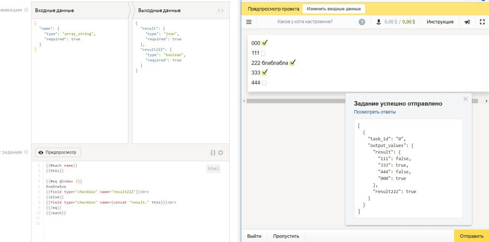
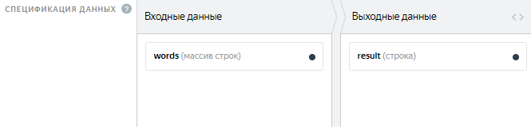
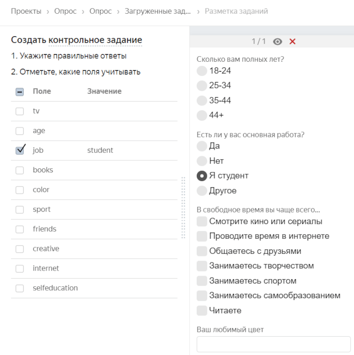
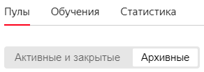

# Все вопросы на одной странице





Если вы ищете ответ на конкретный вопрос, используйте комбинацию клавиш **Ctrl + F** для поиска по странице (в macOS — **Cmd + F**).



#### Если вы еще не используете Толоку и хотите проконсультироваться

[Задайте вопрос](support.md#new)

#### Если у вас возникла проблема при работе с Толокой

В содержании раздела выберите этап, на котором возникла проблема, и найдите решение проблемы в списке. Если не нашли, выберите последний пункт **Другой вопрос**, заполните форму и дождитесь ответа от технической поддержки.

## Регистрация и начало работы {#register-and-start}



1. Проверьте введенный номер. В нем могут быть ошибки.

1. Проверьте номер, указанный в Яндекс ID. Он должен быть указан как основной. Если в Яндекс ID указан другой номер, то смс-код отправится на него.

Также вы можете воспользоваться рекомендациями Справки Яндекс ID. Если они не помогли решить проблему, напишите в [службу поддержки]({{ passport-support }}).





Аккаунт заводится на адрес электронной почты, указанный при регистрации. Привязать аккаунт к другой учетной записи невозможно. Подключить Яндекс Диск другой учетной записи к действующему аккаунту заказчика также не получится.

Чтобы управлять финансами и взаимодействовать с внешними сервисами, нужно входить под логином и паролем, указанными при регистрации. Если эти данные вы не можете передать, то другому пользователю необходимо завести свой аккаунт.





Изменить тип аккаунта с «Заказчика» на «Исполнителя» невозможно.

Для выполнения заданий вам необходимо повторно зарегистрироваться в Толоке как исполнитель, но с другим логином.

Чтобы создать аккаунт исполнителя:

1. Выйдите из аккаунта заказчика.

1. Перейдите на главную страницу [Толоки]({{ toloka-index }}).

1. Нажмите кнопку **Присоединиться**.

1. Следуйте указаниям системы.



Для создания новой учетной записи можно использовать тот же самый номер телефона. Пошаговое описание процесса регистрации вы можете найти на странице [Регистрация и вход]({{ user-documentation }}).







Если вы получили такое предупреждение, убедитесь, что вы правильно ввели номер.

Учтите, что на один номер телефона можно завести только 1 аккаунт заказчика (см. [Пользовательское соглашение]({{ useragreement }})).

Если в [Яндекс ID]({{ phones }}) привязан неверный номер, измените его. Подробнее о привязке номера см. [Справку Яндекс ID]({{ authorization-phone }}).

Если вы не помните ваш аккаунт в Толоке, воспользуйтесь [Восстановлением доступа]({{ restore }}).

Если вы удалили ваш аккаунт в Толоке, создайте новый Яндекс ID и зарегистрируйтесь в Толоке.





Чтобы поменять номер телефона, перейдите в [Яндекс ID]({{ phones }}) и измените основной номер.



Если старый номер вам недоступен, замена номера займет месяц. Подробнее про изменение номера телефона см. [Справку Яндекс ID]({{ change-phone }}).





[Другой вопрос](support.md#help)

## Песочница {#sandbox}



[Зарегистрируйтесь]({{ sandbox }}) в роли заказчика в песочнице.

[Зарегистрируйтесь]({{ sandbox-for-performers }}) с другим аккаунтом в роли исполнителя.

В аккаунте заказчика добавьте исполнителя в список доверенных.

Создайте и запустите задание. Оно появится в списке заданий у ваших доверенных исполнителей. Подробнее об этом можно узнать на [странице помощи](../concepts/sandbox.md).





Проверьте, что:

1. [Пул](../../glossary.md#pool) запущен.

1. Исполнитель добавлен в доверенные.

1. Доверенный исполнитель зарегистрирован в песочнице как исполнитель.

1. Доверенный исполнитель не использовал социальные сети при регистрации.

1. Доверенный исполнитель подходит под установленные [фильтры](../../glossary.md#filters).





Чтобы протестировать свое задание, добавьте себя в доверенные исполнители в Песочнице. Для этого на странице **Исполнители** нажмите **Добавить доверенных исполнителей**. Вводите логин для аккаунта исполнителя с учетом регистра символов.





#### Попробуйте перенести проект без пулов.

Выберите проект для переноса и не указывайте пулы в появившемся окне.Нажмите **Экспортировать**.

#### Если ошибка сохраняется, то обновите токен.

Перейдите в [ Яндекс ID]({{ passport-profile }}).В разделе **История входов и устройства** нажмите **Выйти** на всех устройствах.Запросите новые токены в Песочнице и основной среде.Обновите токен в **Профиле** [Песочницы]({{ sandbox-profile-integration }}).





Для этого понадобится специальная версия приложения Толоки для Песочницы. Чтобы её получить, [напишите в службу поддержки](support.md#support-work-toloka).





Обновить ранее экспортированный проект не получится. Если вы снова клонируете проект из песочницы, то добавится его актуальная копия. Старый проект не изменяется.





Проверьте в предпросмотре пула с аккаунта заказчика, можно ли отправить задание. Если тоже не получится, скорее всего, в вашем проекте ошибка.





Сами задания не переносятся, только конфигурация проекта и настройки выбранного пула. Вы можете скачать размеченные задания из пула в Песочнице и загрузить их в экспортированный пул.

Чтобы скачать только контрольные задания (если вы размечали в интерфейсе), зайдите в **Разметчик**, затем на вкладку **Контрольные задания** и нажмите **Скачать**.





Нет, для каждой версии Толоки нужен отдельный аккаунт. Чтобы создать задание в [Песочнице](../../glossary.md#sandbox), [зарегистрируйтесь](../concepts/access.md) в ней как заказчик, а чтобы выполнить свое задание, зарегистрируйте еще один аккаунт как исполнитель.





Возможные причины:

- Исполнитель не зарегистрирован в песочнице. Аккаунт, зарегистрированный в основной версии Толоки не подойдет. Убедитесь, что вы указали правильный аккаунт _исполнителя_ в качестве доверенного.

- Аккаунт исполнителя авторизован через социальные сети. [Зарегистрируйте]({{ register }}) нового пользователя на Яндексе.



[Другой вопрос](support.md#feedback_oyr_m5s_hlb)

## Настройка проекта {#project}

### Инструкция {#concept_llj_dkp_smb}



Чтобы добавить картинки с помощью ссылок на Яндекс Диск:

1. Используйте ссылку, например: /api/proxy/yadisk/image1.jpg .

1. В настройках профиля заказчика перейдите в **Интеграция с внешними сервисами → Настройки прокси**.

1. Настройте интеграцию с внешними сервисами.

    [Подробно об использовании файлов с Яндекс Диска](../concepts/prepare-data.md).





Существуют три основных варианта решения:

- Разместить инструкцию в самом задании так, чтобы она не сильно перегружала интерфейс.

- Сделать инструкцию [в виде бокового окна]({{ instr-in-form-of-side-window }}), чтобы можно было быстро развернуть и скрыть.

- Разместить инструкцию под катом или [добавить подсказки-вопросы к отдельным элементам интерфейса]({{ hints-questions }}).
Для лучшего результата рекомендуем предварительно отобрать подходящих исполнителей и выставить правила контроля качества.





Нет, но вы можете разместить ссылку на них.





Недопустимые теги удаляются при сохранении проекта — их нельзя использовать. [Список допустимых тегов](../concepts/instruction.md#html).





По умолчанию в обучении отображается инструкцию проекта. Чтобы написать отдельную инструкцию, снимите флажок **Использовать инструкцию проекта**. Не забывайте обновлять инструкцию к обучению, если что-то меняется в инструкции к основному заданию.





Если после сохранения инструкции пропадают теги или атрибуты (например, `checked="true"`), значит они не поддерживаются. Полный список допустимых в инструкции тегов можно найти в [руководстве](../concepts/instruction.md#html-yes).



[Другой вопрос](support.md#help)

### Настройка интерфейса задания {#concept_gss_fkp_smb}



Добавьте к компоненту для вставки картинки параметры `real-size=true` и `screenshot=true`.





Чтобы добавить горячую клавишу, в методе onKey пропишите следующее действие:

```javascript
onKey: function(key) {
          var el = this.getDOMElement().querySelector(".image-annotation-editor__shape-polygon");

          if (key === 'D') {
          el.click();
          el.classList.add('image-annotation-editor__shape_active')
          }
```

Воспользуйтесь [этой библиотекой](https://github.com/vmit/image-annotation), если потребуются дальнейшие модификации редактора по выделению областей.





В режиме предпросмотра проверить загрузку файлов нельзя, но это можно сделать в песочнице, выполнив своё задание. Для этого нужно зарегистрироваться в сендбоксе в качестве исполнителя и добавить логин в доверенные на странице **Пользователи**. Подробнее можете прочитать в этой [статье](../concepts/sandbox.md) .





Если никто из исполнителей не смог отправить задание, скорее всего проблема в валидации в JS. Проверьте её ещё раз.

Перенесите проект в сендбокс и попробуйте выполнить задание самостоятельно в песочнице.





Чтобы проверить, как выглядит задание на экране мобильного телефона, можно переключиться в режим эмуляции в браузерах Chrome или Safari и отредактировать блок CSS.

Также вы можете воспользоваться мобильной версией сендбокса. Чтобы получить к ней доступ, напишите в службу поддержки.





Используйте [конкатенацию](../concepts/t-components/helpers.md#concat), например:

```html
{{field type="checkbox" name=(concat "result." @index ) label=(concat "checkbox –
          " @index) size="L"}}
```





Если это в JS, то укажите в конце индекс:

```javascript
this.getTask().input_values['name'][2]solution.output_values['result'][2]
```

Если в интерфейсе, то следующим образом: 





Попробуйте отключать расширения браузера. Они могут блокировать загрузку iframe.





Чтобы передать `label` во входных данных, укажите в нём имя входного поля.

Например, если у вас входное поле `asd` с типом строка, то компонент может быть записан так: `{{field type="checkbox" name="like" label=asd hotkey="q"}}`.

Если вы хотите передавать различные значения лейблов в разных заданиях или количество чекбоксов может меняться, то воспользуйтесь [конкатенацией](../concepts/t-components/helpers.md#concat).





Текст под кат можно убрать с помощью стилей CSS как в самом задании, так и в инструкции. Пример кода можно посмотреть [здесь]({{ text-under-the-cut }}).





Укажите название входного поля, куда передаёте ссылку, без скобок:

```html
{{field type="button-clicked" name="ads" label="Нажми меня" href=name_escape
            action=true}}
```





1. Посмотрите как это реализовано в шаблоне [«Поиск данных в сети»](../concepts/internet-search.md).

1. Для решения второй задачи вы можете добавить ещё одну валидацию по аналогии с этой:

    ```javascript
    if (solution.output_values.url && solution.output_values.check) {return {task_id:
    this.getTask().id,errors: {'url': {code: 'Вставьте ссылку или отметьте галочкой,что сайта нет'}}}}
    ```





Названия выходных полей должны отличаться: для каждого чекбокса своё имя. Подробнее об этом компоненте [здесь](../concepts/t-components/checkboxes.md).





Добавить валидацию ответа в зависимости от чекбокса возможно с помощью JavaScript. Пример доступен в шаблоне «Поиск данных в сети».





Посмотреть пример вы можете в комментариях к [проекту]({{ how-to-insert-a-calendar }}). В примере есть формат выходных данных и библиотеки, которые нужно подключить.

Чтобы подключить библиотеки:

1. В режиме редактирования проекта нажмите «шестеренку».

1. В открывшемся поле слева введите ссылки и нажмите **Ввод**.





Вероятно, проблема в блоке JS. Попробуйте удалить его содержимое, после чего проверьте кнопку **Отправить** в режиме предпросмотра.





Вы можете сделать это с помощью [конкатенации](../concepts/t-components/helpers.md#concat).

Посмотрите примеры проектов, которые могут помочь вам в создании интерфейса:

- [с чекбоксами]({{ project-with-checkboxes }})

- [с выпадающим списком]({{ project-with-drop-down-list }})

- [с радиобаттонами]({{ project-with-radiobutton }})

Во входном поле массив значений необходимо передавать через запятую. Для каждого из них в интерфейсе будет сформирован вариант ответа. Входные/выходные данные к проектам-примерам указаны в комментариях на codepen.io.





Снять выбор нельзя. Только изменить на другую радиокнопку с ответом.





В этом случае нужно оставить поле необязательным в выходных данных и прописать валидацию в зависимости от ответа исполнителя. Вы можете посмотреть, как это решено в шаблоне «Классификация текстов».





Добавьте `sources="CAMERA"` в атрибуты к компоненту для загрузки картинки, чтобы запретить добавлять фото из галереи.





Попробуйте добавить условие на наличие второй шкалы:

```javascript
setSolution: function(solution) {
var secondScale = this.getDOMElement().querySelector('.second-scale');

if(secondScale) {
secondScale.style.display = solution.output_values.grammar === 'no' ? 'block' : 'none';
}

TolokaHandlebarsTask.prototype.setSolution.call(this, solution);
},
```





Вы можете сделать выделение и выпадающий список с выбором категории. Посмотрите, как это реализовано на [этой странице](../concepts/t-components/image-annotation.md) (вкладка **Выпадающий список**).





Подробнее про расширение шаблона на JS вы можете прочитать [здесь](../concepts/spec-advanced.md).

Чтобы разметка Vue не конфликтовала с синтаксисом Handlebars нужно отключить библиотеку toloka-handlebars-templates и наследоваться от классов Task/TaskSuite.





В шаблоне **Сравнение изображений (Side-by-side)** используется не HTML-тег, а компонент. Поэтому нужно подставить прокси в круглых скобках по [образцу](../concepts/t-components/img.md): `{{img src=(proxy image)}}`.





Установите фон в CSS для элемента `.task` или `.task-suite`. Например, черный:

```css
.task-suite {
background-color: #000000;
}
.task {
background-color: #000000;
}
```

Также вы можете присвоить класс области интерфейса, где находится изображение, и установить фон только для этой области.





Проверить формат ссылки можно с помощью регулярных выражений. Для этого в шаблоне задания добавьте валидацию ссылки на JavaScript c помощью `regexp`.

Например: `var regexp = /^(https://www.myurl.com/).{4,200}$/`.

Или можно добавить регулярное выражение в выходные данные в поле `input` с типом **строка**. Сделайте поле обязательным. Затем добавьте компонент **Поле для ввода текста** в интерфейс задания (в блок HTML) и укажите имя поля в атрибуте `name`:

```html
{{field type="textarea" name="input" width="270px" rows=5}}
```





Добавить валидацию ответа в зависимости от чекбокса можно с помощью JavaScript. Пример доступен в шаблоне «Поиск данных в сети».





В качестве входного поля передайте массив строк. Например, как показано на скриншоте: 

В HTML используйте специальный handlebar, чтобы итерироваться по этому полю. Конструкция будет выглядеть следующим образом:

```html
{{#each words}}
{{field type="radio" name="result" value=this label=this}}
{{/each}}
```





В HTML шаблона укажите следующий код:

```html
<input type=""range"" list=""rng"" class=""res"">
```

а в JS в onRender прописать следующее:

```javascript
onRender: function() {
// DOM-элемент задания сформирован (доступен через #getDOMElement())
//Добавляем служебные переменные
var $root = $(this.getDOMElement());
var _this = this;
var solution = TolokaHandlebarsTask.prototype.getSolution.apply(this, arguments);

$root.on('change', '.res', function(){
var range_result = $(this).val()
_this.setSolutionOutputValue('result', range_result);

return solution;
})

}
```





Расширить окно HTML не получится. Чтобы раскрыть поля JS и CSS, кликните в любую область в пределах поля.





Заключите входное поле в двойные фигурные скобки `not_var{{text}}`.





Заключите входное поле в тройные фигурные скобки `{not_var{{input_field}}}`.

Подробнее об использовании компонента можно узнать в [Руководстве заказчика](../concepts/t-components/html.md).





Да, вы можете не использовать наши компоненты для создания интерфейсов, а создать собственный дизайн страницы с заданиями. Для этого удалите библиотеку из шаблона проекта:

- откройте настройки под «шестеренкой».

- удалите `$TOLOKA_ASSETS/js/toloka-handlebars-templates.js`.

В [Руководстве заказчика](../concepts/spec-advanced.md) описана вся структура классов и как они устроены.





Для решения задачи с динамическим количеством выходных полей воспользуйтесь рекомендациями с [этой страницы](../concepts/t-components/helpers.md).





Мы не задумывали, что в этом окошке будет вестить какая-то сложная разработка. Как правило, контент подготавливают в стороннем редакторе, который имеет подсветку, а в окошко копируют готовый вариант перед обновлением.

В аспекте доступности TolokaHandlebars для редактирования нет отличий между нашим окошком и редактором.





Чтобы текст из входного поля отображался с HTML-тегами, можно использовать `<pre>`. Например:`<pre>not_var{{text}}</pre>`.

Так текст будет записан как есть, в одну строку со скроллом.Чтобы убрать скролл и не растягивать карточку с заданием, добавьте в блок CSS:

```css
.task {
  max-width: 800px;
}

pre {
  white-space: pre-wrap;
}
```





Существуют четыре основных варианта решения:

- [Декомпозировать задачу](../concepts/solution-architecture.md): сначала отбрать картинки с нужными объектами, затем выделить на них области.

- Выделить произвольную область на картинке. Например, поставьте квадрат в правый верхний угол.

    Добавьте информацию об этом в инструкцию для проверяющих.

- Предложить исполнителю пропустить задание и сообщить о нём в личном сообщении. Сообщения проверяются заказчиком и, если объекта действительно нет, задание будет удалено из пула (путем обнуления перекрытия).

- Добавить в интерфейс чекбокс «нет объекта» и настройте в JS проверку, что в задании либо выделен объект, либо поставлена галочка.

    Для контроля добавьте в интерфейс задания информацию о значении этого чекбокса.





Для Толоки задачу нужно декомпозировать. Задание на 30 минут для одного человека со всеми фразами лучше разбить на отдельные фразы и предложить разным исполнителям. Шаблон для создания задания такого типа не потребует от исполнителя установки отдельного диктофона.

Возьмите наше пошаговое описание создания [задания по записи фраз на диктофон](../concepts/record-audio.md).

Во входных данных можно передать фразу, которую должен произнести исполнитель (включить навигацию), и скорость речи (normal speed). Эти данные вам и нужно будет записать в файл с заданиями. О создании файла и его структуре можно прочитать в [Руководстве](../concepts/pool_csv.md).

В предпросмотре по умолчанию 4 задания на странице. Их количество для вашего проекта можно будет указать при загрузке файла с заданиями. [Подробнее о предпросмотре](../concepts/spec.md).

Например, если вам нужно, чтобы один человек произнес одну и ту же фразу 10 раз, сделайте на странице 10 заданий. Стоимость указывается за целую страницу. Определить, сколько человек должно произнести ту или иную фразу, можно с помощью перекрытия в пуле. Кстати, не забудьте о фильтрах в пуле, чтобы отобрать только исполнителей, владеющих русским языком и выдать задание на мобильном: клиент = мобильная Толока.

Вы можете поручить проверку записанных фраз другим исполнителям, создав отдельный проект. Как это сделать кратко описано [здесь](../concepts/record-audio.md).



[Другой вопрос](support.md#help)

### Входные и выходные данные {#concept_cjj_gkp_smb}



Пример шаблона задания по выделению групп изображений вы найдете по [ссылке]({{ selection-of-images-groups }}). Входные и выходные данные, а также фрагмент инструкции — в комментариях к проекту.





Для проверки формата ввода данных можно использовать тип выходного поля с указанием допустимых или минимальных/максимальных значений. Например, для ИНН создайте выходное поле с типом «строка» и укажите минимальную и максимальную длину (например, 10 и 12). Для более сложной проверки введённых данных в шаблоне, используйте RegExp.

Для ввода даты можно добавить в интерфейс задания календарь. Пример календаря вы найдете [здесь]({{ how-to-insert-a-calendar }}).





Размеры изображений могут быть разные.





Диапазон не будет являться фиксированным значением.



[Другой вопрос](support.md#help)

## Настройки пула {#pool-settings}

### Фильтры {#filters}



Да, можно. В [фильтрах](../concepts/filters.md) выберите **Профиль → Город**. Обратите внимание, что данные профиля вводит сам пользователь при регистрации в Толоке. Рекомендуем использовать фильтры **Регион по номеру телефона** и **Регион по IP**.





Да, конечно, один и тот же навык можно назначать и использовать на различных проектах. Но чаще всего один навык используется в рамках одного проекта. Если исполнитель хорошо выполняет одно задание, это не значит, что он так же успешно справится с другим. Кроме того, используя фильтры по давно настроенным навыкам, вы ограничиваете количество доступных исполнителей.





Если речь идет о нескольких проектах, то так сделать не получится.

Вы можете перенести все в один проект и в блоках контроля качества использовать параметр **Помнить значения**. Примеры вы можете посмотреть в статье [Контрольные задания](../concepts/goldenset.md).

Использовать **Агрегацию результатов по навыку** можно, но вам придется перечислить все возможные значения, что, вероятно, будет не очень удобно делать. Возможно, подойдет [другой способ агрегации](../concepts/result-aggregation.md).





Так Толока подает сигнал, что с проектом что-то не в порядке. Белый экран часто появляется при ошибках в [интерфейсе задания](../../glossary.md#task-interface), в том числе JavaScript-коде. Кнопка **Далее** может не реагировать, если в выходной спецификации не хватает какого-то поля, если в ней указаны недопустимые значения или, например, если у вас в JavaScript настроена валидация по несуществующему полю.





Назначить навык в основной версии Толоки можно только для исполнителей, которые выполнили хотя бы одно ваше задание. Любому исполнителю назначить навык возможности нет. Чтобы ограничить поток исполнителей, которые увидят ваш проект, можно воспользоваться [фильтрами](../concepts/filters.md). Например, указать город, дату рождения, пол или какие-то другие параметры, которые есть у нужных вам исполнителей.





Задания из открытого пула доступны всем исполнителям, которые подходят под [фильтры](../concepts/filters.md) в пуле. Вы можете ограничивать доступ, например по навыку.





За количество дней, в течение которых сохраняется тренировочный навык, отвечает параметр **Повторное прохождение**. Навык будет удален через количество дней, указанное в поле **Повторное прохождение**, если исполнитель:

- получил значение навыка ниже значения в поле **Уровень прохождения**;

- не выполнил ни одного задания, к которому привязано обучение, в течение этого срока.

Вашим исполнителям будет нужно пройти обучение заново.





Задания в пулах по умолчанию доступны для веб-версии Толоки и мобильного приложения. Проверьте настройки пула, возможно у вас настроен [фильтр](../concepts/filters.md): `Клиент = Веб-версия Толоки`





Если пользователь не проходит по фильтру, увидеть задание у него не получится. Можно только убрать такой блокирующий фильтр из пула. Протестировать задание можно в [Песочнице](../concepts/sandbox.md), добавив нужного пользователя в список доверенных.





Можно, чтобы отобрать исполнителей для пула используйте [фильтры](../concepts/filters.md).





Задания в пулах по умолчанию доступны для веб-версии Толоки и мобильного приложения. Проверьте настройки пула, возможно у вас настроен [фильтр](../concepts/filters.md): `Клиент = Мобильная Толока`





Вы можете назначить им навык по результатам выполнения заданий в предыдущих пулах. Этот навык укажите в качестве [фильтра](../concepts/filters.md) в новом пуле.





Укажите этот навык в качестве [фильтра](../concepts/filters.md) и в качестве значения установите пустое поле (это равносильно тому, что навык отсутствует).





Если у исполнителя уже есть навык, то добавить ему этот же навык из интерфейса проверки задания нельзя. Можно зайти в профиль исполнителя и отредактировать значение навыка.





Если навык публичный или обучающий, то видят — им приходит сообщение об этом.





Такой возможности нет. Если навык публичный, то исполнитель видит его в своем профиле.





Заказчику не доступна полная информация о каждом конкретном исполнителе. Например, заказчик не видит дату рождения, пол, фамилию и имя. При этом фильтры по дате рождения и полу в настройках пула ему доступны, поскольку они позволяют отобрать группу исполнителей, не получая информации о каждом в отдельности. Это уменьшает риск деанонимизации пользователей.





Это можно сделать с помощью правила [Контрольные задания](../concepts/goldenset.md).

1. Загрузите файл с заданиями при помощи **Умного смешивания**.

1. Укажите `student` в качестве правильного ответа на вопрос. Остальные вопросы не учитывайте (оставьте поля пустыми или не ставьте галочку).

1. Добавьте в пул правило [Контрольные задания](../concepts/goldenset.md): `если процент правильных контрольных ответов = 100, то установить значение навыка Студент = 1`.









[Другой вопрос](support.md#help)

### Контроль качества {#quality-control}



Настройка блоков [контроля качества](../../glossary.md#quality-control) зависит от типа заданий. Ниже приводятся общие рекомендации:

- Обязательно используйте один или несколько способов контроля качества.

- Подсчет [быстрых ответов](../concepts/quick-answers.md) имеет смысл для большинства заданий.

- Если в задании нужно выбрать вариант ответа (например, в флажка), его лучше проверить с помощью [мнения большинства](../concepts/mvote.md) или [контрольных заданий](../concepts/goldenset.md).

- Если задание подразумевает ответ в виде текста, ссылки, загруженного фото и т. д., оптимальным методом контроля качества является [отложенная приемка](../concepts/accept.md). Приемку заданий можно поручить исполнителям. Создайте задания с вопросом (например, «Правильно ли переведена фраза?») и вариантами ответов (например, «да»/«нет»). Настройте [перекрытие](../concepts/dynamic-overlap.md) и проверку [мнением большинства](../concepts/mvote.md).

- Если задание похоже на опрос (например, выбрать более приятные картинки из ряда), [мнение большинства](../../glossary.md#majority-vote) не подходит для контроля качества. Составьте [контрольные задания](../../glossary.md#control-task) с искусственно созданными примерами, где выбор более очевиден.





Рекомендуем добавлять не менее 1% контрольных заданий в пул. А для маленьких пулов — 5–10%.



Все контрольные задания показываются исполнителю только один раз. Если вы используете умное смешивание, то определяете, сколько контрольных заданий должно быть на каждой странице. Если на странице одно контрольное задание, то максимальное число страниц, которое может выполнить исполнитель, равно количеству контрольных заданий в пуле. Если вы увеличиваете количество контрольных заданий на странице, во столько же раз снижается число доступных исполнителю страниц.

Доступных страниц не должно быть слишком мало. Иначе:

- правильно оценить качество его ответов не получится;

- исполнитель не будет заинтересован выполнять такие задания, так как потратит много времени на изучение инструкций, а получит мало заработка.



#### Большой пул 1% контрольных заданий (хорошо)

В пуле 10 000 заданий, из них 100 контрольных (1%). На одной странице 10 заданий, из них 1 контрольное. Следовательно, один исполнитель может сделать до 100 страниц.

#### Маленький пул 1% контрольных заданий (плохо)

В пуле 100 заданий, из них 1 контрольное (1%). На одной странице 10 заданий, из них 1 контрольное. Следовательно, один исполнитель может сделать только 1 страницу.

#### Маленький пул 10% контрольных заданий (хорошо)

В пуле 100 заданий, из них 10 контрольных (10%). На одной странице 10 заданий, из них 1 контрольное. Следовательно, один исполнитель может сделать до 10 страниц.



Если в открытом пуле мало контрольных заданий, [добавьте новые контрольные задания](#add-gs).





Если пул большой, а контрольных заданий мало, может сложиться ситуация, что активным исполнителям, которые сделали много заданий в проекте, перестают показываться новые страницы с заданиями. Это происходит, когда исполнитель выполнил все контрольные задания в пуле.





Чтобы отсеивать исполнителей, используйте блок контроля качества [Контрольные задания](../concepts/control.md). Чтобы ранжировать исполнителей по качеству ответов на контрольные задания, используйте [навык](../concepts/nav.md).







Чтобы новые страницы с заданиями стали доступны всем исполнителям, в том числе тем, которые уже выполнили часть заданий в пуле:

1. Остановите пул.

1. [Загрузите файл](../concepts/task_upload.md) с новыми контрольными заданиями.

1. Запустите пул.

Для открытого пула мы не рекомендуем делать контрольные задания из уже выполненных заданий другого типа. Так как исполнители, которые уже дали на них ответы, не смогут повторно выполнить такие задания как контрольные. Чтобы эти исполнители смогли продолжить выполнять страницы с заданиями, контрольные задания в пуле должны быть новыми.





Правило контрольных заданий начинает действовать после того, как исполнитель дал ответы на заданное число контрольных заданий. Если у вас в пуле есть и [обучающие](../../glossary.md#training-task), и контрольные задания, то вы можете установить учитывать ответы на те и другие (параметр **Количество ответов**) или только на контрольные (параметр **Количество контрольных ответов**).

Как только нужное количество ответов набрано, Толока подсчитывает процент правильных и неправильных ответов и выполняет действие (назначить навык, заблокировать в пуле или на проекте). Далее этот процент обновляется по мере выполнения заданий исполнителем. Количество последних ответов исполнителя, которое учитывается в расчете, задается в поле **Учитывать последних ответов на контрольные и обучающие задания**. Если оставить его пустым, будут учитываются все ответы исполнителя в пуле.





Лучше использовать один [навык](../../glossary.md#skill) в проекте. Можно выбрать способ подсчета навыка:

- Подсчет навыка для каждого пула отдельно. Текущее значение навыка — это значение навыка в пуле, который выполнялся последним. Такой вариант удобен, если:

    - Пулы предназначены для разных групп исполнителей (например, настроены фильтры по городам, странам).

    - Пулы запускаются последовательно, и вы не хотите учитывать качество ответов в предыдущих пулах при подсчете навыка в выполняемом пуле.

    Этот способ подсчета действует по умолчанию при добавлении блока контроля качества в пул. Для блока по контрольным заданиям оставьте пустым поле **Учитывать последних ответов на контрольные и обучающие задания**.

- Подсчет навыка по всем выполненным заданиям в проекте. Такой вариант удобен, если пулы небольшие и вам не нужно рассчитывать навык для каждого пула.

    Этот способ подсчета доступен только для навыков по контрольным заданиям. Чтобы использовать его, заполните поле **Учитывать последних ответов на контрольные и обучающие задания** в блоках контроля качества в пулах.





[Обучающие](../concepts/train.md) и контрольные задания будут иметь спецификацию проекта. Но вы можете сделать отдельный проект и разместить в нем необходимые задания, а потом по ответам из них назначить навык, по которому вы будете допускать исполнителей к основному проекту.





Экзаменационным мы называем пул, в котором содержатся только контрольные задания. Он обычно делается небольшим и служит для проверки того, как исполнители научились выполнять задание после чтения инструкции и прохождения [обучения](../concepts/additionals-q.md#selection). В отличие от пула для основной разметки, ответы на все задания вам уже известны. Стоимость можно установить нулевой.

По результатам ответов на контрольные задания вы можете назначить исполнителям навык и далее указать его в основном пуле в качестве фильтра. Например, `МойНавык = 80 или = отсутствует`. Составление экзамена не обязательно — в простых заданиях достаточно тренировки, но многие заказчики используют также и экзамен.





Да, в настройках [быстрых ответов](../concepts/quick-answers.md) указывается время за выполнение 1 страницы с заданиями.





Действительно, при копировании настроек фильтров и контроля качества уже добавленные вручную настройки заменяются. Мы предупреждаем об этом в окне копирования настроек.





К сожалению, да, может. Поэтому мы рекомендуем перед боевым заданием делать обучение или экзамен, чтобы до боевого пула добирались только те, кто хорошо прошел предыдущий этап отбора.





При загрузке заданий используйте умное смешивание, тогда экзамен будет с бесконечным перекрытием.

Однако это чревато тем, что вы будете тратить на экзамен много денег. Возможно, его стоит открывать тогда, когда открывается боевой пул, и закрывать, когда разметка боевого пула завершается.





Вы можете добавить [обучающий пул](../concepts/train.md), чтобы протестировать исполнителей. По результатам прохождения тестирования выдавайте навыки исполнителям в соответствии с тем, что они хорошо выполняют.

Затем откройте пулы только для исполнителей, имеющих определенный навык — для этого используйте [фильтры](../concepts/filters.md).





Умное смешивание задается при загрузке заданий в пул. После создания пула нажмите **Загрузить** и выбираете соответствующий способ формирования страниц с заданиями. При этом вы можете загрузить их отдельными файлами, либо одним файлом, расположив в любом порядке.





Если исполнителю уже начислены деньги за задания, то обратно их не вернуть.





Да, может, если оба пула ему доступны. Чтобы ограничить доступ исполнителя к следующим заданиям, используйте правило [Выполненные задания](../concepts/submitted-answers.md) — выберите блокировку на проекте.





Нет, ответы такого исполнителя автоматически не исключаются из итогового файла.

Но вы можете это сделать самостоятельно. Для этого при скачивании результатов выберите опцию **Не учитывать ответы заблокированных пользователей** — из результатов удалятся ответы заблокированных в момент выгрузки исполнителей. Также вы можете отправить все ответы заблокированных исполнителей на повторное выполнение другим толокерам — для этого используйте [Повторное выполнение заданий после блокировки исполнителя](../concepts/restore-task-overlap.md).





Да, можно. В этом случае первый пул сделайте на базе [обучающего](../../glossary.md#training-pool). А второй — экзамен — на базе основного пула. Если в нем будут только контрольные и/или обучающие задания, такой пул может иметь нулевую стоимость.

В экзаменационном пуле можно назначить навык, который будет определять результат сдачи экзамена и служить допуском в основной пул. Например: `если количество ответов ≥ 10, то установить навык из поля <экзаменационный навык> % правильных ответов`. В требованиях к исполнителям экзаменационного пула укажите: `<экзаменационный навык> < 80 или = отсутствует>`. Установите в основном пуле фильтр: `<экзаменационный навык> >= 80 и (<основной навык> >= 70 или = отсутствует)`. Значения навыка вы сможете подобрать в зависимости от того, насколько хорошо исполнители справляются с вашим заданием.





Считаются все ответы в задании. Если на какой-то вопрос ответ отличается, результат всего задания засчитывается как несовпадающий с ответами других исполнителей.





Нет, при такой настройке каждый раз, когда будет выполняться условие правила, исполнителю будет устанавливаться `навык = 1`. Чтобы изменять значения по мере проверки заданий, понадобится «ступенчатое» правило (несколько одинаковых правил) с разным значением параметра **Количество проверенных ответов**.





Технически с одним заданием в обучении — никак. Навык будет или `0`, или `100`. Рекомендуем добавить несколько задний, хотя бы 2: на первом исполнитель потренируется, а второе сможет уже выполнить верно. Тогда можно начать допускать к основному пулу со значением навыка `50`.

Также вы можете создать обучающий пул на основе обычного. Назначайте навык правилом [Контрольные задания](../concepts/goldenset.md) — тогда к основному пулу вы можете допустить исполнителей с любым уровнем навыка, даже нулевым. Но мы бы не советовали допускать к разметке тех, кто не справился с обучением.





Нет. Но вы можете создать пул на базе основного с типом **Тренировка** с обучающими заданиями и в нем выставить отложенную приемку.





Нет, не видят.





Если вы передаете тексты во входные данные, то достаточно загрузить в пул 2 разных задания: в одном из них в поле `INPUT:<имя входного поля>` вы передадите текст № 1, в другом — текст № 2. А если текст в самом шаблоне задания в блоке HTML, то да, нужно клонировать проект. Чтобы исполнитель мог сделать только одно задание в вашем проекте, используйте правило [Выполненные задания](../concepts/submitted-answers.md). Можно назначить навык или заблокировать исполнителя после того, как он отправит один ответ.





Нет, исполнители не знают о блокировке.





Сами задания не переносятся, только конфигурация проекта и настройки выбранного пула. Но вы можете скачать размеченные задания из пула в **Песочнице** и загрузить их в созданный пул. Чтобы скачать только контрольные задания (если вы размечали их в интерфейсе), зайдите в **Разметчик**, затем во вкладку **Контрольные задания** и нажмите **Скачать**.





В поле **Учитывать последних ответов на контрольные и обучающие задания** указывается количество последних ответов исполнителя. Если у вас задание с отложенной приемкой, то, чтобы настроить правило по вашей логике, необходимо указать `3` в параметре **Количество проверенных ответов**.





Чтобы выполнять действия с исполнителями (назначение навыка, блокировка), основываясь на мнении большинства, нужно добавить в пул соответствующее [правило](../concepts/mvote.md).

Не забудьте включить опцию **Сохранять порядок заданий** в параметрах пула. Мнение большинства применяется на проектах с заданными значениями (с радиобаттонами или чекбоксами). Для полей со свободным вводом или файлов это правило работать не будет.





Чтобы ответ на контрольное или обучающее задание был засчитан как верный, он должен полностью совпасть с эталоном. Для этого текст нужно нормализовать с помощью JavaScript: удалить пробелы, знаки препинания, специальные символы и заглавные буквы, а результат записать в отдельное выходное поле. Такой обработанный ответ можно уже сравнивать с контрольным.

Другой вариант отбора исполнителей для проекта такого типа — отложенная приемка.





Это количество любых ответов на контрольные вопросы.





Вы можете создать пул заданий для всех исполнителей и выделить в нем навыки, присвоенные исполнителям. Тогда вы сможете открывать задания только для тех исполнителей, которые имеют нужные навыки.





Возможные причины:

- Вы остановили [обучающий пул](../../glossary.md#training-pool), и тем самым ограничили количество исполнителей имеющих доступ к заданиям. Запустите обучающий пул снова. Исполнителей, которым доступны задания, станет больше.

- Установлены слишком жесткие фильтры, например строгое ограничение по навыку, которого нет у большинства исполнителей.

- Слишком много исполнителей заблокированы. Сделайте правила контроля качества мягче.





- Мотивируйте исполнителей, назначив [публичный навык](../concepts/nav-create.md#public) и [динамическое ценообразование](../concepts/dynamic-pricing.md).

- Постарайтесь [повысить рейтинг проекта](../concepts/project_rating_stat.md), чтобы ваше задание оказалось выше в списке заданий у исполнителей.

- Отрегулируйте [соотношение скорости и качества](../concepts/adjust.md).

- Установите более высокий [приоритет](../concepts/pool_poolparams.md#priority) пула среди всех пулов проекта.



[Другой вопрос](support.md#help)

### Перекрытие {#overlap}



Перекрытие определяет, сколько исполнителей будут выполнять задание в пуле.

Оптимальное перекрытие — это перекрытие, по результатам которого заказчик получает устраивающее его качество ответов. Для большинства заданий без [отложенной приемки](../../glossary.md#assignment-review) достаточно перекрытия от «3» до «5». Если у вас простое задание, скорее всего, вам хватит перекрытия «3». Для заданий с отложенной приемкой установите перекрытие «1».





Да. [Откройте режим редактирования пула](../concepts/pool-edit.md) и установите новое значение перекрытия. Перезапускать пул не требуется. Обновление настроек обычно происходит быстро, но если заданий много, то может занять несколько минут.





Да, такое может произойти. Необходимо установить достаточный интервал закрытия пула.





В этом случае, если у вас не наберется 3 одинаковых ответа для задания (порог ответов), то ни один из исполнителей не будет считаться ни плохим, ни хорошим, потому что система не будет знать, кто из этих исполнителей ошибся.

А если вы установите `порог ответов = 2` при `перекрытии = 3`, то два исполнителя, у которых совпали ответы, будут считаться хорошими, а третий исполнитель, ответ которого отличается, будет плохим.





Да, можно. Настройте [динамическое перекрытие](../concepts/dynamic-overlap.md) (incremental relabeling, IRL).





Чтобы одно и то же задание выполнило несколько разных исполнителей, используется перекрытие. Его значение устанавливается в [настройках пула](../concepts/pool-edit.md).





В прогресс-баре указано количество страниц заданий с учетом перекрытия. Если перекрытие больше единицы, то количество страниц заданий будет отличаться от общего количества заданий.



[Другой вопрос](support.md#help)

## Добавление заданий в пул {#add-task-to-pool}

### Загрузка заданий {#concept_iy1_3kh_5mb}



Количество заданий зависит от сложности и длительности выполнения. Не делайте страницы заданий слишком большими: они неудобны для исполнителей (например, при сбоях в соединении с интернетом) и не пользуются спросом.





Попробуйте выполнить задания сами, попросите своих друзей и коллег. Найдите среднее время выполнения и добавьте к нему 50%.





Вы можете указать сколько заданий будет на странице при загрузке заданий в пул. Подробнее о способах распределения заданий по страницам можно узнать [здесь](../concepts/distribute-tasks-by-pages.md).





Про подключение Яндекс Диска вы можете прочитать [здесь](../concepts/prepare-data.md).

В шаблоне проекта должно быть прописано, например, следующее:

``, где `img` — входное поле строкового формата.

Для тестирования используйте файл `example.jpg`. Его URL вы можете найти в **Профиль → Интеграция с внешними сервисами**.





Каждое задание должно быть описано на отдельной строке в файле с заданиями. Подробнее об этом вы можете прочитать [здесь](../concepts/pool_csv.md).

Когда вы создадите пул, то в нем будет настройка количества заданий на странице.





Заэкранируйте запятые обратным слэшем `\`.





Для загрузки файла используйте кнопку **Загрузить результаты**. Формат можно посмотреть [здесь](../concepts/accept.md).

Проверка ответов выполняется в файле с заданиями.





Текст из поля `hint` будет показан исполнителю в верхней части задания на красном фоне, если он в обучающем задании даст ответ, который отличается от указанного правильного.

#### Пример


Если текст из поля `hint` необходимо отразить в несколько строк, то переносы добавляются в файл, а текст заключается в кавычки.





Add your text here — это подсказка, которая говорит о том, что текст в поле вы можете заменить на свои данные для задания. О структуре файла и его заполнении можно узнать [здесь](../concepts/pool_csv.md).





Из-за наличия кавычек в одном слове загружать ответ следует таким образом: `"Сколько букв в слове ""Лихтенштейн"""`. Если внутри текста есть экранирование кавычками, то весь текст следует заключать в кавычки. Подробнее описано в [Руководстве](../concepts/pool_csv.md#string).





Проверьте поле `hint`. Для обычных заданий это поле должно быть пустым.





В файле с основными заданиями должны быть заполнены столбцы с заголовками `INPUT`. Вы можете увидеть эти заголовки, если скачаете образец файла из пула.

Если создаете контрольные задания, то заполните столбцы с правильными ответами — `GOLDEN`.

Если обучающие, то также понадобится заполнить столбец `HINT:text`. Для основных заданий все столбцы кроме `INPUT` не нужны, их можно удалить.

Формат файла должен быть TSV, XLSX или JSON, кодировка — UTF-8.

Если вы разместили файлы на Яндекс Диске, посмотрите видео, [как указать ссылки на них в файле с заданиями](https://youtu.be/hIJ6IGaDgeU).

Подробнее о создании файла в [Руководстве](../concepts/pool_csv.md). Если при загрузке возникают ошибки, поищите вашу ошибку на этой [странице](../concepts/task_upload.md).





Ошибка будет возникать, если на вход ожидается тип URL, а приходит строка.

Причин может быть две:

- Входное поле имеет тип "ссылка".

- Пул работает на неактуальной версии проекта. То есть создан до того, как вы изменили тип входного поля.





Зависит от задания. Технически можно много.

Но, во-первых, исполнители неохотно берутся за задания, которые требуют много времени на выполнение. То есть, они скорее сделают 10 заданий по одной минуте, чем одно задание на 10 минут.

Во-вторых, при большом количестве заданий на странице может быть проблема с загрузкой файлов для разметки. Например, картинок.

Третий момент — контроль качества и оценка выполнения всей страницы. Если вы используете дооценку заблокированных исполнителей, то лучше дробить задание на более мелкие части, чтобы в переразметку отправлялось меньше заданий. Это позволит уложиться в бюджет.





Загруженные ссылки на картинки в файле Толока разделит на страницы в зависимости от того, какой способ распределения заданий вы выбрали. Подробнее читайте на странице [Способы распределения заданий](../concepts/distribute-tasks-by-pages.md).





Порядок следования полей в файле значения не имеет. Можете делать так, как удобно.





Загрузить в пул задания с разными ответами через интерфейс невозможно. Можно только через [API](../../api/concepts/tasks.md).





Если в настройках пула включена опция **Сохранять порядок заданий**, то разметка новых заданий начнется после того, как будут взяты в работу предыдущие. Если опция выключена, то нет и гарантии, что задания будут раздаваться последовательно.





Массив строк во входных данных записывается через запятую. Например: `INPUT:types   text1, text2, text3, text4`





Все значения записываются в один столбец. Не забудьте экранировать кавычки. Подробнее об экранировании кавычек для формата JSON можно узнать в [Руководстве](../concepts/pool_csv.md#json).





Нет, если вы загрузите в пул файл с несуществующими заголовками, система выдаст ошибку загрузки. Все обязательные INPUT поля, используемые в спецификации должны быть в файле с заданиями. Лишних полей и столбцов быть не должно.

Если вы не хотите показывать какие-то данные исполнителям, но они вам нужны в файле, создайте для них необязательные скрытые входные поля в проекте.





Текст в поле GOLDEN должен в точности совпадать с эталоном.

Обычно, если копировать ссылку из браузера на определенный сайт, они будут иметь одинаковый формат. Другое дело, если ссылка была обрезана или набрана на клавиатуре.

Проверьте ссылки, которые используете. Решить задачу с унификацией ссылок можно несколькими способами:

- Добавить требования к формату ссылок в инструкцию и подсказки в обучении.

- Обрезать полученные ссылки в js с помощью regexp и записать результат в новое выходное поле, а после сравнить полученное значение с эталоном.





Настройки умного смешивания указываются для файла — не для пула.

При первой загрузке файла указанные настройки будут применяться для всех файлов, загруженных в дальнейшем в этот пул.





Все значения записываются в один столбец. Не забудьте экранировать кавычки.

Подробнее об экранировании кавычек для формата JSON можно узнать в [Руководстве](../concepts/pool_csv.md).





Task — это отдельное задание. Task suite — страница с заданиями. Исполнитель получает оплату за страницу заданий.







Чтобы посмотреть лог обработки, нажмите **Подробнее об ошибках загрузки**. Лог обработки записан в формате JSON. Объекты внутри `result` соответствуют номеру строки загружаемого файла. Строки, обработанные с ошибкой, имеют статус `"success": false`.



Работать с большим логом удобнее, если скопировать его в текстовый редактор.





#### Ошибки в заголовках столбцов

Если [заголовки столбцов](../concepts/pool_csv.md) некорректны, файл будет полностью отклонен. В остальных случаях указано количество заданий с ошибками обработки.

#### Таблица ошибок обработки

```json
"parsing_error_of": "https://tlk.s3.yandex.net/wsdm2020/photos/2d5f63a3184919ce7e3e7068cf93da4b.jpg\t\t", "exception_msg": "the nameMapping array and the sourceList should be the same size (nameMapping length = 1, sourceList size = 3)"
```

#|
|| **Описание** | **Как исправить** ||
||**Лишние знаки табуляции.**
Если в загружаемом файле после данных или ссылки стоит количество разделителей столбцов `\t` больше, чем задано число столбцов во [входных данных](../../glossary.md#input-output-data), то появится сообщение об ошибке.

Например, когда во входных определен 1 столбец, а в файле после ссылки прописано ещё два знака табуляции `\t\t`, то получится 3 столбца, 2 из которых лишние. | Удалите лишние разделители столбцов, в приведенном выше примере ошибки — оба знака (`\t\t`).||
|#

```json
"exception_msg": "the nameMapping array and the sourceList should be the same size (nameMapping length = 4, sourceList size = 6)"
```

#|
|| **Описание** | **Как исправить** ||
||**Не совпадает количество полей в заголовке и в строке.** | Проверьте, что:

- указано верное количество знаков табуляции в структуре файла;
- строковые значения, содержащие знак табуляции, заключены [в кавычки](../concepts/pool_csv.md#string)`" "`.||
|#

```json
"code": "VALUE_REQUIRED", "message": "Value must be present and not equal to null"
```

#|
|| **Описание** | **Как исправить** ||
||**Не указано значение обязательного поля входных данных.** | Проверьте, что заполнены все столбцы с обязательными полями входных данных.||
|#

```json
"code": "INVALID_URL_SYNTAX", "message": "Value must be in valid url format"
```

#|
|| **Описание** | **Как исправить** ||
||**Данные в поле с типом «ссылка» («url») некорректны.** | Проверьте, что:

- Все ссылки начинаются с префикса `http://`, `https://` или `www`.
- При [загрузке файла с Яндекс Диска](../concepts/prepare-data.md) по относительной ссылке, указан тип данных **строка** для [поля входных данных](../concepts/incoming.md).||
|#

```json
"exception_msg": "unexpected end of file while reading quoted column beginning on line 2 and ending on line 4"
```

#|
|| **Описание** | **Как исправить** ||
||**В строке стоит непарная кавычка.** | Проверьте, что все кавычки [экранированы](../concepts/pool_csv.md#string).||
|#





Одно и то же задание может попасть на разные страницы, если:

- Существует динамическое перекрытие (incremental relabeling, IRL). Например на странице было 5 заданий, по 4-м из них ответы согласовались так, что общий ответ зачелся как верный. Пятое задание будет замешано в другой набор, поскольку оно не попало в финальный ответ и его необходимо «дооценить».

- У разных заданий существует разное перекрытие. Те задания, у которых перекрытие указано больше, будут дополнительно показываться в наборах с другими оставшимися заданиями в пуле.

- Если [правило контроля качества](../../glossary.md#quality-control-rule) меняет перекрытие у задания, то оно окажется в другом наборе.





Если вы передаёте тексты во входные данные, то достаточно загрузить в пул 2 разных задания: в одном из них в поле `INPUT: <имя входного поля>` вы передадите текст № 1, в другом — текст № 2.

Если текст в самом шаблоне задания, в блоке HTML, то нужно клонировать проект. Чтобы исполнитель мог сделать только одно задание в вашем проекте, используйте правило [Выполненные задания](../concepts/submitted-answers.md). Можно назначить навык или заблокировать исполнителя, после того, как он отправит один ответ.



[Другой вопрос](support.md#help)

### Использование файлов из облачных хранилищ {#concept_yvk_jkh_5mb}



Если картинки, аудио или видео с Яндекс Диска не отображаются в [инструкции](../../glossary.md#instructions) или на [странице задания](../../glossary.md#task-suite), убедитесь, что вы правильно подключили Диск и загрузили файлы.

- [Как подключить Яндекс Диск](../concepts/prepare-data.md#prepare-data__connect)
- [Как загрузить файлы для инструкции](../concepts/prepare-data.md#prepare-data__instruction)
- [Как загрузить файлы для задания](../concepts/prepare-data.md#prepare-data__interface)



Для создания задания возьмите за основу [шаблон для разметки видео]({{ templates-video-new }}).

Чтобы разместить ваши видеоролики на Яндекс Диске, его нужно подключить и настроить проект.

Подробная видеоинструкция об этом [в нашем блоге]({{ toloka-blog-yadisk }}).





Проблема в шаблоне задания. Проверьте, что:

- Для поля входных данных, куда вы передаете ссылку на файл, в проекте указан тип «строка».

- В компоненте в шаблоне задания используется выражение proxy.

- Формат относительных ссылок в файле с заданиями указан верно: <уникальное имя>/<путь и имя файла>.

Подробная инструкцию и видео на странице [Использование файлов с Яндекс Диска](../concepts/prepare-data.md).





- В настройках проекта в поле **Входные данные** указан тип _ссылка_. Необходимо выбрать тип _строка_.

- В [файле с заданиями](../../glossary.md#tsv) указаны абсолютные ссылки на файлы для заданий. Необходимо вставить ссылку вида `<уникальное имя>/<путь и имя файла>`. Например: `yadisk/image1.jpg` или `yadisk/photos/image1.png`.

- Фото с Яндекс Диска используются в инструкции к заданию в мобильном приложении. Чтобы фото отобразилось в инструкции, используйте только прямые ссылки.

- Файлы удалены или находятся не в той папке на Диске, на которую ведет ссылка.

- OAuth-токен не активен. Обновите токен на странице [Интеграция]({{ integration }}).

Чтобы файлы, загруженные на Яндекс Диск (картинки, аудио, видео), отображались у исполнителя, нужно:

1. Подключить Яндекс Диск в профиле.

1. Установить тип строка для поля [входных данных](../../glossary.md#input-output-data).

1. Вставлять ссылку на файл при помощи компонента `proxy`.

[Подробная инструкция](../concepts/prepare-data.md)







Попробуйте воспользоваться рекомендациями с [этой страницы]({{ yadisk-uploading }}) или написать в службу поддержки Яндекс Диска.





Чтобы добавить картинки с помощью ссылок на Яндекс Диск, используйте ссылку вида `/api/proxy/<имя прокси>/<имя файла>.<тип>`. Например: `/api/proxy/my-proxy/example.jpg`

Подробнее об этом читайте в разделе [Добавить файлы в инструкцию](../concepts/prepare-data.md).





Проблема в шаблоне задания. Проверьте, что:

- Для поля входных данных, куда вы передаете ссылку на файл, в проекте указан тип «строка».

- В компоненте в шаблоне задания используется выражение proxy.

- Формат относительных ссылок в файле с заданиями указан верно: <уникальное имя>/<путь и имя файла>.

Подробная [инструкция и видео](../concepts/prepare-data.md).





Можно взять за основу шаблон [для разметки видео]({{ templates-video }}).

Чтобы разместить ваши видеоролики на Яндекс Диске, его нужно подключить и настроить проект.

Подробная видеоинструкция есть в нашем [блоге]({{ toloka-blog-yadisk }}).



[Другой вопрос](support.md#help)

### Обучение-экзамен-реабилитация {#concept_i2g_kkh_5mb}



Обучающие и контрольные вопросы будут иметь спецификацию проекта. Но вы можете сделать отдельный проект и разместить в нем инструкцию, опросник, приложить примеры видео. А потом по ответам назначить навык. По этому навыку вы будете допускать исполнителей к основному проекту.





В пуле отображается общее число исполнителей, которые выполнили там хотя бы одну страницу заданий. Тренировочный навык может со временем теряться из-за настройки [повторного прохождения](../concepts/train.md). Она позволяет заново пройти обучение по истечении указанного срока, если исполнитель так и не приступил к заданиям в привязанных пулах или сделал слишком большой перерыв в выполнении заданий (например, из-за [блокировки](../../glossary.md#banning-tolokers)). Поэтому в тренировочном навыке отображаются те исполнители, которые либо недавно завершили обучение, либо регулярно выполняют ваше задание и не дают навыку исчезнуть.





Экзаменационным мы называем пул, в котором содержатся только контрольные задания. Обычно он делается небольшим и служит для проверки того, как исполнители научились выполнять задание после чтения инструкции и прохождения обучения.

В отличие от пула для основной разметки, ответы на все задания вам уже известны. Стоимость можно установить нулевой. По результатам ответов на контрольные задания вы можете назначить исполнителям навык и далее указать его в основном пуле в качестве фильтра. Например, `≥ 80` или `≠ Отсутствует`. Составление экзамена не обязательно, в простых заданиях достаточно тренировки. Но многие заказчики используют также и экзамен.





За количество дней, в течение которых сохраняется тренировочный навык, отвечает параметр **Повторное прохождение**.

Навык удаляется спустя указанное количество дней, если исполнитель:

- Получил значение навыка ниже значения в поле **Уровень прохождения**.

- Не выполнил ни одного задания, к которому привязано обучение, в течение этого срока.

С истекшим навыком вашим исполнителям нужно проходить обучение заново.





В файле задания оставьте пустыми контрольные значения для необязательных выходных данных.





1. Перейдите в карточку исполнителя.
1. Выберите вкладку **Профиль**.
1. Найдите в списке нужный навык и скачайте историю его изменений.





В обучающем пуле задания имеют бесконечное перекрытие. Пока открыт пул, к которому оно привязано, и запущено само обучение, задания из него будут видны исполнителям. Подробнее об [обучающих пулах](../concepts/train.md).





Текст в поле GOLDEN должен в точности совпадать с эталоном.

Обычно, если копировать ссылку из браузера на определенный сайт, они будут иметь одинаковый формат. Другое дело, если ссылка была обрезана или набрана на клавиатуре.

Проверьте ссылки, которые используете. Решить задачу с унификацией ссылок можно несколькими способами:

- Добавить требования к формату ссылок в инструкцию и подсказки в обучении.

- Обрезать полученные ссылки в js с помощью regexp и записать результат в новое выходное поле, а после сравнить полученное значение с эталоном.





Умное смешивание задается при загрузке заданий в пул. После создания пула нажмите **Загрузить** и выбираете соответствующий способ формирования страниц с заданиями. При этом вы можете загрузить их отдельными файлами, либо одним файлом, расположив в любом порядке.





Через интерфейс пул можно закрыть вручную в любое время, но задать определенное количество прошедших обучающий пул и затем закрыть его автоматически не получится.





Обучение помогает исполнителям тренироваться выполнять задание и разобраться с инструкцией.

На основе его результатов заказчик может отобрать в основной пул тех исполнителей, которые справились достаточно хорошо.

Однако, одно лишь прохождение обучающего пула не гарантирует, что тот или иной исполнитель станет в дальнейшем качественно выполнять основные задания. Вероятно, исполнители, которые прошли обучение с высоким уровнем точности, могли обменяться друг с другом правильными ответами.

Помимо обучения нужно добавлять в основные пулы правила контроля качества и [контрольные задания](../concepts/control.md). Это позволит контролировать качество исполнителя на всём протяжении его работы над заданием.

Если же задание предполагает ответы в свободной форме или получение файлов с данными, используйте **Отложенную приемку**, чтобы выплачивать вознаграждение после проверки.





Это техническая особенность [обучающих пулов](../../glossary.md#training-pool). В них задания загружаются только таким образом. Если вы хотите использовать в обучении способ **Указать вручную**, создайте основной пул, укажите тип пула **Тренировка** и установите нулевую стоимость.





Первый пул сделайте на базе [обучающего пула](../../glossary.md#training-pool). А второй — на базе основного и укажите тип пула **Экзамен**. Если в нем будут только контрольные и/или обучающие задания, такой пул может иметь нулевую стоимость.

В экзаменационном пуле можно назначить навык, который будет определять результат сдачи экзамена и служить допуском в основной пул. Например: `Если количество ответов ≥ 10 , то установить навык из поля <экзаменационный навык> % правильных ответов.`

В требованиях к исполнителям экзаменационного пула укажите: `<экзаменационный навык> <80 или = отсутствует>`.

Установите в основном пуле фильтр: `<экзаменационный навык> >=80 и <основной навык> >=70 или = отсутствует>`. Значения навыка вы сможете подобрать в зависимости от того, насколько хорошо исполнители справляются с вашим заданием.





Создайте основной пул с типом **Тренировка**. Добавьте только [обучающие задания](../../glossary.md#training-task). Назначьте навык правилом **Контрольные задания**. Чтобы допустить к основным заданиям исполнителей с любым уровнем навыка, установите в основном пуле фильтр: `<навык> >= 0` или `<навык> ≠ 0`.

Но мы не советуем допускать к основным заданиям тех, кто не справился с обучением.





Если установлено неполное прохождение и указано количество страниц, которое нужно пройти, то для прохождения обучения не нужно проходить обучение целиком. Если такие настройки не выставлены, то для получения тренировочного навыка нужно пройти все задания в обучающем пуле.





Создать реабилитацию можно также, как и экзамен. В параметрах пула выберите тип **Реабилитация**. В фильтрах реабилитационного пула укажите верхнее и нижнее значение <основного навыка> исполнителей, которым он будет доступен.

Например, если в основную разметку попадают исполнители с навыком 70 и выше, то в реабилитационный пул можно отправить тех, чей навык между 69 и 40.

Чтобы получилось «окно», нужно указать навык дважды с верхним и нижним значением. Например: `<основной навык > <70 и <основной навык > >=40`.
Советуем не делать экзамен и реабилитацию слишком длинными — исполнители не любят выполнять бесплатные задания. Достаточно 10–20 заданий в зависимости от их сложности.





В сущность обучения заложена функция отбора исполнителей для основного задания. Именно поэтому обучение должно быть связано с основным пулом и становится неактивным, как только этот пул закрывается.

Исполнитель проходит обучение, чтобы получить доступ к оплачиваемым заданиям. Если обучение необязательное, то скорее всего, будет мало желающих его проходить. Технически такое «факультативное» обучение можно реализовать на базе основного пула с обучающими заданиями внутри.

Чтобы оно показывалось отдельно от других пулов, снимите галочку **использовать описание проекта** и укажите в этом поле, что это необязательный обучающий набор заданий. В параметрах пула выберите тип **Тренировка**





В обучающем пуле отложенная приемка невозможна.

Но вы можете создать обучающий пул с типом **Тренировка** на базе обычного пула и в нем выставить отложенную приемку.





Создать такое обучение невозможно, потому что для того, чтобы ответ засчитался верным, он должен в точности совпасть с эталоном.

Для проектов со свободным вводом или файлами-вложениями можно сделать отборочное задание с отложенной приемкой. Тех, кто хорошо справится, можно будет пропустить по навыку в основной пул.





Необходимо в блоке **Результат проверки** в поле **Учитывать последних заданий** указать количество последних ответов исполнителя.

Например, требуется создать экзамен размером в три задания по одному заданию на страницу. Если исполнитель выполняет два из трех правильно, то получит навык.

Если задание с отложенной приемкой, то чтобы настроить правило по такой логике, необходимо указать 3 в параметре количество проверенных ответов. На скриншоте в первом случае навык получат все исполнители, которые выполнили 3 страницы заданий и ответы которых проверены, а во втором — только те, у которых приняты 2 или 3 задания.






Чтобы ответ на контрольное или обучающее задание был засчитан как верный, он должен полностью совпасть с эталоном. Для этого текст нужно нормализовать с помощью JavaScript: удалить пробелы, знаки препинания, специальные символы и заглавные буквы, а результат записать в отдельное выходное поле. Такой обработанный ответ можно уже сравнивать с контрольным.

Другой вариант отбора исполнителей для проекта такого типа — отложенная приемка.





Для обучающих заданий необходимо:

- Правильные ответы пометить в колонке `GOLDEN:result`.

- Заполнить колонку `HINT:text`, куда записывается подсказка в случае выбора неверного варианта ответа.



[Другой вопрос](support.md#help)

### Изменение запущенного пула {#concept_olz_kkh_5mb}



Если вы изменили время на выполнение задания, то его значение применится к тем заданиям, которые еще не взяты исполнителями в работу. Тоже самое касается и случая, когда вы закрываете пул. У исполнителя, у которого задание активно, остается возможность его доделать.





Если вы загрузили в пул задания «Умным смешиванием», то можете остановить пул и разметить задания — отредактировать ответы, подсказки или удалить задания.

Если вы загружали их другим способом, то нужно будет клонировать пул и загрузить туда новый файл с откорректированным списком данных на разметку.





Все задания после загрузки попадают в один список, поэтому один файл удалить не получится.

- **Если пул не запускался**, то удалите все задания. Для этого в блоке **Задания пула** нажмите кнопку **Удалить**. Далее загрузите в пул только один файл.

- **Если пул запускался**, то удалите задания по [одному через режим разметки](../concepts/task-markup-by-yourself.md#delete-task).



[Другой вопрос](support.md#help)

## Работа с результатами {#result-questions}

### Агрегация {#results}



В способе вычисления. В обоих агрегациях уверенность означает то же самое.





Модель агрегации Dawid-Skene анализирует ответы исполнителей и создает матрицу ошибок каждого толокера. Так вычисляется статистическая значимость толокера для каждого ответа. [Подробнее о модели](https://www.jstor.org/stable/2346806).











На странице пула есть кнопка **К списку операций**.





Невозможно агрегировать поля проекта, которые не имеют допустимых значений. Необходимо указывать возможные значения для всех полей всех типов.





Необходимо использовать [«умное смешивание»](../concepts/distribute-tasks-by-pages.md#smart-mixing).





Да. Настройте оповещения в аккаунте через **Профиль → Уведомления → Выполнение пула или агрегации**. [Подробнее о настройке оповещений.](../concepts/result-aggregation.md#notification)



[Другой вопрос](support.md#help)

### Обработка файла с результатами {#results_1}



При загрузке строк в файле двойные кавычки обозначают область, внутри которой можно использовать спецсимволы: табы или переносы строк. Толока заключает все, что находится между кавычками в одну строку и получается одно задание. Чтобы использовать кавычки внутри такой области, нужно их экранировать еще одной кавычкой. [Подробнее здесь](../concepts/pool_csv.md#string).





Если толокер написал и стер информацию, то будет `null`, иначе — `undefined`.



[Другой вопрос](support.md#help)

### Проверка ответов {#results_2}



Можно только принять или отклонить это задание.





Можно закрывать доступ исполнителей к пулу по слишком [быстрым ответам](../concepts/quick-answers.md), по регулярному несовпадению с [мнением большинства](../concepts/mvote.md) или если исполнитель делает много ошибок в [контрольных заданиях](../concepts/goldenset.md). Задания, выполненные такими исполнителями, можно [выдать другим исполнителям](../concepts/restore-task-overlap.md).





Нет, в самом задании ничего исправить нельзя. Но это можно сделать вручную при обработке файла с результатами.





Просто [начислите толокеру бонус](../concepts/bonus.md) без изменения статуса задания. Изменить статус задания в пуле в этой ситуации уже невозможно.





Примите задание и скорректируйте инструкцию. Иначе вы нарушаете [**Соглашение с заказчиком**]({{ customeragreement }}), согласно которому нужно четко прописывать требования к выполнению задания и ожидаемым от исполнителя результатам.





Нет. Например, на странице 10 заданий стоимостью 0,1 $, а исполнитель сделал только 2 из них неправильно.

Вы не можете принять правильные ответы и заплатить ему часть стоимости - 0,08 $. Страницы с ответами принимаются либо отклоняются только целиком.





Добавьте уведомление в описание проекта (например: «Внимание! В инструкции произошли изменения») и напишите сообщение всем исполнителям, которые выполняли ваши задания. Для этого:

- Назначьте им скрытый навык или воспользуйтесь уже имеющимся [навыком](../concepts/nav-assign.md) по пулу.

- Перейдите в **Сообщения**, нажмите **Написать** → **Группе** → **Добавить фильтр** → **Выбрать свой навык** → **&lt;название навыка&gt;**.

- Если вы создали новый навык, то укажите то значение, которое присвоили выбранной группе, например 1. Если вы используете существующий навык, то укажите минимально допустимое значение.





Рейтинг проекта — это средняя оценка по всем категориям. Обращайте особое внимание на категории, по которым вы набрали наименьшее количество баллов.





Возможно, ваши задания показались сложными исполнителям. Попробуйте упростить их.





Сократите инструкцию и перепишите более простым языком, добавьте картинки и примеры.





Сделайте интерфейс [более удобным](../concepts/spec.md) и интуитивно понятным, не заставляйте исполнителя совершать дополнительные ненужные действия, используйте горячие клавиши.

С 15 декабря 2021 года задания в пулах по умолчанию доступны для веб-версии Толоки и мобильного приложения. Если ваше задание не подходит для мобильных устройств, возможно вы забыли добавить фильтр **Клиент**.





Регулярно отвечайте на [сообщения исполнителей](../concepts/messaging.md). Постарайтесь обеспечить максимально быструю обратную связь. Своевременно исправляйте ошибки и уведомляйте исполнителей об изменениях с помощью рассылок.
Если вы не понимаете, в чем проблема, запустите мини-опросник и поинтересуйтесь у исполнителей, выполнявших ваши задания, что именно им нравится и не нравится.



[Другой вопрос](support.md#help)

### Статистика {#results_3}



Процент рассчитывается исходя из количества страниц, с учетом перекрытия. Если в пуле используется умное смешивание с контрольными заданиями, то максимальное значение прогресс-бара и текущий процент выполнения будут рассчитаны приблизительно.





Они возвращаются в пул, пока не будет набрано полное перекрытие.





«Качество обучения» относится только к обучающим пулам, которые привязываются к основным, а контрольные и обучающие задания, которые залиты в основные пулы, учитываются в показателе «Качество контрольных».





Когда скачиваете файл с результатами, поставьте галочки **Время старта** и **Время отправки**. В файле будут точные дата и время, когда исполнитель взял страницу заданий на выполнение и отправил ее в формате UTC.



[Другой вопрос](support.md#help)

## Архивация пулов и проектов {#pool-n-project-archive}



Полностью удалить пул невозможно, но можно переместить в архив. Система не удаляет пулы автоматически.





Если в пуле нет активности в течение месяца, он архивируется. Его нельзя запустить, но можно клонировать или скачать размеченные данные.





Неактивные пулы через месяц попадают в архив. Чтобы их увидеть, на вкладке **Пулы** выберите **Архивные**.







Чтобы узнать дату архивации, получите [список операций](../../api/concepts/get-operations-list.md) с типом `POOL.ARCHIVE`. В ответе будет номер пула и дата архивации. Получить способ отправки пула в архив через API невозможно.

Если между активностью в пуле и его архивацией прошло меньше месяца, можно предположить, что пул отправили в архив вручную, а если месяц — автоматически.





Чтобы узнать дату архивации, получите [список операций](../../api/concepts/get-operations-list.md) с типом `POOL.ARCHIVE`. В ответе будет номер пула и дата архивации. Получить способ отправки пула в архив через API невозможно.

Если между активностью в пуле и его архивацией прошло меньше месяца, можно предположить, что пул отправили в архив вручную, а если месяц — автоматически.



[Другой вопрос](support.md#help)

## Финансы {#finance}

### Пополнение счета {#concept-1}



Если ваш адрес в самом Санкт-Петербурге, введите Санкт-Петербург в поле **Регион**, затем введите улицу, номер дома и индекс. Остальные поля заполнять не нужно.

Если ваш адрес в самой Москве, введите Москва в поле **Регион**, затем введите улицу, номер дома и индекс. [Подробнее](../concepts/refill-russia.md#step-by-step) о подключении к биллингу.

Если всё равно не получается [напишите](troubleshooting.md) полный адрес с индексом, который вы пытаетесь ввести, по форме обратной связи. Подскажем, как правильно заполнить поля.





Это нормально. Например, если вы вводили 25 \$, а видите 25,000 — это все еще 25 долларов с десятичной запятой. На счет вы получите 25 \$ по актуальному курсу. Сумма в рублях появится, когда вы перейдете к оплате.





Толока — международная платформа для исполнителей из разных стран. Ее предоставляет швейцарская компания Yandex Services AG.



{% cut "Почему мы платим НДС 20% в счете?" %}

Согласно налоговому законодательству РФ мы внесли п.3.8. в [Соглашение с заказчиком]({{ customeragreement-probki }}) — НДС начисляется дополнительно к стоимости услуг и включается в счет на оплату. Так же мы все платим НДС в любом магазине. На свой счет в Толоке вы получите сумму, которую указывали при пополнении.





Если вы оплачиваете банковской картой, средства обычно поступают на ваш счет в Толоке в течение нескольких минут. Если ваши средства не отображаются в счете, [напишите нам](../troubleshooting/support.md#help) — разберемся. Укажите логин заказчика и номер счета, а также отметьте тему **Пополнение счета**.





Вы указываете сумму пополнения в долларах США. В **Балансе** она переводится в рубли с учетом НДС. Конверсия производится по курсу ЦБ РФ на момент выставления счета по всемирному времени (UTC). [Подробнее](../concepts/refill-russia.md) о пополнении счета.





Пополнить счет в Толоке можно с банковской карты или банковским переводом. На странице [Профиль]({{ profile }}) нажмите на кнопку Подключиться к биллингу, заполните форму, появится кнопка Пополнить счет. [Подробнее](../concepts/refill-russia.md#step-by-step) по шагам.

[Получить закрывающие документы и акты](support.md#feedback_g3b_vj3_qjb)



[Другой вопрос](support.md#new)

### Оплата заданий {#concept-2}



Установить цену за **страницу** заданий можно на странице редактирования пула. Минимальная цена для обычных пулов составляет 0,005 $.





Общее правило формирования цены: чем больше времени нужно на выполнение, тем выше цена.

Если задание простое, например, на оценку релевантности товара исполнитель потратит несколько секунд, то при 10 заданиях (товарах) на странице устанавливайте стоимость 0,01 \$–0,02 \$.

Если вы зарегистрируетесь в Толоке как исполнитель, то сможете проанализировать предложения других заказчиков.

Определите цену страницы, умножьте на перекрытие (например, в задании по классификации это обычно 3–5) и учтите НДС 20%. Попробуйте положить на счет первые 10 $, а затем пополняйте его с учетом выполнения.





Вы можете выдавать бонусы после выполнения и описать условие получения повышенного вознаграждения в инструкции к заданию. Возможности изменять цену за страницу заданий динамически по результатам выполнения не предусмотрено.





Отслеживайте списание денег на бонусы в **Профиле** → вкладка **Затраты**.





Нет, цена за страницу заданий общая для всех заданий в пуле. Вы можете создать несколько пулов с разными ценами или [изменять цену](../concepts/dynamic-pricing.md) в зависимости от навыка исполнителя с помощью **Динамического ценообразования**. Добросовестным исполнителям можно [выплачивать бонусы.](../concepts/bonus.md)



[Другой вопрос](support.md#new)

### Возврат средств {#concept-3}

[Вернуть средства, перечисленные на счет в Толоку](support.md#feedback_khw_wc3_qjb)

## Исполнители {#performers}

### Данные об исполнителях {#user-info}



Информация об исполнителях, которые участвовали в ваших заданиях, доступна на странице  [Исполнители]({{ users }}). Чтобы посмотреть информацию об исполнителе, выберите его идентификатор. Заказчику доступны следующие данные профиля исполнителя: страна и город, возраст, образование, знание языков. Во вкладке **Метаинформация** можно узнать версию браузера и операционной системы, тип User-agent, регион, определённый по IP, и другие параметры исполнителя. Чтобы отобрать исполнителей для [пула](../../glossary.md#pool) по данным профиля, устройству, геопозиции и другим параметрам, используйте [фильтры](../concepts/filters.md).





Исполнители сами указывают информацию в профиле при регистрации. Мы не требуем документов, удостоверяющих личность, при регистрации в Толоке. Если профиль кажется нам подозрительным, мы просим его владельца уточнить данные.





Нет, идентификатор исполнителя доступен только заказчику.





Заказчику недоступна полная информация о конкретных исполнителях. Например, он не видит их дату рождения, пол, фамилию и имя. При этом в настройках пула заказчику доступны фильтры по дате рождения и полу. Они позволяют отобрать группу исполнителей, не получая информации о каждом в отдельности. Это уменьшает риск деанонимизации исполнителей.





В пуле отображается общее число исполнителей, которые выполнили там хотя бы одну страницу заданий. Тренировочный навык может со временем теряться из-за настройки повторного прохождения. Она позволяет заново выполнить тренировку по истечении указанного срока, если исполнитель так и не приступил к заданиям в привязанных пулах или сделал слишком большой перерыв в выполнении заданий (например, из-за [блокировки](../../glossary.md#banning-tolokers)). Поэтому в тренировочном навыке отображаются те исполнители, которые либо недавно завершили обучение, либо регулярно выполняют ваше задание и не дают навыку исчезнуть.

[Другой вопрос](support.md#help)



### Бонусы {#bonuses}



Вы можете повысить базовую стоимость задания для исполнителей с более высоким навыком. Для этого настройте [Динамическое ценообразование](../concepts/dynamic-pricing.md). Если вы хотите повысить мотивацию исполнителей за качественное выполнение заданий, независимо от их навыка, используйте бонусы. Опишите в инструкции задания, сколько бонусов и в каких случаях получат исполнители.





Чтобы посмотреть расходы на выплату бонусов, перейдите в ваш  [профиль]({{ profile }}) и откройте вкладку **Затраты**.

[Другой вопрос](support.md#help)



### Читеры {#cheaters}



Можно закрывать доступ исполнителей к пулу по слишком [быстрым ответам](../concepts/quick-answers.md), по регулярному несовпадению с [мнением большинства](../concepts/mvote.md) или если исполнитель делает много ошибок в [контрольных заданиях](../concepts/goldenset.md). Задания, выполненные такими исполнителями, можно [выдать другим исполнителям](../concepts/restore-task-overlap.md).





Нет, после отправки задания исполнитель уже не может внести в него изменения. Неверно [выполненные задания](../../glossary.md#completed-tasks) можно добавить в новый пул.





Нет, в самом задании ничего исправить нельзя. Но это можно сделать вручную при обработке файла с результатами.





Исполнитель не будет заблокирован, пока не будет известно [мнение большинства](../concepts/mvote.md). Поэтому мы рекомендуем проводить [обучение](../concepts/train.md) или экзамен для новых исполнителей. Тогда для выполнения заданий можно будет отобрать тех, кто успешно прошел обучение.





Если исполнителю уже начислена оплата за задания, отменить ее не получится.





Обучение помогает исполнителям изучить инструкцию задания и потренироваться в его выполнении. По результатам обучения заказчик может отобрать исполнителей, которые справились достаточно хорошо, в основной пул. Однако, успешное прохождение обучающего пула не гарантирует, что исполнитель в дальнейшем будет качественно выполнять задания. Исполнители, которые прошли обучение с высоким уровнем точности, не соответствующим их ответам в основном задании, могли обменяться друг с другом правильными ответами.

Помимо обучения, в основных пулах нужно настроить [правила контроля качества.](../concepts/control.md) Это позволит контролировать качество работы исполнителя на протяжении выполнения им задания. Если задание предполагает ответы в свободной форме или отправку файлов с данными, используйте [отложенную приемку](../concepts/offline-accept.md), чтобы выплачивать вознаграждение после проверки.





В результатах отображаются ответы всех исполнителей, в том числе и заблокированных. Чтобы исключить их ответы из результатов, выберите опцию **Не учитывать ответы заблокированных исполнителей**. Убраны будут ответы тех исполнителей, кто заблокирован на момент выгрузки результатов, а не на момент разметки пула.





Автоматически отклонить ответы заблокированного исполнителя нельзя.







К сожалению, такой исполнитель нарушил требования пользовательского соглашения и больше не сможет выполнять задания. Вы можете найти новых исполнителей или настроить [фильтры](../concepts/filters.md) так, чтобы они лучше соответствовали проекту.



## Вопросы о пресетах {#question-about-templates}

### Выбор пресета {#concept_tfh_pgd_rmb}



Задание по классификации текстов можно представить как текст и радиобаттоны. Либо текст и чекбоксы, если тематик несколько.

Рекомендуем взять за основу пресет [**Анализ тональности и модерация контента**](../concepts/content-moderation.md).

Также вы можете создать свой собственный интерфейс. Все доступные инструменты описаны в [Руководстве заказчика](../concepts/spec.md).





Вы можете посмотреть, как реализован пресет [**Расшифровка аудиозаписей**](../concepts/transcript-audio.md) — выходным полем которого является строка. В пресете **Распознавание текста с изображения (OCR)** можно посмотреть, как описать текстовые входные поля. Обратите внимание на то, что если впоследствии вы захотите использовать агрегацию по методу Дэвида — Скина, то необходимо указать допустимые значения.





Такое задание можно сделать на основе пресета по классификации. Покажите картинку с товаром и задайте вопрос: подходит ли товар к запросу? Для ответов добавьте два радиобаттона: «да» и «нет».





Сгенерируйте скриншоты страниц и вручную разметьте на них области, используя пресет **Распознавание объектов и выделение областей**.





Если в вашем задании много объектов разного типа для выделения, то его стоит декомпозировать. Например, в одном проекте предложить исполнителям выделить только цифры, во втором — дверные проёмы и окна, в третьем — стены, в четвёртом — сантехнику.

Чем проще получится задание, тем оно будет дешевле, и тем качественнее будет итоговый результат. Устанавливайте стоимость разметки одного класса объектов на фото примерно 0,01 $

[Используйте](../concepts/selection.md) пресет **Распознавание объектов и выделение областей**. Через редактор из этого пресета можно добавить выпадающий список для маркировки выделенного объекта. Посмотрите как это сделать в [описании](../concepts/t-components/image-annotation.md#annotation) редактора (вкладка **Выпадающий список**).





Добавить валидацию ответа в зависимости от чекбокса можно с помощью JavaScript. Пример доступен в пресете **Сбор данных: Организации**.



[Другой вопрос](support.md#help)

### Выделение областей {#concept_bdk_qgd_rmb}



Чтобы добавить горячую клавишу, в методе onKey пропишите следующее действие:

```javascript
onKey: function(key) {
    var el = this.getDOMElement().querySelector(".image-annotation-editor__shape-polygon");

    if (key === 'D') {
      el.click();
      el.classList.add('image-annotation-editor__shape_active')
    }
```





Для замыкания используйте горячую клавишу **C**.

Вы также можете воспользоваться [библиотекой](https://github.com/vmit/image-annotation), чтобы настроить горячие клавиши под свои задачи.





Задачу с выделением областей на изображении с помощью Толоки рекомендуем решать в трёх проектах:

1. Сортировка изображений, на которых есть объект.

    1. [Создайте задание](../concepts/categorization.md), используя пресет **Классификация изображений**.

    1. Отсортируйте изображения, на которых есть искомый объект.

    1. Покажите изображение исполнителю и задайте вопрос: есть объект на картинке? Ответ — Да/Нет.

1. Выделение объекта на изображениях.

    1. Выделите объект на изображениях, которые отобрали в предыдущем проекте. Такой проект у вас уже есть. Задание запускается с отложенной приемкой.

    1. Используйте правила контроля качества: быстрые ответы, отложенная приемка, дооценка после приёмки. [Описание правил и примеры](../concepts/control.md).

1. Проверка выделения объектов.

    1. Создайте задание, используя шаблон по выделению областей.

    1. Скройте редактор и задайте вопрос: объект выделен верно? Ответ — Да/Нет.

    1. Во входных данных передайте картинки и координаты размеченных областей из предыдущего задания.

    Запустив полученный пул с перекрытием 3–5 или с динамическим перекрытием, вы сможете агрегировать результаты, а затем загрузить данные для проверки в проект 2.

    Чтобы не допускать к проверке тех исполнителей, которые работали над вторым проектом, назначайте им навык. Используйте этот навык в качестве фильтра в пулах третьего проекта.





Добавить валидацию ответа в зависимости от чекбокса можно с помощью JavaScript. Пример доступен в пресете **Сбор данных: Организации**.





Основные варианты решения:

- Выделите произвольную область на картинке (например, поставьте квадрат в правый верхний угол). В этом случае в инструкции к проекту для проверяющих это тоже должно быть отражено.

- Предложите пропустить задание и сообщить о нём в личном сообщении. Сообщения проверяются заказчиком и, если объекта действительно нет, задание удаляется из пула путем обнуления перекрытия.

- Добавьте в интерфейс дополнительный чекбокс «нет объекта». Настройте в JS проверку, чтобы в задании был выделен объект, либо проставлен чекбокс. В этом случае в интерфейс задания для контроля также нужно добавить информацию о значении этого чекбокса.





Для краудсорсинга такое задание лучше декомпозировать. Чем проще задание, тем оно будет дешевле и качественнее итоговый результат. Стоимость разметки одного класса объектов на фото может составить примерно 0,01 $.

Возьмите за основу пресет **Распознавание объектов и выделение областей**. Пошаговое руководство по созданию проекта такого типа вы найдёте на [этой странице](../concepts/selection.md).

Редактор, который используется в пресете, позволяет добавлять выпадающий список для маркировки выделенного объекта. Посмотрите как это сделать в описании редактора (вкладка [Выпадающий список](../concepts/t-components/image-annotation.md)).





Можно сделать выделение + выпадающий список с выбором категории. Посмотрите как это сделать в описании редактора (вкладка [Выпадающий список](../concepts/t-components/image-annotation.md)).





Координаты относительно самого изображения.





Проблема в шаблоне задания. Проверьте, что:

- Для поля входных данных, куда вы передаете ссылку на файл, в проекте указан тип «строка».

- В компоненте в шаблоне задания используется выражение proxy.

- Формат относительных ссылок в файле с заданиями указан верно: <уникальное имя>/<путь и имя файла>.

Подробная инструкция и видео на странице [Использование файлов с Яндекс Диска](../concepts/prepare-data.md).





В стандартном пресете для выделения областей использовать контрольные задания не получится. Для того, чтобы ответ засчитался как верный, выделенный исполнителем объект должен в точности совпасть с эталоном. А это практически невозможно. Поэтому в файле с заданиями оставьте поле `GOLDEN` пустым или просто удалите все столбцы, кроме `INPUT`.

Использование [обучения](../../glossary.md#training-pool) и основного пула с типом **Тренировка** в проекте по выделению областей на картинке не принесет результата, так как для правильного ответа необходимо, чтобы выделение исполнителя полностью совпало с эталоном. А это практически невозможно.

Поэтому такие задания обычно запускаются с отложенной приемкой: исполнитель дает ответ, а затем после проверки, задание отклоняется или принимается.

Для предварительного отбора исполнителей подойдет так называемое «экзаменационное задание». Проверяйте задания и выставляйте навык по проценту принятых ответов. Для этого добавьте в пул правило «Результаты проверки». Чтобы к разметке основного пула приступили только хорошие исполнители, поставьте в нем фильтр по навыку.



[Другой вопрос](support.md#help)

### Полевое задание {#concept_k1m_rgd_rmb}



Чтобы при нажатии на кнопку загрузки картинки запускалась камера, а не галерея, укажите в компоненте **Кнопка для загрузки картинки** `camera=true`.

В мобильных приложениях исполнители могут прикреплять фотографии из дефолтной галереи (iOS) или через Google photo (Android). Чтобы ограничить возможность добавления картинок из сети, укажите в компоненте `requiredCoordinates=true`. В этом случае система не позволит воспользоваться картинками без геотегов.

[Подробнее о настройке компонента для загрузки картинки](../concepts/t-components/upload-picture.md) .



[Другой вопрос](support.md#help)

### Сравнение изображений (Side-by-side) {#side-by-side}



1. Используйте пресет **Сравнение изображений (Side-by-side)**.

1. В файле с заданиями укажите ссылки на сравниваемые картинки.

1. В файле создайте задания, в которых все картинки будут попарно сравниваться:

    - Картинка 1 и Картинка 2

    - Картинка 1 и Картинка 3

    - Картинка 2 и Картинка 3

1. Обработайте результаты.

Также вы можете изменить проект так, чтобы исполнитель видел сразу 3 картинки и выбирал одну из них.



[Другой вопрос](support.md#help)

### Опрос {#interview}



1. Создать проект из пустого пресета.

1. Напишите свой вопрос в блоке HTML.

1. Если ответ должен быть [развёрнутый](../concepts/t-components/text.md), то добавьте нужное количество компонентов для ввода текста.

1. Если ответ должен быть [коротким](../concepts/t-components/string.md), то добавьте нужное количество компонентов для ввода строки.

1. Для каждого из компонентов придумайте своё название (name) и создайте соответствующее количество выходных полей с типом строка с таким же названием. В них будут записываться ответы.

1. Сделайте все выходные поля обязательными.

1. Входное поле сделайте техническим. Оно будет использоваться только для создания файла с заданиями.

1. Придумайте название входному полю и укажите для него тип строка, как это сделано в пошаговом [руководстве по созданию опроса](../concepts/questionnaire.md).





В опросе имеется техническое входное поле. В него можно передать любую информацию — она не будет видна исполнителям.

Загрузите одно задание и в перекрытии укажите количество человек, которое хотите опросить.



[Другой вопрос](support.md#help)

