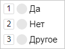

# Настройте горячие клавиши

Добавьте горячие клавиши на часто используемые элементы интерфейса. Так вы поможете исполнителям — нажимать на кнопки порой быстрее, чем управлять мышкой.

В [Толоке]({{ toloka-requester-index-dita }}) горячие клавиши особенно полезны — исполнители будут быстрее выполнять ваши задания, а значит, платить за них можно меньше. Кроме того, они помогут повысить рейтинг проекта, если у него низкая оценка в категории «Удобство интерфейса задания».

## Особенности работы {#hotkeys-features}

Горячие клавиши — это цифры или буквы, которые отображаются возле кнопок. С ними исполнитель может выполнить действие, нажав нужную клавишу.



Горячая клавиша всегда добавится на кнопку, если они делают одно и то же.

Горячие клавиши не зависят от интерфейса. Они работают, даже если не отображаются — например, если настроена горячая клавиша, но не сама кнопка.

Некоторые компоненты предоставляют отдельный способ настройки горячих клавиш. Например, для компонента [field.image-annotation](../reference/field.image-annotation.md) есть специальный [плагин](../reference/plugin.field.image-annotation.hotkeys.md).

## Как их настроить {#set-hotkeys}

Добавьте горячие клавиши с помощью отдельного плагина — [plugin.hotkeys](../reference/plugin.hotkeys.md). Укажите в нем, какая клавиша какое действие вызывает. Плагины добавляются в массив `plugins` в корне конфигурации.

```json
{
  "type": "plugin.hotkeys",
    "p": {
     "type": "action.play-pause",
     "view": {
       "$ref": "view.items.0"
    }
  }
}
```

В этом примере нажатие латинской клавиши **Р** вызывает действие [action.play-pause](../reference/action.play-pause.md). Оно запускает или останавливает воспроизведение для плеера. Плеер указывается в свойстве `view` с помощью конструкции [$ref](reuse.md) — ссылки на другое место в конфигурации.

[](https://ya.cc/t/fowMbgtQ3YCoxE)



При использовании в горячих клавишах букв учитывайте раскладку: одинаковый символ в кириллической и латинской раскладках может запутать исполнителя.




## Радио-кнопки и чекбоксы {#radio-check}

Чтобы задать горячие клавиши к радио-кнопкам, используйте компонент [action.set](../reference/action.set.md), а для чекбоксов — [action.toggle](../reference/action.toggle.md). Настройте для горячих клавиш выполнение тех же самых действий, что и у переключателя.

[](https://clck.ru/R4kTo)

## Переиспользование горячих клавиш {#reuse}

Вы можете [переиспользовать](reuse.md) горячую клавишу так же, как и любое другое место кода. Для этого используйте конструкцию `{ "$ref": "path.to.element" }`. Переиспользование пригодится, если вам нужно вставить одинаковые горячие клавиши в несколько мест.

[](https://clck.ru/R4kHH)



Размещайте переиспользуемый код в `vars`, чтобы при изменении конфигурации не менять путь в свойстве `$ref`.




## Выполнение нескольких действий {#bulk-actions}

Чтобы одновременно вызывать несколько действий при нажатии на кнопку, добавьте компонент [action.bulk](../reference/action.bulk.md). Например, чтобы показать несколько уведомлений.

[](https://clck.ru/RGsvZ)

## Условия в горячих кнопках {#if-switch}

Если вы используете условие ([helper.if](../reference/helper.if.md) или [helper.switch](../reference/helper.switch.md)), то добавьте его и в горячую клавишу для корректной работы.

Если вы пропишете горячую клавишу без условия, то горячая клавиша все равно будет работать, хоть визуально отображаться не будет. Это может привести к ошибкам.

Посмотрите пример с ошибкой. В этом примере, если вы ответите **Да**, то появится еще один вопрос. Но с помощью горячих клавиш на него можно ответить, даже если он не показывается в интерфейсе.

[Посмотреть пример с ошибкой в песочнице](https://clck.ru/RGsxF).

[Посмотреть исправленный пример в песочнице](https://clck.ru/RJXUV).

## Решение проблем {#troubleshooting}

Чтобы в интерфейсе отображалась горячая клавиша, задайте ей то же действие ([action](../reference/actions.md)), которое происходит при нажатии кнопки.

Если для компонента действие не задано, то его необходимо назначить:
- [action.set](../reference/action.set.md) для радио-кнопок;
- [action.toggle](../reference/action.toggle.md) для чекбоксов;
- [action.play-pause](../reference/action.play-pause.md) для управления воспроизведением;
- [action.open-close](../reference/action.open-close.md) для увеличения картинки.

Полный список действий можно посмотреть в разделе [Список действий](../reference/actions.md).

Особенности:

- Тип данных для действий должен совпадать. Например, горячая клавиша будет работать, но не будет отображаться, если кнопка при нажатии записывает в результат строку `“true”`, а для горячей клавиши указано логическое значение `true`.
- Если при нажатии кнопки вызывается несколько действий ([action.bulk](../reference/action.bulk.md)), то их последовательность для горячей клавиши должна быть такой же.
- Если используется условный оператор для выбора действия, например [helper.if](../reference/helper.if.md), то при нажатии горячей клавиши должен вызываться тот же условный оператор (**helper.if**) по тем же правилам.


[](../concepts/support.md)
