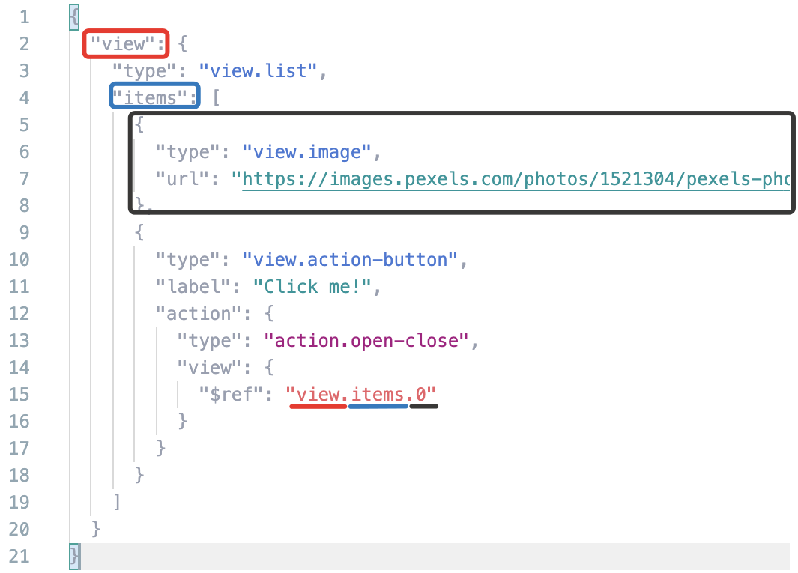

# Переиспользуйте код



Если вам надо одинаковый или похожий код вставить много раз, переиспользуйте его. Это сделает вашу конфигурацию короче и может упростить изменение повторяющихся кусков кода.

## $ref на любое место в конфигурации {#ref}

В любом месте конфигурации вы можете подставить код из другой части этой конфигурации. Для этого используется конструкция `{ "$ref": "path.to.element" }`.

Это полезно, когда надо вставить одинаковый код в несколько мест. Например, если вам надо выполнить одно и то же действие для нескольких кнопок, поместите это действие в переменную и вызовите его через `$ref`.



Размещайте переиспользуемый код в переменных в `vars`, иначе при изменении конфигурации может понадобиться изменять путь в свойстве `$ref`.



Путь в конструкции `$ref` указывается от корня. Элементы массивов задаются числом от нуля. Пример:



В некоторых компонентах есть свойства с типом ref или похожими, например [action.open-close](../reference/action.open-close.md). Там это свойство работает просто как указатель на конкретный элемент в интерфейсе.



Указатель на визуальный компонент в виде конструкции `{ "$ref": "path.to.element" }`.



Список компонентов, на которые можно ссылаться, может быть ограничен. Например, [action.play-pause](../reference/action.play-pause.md) работает только с компонентами, которые позволяют проиграть аудио или видео.







## helper.transform {#helper-transform}

Компонент [helper.transform](../reference/helper.transform.md) позволяет преобразовать один массив в другой. Это полезно, если вы не знаете количество элементов в массиве или он очень длинный.

**Примеры:**

- [Преобразовать ссылки в картинки](https://tb.toloka.dev/editor?config=N4Igxg9gdgZglgcxALhMAOlABF9IBucApgO57JYbY64gAuAngA5Hm2GkB0ANnAM508AGkw1acOkQC2fNlTE48jFmzwALItxYAnTnW0BDKHxgRtU4aIV4J02SkpWFtZawd4AJgboHOcKEwAroIgItTOeEzeaqogcFIGCET2TjQAvmERcVB0EHKpYkrMbhR4HCR+CUmW4dYggdrc+bVZrrFePjwQYAZNoQV1UXQx7nGSFiADOGkDM7Vz05hpodlBdChoVjZVyWwA2qnqdHRMfMgA9OdgHlCcAt0A1nxQBkx+EOfxCAC0w4FSACM+OcAJwANgADCRznwGjAiNpviQDPgiAB9ADMABEAEIAeQAmjiAAo4jEADU4ACsmAgaoUQGpjqcLlcbndcmAni83nAPl9fmp-kDQZDofA+BpzEZvnw4Nw1BBAkRjuiAKoAQSxaoAMgAlPUACQAogBpam0+k0I4nM6Xa63e5c56vd6fKQ-P6A4HgqHnCDcDzfJiK3JogDixoAigAmADseIA6gAtABqqYtdMm1AAuksQGkgA).
- [Написать приветствие на нескольких языках](https://ya.cc/t/DlWy7BtH3tvqiK).

