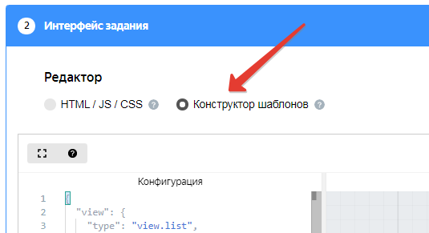
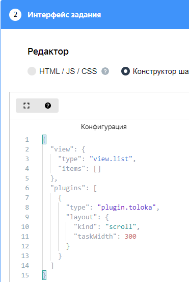
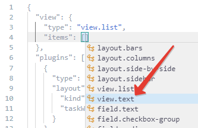
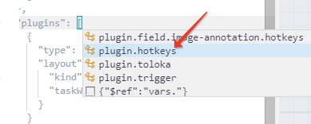
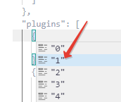
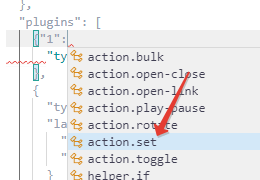
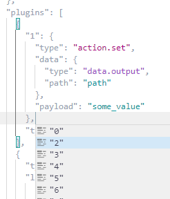

# Быстрый старт



В этом разделе вы узнаете, как пользоваться конструктором шаблонов, а в качестве примера создадите интерфейс задания для картинки с несколькими вариантами ответа.

## Перед началом {#before-begin}

Откройте конструктор шаблонов.



- В Толоке

  1. Вы должны быть зарегистрированы в Толоке как заказчик.
  1. Войдите в [Толоку]({{ toloka }}).
  1. Начните создавать новый проект в Толоке. Конструктор шаблонов интегрирован в Толоку и доступен при создании или редактировании проекта.
  1. Выберите **Конструктор шаблонов** в разделе **Интерфейс задания**.

     

      

      

- В песочнице конструктора

  [Ссылка](https://ya.cc/t/2s46Lzoq3yMQDq) на песочницу конструктора шаблонов.



## Теория {#theory}

Рекомендуем прочитать эти разделы, чтобы понять, как работать в конструкторе шаблонов:

### Интерфейс конструктора {#interface}

Интерфейс конструктора состоит из четырех вертикальных панелей:

1. **Конфигурация** — редактор интерфейса задания в формате JSON. В нем есть автодополнение с подсказками и готовыми примерами кода.

1. **Пример входных данных** — редактор для входных данных в формате JSON. Из этого поля автоматически генерируется спецификация входных данных.

1. **Предпросмотр** — пример отображения задания.

    Если в конфигурации ошибка, то здесь будет отображаться причина ошибки. Например, `[3:2]Не хватает закрывающей скобки "}"`. Это означает, что на третьей строке во втором символе забыта скобка.

1. **Отправленные данные** — пример выходных данных в формате JSON. Эта панель появляется при нажатии на кнопку **Отправить** в предпросмотре. Чтобы скопировать выходные данные, нажмите значок . Чтобы скрыть эту панель, нажмите внизу кнопку **Закрыть панель**.

Чтобы скрыть или отобразить первые три панели, используйте кнопки  в левом верхнем углу.



Для некоторых пресетов Толоки доступен визуальный редактор. Прочитайте раздел [Визуальный редактор](visual-editor.md), чтобы узнать, как редактировать интерфейс задания с его помощью.



Если вы открыли конструктор в Толоке, то для перехода в полноэкранный режим нажмите кнопку  в левом верхнем углу. Если вы зашли в песочницу конструктора, то она уже открыта на весь экран.

### Горячие клавиши {#editor}

Чтобы посмотреть все доступные команды и горячие клавиши, нажмите **F1**. Основные горячие клавиши:

- **Tab** — получение подсказок автодополнения.
- **Ctrl**+**S** для автоматического форматирования (выравнивает отступы в тексте).



Если вы пользуетесь редактором [VS Code]({{ visualstudio }}), то редактор вам будет привычен — большинство горячих клавиш здесь такие же.



### Если вы не знакомы с JSON {#json-guide}

Если вы раньше не писали в этом формате, у вас могут часто возникать сложности: незакрытые скобки, пропущенные запятые и кавычки.



Основной элемент в JSON — объект, он выделяется фигурными скобками `{}`. Объект состоит из пар `"ключ": значение`, разделенных запятой.

```json
{
  "name": "John",
  "surname": "Smith"
}
```



Количество пробелов и переносов строк между элементами в JSON не играет роли. Вы можете не расставлять переносы строк, при нажатии **Ctrl**+**S** в редакторе код отформатируется автоматически.



В значении могут быть разные типы данных:

- `string` — cтрока, выделяется двойными кавычками, например `"Hello world"`.
    Чтобы добавить в строку кавычку вида `"` или обратную косую черту `\`, дополните их обратной косой чертой `\`. Кавычки вида `« »` и `/` экранировать не надо.

    

    Входные данные|Результат
    --|--
    `"\"Перед тем как излить душу, убедитесь, что \"сосуд\" не протекает\". \\Джордж Бернард Шоу"`|`"Перед тем как излить душу, убедитесь, что "сосуд" не протекает". \Джордж Бернард Шоу`
    `"«Перед тем как излить душу, убедитесь, что «сосуд» не протекает». /Джордж Бернард Шоу"`|`«Перед тем как излить душу, убедитесь, что «сосуд» не протекает». /Джордж Бернард Шоу`

    

  Чтобы добавить перенос текстовой строки, вставьте в подходящее место ``\n``. Чтобы добавить табуляцию, вставьте `\t`.

- `number` — число без кавычек, например `"age": 25`.
- `boolean` — логическое значение без кавычек: `true` (истина) или `false` (ложь).
- `object` — другой объект, например:

    ```json
    {
    "person": {
    "name": "John",
    "surname": "Smith"
    }
    }
    ```

- `array` — массив элементов, разделенных запятой. Элементом может быть что угодно: строка, число, логическое значение или объект. Массив выделяется квадратными скобками `[]`:

    ```json
    "cities": ["Moscow", "Tokyo", "New York"]
    ```



Если вы укажете число или логическое значение в кавычках, то это будет строка. `"disabled": true` не равно `"disabled": "true"`.



Если остались вопросы, посмотрите документацию на сайте [json.org]({{ json }}).



### Формат конфигурации {#config-format}

```json
{
  "view": {
    "type": "category.name",
    ...
  },
  "plugins": [
    {
      "type": "plugin.name",
      ...
    }
  ],
  "vars": {
    "varName": "value",
    ...
  }
}
```

На верхнем уровне в конфигурации есть 3 элемента:

- `view` — компонент, который надо отобразить, например картинка или список вложенных компонентов.

    В свойстве `type` вы указываете название компонента, затем перечисляете остальные свойства. Набор свойств у каждого компонента свой — смотрите подсказки в редакторе и описание компонента в разделе [Справочник компонентов](reference/index.md).

- `plugins` — массив подключенных [плагинов](reference/plugins.md). Это особые компоненты, предоставляющие дополнительную функциональность, например горячие клавиши.

- `vars` — переменные с JSON-кодом, который можно [переиспользовать](best-practices/reuse.md) в любом месте в конфигурации с помощью конструкции $ref, например так:

    ```json
    {
    "view": {
    "type": "view.text",
    "content": {
    "$ref": "vars.my-text"
    }
    },
    "vars": {
    "my-text": "Hello World"
    }
    }
    ```

## Практика {#practice}

В этом разделе вы создадите интерфейс задания для картинки. Интерфейс будет будет состоять из трех элементов: заголовка (в котором дается задание), картинки и группы из трех кнопок с вариантами ответа.



Если в процессе создания у вас что-то пойдет не так, можете [посмотреть правильный код в песочнице](https://ya.cc/t/3JhvCg1P3tvks5).



### Создание интерфейса задания {#create-interface}

1. В редакторе конфигурации отобразится пустой шаблон кода с двумя блоками: `view` и `plugins`.

    Если вы работаете не в интерфейсе сервиса Толоки, а в конструкторе, то используйте [пустой шаблон](https://ya.cc/t/9qSDag9u3ttEdB).

    В блоке `view` добавлен компонент [view.list](reference/view.list.md), который отображает данные списком. Используем его для создания нужного интерфейса.

    

    

    Чтобы увидеть дополнительную информацию о компоненте, наведите на него мышкой в списке компонентов или в тексте редактора.

    

1. Перейдите на панель **Пример входных данных**, чтобы настроить входные данные.

    Скопируйте туда пример входных данных — ссылку на картинку. Она будет использоваться в следующих шагах.

    ```json
    {
    "image": "https://yastatic.net/s3/toloka/p/requester/a66492018a130d7337d57a787970f376.jpg"
    }
    ```

1. Вернитесь на панель **Конфигурация**. Добавьте в свойство `items` компонента `view.list` массив элементов будущего интерфейса. Для этого установите курсор внутрь квадратных скобок и нажмите **Tab**. Появится список, в котором надо выбрать компонент [view.text](reference/view.text.md). Измените значение его свойства `content` на `"Посмотрите на картинку и ответьте на вопрос."`. Этот текст появится над картинкой в качестве заголовка задачи.

    

1. Добавьте следующий элемент. Для этого установите курсор за фигурной скобкой, закрывающей компонент `view.text`, поставьте запятую и нажмите **Tab**. Появится список, в котором надо выбрать компонент [view.image](reference/view.image.md). Он используется для отображения картинки. Его свойство `url` содержит ссылку на изображение. Удалите ссылку вместе с кавычками и нажмите **Tab**. Появится список, в котором надо выбрать компонент [data.input](operations/work-with-data.md). Он позволяет получить значения из примера входных данных.

    

1. Измените значение свойства `path` в компоненте `data.input` на `"image"`. На панели **Предпросмотра** появится изображение из примера входных данных.

1. Добавьте следующий элемент интерфейса — группу кнопок, компонент [field.button-radio-group](reference/field.button-radio-group.md). Его свойство `label` содержит текст, который будет отображаться над вариантами ответа. Измените его значение на `"Какое у кота настроение?"`.

1. Свойство `options` содержит список опций для выбора ответа. По умолчанию их две. Добавьте третью опцию так же, как сейчас добавили новые компоненты. Не забудьте поставить запятую между второй и третьей опциями.

    Каждая опция содержит два свойства: `label` (заголовок) и `value` (значение, которое будет передано в выходных данных). Измените заголовки свойств на `"Хорошее"`, `"Плохое"` и `"Ошибка загрузки"`, а значения — на `"ok"`, `"bad"` и `"error"`.

1. После массива кнопок идет свойство `data`. Оно определит, как будут выглядеть выходные данные ([data.output](operations/work-with-data.md)). Выходные данные — это значения, в которые будут переданы ответы на вопросы задания.

1. В конце кода есть компонент [plugin.toloka](reference/plugin.toloka.md), который определяет дополнительные настройки заданий. Измените в нем значение свойства `taskWidth` (ширина блока с заданием) на 500.

1. Задание готово. Попробуйте выполнить его в окне **Предпросмотра** и нажать кнопку **Отправить**, чтобы посмотреть результат.



```json
{
  "view": {
    "type": "view.list",
    "items": [
      {
        "type": "view.text",
        "content": "Посмотрите на картинку и ответьте на вопрос."
      },
      {
        "type": "view.image",
        "url": {
          "type": "data.input",
          "path": "image"
        }
      },
      {
        "type": "field.button-radio-group",
        "label": "Какое у кота настроение?",
        "options": [
          {
            "label": "Хорошее",
            "value": "ok"
          },
          {
            "label": "Плохое",
            "value": "bad"
          },
          {
            "label": "Ошибка загрузки",
            "value": "error"
          }
        ],
        "data": {
          "type": "data.output",
          "path": "result"
        },
        "validation": {
          "type": "condition.required"
        }
      }
    ]
  },
  "plugins": [
    {
      "type": "plugin.toloka",
      "layout": {
        "kind": "scroll",
        "taskWidth": 500
      }
    }
  ]
}
```





Используйте готовые примеры кода, чтобы понять, что писать в значении свойства. В автодополнении примеры помечаются иконкой .

Чтобы посмотреть список примеров для какого-то свойства, удалите значение свойства, поставьте курсор после двоеточия и нажмите **Tab**.



### Добавление горячих клавиш {#add-hotkeys}

Чтобы исполнители быстрее выполняли ваши задания, добавьте в интерфейс горячие клавиши.

Подробнее об этом вы можете прочитать в разделе [Настройте горячие клавиши](best-practices/hotkeys.md).

Горячие клавиши не являются частью визуальных компонентов, они добавляются с помощью отдельного плагина — [plugin.hotkeys](reference/plugin.hotkeys.md). В нем вы указываете, какая клавиша какое действие вызывает.

1. Горячие клавиши добавляются в блок `plugins`. Установите курсор после открывающей квадратной скобки блока `plugins` и нажмите **Tab**. В появившемся списке выберите `plugin.hotkeys`.

    

1. Компонент `plugins.hotkeys` пока пуст. Заполните его нужными значениями. Для этого установите курсор после открывающей фигурной скобки этого компонента и нажмите **Tab**. Последовательно появятся два списка: первый для выбора горячей клавиши, второй для назначения действия. В первом списке выберите горячую клавишу `"1"`, во втором — действие [action.set](reference/action.set.md).

    

1. Добавьте еще две горячих клавиши. Для этого установите курсор после закрывающей фигурной скобки с запятой нового блока с горячей клавишей `"1"` и нажмите **Tab**. Добавьте горячую клавишу `"2"` с таким же действием `action.set`. Затем таким же способом добавьте горячую клавишу `"3"`.

    

1. В каждом блоке с горячей клавишей есть свойство `data`, определяющее выходные данные. Измените значение его свойства `path` на `"result"` для каждой горячей клавиши. Путь для выходных данных горячих клавиш должен быть такой же, как и для кнопок, на которые мы их назначаем.

1. Также у каждой горячей клавиши есть свойство `payload` со значением, которое будет передано в выходные данные при выборе этой кнопки. Измените это свойство для трех кнопок на `"ok"`, `"bad"` и `"error"`.

1. Перейдите на панель **Предпросмотра** и нажмите на произвольное место на этой панели, чтобы убрать курсор из редактора. Теперь можете проверить, что горячие клавиши работают.



```json
{
  "view": {
    "type": "view.list",
    "items": [
      {
        "type": "view.text",
        "content": "Посмотрите на картинку и ответьте на вопрос."
      },
      {
        "type": "view.image",
        "url": {
          "type": "data.input",
          "path": "image"
        }
      },
      {
        "type": "field.button-radio-group",
        "label": "Заголовок",
        "options": [
          {
            "label": "Хорошее",
            "value": "ok"
          },
          {
            "label": "Плохое",
            "value": "bad"
          },
          {
            "label": "Ошибка загрузки",
            "value": "error"
          }
        ],
        "data": {
          "type": "data.output",
          "path": "result"
        },
        "validation": {
          "type": "condition.required"
        }
      }
    ]
  },
  "plugins": [
    {
      "1": {
        "type": "action.set",
        "data": {
          "type": "data.output",
          "path": "result"
        },
        "payload": "ok"
      },
      "2": {
        "type": "action.set",
        "data": {
          "type": "data.output",
          "path": "result"
        },
        "payload": "bad"
      },
      "3": {
        "type": "action.set",
        "data": {
          "type": "data.output",
          "path": "result"
        },
        "payload": "error"
      },
      "type": "plugin.hotkeys"
    },
    {
      "type": "plugin.toloka",
      "layout": {
        "kind": "scroll",
        "taskWidth": 500
      }
    }
  ]
}
```



### Настройка валидации {#validation}

Валидация позволяет вам проверять значения, которые вводят исполнители. Следующая часть кода из блока с переключателями проверяет, чтобы исполнители обязательно выбрали один из вариантов.

Для этого в коде нужного компонента используется свойство `validation` с компонентом [condition.required](reference/condition.required.md). Этот код уже добавлен в примеры выше.

Вы можете дополнить этот код подсказкой исполнителю, что нужно исправить для успешной проверки. Добавьте свойство `hint` с текстом подсказки для исполнителя так, чтобы этот блок выглядел следующим образом:

```json
{
  "validation": {
    "type": "condition.required",
    "hint": "выберите один из вариантов"
  }
}
```

Перейдите на панель **Предпросмотра** и попробуйте отправить задание, не выбрав ни один из вариантов.

Подробнее о способах проверки вы можете прочитать в разделе [Проверяйте ответы автоматически](best-practices/conditions.md).

### Проверка спецификации данных {#check-specs}

После настройки интерфейса задания проверьте спецификации входных и выходных данных в поле **Спецификация данных**, сразу под полем выбора редактора. Спецификации генерируются автоматически, но возможны ошибки.

После этого вы можете продолжить создание или редактирование проекта в Толоке.

## Что дальше {#what-next}

- Посмотрите [инструкции](operations/all.md) для популярных задач.
- Посмотрите [список доступных компонентов](reference/index.md).

[](concepts/support.md)

