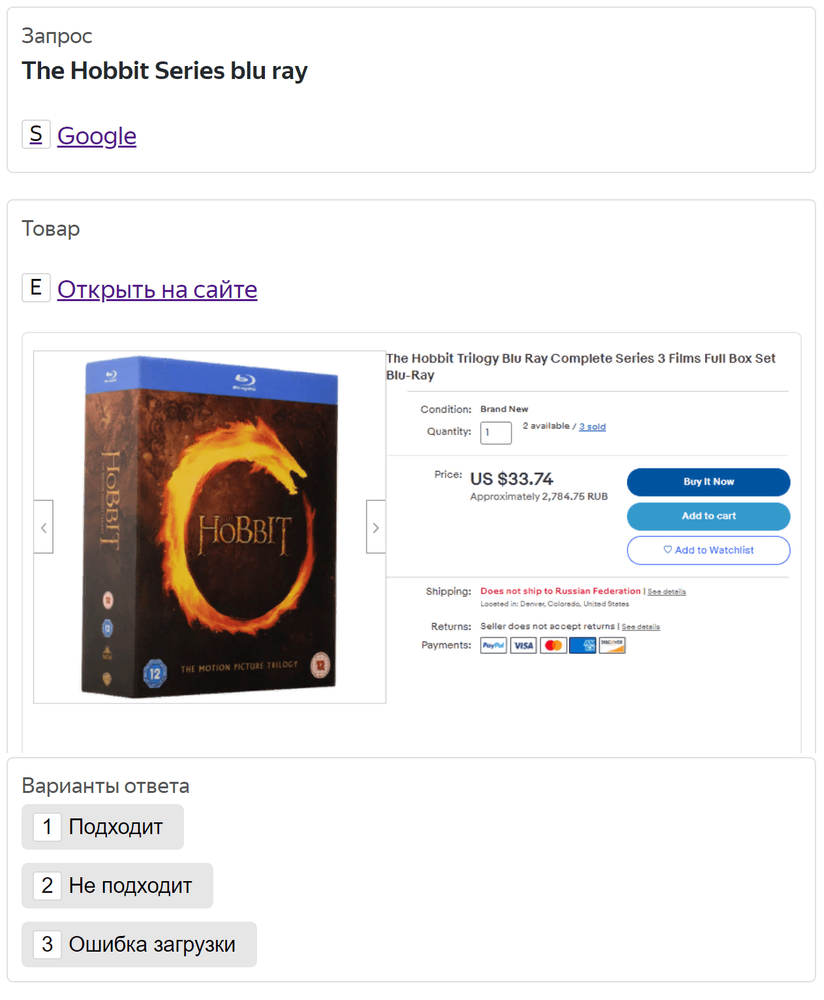

# Оценка релевантности товара поисковому запросу



Это Bespoke-решение поможет определить релевантность товара поисковому запросу.

## Сценарии использования {#use_cases}

- Для улучшения качества поиска с помощью обучения алгоритмов.
- Для понимания качества работы собственных алгоритмов поиска.
- Для сравнения различных версий алгоритмов перед A/B-тестированием.

## Входные данные {#input-data}

Выберите один из форматов входных данных. Доступные форматы и примеры представлены ниже.





По умолчанию эта функция отключена. Чтобы ее активировать, [свяжитесь с нами](support.md).



Преимущества формата:

- Нет необходимости указывать ссылку на страницу товара.
- Интерфейс страницы товара не отвлекает исполнителей, и они могут сосредоточиться на выполнении заданий.
- Более удобный и адаптивный интерфейс заданий.
- Исполнители могут быстрее выполнять задания из-за экономии трафика.


Данные можно загрузить в формате JSON.

```json
[
  {
    "id": "1",
    "query": "The Hobbit Series blu ray",
    "website_url": "https://example.com/search?q=The+Hobbit+Series+blu+ray",
    "product_name": "The Hobbit Trilogy Blu Ray Complete Series 3 Films Full Box Set",
    "product_image": "https://example.com/images/hobbit.png",
    "product_description": [
      {
        "label": "Формат",
        "value": "blu-ray"
      },
      {
        "label": "Жанр",
        "value": "фантастика"
      }
    ]
  }
]
```





Укажите поисковый запрос и ссылку на страницу с товаром.





- JSON

  ```json
  [
    {
      "id": "1",
      "query": "The Hobbit Series blu ray",
      "website_url": "https://example.com/search?q=The+Hobbit+Series+blu+ray"
    }
  ]
  ```

- XLSX

  id | query | website_url
  -- | ----- | -----------
  1 | The Hobbit Series blu ray | https://example.com/search?q=The+Hobbit+Series+blu+ray

- CSV

  ```
  id,query,website_url
  1,The Hobbit Series blu ray,https://example.com/search?q=The+Hobbit+Series+blu+ray
  ```

- TSV

  ```
  id query website_url
  1 The Hobbit Series blu ray https://example.com/search?q=The+Hobbit+Series+blu+ray
  ```







Вместо ссылок на страницы можно использовать скриншоты страниц.




- JSON

  ```json
  [
    {
      "id": "1",
      "query": "The Hobbit Series blu ray",
      "screenshot_url": "https://example.com/images/hobbit.png"
    }
  ]
  ```

- XLSX

  id | query | screenshot
  -- | ----- | ----------
  1 | The Hobbit Series blu ray | https://example.com/images/hobbit.png

- CSV

  ```
  id,query,screenshot_url
  1,The Hobbit Series blu ray,https://example.com/images/hobbit.png
  ```

- TSV

  ```
  id query website_url
  1 The Hobbit Series blu ray https://example.com/images/hobbit.png
  ```





## Как запустить решение {#how-to-use}

1. Нажмите **Проекты → Создать проект → Bespoke**.

1. В разделе **Изображения** выберите **Оценка релевантности товара поисковому запросу**.

1. Укажите язык исполнителей.

1. Укажите название проекта.

1. Опишите классы разметки. Убедитесь, что указали все возможные варианты и крайние случаи.

1. Добавьте примеры, чтобы сделать описание более наглядным для исполнителей.

1. Подождите, пока проект пройдет модерацию. После этого статус изменится на **Активный**.

1. Загрузите входные данные.

1. Нажмите **Запустить**, чтобы начать разметку данных в Толоке.

## Дополнительные возможности {#another}

[Обратитесь к нам](support.md), чтобы подключить дополнительные возможности:

- Поиск товара на вашей платформе с помощью нашей поисковой системы.
- Использование метаданных. Например, для определения местонахождения исполнителя.

## Цена {#pricing}

Базовая цена зависит от объема данных для обработки в месяц.

Число позиций | Базовая цена за одну размеченную позицию
---------- | ---------------------------
До 10 000 | 0,25 $
10 001 - 100 000 | 0,20 $
100 001 - 500 000 | 0,17 $
Более 500 000 | [Обратитесь к нам](support.md), чтобы получить особое предложение.

